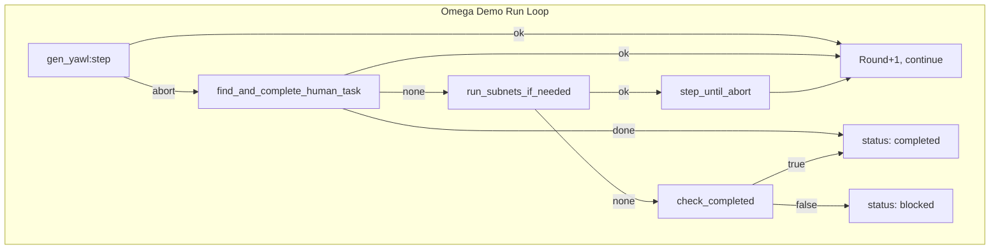
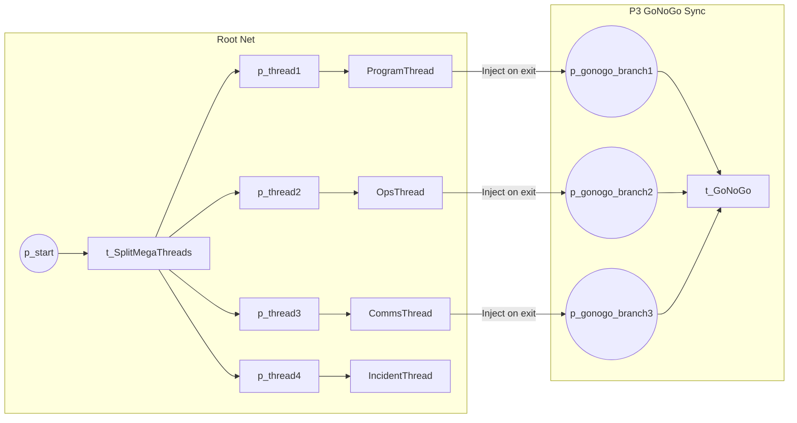
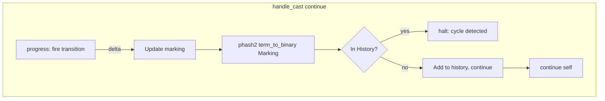
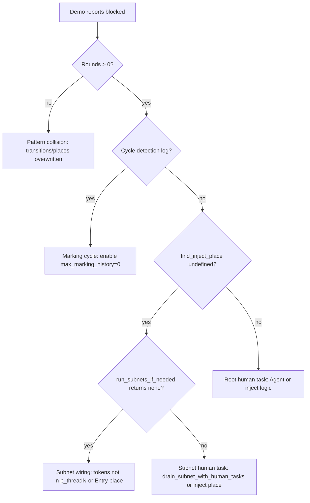
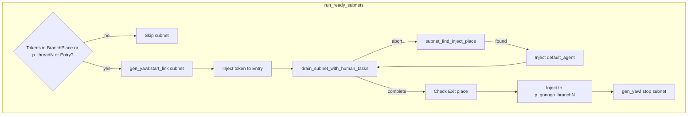
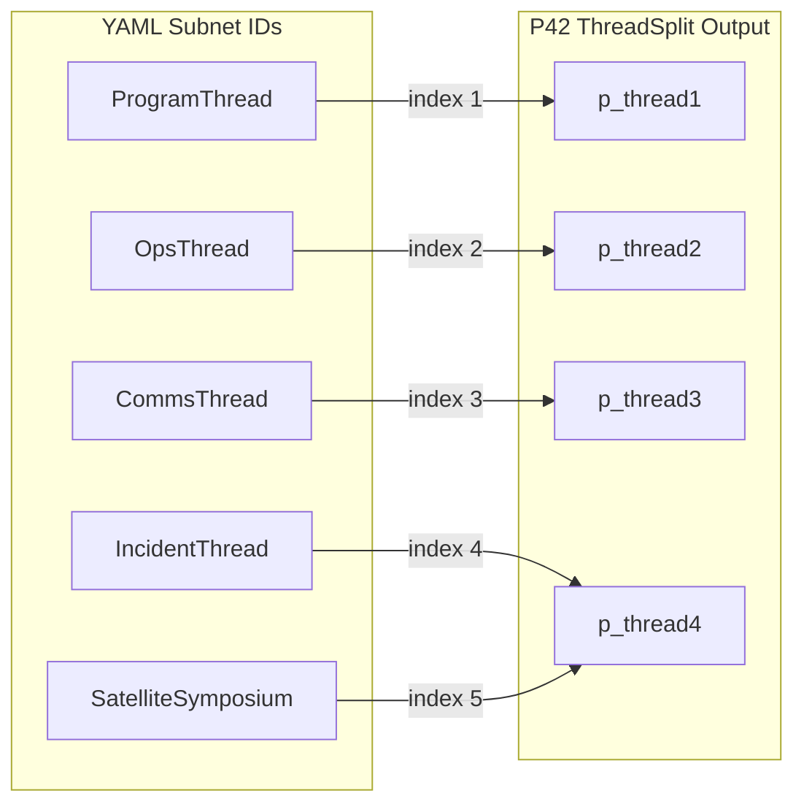

# AGI Symposium Omega: Issue Identification Guide

This document provides mermaid diagrams and explanations to diagnose issues when the AGI Symposium Omega demo blocks or fails.

---

## 1. Execution Flow and Blocking Points

Shows where the Omega demo can stop and why.

**Issue:** When `step()` returns `abort`, `find_inject_place` returns `undefined` (no root human task enabled). Then `run_subnets_if_needed` may return `none` if no subnets have tokens in entry places. Result: **blocked** at ~3 rounds.

---

## 2. Token Flow: Root to Subnets to P3 Sync

Shows where tokens must flow for GoNoGo to fire.

**Issue:** Subnets must complete and `run_one_subnet` must inject into `p_gonogo_branch1..3`. If subnets never receive tokens (P42 place mapping mismatch) or inject to wrong place, P3 never fires.

---

## 3. Cycle Detection Logic (gen_yawl)

When `max_marking_history > 0`, this path can halt execution.

**Note:** Omega uses `max_marking_history = 0` so cycle detection is disabled. If someone runs without that option, cycle detection would halt after a repeated marking.

---

## 4. Issue Identification Decision Tree

---

## 5. Subnet Run Flow (run_ready_subnets)

**Issue:** `p_branch_place_for_subnet(4)` and `p_branch_place_for_subnet(_)` both map to `p_gonogo_branch3`. IncidentThread and SatelliteSymposium (indices 4,5) would both inject into branch3, potentially causing P3 sync to see duplicate tokens or wrong count.

---

## 6. Place Name Mapping (P42 vs YAML)

**Issue:** 5 subnets but P42 has 4 branches. `subnet_index` and `p_branch_place_for_subnet` may misalign for IncidentThread and SatelliteSymposium.

---

## Quick Reference

| Symptom | Likely Cause |
|---------|--------------|
| Rounds = 0 | Pattern collision (namespacing fix applied) |
| "marking cycle detected" log | Set `max_marking_history = 0` in gen_yawl_options |
| Blocked at ~3 rounds | Subnet wiring or token injection; check p_threadN and Entry places |
| find_inject_place undefined | No root human task enabled; run_subnets_if_needed should run |
| run_subnets_if_needed returns none | No tokens in p_threadN or subnet Entry; P42 split may not have produced |

## Related Files

- `test/omega_demo_runner.erl` - Main run loop, find_and_complete_human_task, run_subnets_if_needed
- `src/core/gen_yawl.erl` - Cycle detection (marking_history)
- `docs/mermaid/14-omega-symposium.md` - High-level workflow diagrams
