# AGI Symposium Omega: Issue Identification Guide

This document provides mermaid diagrams and explanations to diagnose issues when the AGI Symposium Omega demo blocks or fails.

---

## 1. Execution Flow and Blocking Points

Shows where the Omega demo can stop and why.

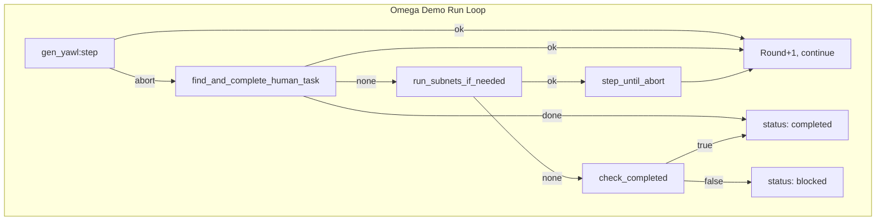

**Issue:** When `step()` returns `abort`, `find_inject_place` returns `undefined` (no root human task enabled). Then `run_subnets_if_needed` may return `none` if no subnets have tokens in entry places. Result: **blocked** at ~3 rounds.

---

## 2. Token Flow: Root to Subnets to P3 Sync

Shows where tokens must flow for GoNoGo to fire.

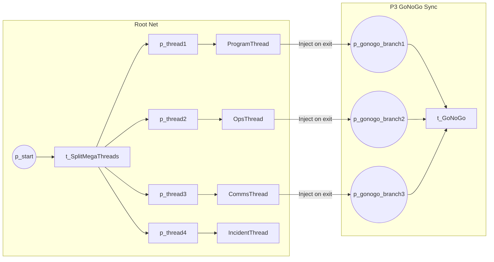

**Issue:** Subnets must complete and `run_one_subnet` must inject into `p_gonogo_branch1..3`. If subnets never receive tokens (P42 place mapping mismatch) or inject to wrong place, P3 never fires.

---

## 3. Cycle Detection Logic (gen_yawl)

When `max_marking_history > 0`, this path can halt execution.

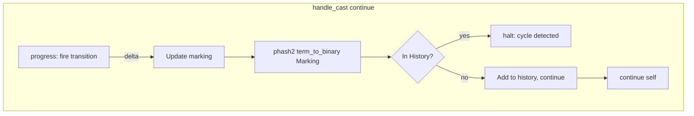

**Note:** Omega uses `max_marking_history = 0` so cycle detection is disabled. If someone runs without that option, cycle detection would halt after a repeated marking.

---

## 4. Issue Identification Decision Tree

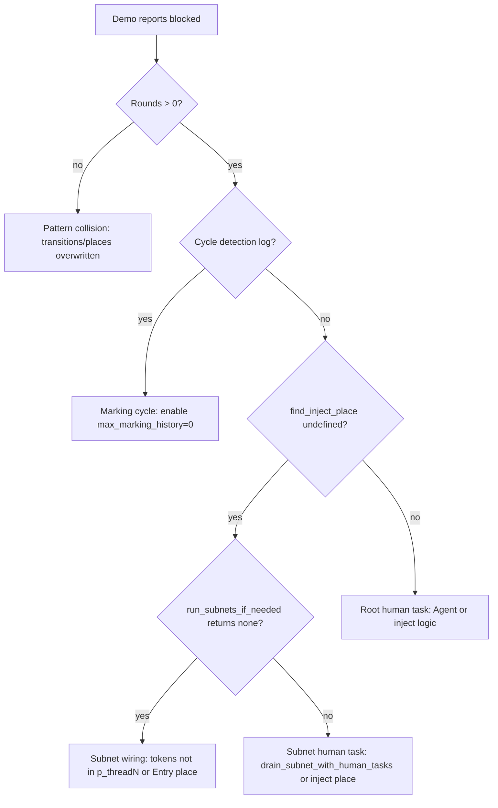

---

## 5. Subnet Run Flow (run_ready_subnets)

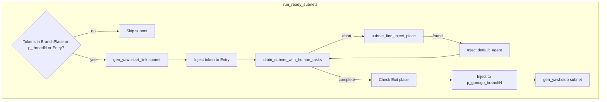

**Issue:** `p_branch_place_for_subnet(4)` and `p_branch_place_for_subnet(_)` both map to `p_gonogo_branch3`. IncidentThread and SatelliteSymposium (indices 4,5) would both inject into branch3, potentially causing P3 sync to see duplicate tokens or wrong count.

---

## 6. Place Name Mapping (P42 vs YAML)

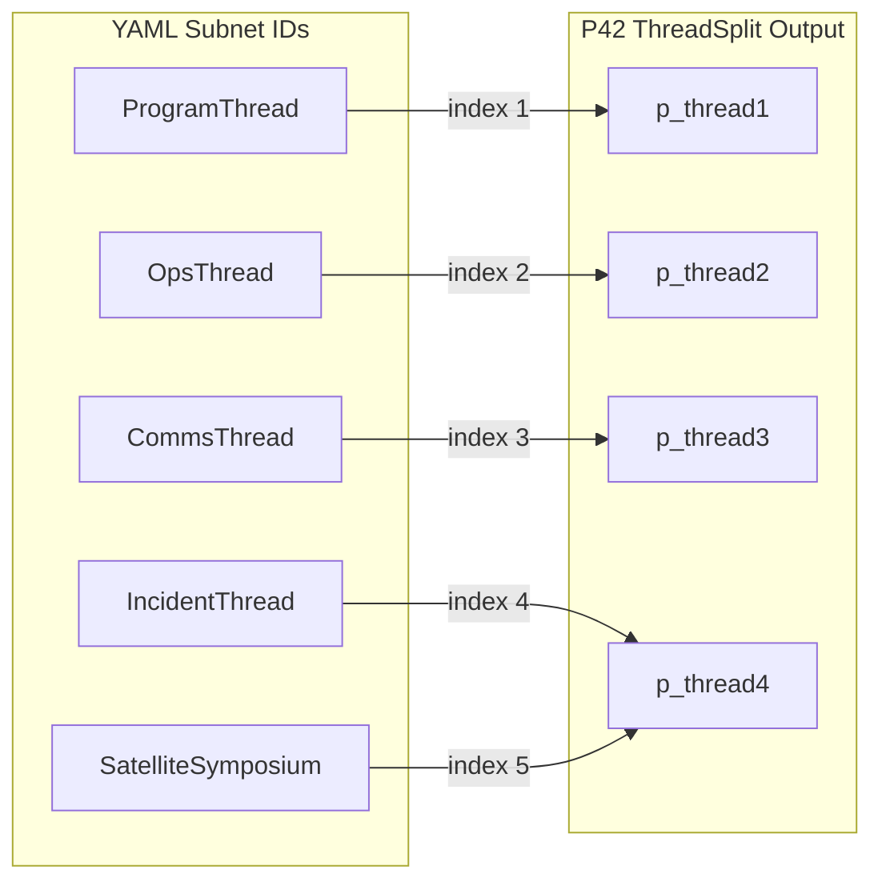

**Issue:** 5 subnets but P42 has 4 branches. `subnet_index` and `p_branch_place_for_subnet` may misalign for IncidentThread and SatelliteSymposium.

---

## 7. Code-Level Call Chain (Entry to Blocked)

Trace the execution path from `run_omega_loop` to `blocked` with modules and functions. Includes return paths and `step_until_abort`.

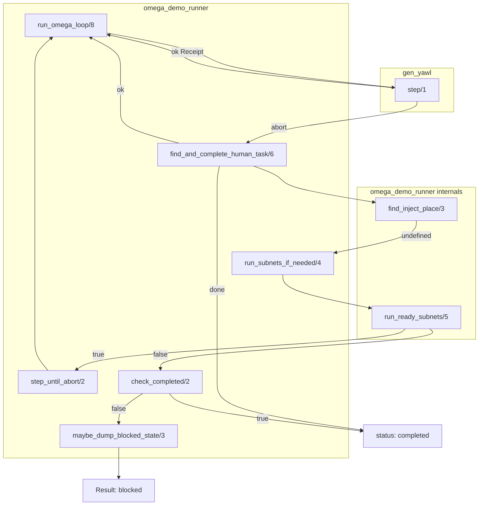

**Breakdown points:**
- `find_inject_place` → `undefined`: no preset (P1,P2) has exactly one full + one empty
- `run_ready_subnets` → `false`: `Tokens = []` for every subnet (BranchPlace + P42Place + EntryPlace all empty)
- `check_completed` → `false`: end place has no tokens

---

## 8. Root Human Task Resolution (find_inject_place)

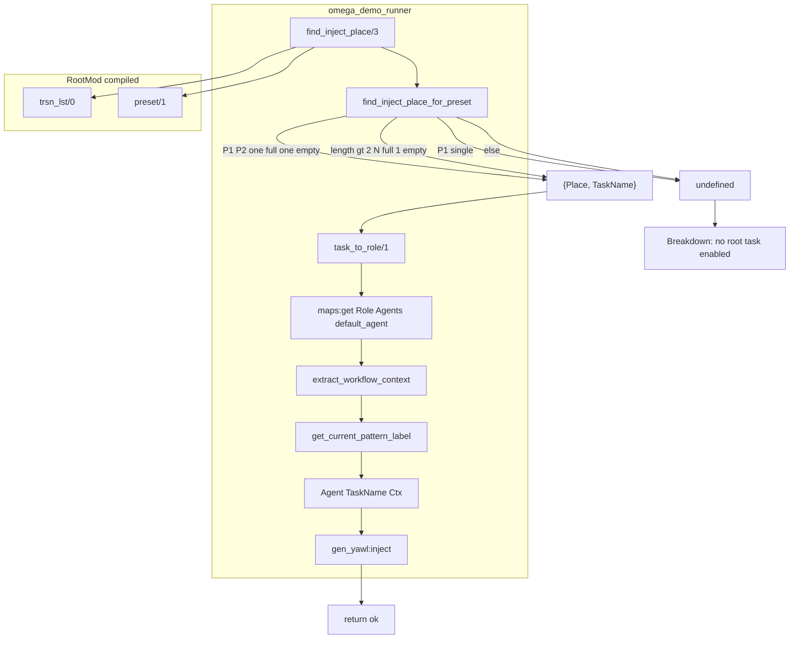

**Key:** `find_inject_place_for_preset` returns `undefined` when:
- `[P1,P2]`: both empty, or both full (T1>0,T2>0)
- `[P1]`: always undefined (single-place preset)
- `[P1..Pn]`: not exactly (N full, 1 empty) or (1 full, 2 empty)

---

## 9. Subnet Run Breakdown (run_ready_subnets)

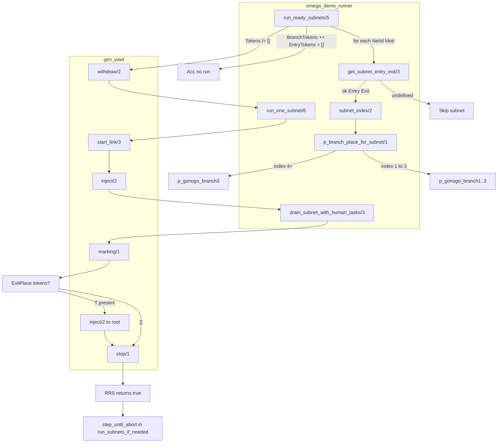

**Breakdown points:**
- `get_subnet_entry_exit` → `undefined`: subnet not found in SubnetDefs or Executor
- `Tokens = []`: `BranchPlace` and `P42Place` and `EntryPlace` all empty
- `p_branch_place_for_subnet(4)` and `(_)` both map to `p_gonogo_branch3` (5 subnets, 4 P42 branches)

---

## 10. Subnet Drain Breakdown (drain_subnet_with_human_tasks)

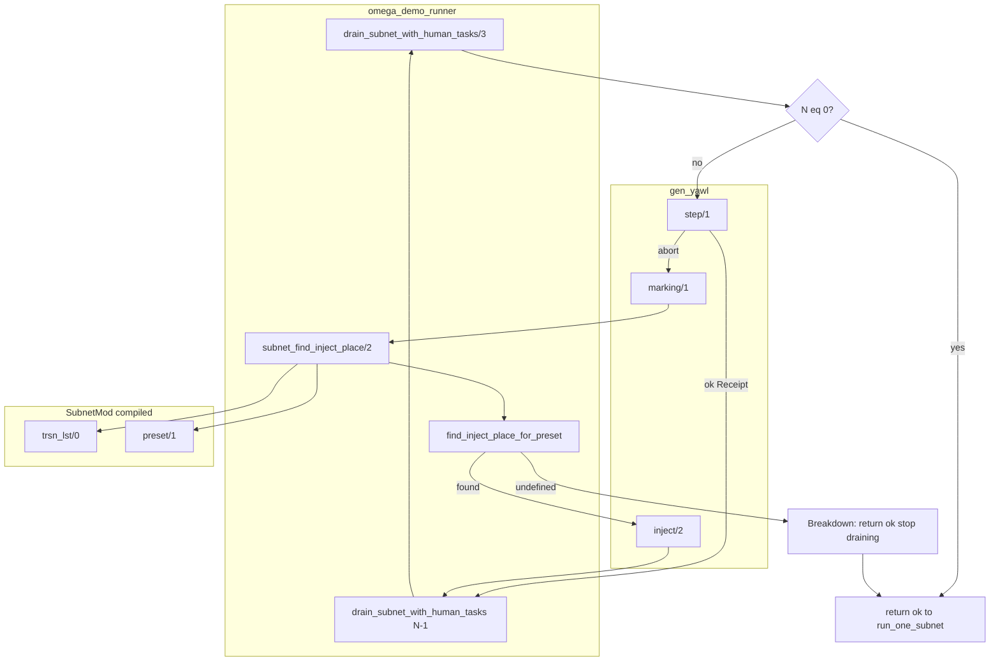

**Breakdown:** When subnet blocks on a human task whose preset doesn't match `find_inject_place_for_preset` (e.g. single-place preset, or all-empty / all-full), `subnet_find_inject_place` returns `undefined` → drain returns `ok` without injecting → subnet never completes → exit place empty → no token injected to root.

---

## 11. Place/Token Data Flow

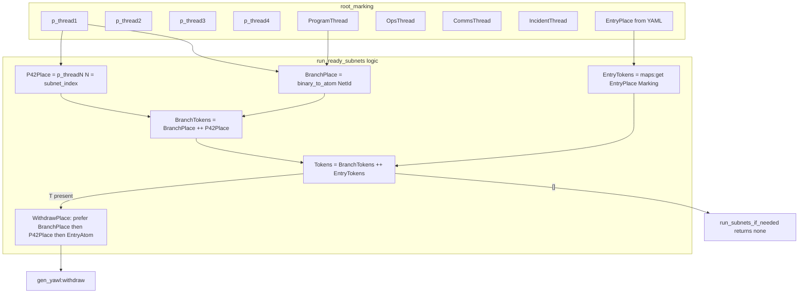

---

## Quick Reference

### Key Functions and Return Values

| Module | Function | Returns | Breakdown when |
|--------|----------|---------|----------------|
| omega_demo_runner | find_inject_place/3 | undefined \| {Place, TaskName} | undefined → no root task |
| omega_demo_runner | find_inject_place_for_preset | undefined \| {Place, TaskName} | Preset structure doesn't match |
| omega_demo_runner | run_subnets_if_needed/4 | ok \| none | none when run_ready_subnets false |
| omega_demo_runner | run_ready_subnets/5 | true \| false | false when no subnet has tokens |
| omega_demo_runner | subnet_find_inject_place/2 | undefined \| {Place, TaskName} | undefined → subnet human task unknown |
| omega_demo_runner | drain_subnet_with_human_tasks/3 | ok | Returns ok when subnet_find_inject_place undefined |
| omega_demo_runner | check_completed/2 | true \| false | false → end place empty |
| gen_yawl | step/1 | ok \| abort | abort → human task or no enabled auto |

### Symptom to Cause

| Symptom | Likely Cause |
|---------|--------------|
| Rounds = 0 | Pattern collision (namespacing fix applied) |
| "marking cycle detected" log | Set `max_marking_history = 0` in gen_yawl_options |
| Blocked at ~3 rounds | Subnet wiring or token injection; check p_threadN and Entry places |
| find_inject_place undefined | No root human task enabled; run_subnets_if_needed should run |
| run_subnets_if_needed returns none | No tokens in p_threadN or subnet Entry; P42 split may not have produced |

## Related Files

- `test/omega_demo_runner.erl` - Main run loop, find_and_complete_human_task, run_subnets_if_needed
- `src/core/gen_yawl.erl` - Cycle detection (marking_history)
- `docs/mermaid/14-omega-symposium.md` - High-level workflow diagrams
