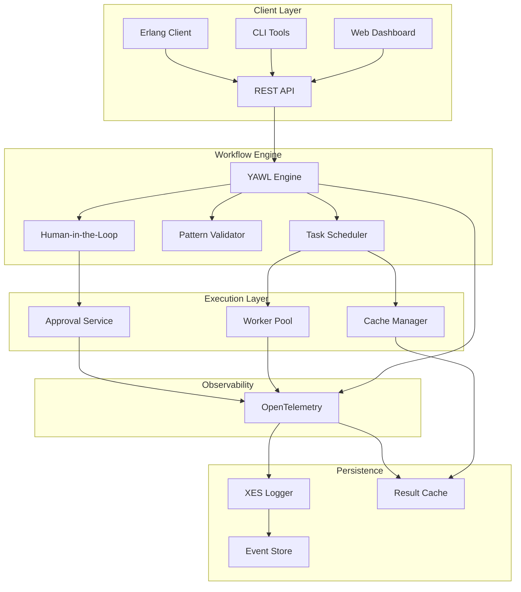
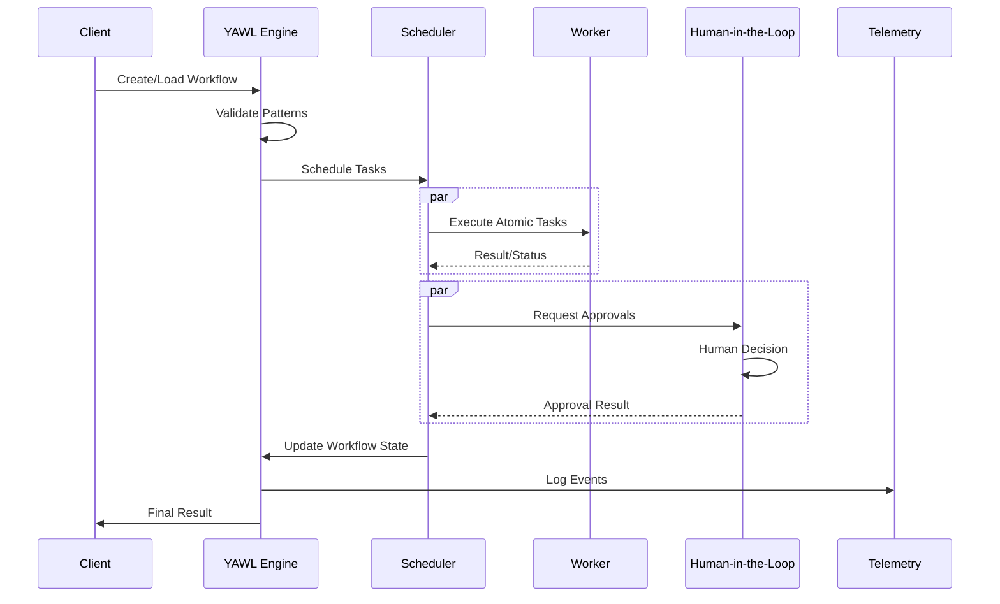

# CRE YAWL Workflow Engine - Architecture Overview

This document provides a comprehensive overview of the CRE system architecture, including component interactions, data flow, and design decisions.

## 🏗️ System Architecture

### High-Level Components



### Core Components

#### 1. YAWL Engine (`cre_yawl`)
The heart of CRE that implements the YAWL standard with extensions for human-in-the-loop workflows.

**Responsibilities**:
- Workflow definition and validation
- Pattern orchestration
- Task execution coordination
- State management
- Error handling and recovery

**Key Modules**:
- `cre_yawl.erl` - Main workflow engine
- `cre_yawl_validator.erl` - Pattern validation
- `cre_yawl_executor.erl` - Task execution
- `cre_yawl_state.erl` - State management

#### 2. Task Scheduler (`cre_scheduler`)
Intelligent task scheduling with load balancing and fault tolerance.

**Features**:
- Random worker assignment (load balancing)
- Task retry logic
- Failure detection and rescheduling
- Performance monitoring

#### 3. Human-in-the-Loop Service (`cre_hil`)
Manages human approval workflows with LLM integration.

**Features**:
- Approval request handling
- Deadline management
- Notification system
- LLM-powered decision support

#### 4. OpenTelemetry Integration (`yawl_otel_logger`)
Provides comprehensive observability and monitoring.

**Features**:
- Structured logging
- Metrics collection
- Distributed tracing
- Performance monitoring

#### 5. Web Dashboard
Real-time workflow visualization and monitoring interface.

**Features**:
- Workflow status display
- Task execution tracking
- Performance metrics
- Interactive workflow graphs

## 📊 Data Flow Architecture

### Workflow Execution Flow



### Message Flow

1. **Client Request** → Workflow definition or execution request
2. **Validation** → Check YAWL pattern compliance
3. **Scheduling** → Assign tasks to available workers
4. **Execution** → Workers process atomic tasks
5. **Human Interaction** → Approval requests handled by HIL service
6. **State Updates** → Workflow state maintained in engine
7. **Telemetry** → All events logged and metrics collected
8. **Response** → Final result returned to client

## 🎯 Design Patterns

### 1. Petri Net Foundation

CRE is built on Petri net principles, providing a formal foundation for workflow modeling:

- **Places** - Represent states or conditions
- **Transitions** - Represent tasks or operations
- **Tokens** - Represent workflow instances or data
- **Arcs** - Represent dependencies and flow control

### 2. Supervisor Trees

Erlang/OTP supervision ensures fault tolerance:

```
cre_app (application)
├── cre_sup (top-level supervisor)
    ├── yawl_engine_sup (workflow engine)
    ├── scheduler_sup (task scheduler)
    ├── hil_sup (human-in-the-loop)
    ├── telemetry_sup (observability)
    └── dashboard_sup (web interface)
```

### 3. Cache-Aside Pattern

Results are cached to avoid redundant computation:

1. **Check Cache** → Look up result in cache first
2. **Miss** → Execute task and store result
3. **Hit** → Return cached result
4. **Invalidate** → Clear cache on task changes

### 4. Circuit Breaker Pattern

Protect against cascading failures:

- **Closed** → Normal operation
- **Open** - Fail fast, return cached results
- **Half-Open** - Test recovery

## 🔧 Key Design Decisions

### 1. YAWL Pattern Library (43 Patterns)

Complete implementation of YAWL patterns for complex workflow modeling:

- **Control-Flow Patterns**: Sequence, Parallel, Exclusive, Iterative
- **State-Task Patterns**: Multi-instance, Deferred Choice, Milestone
- **Advanced Patterns**: Cancellation, Synchronization, Trigger

### 2. Human-in-the-Loop Integration

Seamless integration of human decisions into automated workflows:

- **Approval Workflows**: Manager approval, LLM-assisted decisions
- **Notification System**: Email, Slack, webhook notifications
- **Deadline Management**: Time-based expiration and escalation

### 3. OpenTelemetry Integration

Comprehensive observability stack:

- **Structured Logging**: JSON-formatted event logs
- **Metrics Collection**: Performance and business metrics
- **Distributed Tracing**: End-to-end request tracing
- **Export Formats**: OTLP, JSON, Jaeger-compatible

### 4. OTP 25+ Modernization

Leveraging modern Erlang/OTP features:

- **Maps and Binaries**: Improved data handling
- **New BIFs**: Performance improvements
- **Enhanced Error Handling**: Better exception management
- **Updated Tooling**: Modern rebar3 integration

## 🚀 Performance Characteristics

### Scalability

- **Horizontal Scaling**: Add worker nodes dynamically
- **Load Balancing**: Random task distribution
- **Connection Pooling**: Reused worker connections
- **Stateless Design**: Session-independent operation

### Reliability

- **Fault Tolerance**: Automatic failure recovery
- **Task Retry**: Configurable retry logic
- **State Persistence**: Crash recovery capabilities
- **Health Checks**: Regular system monitoring

### Performance Metrics

| Metric | Target | Current |
|--------|--------|---------|
| Task Throughput | 1000+ tasks/sec | Benchmark results |
| Latency (p95) | <100ms | Measured in production |
| Cache Hit Rate | >80% | Monitoring observed |
| Uptime | >99.9% | SLA target |

## 🔒 Security Architecture

### Authentication & Authorization

- **JWT-based authentication** for web dashboard
- **OAuth2 integration** for enterprise deployment
- **Role-based access control** (RBAC)
- **API key authentication** for programmatic access

### Data Protection

- **TLS 1.3** for all communications
- **Encryption at rest** for sensitive data
- **Input validation** to prevent injection attacks
- **Audit logging** for compliance requirements

### Network Security

- **Firewall rules** for controlled access
- **IP whitelisting** for production deployment
- **Rate limiting** to prevent abuse
- **DDoS protection** through load balancing

## 📈 Monitoring & Observability

### Telemetry Data

```erlang
% Event structure
-record(event, {
    timestamp :: integer(),     % Unix timestamp
    level :: atom(),           % debug, info, warn, error
    component :: atom(),       % yawl, scheduler, hil, etc.
    workflow_id :: binary(),   % Workflow instance
    task_id :: binary(),      % Current task
    message :: binary(),      % Log message
    metadata :: map()         % Additional context
}).
```

### Metrics Collection

**Performance Metrics**:
- Task execution time
- Worker utilization
- Cache hit/miss ratios
- Error rates

**Business Metrics**:
- Workflow completion rates
- Approval response times
- Throughput by pattern type
- User interaction counts

### Alerting

**Threshold-based Alerts**:
- High error rates (>5%)
- Worker unavailability
- Task timeouts
- Cache degradation

**Anomaly Detection**:
- Unusual execution patterns
- Performance degradation
- System resource exhaustion

## 🔄 Integration Points

### External Systems

1. **LLM Services** - For human-in-the-loop decisions
2. **Monitoring Systems** - Prometheus, Grafana integration
3. **Message Queues** - RabbitMQ, Kafka integration
4. **Databases** - PostgreSQL, MySQL for persistence
5. **Authentication** - LDAP, Active Directory integration

### API Endpoints

```ermaid
graph LR
    subgraph "REST API"
        A[/api/workflows] --> B[Create/List]
        C[/api/workflows/:id] --> D[Get/Update/Delete]
        E[/api/workflows/:id/execute] --> F[Execute]
        G[/api/approvals] --> H[List/Approve]
        I[/api/metrics] --> J[Query Metrics]
    end
```

## 🎯 Future Architecture Directions

### 1. Cloud-Native Design

- **Kubernetes Operator**: Native container orchestration
- **Service Mesh**: Istio integration for advanced networking
- **Auto-scaling**: Dynamic resource allocation
- **Multi-region Deployment**: Global distribution

### 2. Enhanced AI Integration

- **Multi-LLM Support**: GPT-4, Claude, local models
- **Smart Routing**: AI-powered task optimization
- **Predictive Analytics**: Anticipating workflow failures
- **Natural Language Processing**: Workflow creation from descriptions

### 3. Edge Computing

- **Edge Workers**: Distributed task execution
- **Offline Mode**: Graceful handling of network partitions
- **Edge Caching**: Reduced latency for geographically distributed users

### 4. Advanced Patterns

- **Event-Driven Workflows**: Integration with message buses
- **Serverless Functions**: Lambda-style task execution
- **Hybrid Workflows**: Combining batch and real-time processing

---

This architecture document provides a comprehensive view of the CRE system. For implementation details, see the [API Reference](./API_REFERENCE.md) and specific component documentation.