# Diagrams Reference

**Architecture Diagrams and Visualizations for YAWL Workflow Engine**

## Overview

This document provides a comprehensive reference to all architecture diagrams and visualizations in the CRE YAWL workflow engine. The diagrams illustrate the new architecture following Joe Armstrong's principle: **one real OTP runner (`gen_pnet`), everything else pure helpers/utilities + message contracts**.

## Architecture Diagrams

### High-Level Architecture

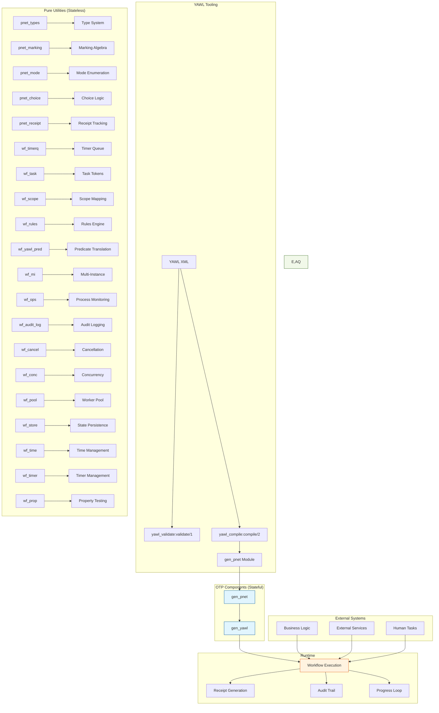
```mermaid
graph TB
    subgraph "YAWL Tooling"
        A[YAWL XML] --> B[yawl_validate:validate/1]
        A --> C[yawl_compile:compile/2]
        C --> D[gen_pnet Module]
    end

    subgraph "Pure Utilities (Stateless)"
        E[pnet_types] --> F[Type System]
        G[pnet_marking] --> H[Marking Algebra]
        I[pnet_mode] --> J[Mode Enumeration]
        K[pnet_choice] --> L[Choice Logic]
        M[pnet_receipt] --> N[Receipt Tracking]
        O[wf_timerq] --> P[Timer Queue]
        Q[wf_task] --> R[Task Tokens]
        S[wf_scope] --> T[Scope Mapping]
        U[wf_rules] --> V[Rules Engine]
        W[wf_yawl_pred] --> X[Predicate Translation]
        Y[wf_mi] --> Z[Multi-Instance]
        AA[wf_ops] --> AB[Process Monitoring]
        AC[wf_audit_log] --> AD[Audit Logging]
        AE[wf_cancel] --> AF[Cancellation]
        AG[wf_conc] --> AH[Concurrency]
        AI[wf_pool] --> AJ[Worker Pool]
        AK[wf_store] --> AL[State Persistence]
        AM[wf_time] --> AN[Time Management]
        AO[wf_timer] --> AP[Timer Management]
        AQ[wf_prop] --> AR[Property Testing]
    end

    subgraph "OTP Components (Stateful)"
        D --> S1[gen_pnet]
        S1 --> S2[gen_yawl]
    end

    subgraph "Runtime"
        S2 --> T1[Workflow Execution]
        T1 --> U1[Receipt Generation]
        T1 --> V1[Audit Trail]
        T1 --> W1[Progress Loop]
    end

    subgraph "External Systems"
        X1[Business Logic] --> T1
        Y1[External Services] --> T1
        Z1[Human Tasks] --> T1
    end

    style S1 fill:#e1f5fe,stroke:#01579b
    style S2 fill:#e1f5fe,stroke:#01579b
    style E,AQ fill:#f1f8e9,stroke:#33691e
    style T1 fill:#fff3e0,stroke:#e65100
```

**Key Architectural Patterns:**
- **Single Runtime**: Only `gen_pnet` maintains state
- **Pure Utilities**: All helper modules are stateless
- **Message Contracts**: Clean inter-process communication
- **Progress Loop**: Automatic token processing

### Component Dependencies

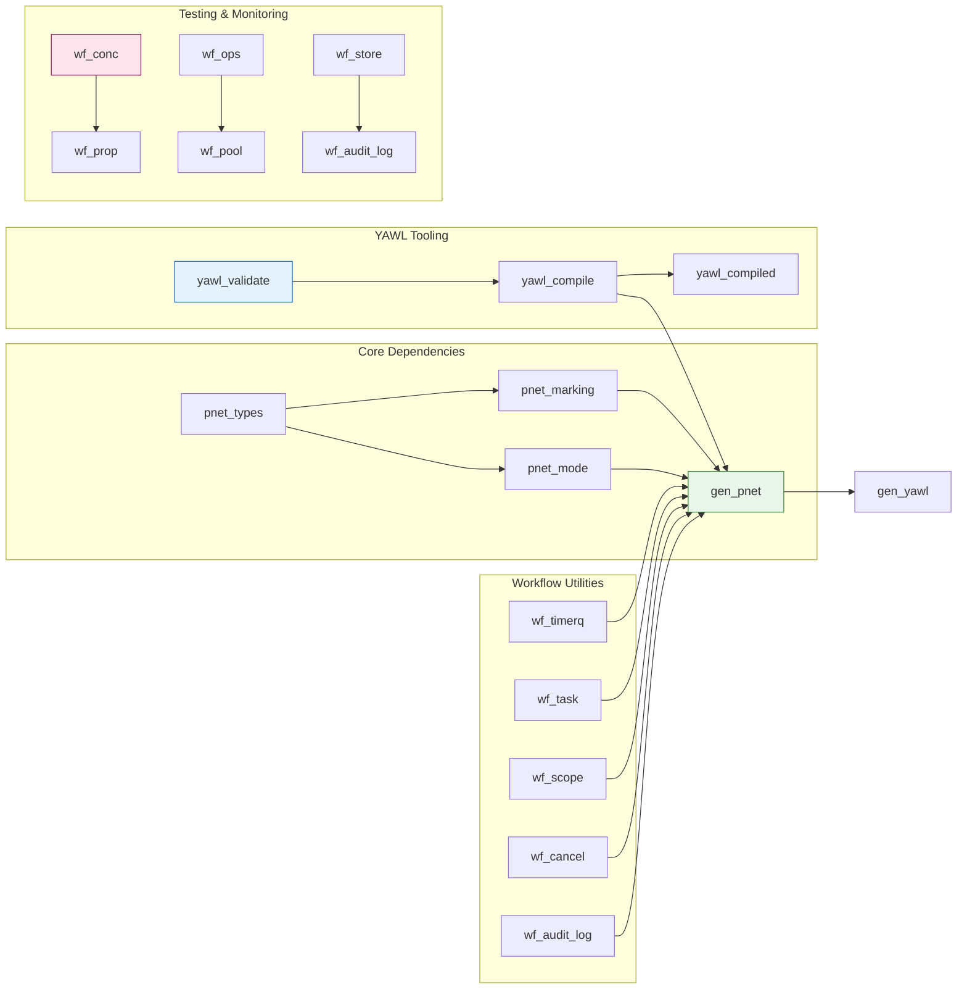
```mermaid
graph LR
    subgraph "Core Dependencies"
        A[pnet_types] --> B[pnet_marking]
        A --> C[pnet_mode]
        B --> D[gen_pnet]
        C --> D
    end

    subgraph "YAWL Tooling"
        E[yawl_validate] --> F[yawl_compile]
        F --> D
        F --> G[yawl_compiled]
    end

    subgraph "Workflow Utilities"
        H[wf_timerq] --> D
        I[wf_task] --> D
        J[wf_scope] --> D
        K[wf_cancel] --> D
        L[wf_audit_log] --> D
    end

    subgraph "Testing & Monitoring"
        M[wf_conc] --> N[wf_prop]
        O[wf_ops] --> P[wf_pool]
        Q[wf_store] --> R[wf_audit_log]
    end

    D --> S[gen_yawl]

    style D fill:#e8f5e8,stroke:#2e7d32
    style E fill:#e3f2fd,stroke:#1565c0
    style M fill:#fce4ec,stroke:#880e4f
```

## YAWL Compilation Pipeline

### XML to Module Generation

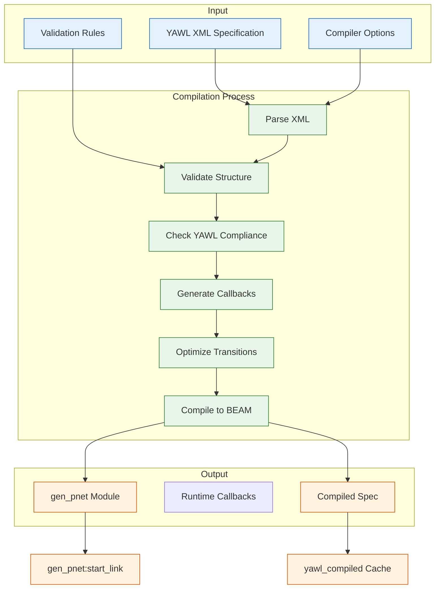
```mermaid
graph TB
    subgraph "Input"
        A[YAWL XML Specification]
        B[Validation Rules]
        C[Compiler Options]
    end

    subgraph "Compilation Process"
        D[Parse XML]
        E[Validate Structure]
        F[Check YAWL Compliance]
        G[Generate Callbacks]
        H[Optimize Transitions]
        I[Compile to BEAM]
    end

    subgraph "Output"
        J[gen_pnet Module]
        K[Runtime Callbacks]
        L[Compiled Spec]
    end

    A --> D
    B --> E
    C --> D
    D --> E
    E --> F
    F --> G
    G --> H
    H --> I
    I --> J
    I --> L
    J --> M[gen_pnet:start_link]
    L --> N[yawl_compiled Cache]

    classDef process fill:#e8f5e9,stroke:#2e7d32
    classDef input fill:#e3f2fd,stroke:#1565c0
    classDef output fill:#fff3e0,stroke:#e65100

    class A,B,C input
    class D,E,F,G,H,I process
    class J,L,M,N output
```

### Compilation Details

```mermaid
flowchart TD
    Start -->[Parse XML]--> XML_Parsed
    XML_Parsed -->[Validate Schema]--> Schema_Valid
    Schema_Valid -->[Check YAWL Rules]--> YAWL_Valid
    YAWL_Valid -->[Generate Places]--> Places_Generated
    YAWL_Valid -->[Generate Transitions]--> Transitions_Generated
    Places_Generated -->[Generate Presets]--> Presets_Generated
    Transitions_Generated -->[Generate Fire Callbacks]--> Fire_Generated
    Presets_Generated -->[Generate Init Marking]--> Init_Generated
    Fire_Generated -->[Compile Module]--> Module_Compiled
    Init_Generated --> Module_Compiled
    Module_Compiled -->[Cache in yawl_compiled]--> Cached
    Cached -->[Runtime Execution]--> Runtime

    classDef process fill:#f3e5f5,stroke:#4a148c
    classDef decision fill:#e8eaf6,stroke:#1a237e
```

## Workflow Execution Flow

### Progress Loop Execution

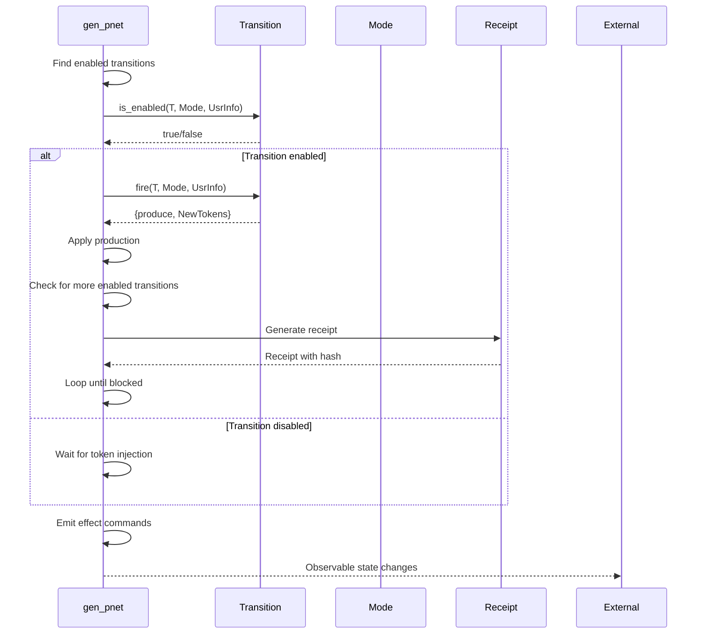
```mermaid
sequenceDiagram
    participant G as gen_pnet
    participant T as Transition
    participant M as Mode
    participant R as Receipt

    G->>G: Find enabled transitions
    G->>T: is_enabled(T, Mode, UsrInfo)
    T-->>G: true/false

    alt Transition enabled
        G->>T: fire(T, Mode, UsrInfo)
        T-->>G: {produce, NewTokens}
        G->>G: Apply production
        G->>G: Check for more enabled transitions
        G->>R: Generate receipt
        R-->>G: Receipt with hash
        G->>G: Loop until blocked
    else Transition disabled
        G->>G: Wait for token injection
    end

    G->>G: Emit effect commands
    G-->>External: Observable state changes
```

### Token Flow Example

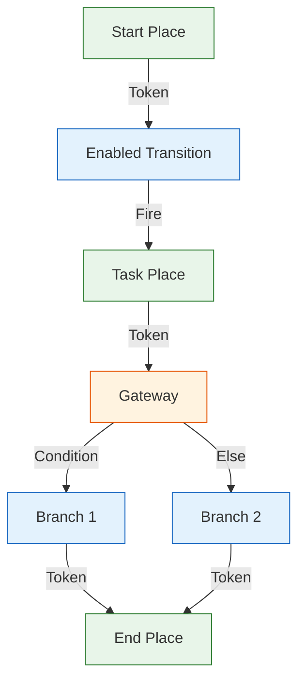
```mermaid
graph TD
    A[Start Place] -->|Token| B[Enabled Transition]
    B -->|Fire| C[Task Place]
    C -->|Token| D[Gateway]
    D -->|Condition| E[Branch 1]
    D -->|Else| F[Branch 2]
    E -->|Token| G[End Place]
    F -->|Token| G

    classDef place fill:#e8f5e9,stroke:#2e7d32
    classDef transition fill:#e3f2fd,stroke:#1565c0
    classDef gateway fill:#fff3e0,stroke:#e65100
    classDef token fill:#f8bbd0,stroke:#c2185b

    class A,C,G place
    class B,D,E,F transition
    class D gateway
```

## Testing Architecture

### Test Organization by Slice


```mermaid
graph TB
    subgraph "Slice 0-3: Basic"
        A[pnet_types_SUITE] --> B[100% Coverage]
        C[pnet_marking_SUITE] --> B
        D[pnet_mode_SUITE] --> B
        E[gen_pnet_SUITE] --> B
    end

    subgraph "Slice 4-7: YAWL Patterns"
        F[yawl_validate_SUITE] --> G[90% Coverage]
        H[yawl_compile_SUITE] --> G
        I[yawl_compiled_SUITE] --> G
        J[orderfulfillment_SUITE] --> G
    end

    subgraph "Slice 8-10: Advanced"
        K[wf_checkpoint_SUITE] --> L[85% Coverage]
        M[wf_audit_log_SUITE] --> L
        N[wf_conc_SUITE] --> L
        O[yawl_cancellation_SUITE] --> L
    end

    subgraph "Slice 11-13: Performance"
        P[yawl_performance_SUITE] --> Q[Baseline]
        R[wf_pool_perf_SUITE] --> Q
        S[wf_ops_perf_SUITE] --> Q
    end

    B --> T[Test Results]
    G --> T
    L --> T
    Q --> T

    style A,C,D,E fill:#e8f5e9,stroke:#2e7d32
    style F,H,I,J fill:#e3f2fd,stroke:#1565c0
    style K,M,N,O fill:#fff3e0,stroke:#e65100
    style P,R,S fill:#fce4ec,stroke:#880e4f
```

### Test Coverage Flow

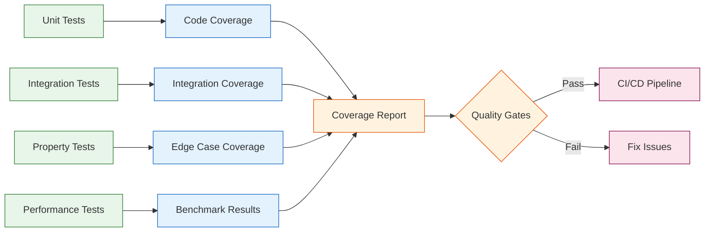
```mermaid
flowchart LR
    A[Unit Tests] --> B[Code Coverage]
    C[Integration Tests] --> D[Integration Coverage]
    E[Property Tests] --> F[Edge Case Coverage]
    G[Performance Tests] --> H[Benchmark Results]

    B --> I[Coverage Report]
    D --> I
    F --> I
    H --> I

    I --> J{Quality Gates}
    J -->|Pass| K[CI/CD Pipeline]
    J -->|Fail| L[Fix Issues]

    classDef tests fill:#e8f5e9,stroke:#2e7d32
    classDef coverage fill:#e3f2fd,stroke:#1565c0
    classDef gate fill:#fff3e0,stroke:#e65100
    classDef process fill:#fce4ec,stroke:#880e4f

    class A,C,E,G tests
    class B,D,F,H coverage
    class I,J gate
    class K,L process
```

## Performance Architecture

### Throughput Analysis

```mermaid
graph TB
    subgraph "Workload Sizes"
        A[Small Workflows] --> B[< 100 tasks]
        C[Medium Workflows] --> D[100-500 tasks]
        E[Large Workflows] --> F[500-1000 tasks]
        G[XL Workflows] --> H[> 1000 tasks]
    end

    subgraph "Performance Metrics"
        B --> I[< 1ms per step]
        D --> J[1-5ms per step]
        F --> K[5-10ms per step]
        H --> L[10-50ms per step]
    end

    subgraph "Resource Usage"
        I --> M[Low Memory]
        J --> N[Medium Memory]
        K --> O[High Memory]
        L --> P[Very High Memory]
    end

    subgraph "Scaling"
        M --> Q[Single Node]
        N --> R[Single Node]
        O --> S[Cluster]
        P --> T[Cluster + Sharding]

    classDef workload fill:#e8f5e9,stroke:#2e7d32
    classDef metric fill:#e3f2fd,stroke:#1565c0
    classDef resource fill:#fff3e0,stroke:#e65100
    classDef scaling fill:#fce4ec,stroke:#880e4f
```

### Memory Management

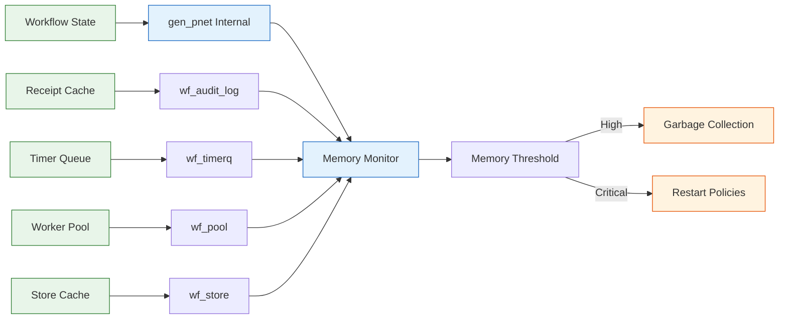
```mermaid
graph LR
    A[Workflow State] --> B[gen_pnet Internal]
    C[Receipt Cache] --> D[wf_audit_log]
    E[Timer Queue] --> F[wf_timerq]
    G[Worker Pool] --> H[wf_pool]
    I[Store Cache] --> J[wf_store]

    B --> K[Memory Monitor]
    D --> K
    F --> K
    H --> K
    J --> K

    K --> L[Memory Threshold]
    L -->|High| M[Garbage Collection]
    L -->|Critical| N[Restart Policies]

    classDef data fill:#e8f5e9,stroke:#2e7d32
    classDef monitor fill:#e3f2fd,stroke:#1565c0
    classDef action fill:#fff3e0,stroke:#e65100

    class A,C,E,G,I data
    class B,K monitor
    class M,N action
```

## Deployment Architecture

### Production Deployment

```mermaid
graph TB
    subgraph "Load Balancer"
        A[HAProxy/Nginx] --> B[Node 1]
        A --> C[Node 2]
        A --> D[Node 3]
    end

    subgraph "Node 1"
        B --> E[gen_pnet Instance]
        E --> F[Worker Pool]
        E --> G[State Store]
    end

    subgraph "Node 2"
        C --> H[gen_pnet Instance]
        H --> I[Worker Pool]
        H --> J[State Store]
    end

    subgraph "Node 3"
        D --> K[gen_pnet Instance]
        K --> L[Worker Pool]
        K --> M[State Store]
    end

    subgraph "External Services"
        N[Database] --> G
        N --> J
        N --> M
        O[Message Queue] --> F
        O --> I
        O --> L
        P[Monitoring] --> E
        P --> H
        P --> K

    classDef node fill:#e8f5e9,stroke:#2e7d32
    classDef service fill:#e3f2fd,stroke:#1565c0
    classDef external fill:#fff3e0,stroke:#e65100

    class B,C,E,H,K node
    class F,G,I,J,L,M service
    class N,O,P external
```

### Development Environment

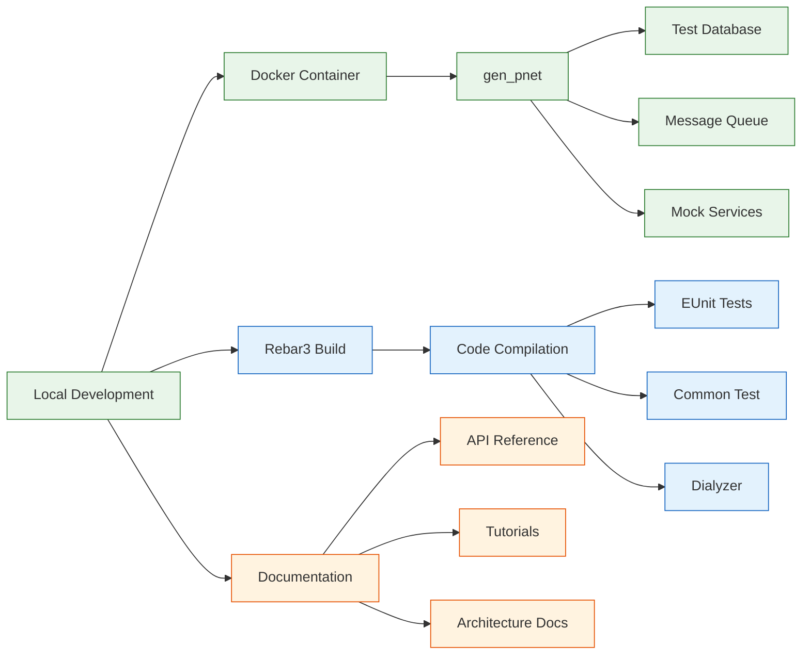
```mermaid
graph LR
    A[Local Development] --> B[Docker Container]
    B --> C[gen_pnet]
    C --> D[Test Database]
    C --> E[Message Queue]
    C --> F[Mock Services]

    A --> G[Rebar3 Build]
    G --> H[Code Compilation]
    H --> I[EUnit Tests]
    H --> J[Common Test]
    H --> K[Dialyzer]

    A --> L[Documentation]
    L --> M[API Reference]
    L --> N[Tutorials]
    L --> O[Architecture Docs]

    classDef dev fill:#e8f5e9,stroke:#2e7d32
    classDef build fill:#e3f2fd,stroke:#1565c0
    classDef docs fill:#fff3e0,stroke:#e65100

    class A,B,C,D,E,F dev
    class G,H,I,J,K build
    class L,M,N,O docs
```

## Monitoring and Observability

### System Monitoring

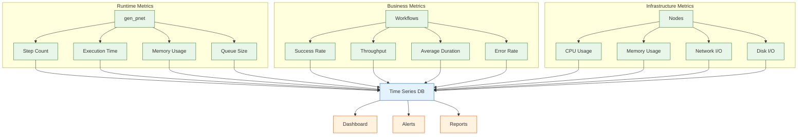
```mermaid
graph TB
    subgraph "Runtime Metrics"
        A[gen_pnet] --> B[Step Count]
        A --> C[Execution Time]
        A --> D[Memory Usage]
        A --> E[Queue Size]
    end

    subgraph "Business Metrics"
        F[Workflows] --> G[Success Rate]
        F --> H[Throughput]
        F --> I[Average Duration]
        F --> J[Error Rate]
    end

    subgraph "Infrastructure Metrics"
        K[Nodes] --> L[CPU Usage]
        K --> M[Memory Usage]
        K --> N[Network I/O]
        K --> O[Disk I/O]
    end

    B --> P[Time Series DB]
    C --> P
    D --> P
    E --> P
    G --> P
    H --> P
    I --> P
    J --> P
    L --> P
    M --> P
    N --> P
    O --> P

    P --> Q[Dashboard]
    P --> R[Alerts]
    P --> S[Reports]

    classDef metrics fill:#e8f5e9,stroke:#2e7d32
    classDef storage fill:#e3f2fd,stroke:#1565c0
    classDef output fill:#fff3e0,stroke:#e65100

    class A,B,C,D,E,F,G,H,I,J,K,L,M,N,O metrics
    class P storage
    class Q,R,S output
```

### Alerting System

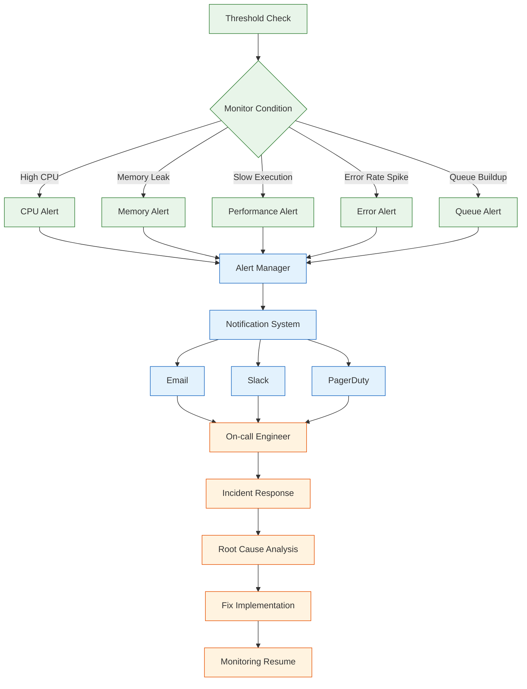
```mermaid
flowchart TD
    A[Threshold Check] --> B{Monitor Condition}
    B -->|High CPU| C[CPU Alert]
    B -->|Memory Leak| D[Memory Alert]
    B -->|Slow Execution| E[Performance Alert]
    B -->|Error Rate Spike| F[Error Alert]
    B -->|Queue Buildup| G[Queue Alert]

    C --> H[Alert Manager]
    D --> H
    E --> H
    F --> H
    G --> H

    H --> I[Notification System]
    I --> J[Email]
    I --> K[Slack]
    I --> L[PagerDuty]

    J --> M[On-call Engineer]
    K --> M
    L --> M

    M --> N[Incident Response]
    N --> O[Root Cause Analysis]
    O --> P[Fix Implementation]
    P --> Q[Monitoring Resume]

    classDef monitor fill:#e8f5e9,stroke:#2e7d32
    classDef alert fill:#e3f2fd,stroke:#1565c0
    classDef response fill:#fff3e0,stroke:#e65100

    class A,B,C,D,E,F,G monitor
    class H,I,J,K,L alert
    class M,N,O,P,Q response
```

## Data Flow Diagrams

### Workflow Lifecycle

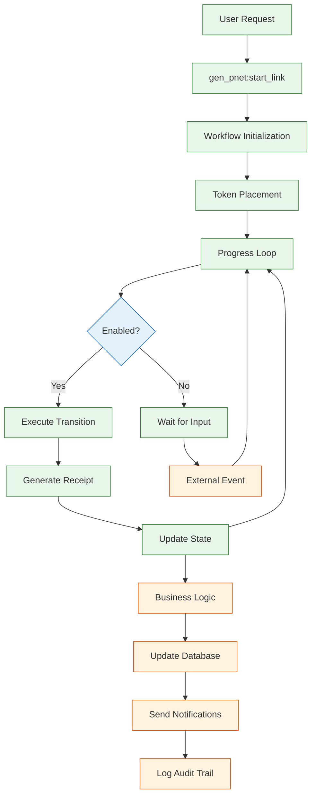
```mermaid
graph TD
    A[User Request] --> B[gen_pnet:start_link]
    B --> C[Workflow Initialization]
    C --> D[Token Placement]
    D --> E[Progress Loop]
    E --> F{Enabled?}
    F -->|Yes| G[Execute Transition]
    F -->|No| H[Wait for Input]
    G --> I[Generate Receipt]
    I --> J[Update State]
    J --> E
    H --> K[External Event]
    K --> E

    J --> L[Business Logic]
    L --> M[Update Database]
    M --> N[Send Notifications]
    N --> O[Log Audit Trail]

    classDef process fill:#e8f5e9,stroke:#2e7d32
    classDef decision fill:#e3f2fd,stroke:#1565c0
    classDef external fill:#fff3e0,stroke:#e65100

    class A,B,C,D,E,F,G,H,I,J process
    class F decision
    class K,L,M,N,O external
```

### Error Handling Flow

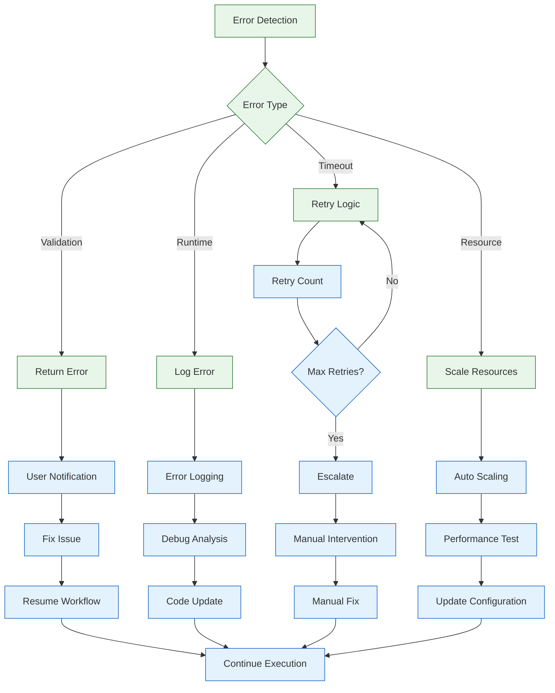
```mermaid
flowchart TD
    A[Error Detection] --> B{Error Type}
    B -->|Validation| C[Return Error]
    B -->|Runtime| D[Log Error]
    B -->|Timeout| E[Retry Logic]
    B -->|Resource| F[Scale Resources]

    C --> G[User Notification]
    D --> H[Error Logging]
    E --> I[Retry Count]
    I --> J{Max Retries?}
    J -->|Yes| K[Escalate]
    J -->|No| E
    F --> L[Auto Scaling]

    G --> M[Fix Issue]
    H --> N[Debug Analysis]
    K --> O[Manual Intervention]
    L --> P[Performance Test]

    M --> Q[Resume Workflow]
    N --> R[Code Update]
    O --> S[Manual Fix]
    P --> T[Update Configuration]

    Q --> U[Continue Execution]
    R --> U
    S --> U
    T --> U

    classDef detection fill:#e8f5e9,stroke:#2e7d32
    classDef action fill:#e3f2fd,stroke:#1565c0
    classDef outcome fill:#fff3e0,stroke:#e65100

    class A,B,C,D,E,F detection
    class G,H,I,J,K,L,M,N,O,P,Q,R,S,T,U action
```

## State Diagrams

### Workflow States

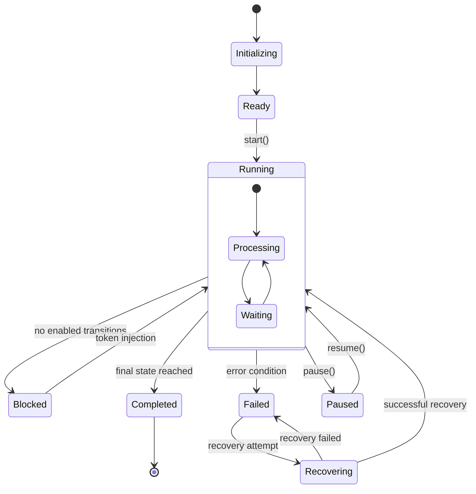
```mermaid
stateDiagram-v2
    [*] --> Initializing
    Initializing --> Ready

    Ready --> Running : start()
    Running --> Blocked : no enabled transitions
    Blocked --> Running : token injection
    Running --> Completed : final state reached
    Running --> Failed : error condition

    Failed --> Recovering : recovery attempt
    Recovering --> Running : successful recovery
    Recovering --> Failed : recovery failed

    Completed --> [*]

    Running --> Paused : pause()
    Paused --> Running : resume()

    state Running {
        [*] --> Processing
        Processing --> Waiting
        Waiting --> Processing
    }
```

### Component States

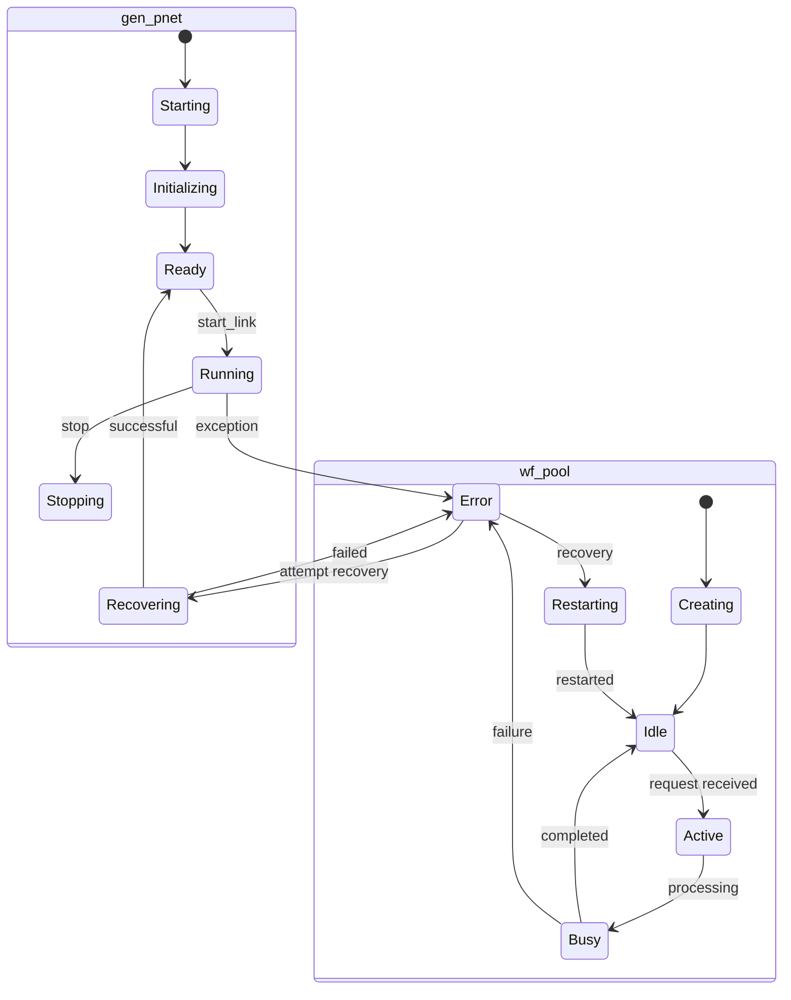
```mermaid
stateDiagram-v2
    state gen_pnet {
        [*] --> Starting
        Starting --> Initializing
        Initializing --> Ready

        Ready --> Running : start_link
        Running --> Stopping : stop
        Running --> Error : exception

        Error --> Recovering : attempt recovery
        Recovering --> Ready : successful
        Recovering --> Error : failed
    }

    state wf_pool {
        [*] --> Creating
        Creating --> Idle
        Idle --> Active : request received
        Active --> Busy : processing
        Busy --> Idle : completed
        Busy --> Error : failure
        Error --> Restarting : recovery
        Restarting --> Idle : restarted
    }
```

## Sequence Diagrams

### Workflow Creation and Execution

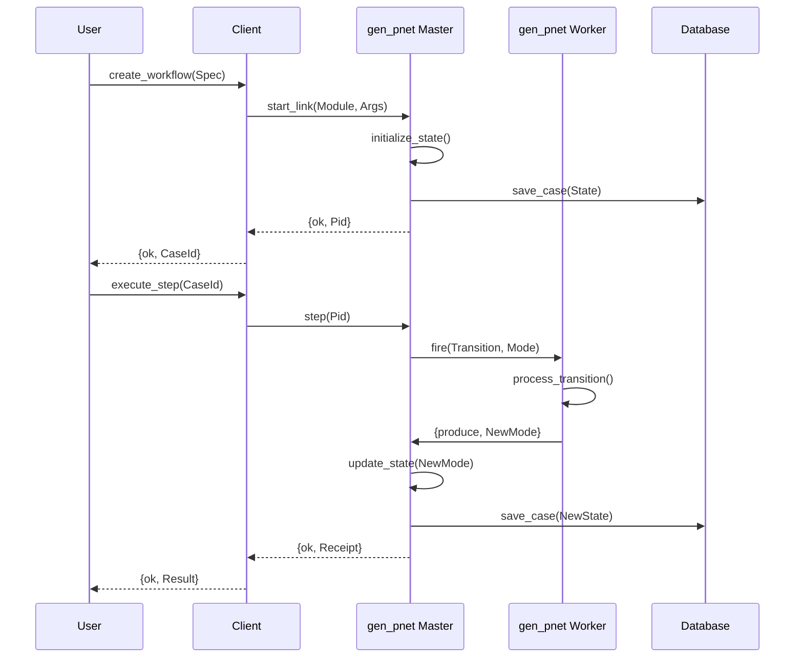
```mermaid
sequenceDiagram
    participant U as User
    participant C as Client
    participant M as gen_pnet Master
    participant W as gen_pnet Worker
    participant D as Database

    U->>C: create_workflow(Spec)
    C->>M: start_link(Module, Args)
    M->>M: initialize_state()
    M->>D: save_case(State)
    M-->>C: {ok, Pid}
    C-->>U: {ok, CaseId}

    U->>C: execute_step(CaseId)
    C->>M: step(Pid)
    M->>W: fire(Transition, Mode)
    W->>W: process_transition()
    W->>M: {produce, NewMode}
    M->>M: update_state(NewMode)
    M->>D: save_case(NewState)
    M-->>C: {ok, Receipt}
    C-->>U: {ok, Result}
```

### Multi-Instance Execution

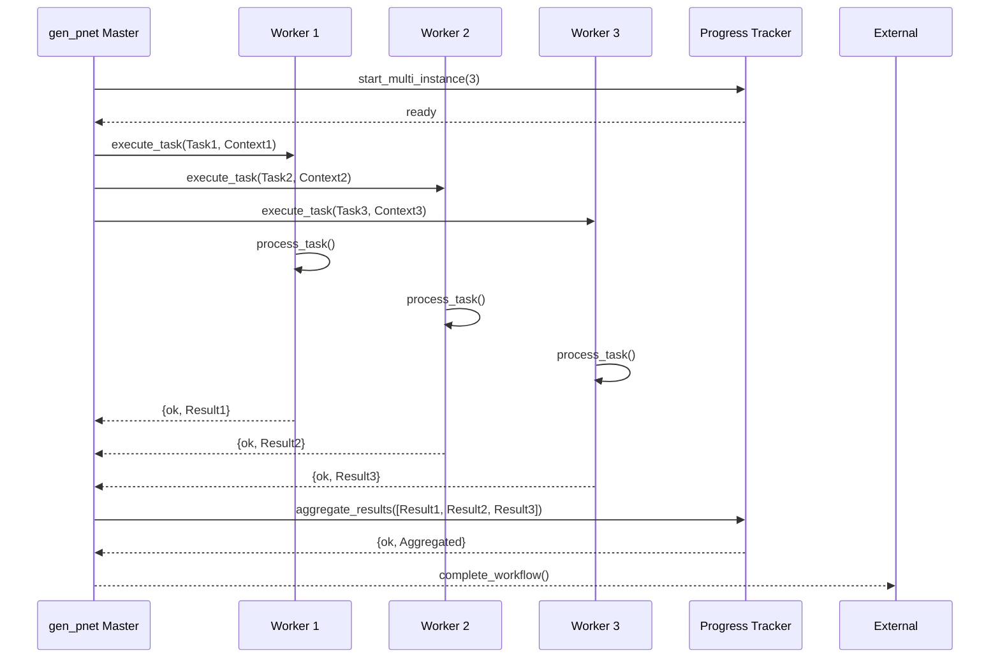
```mermaid
sequenceDiagram
    participant M as gen_pnet Master
    participant W1 as Worker 1
    participant W2 as Worker 2
    participant W3 as Worker 3
    participant P as Progress Tracker

    M->>P: start_multi_instance(3)
    P-->>M: ready

    M->>W1: execute_task(Task1, Context1)
    M->>W2: execute_task(Task2, Context2)
    M->>W3: execute_task(Task3, Context3)

    W1->>W1: process_task()
    W2->>W2: process_task()
    W3->>W3: process_task()

    W1-->>M: {ok, Result1}
    W2-->>M: {ok, Result2}
    W3-->>M: {ok, Result3}

    M->>P: aggregate_results([Result1, Result2, Result3])
    P-->>M: {ok, Aggregated}
    M-->>External: complete_workflow()
```

## Integration Diagrams

### External System Integration

```mermail
graph TB
    subgraph "CRE System"
        A[gen_pnet] --> B[Business Logic Layer]
        B --> C[Workflow Engine]
        C --> D[Token Processing]
    end

    subgraph "External Systems"
        E[Database] --> B
        F[Message Queue] --> C
        G[API Services] --> B
        H[File System] --> B
    end

    subgraph "Monitoring"
        I[Logging] --> A
        J[Metrics] --> A
        K[Tracing] --> A
    end

    subgraph "User Interfaces"
        L[Web Dashboard] --> A
        M[CLI Tools] --> A
        N[REST API] --> A
    end

    classDef system fill:#e8f5e9,stroke:#2e7d32
    classDef external fill:#e3f2fd,stroke:#1565c0
    classDef monitor fill:#fff3e0,stroke:#e65100
    classDef user fill:#fce4ec,stroke:#880e4f

    class A,B,C,D system
    class E,F,G,H external
    class I,J,K monitor
    class L,M,N user
```

### Data Integration Patterns

```mermaid
graph LR
    subgraph "Data Sources"
        A[Relational DB]
        B[NoSQL DB]
        C[Message Queue]
        D[External API]
        E[File System]
    end

    subgraph "Integration Patterns"
        F[Direct Query] --> A
        G[Async Processing] --> C
        H[REST Client] --> D
        I[File Watcher] --> E
        J[Connection Pool] --> A
        K[Batch Processing] --> B
        L[Streaming] --> C
    end

    subgraph "Processing Layer"
        F --> M[Data Transform]
        G --> M
        H --> M
        I --> M
        J --> M
        K --> M
        L --> M
    end

    M --> N[Business Logic]
    N --> O[Workflow State]

    classDef source fill:#e8f5e9,stroke:#2e7d32
    classDef pattern fill:#e3f2fd,stroke:#1565c0
    classDef process fill:#fff3e0,stroke:#e65100

    class A,B,C,D,E source
    class F,G,H,I,J,K,L pattern
    class M,N,O process
```

## Summary

This comprehensive diagram reference provides visual representations of the YAWL workflow engine architecture, from high-level structure to detailed execution flows. The diagrams follow industry-standard Mermaid syntax and can be easily integrated into documentation, presentations, and development tools.

Key diagram categories covered:
1. **Architecture Diagrams** - High-level component structure
2. **Workflow Execution** - Process flows and token movement
3. **Testing Organization** - Test coverage by slice
4. **Performance Analysis** - Resource usage and scaling
5. **Deployment Models** - Production and development setups
6. **Monitoring Systems** - Observability and alerting
7. **Data Flows** - Lifecycle and error handling
8. **State Diagrams** - Component and workflow states
9. **Sequence Diagrams** - Message passing between components
10. **Integration Patterns** - External system connections

All diagrams maintain consistency with the Joe Armstrong architecture principles and provide clear visual documentation of the system's design and behavior.