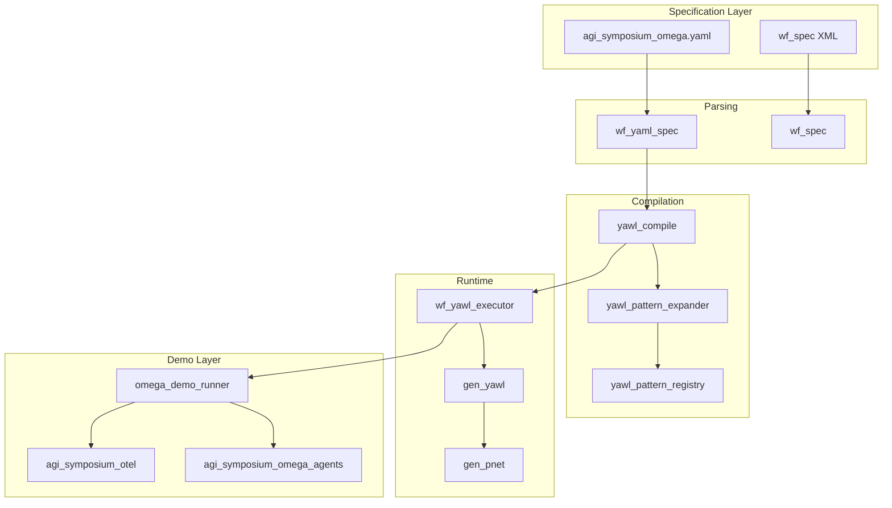
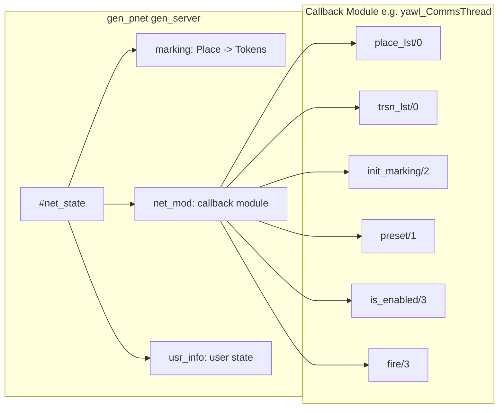
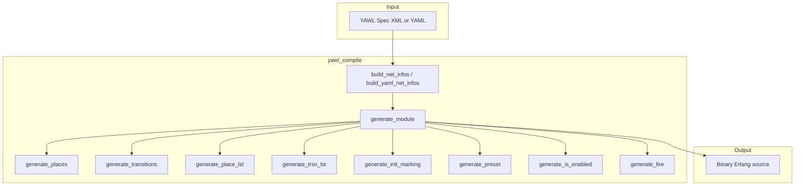
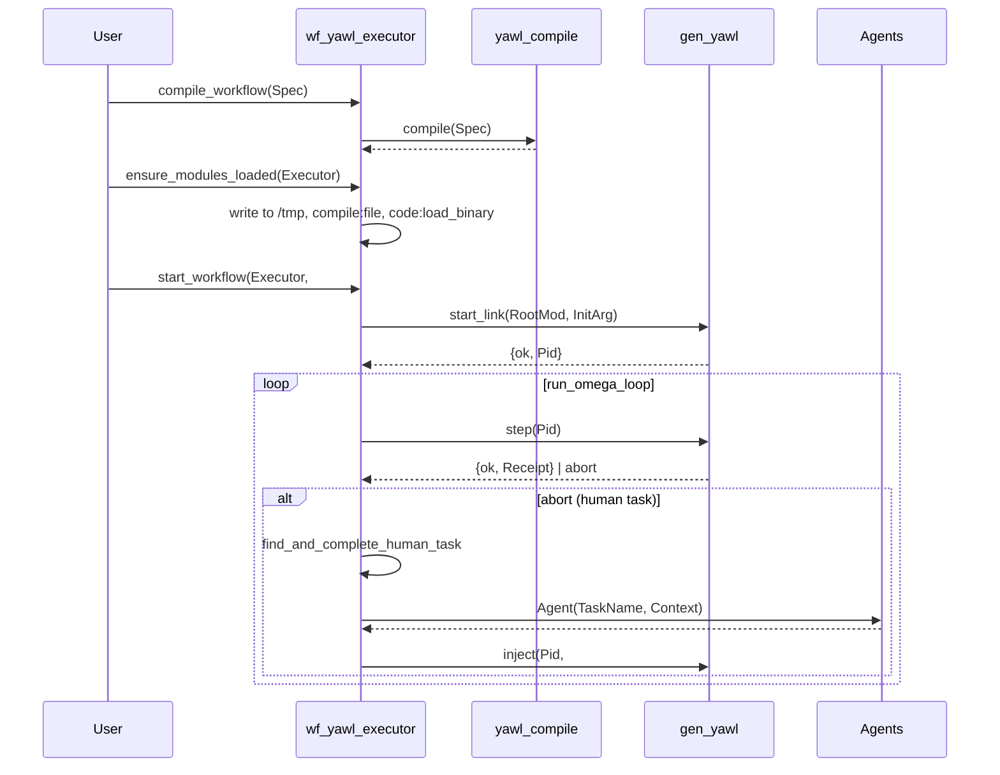
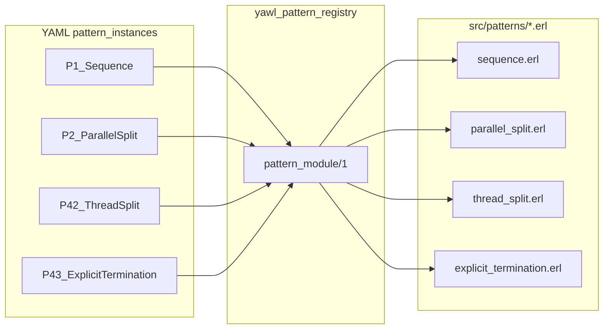
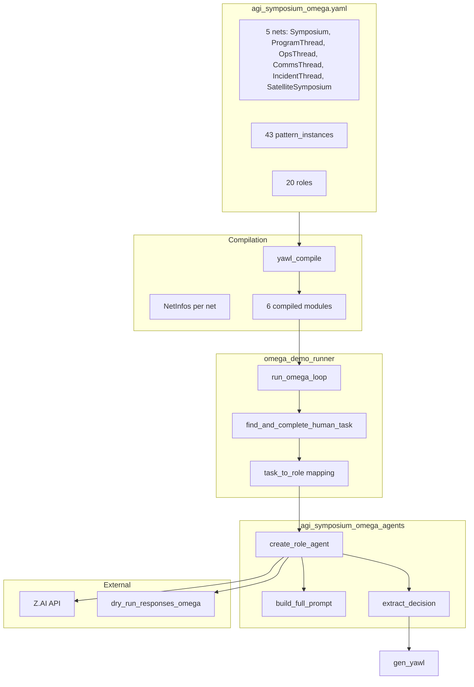
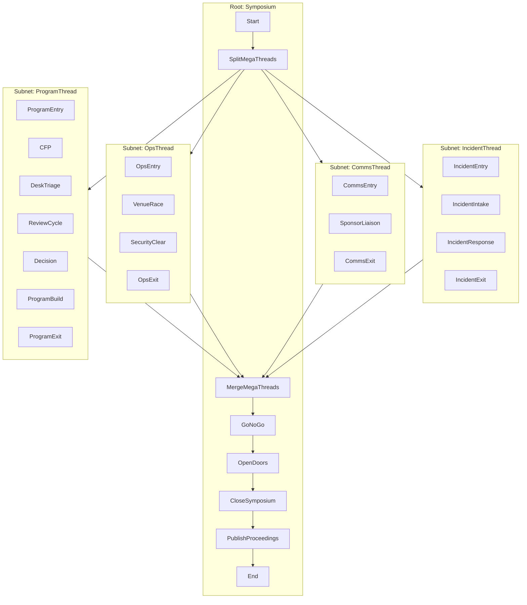
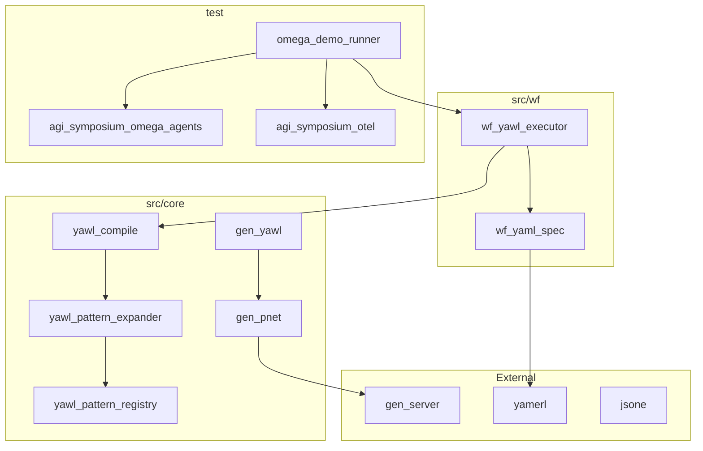

# Workflow Patterns as Generators of State-Space Topology: Expressive Incompleteness and the Swarm Turing Test

**A博士論文 — PhD Thesis**

*On the Formal Properties of Composed Workflow Constraint Systems and Their Implications for Artificial Intelligence Frameworks*

---

## Abstract

This thesis presents a formal and empirical study of the CRE (Common Runtime Environment) workflow engine—an Erlang/OTP system that compiles YAWL (Yet Another Workflow Language) specifications into executable Petri nets. The central claim is that composed workflow patterns generate state-space topologies that are *structurally unmodellable* by current AI frameworks, which assume closed-form agency, fixed policy spaces, and single-objective optimization. We introduce the *Swarm Turing Test* as a witness test for framework insufficiency: a transcript produced by a 43-pattern, 20-agent workflow swarm that cannot be generated by any known single-objective, fixed-topology formalism. We provide complete architectural diagrams and reproduction instructions so that readers may verify the framework and results.

---

## 1. Introduction

### 1.1 Motivation

Modern AI systems—including multi-agent architectures—tacitly assume:

- Agents are **individually specifiable**
- Policies are locally optimizable
- Global behavior is reducible to policy + reward + memory
- Coordination is either explicit or learned end-to-end

This is a *closed-world assumption* about agency. Workflow systems violate it by construction: workflows are **constraints on interaction**, and constraints compose *nonlinearly*.

### 1.2 Key Thesis

1. **Workflow patterns generate state-space topology**, not trajectories within a fixed space.
2. **No single loss surface exists** for composed workflow systems; credit assignment is non-causal.
3. **Certain behaviors are not representable** in MDPs, POMDPs, or game-theoretic equilibria.
4. **The Swarm Turing Test** is a witness test: passing it demonstrates framework insufficiency.

### 1.3 Scope

- CRE: Erlang/OTP YAWL workflow engine
- 43 YAWL workflow patterns (Van der Aalst / Workflow Patterns)
- AGI Symposium Ω: 20-role, 5-net specification with 43 pattern instances
- Swarm Turing Test: transcript output mode for human-indistinguishable committee dialogue

---

## 2. Theoretical Framework

### 2.1 Expressive Incompleteness

**Definition (Informal):** A class of decision systems \(\mathcal{F}\) is *expressively incomplete* with respect to a class of behaviors \(\mathcal{B}\) if there exist behaviors in \(\mathcal{B}\) that cannot be expressed as trajectories of any system in \(\mathcal{F}\).

**Proposition (Sketch):** Let \(\mathcal{F}\) consist of systems with:
- Fixed policy space \(\Pi\)
- Static transition graph \(G\)
- Single scalar objective (or finite objectives with fixed weighting)
- Causal credit assignment

Then there exist workflow-induced behaviors (path-dependent, interpretation-involving, norm-forming, exception-creating) that are **not expressible** as trajectories of any \(\mathcal{F}\)-system.

### 2.2 Phase Boundary

- **Below:** behavior ⊆ framework
- **Above:** framework ⊂ behavior

When behavior escapes representation, benchmarking becomes archaeology.

### 2.3 Workflows as Intelligence

If the thesis holds:
- LLMs are not the intelligence
- The workflows are
- The swarm is the compiler
- The transcript is the trace

---

## 3. Architecture Overview

### 3.1 High-Level Module Diagram



### 3.2 gen_pnet: The Single OTP Runner

`gen_pnet` is the **only** OTP process maintaining Petri net state. All other modules are pure helpers.



**Record Definition (gen_pnet.hrl):**

```erlang
-record(net_state, {
    marking,   %% #{atom() => [term()]} - tokens per place
    net_mod,  %% atom() - callback module
    usr_info, %% term() - user-defined state
    stats,    %% #stats{} | undefined
    tstart,   %% integer()
    cnt       %% integer()
}).
```

**gen_pnet API:**

| Function | Purpose |
|----------|---------|
| `start_link/3` | Start unregistered net process |
| `start_link/4` | Start registered net process |
| `marking/1` | Get full marking map |
| `ls/2` | Get tokens at a place |
| `inject/2` | Inject tokens into places |
| `step/1` | Fire one enabled transition |
| `drain/2` | Execute until quiescent or timeout |

### 3.3 gen_yawl: Enhanced fire/3

`gen_yawl` wraps `gen_pnet` to support 3-tuple returns from `fire/3`:

```erlang
%% fire/3 may return:
{produce, #{Place => [Token]}}              %% Standard
{produce, #{Place => [Token]}, NewUsrInfo}  %% With state update
abort
```

### 3.4 yawl_compile: Spec → gen_pnet Module



**Generated Module Structure:**

```erlang
-module(yawl_CommsThread).
-behaviour(gen_pnet).

%% Structure callbacks
place_lst() -> ['CommsEntry', 'CommsExit', 'PressBriefs', 'SocialUpdates', 'SponsorLiaison'].
trsn_lst() -> ['t_PressBriefs', 't_SocialUpdates', 't_SponsorLiaison'].
init_marking(Place, UsrInfo) -> ...  %% [init] for entry, [] for tasks
preset(Transition) -> ...           %% [InputPlace, TaskPlace] per transition
is_enabled(Transition, Mode, UsrInfo) -> ...  %% case {Transition, Mode, UsrInfo} of
fire(Transition, Mode, UsrInfo) -> ...         %% case {Transition, Mode, UsrInfo} of

%% Interface callbacks
init(_NetArg) -> #{}.
handle_call/3, handle_cast/2, handle_info/2, code_change/3, terminate/2, trigger/3.
```

### 3.5 wf_yawl_executor: Lifecycle



### 3.6 Pattern Registry (43 Patterns)



**Pattern Mapping (excerpt from yawl_pattern_registry.erl):**

```erlang
pattern_module(<<"P1_Sequence">>) -> sequence;
pattern_module(<<"P2_ParallelSplit">>) -> parallel_split;
pattern_module(<<"P3_Synchronization">>) -> synchronization;
pattern_module(<<"P4_ExclusiveChoice">>) -> exclusive_choice;
%% ... P5 through P41 ...
pattern_module(<<"P42_ThreadSplit">>) -> thread_split;
pattern_module(<<"P43_ExplicitTermination">>) -> explicit_termination;
```

### 3.7 Omega Demo Data Flow



---

## 4. AGI Symposium Ω Specification

### 4.1 Nets and Subnets



### 4.2 Human Tasks (18)

| Role | Tasks |
|------|-------|
| Chair | GoNoGo, CloseSymposium |
| EthicsChair | DeskTriage |
| Reviewer | ReviewCycle |
| AreaChair | AuthorRebuttal, MetaReview |
| ProgramChair | Decision, ProgramBuild |
| VenueLead | VenueRace |
| SafetyOfficer | SecurityClear, IncidentIntake, IncidentResponse |
| AVLead | AVPrep |
| OpsLead | NetworkPrep, SpeakerOnboarding |
| TravelGrantsLead | TravelGrants |
| FinanceLead | VisaLetters |
| SponsorshipLead | SponsorLiaison |

### 4.3 Pattern Instances (43)

| ID | Pattern | Net |
|----|---------|-----|
| P42 | Thread Split | Symposium |
| P41 | Thread Merge | Symposium |
| P2 | Parallel Split | ProgramThread |
| P3 | Synchronization | Symposium |
| P1 | Sequence | ProgramThread |
| P4 | Exclusive Choice | ProgramThread |
| P21 | Structured Loop | ProgramThread |
| P10 | Arbitrary Cycles | ProgramThread |
| P6 | Multiple Choice | ProgramThread |
| P7 | Structured Sync Merge | ProgramThread |
| ... | ... | ... |
| P43 | Explicit Termination | Symposium |

---

## 5. Swarm Turing Test

### 5.1 Purpose

The Swarm Turing Test is not "does it look human?" but:

> "Did the system produce interactional events that cannot be generated by any known single-objective, fixed-topology AI formalism?"

Passing = **witness** of framework insufficiency.

### 5.2 Transcript Mode Design

- **Banner:** "AGI Symposium 2026 — Planning Committee Transcript" (no LLM mention)
- **Output:** `Role: statement` (50-150 words per turn)
- **Omit:** Prompts, JSON, workflow context, timestamps
- **Target:** 50-100+ turns, 5000-15000+ words

### 5.3 Response Format

```json
{"statement": "I've reviewed the materials from ops, program, and comms...", "decision": "accept"}
```

---

## 6. Project Structure

### 6.1 Module Dependency Graph



### 6.2 Directory Layout

```
cre/
├── src/
│   ├── core/
│   │   ├── gen_pnet.erl          %% Petri net OTP behavior
│   │   ├── gen_yawl.erl           %% Extended fire/3
│   │   ├── yawl_compile.erl       %% Spec → gen_pnet modules
│   │   ├── yawl_pattern_expander.erl
│   │   └── yawl_pattern_registry.erl
│   ├── wf/
│   │   ├── wf_yaml_spec.erl       %% YAML parsing
│   │   ├── wf_yawl_executor.erl   %% Workflow lifecycle
│   │   └── ...
│   ├── patterns/                  %% 43 pattern modules
│   │   ├── sequence.erl
│   │   ├── thread_split.erl
│   │   └── ...
│   └── ...
├── test/
│   ├── omega_demo_runner.erl
│   ├── agi_symposium_omega_agents.erl
│   ├── agi_symposium_otel.erl
│   └── fixtures/
│       └── agi_symposium_omega.yaml
├── include/
│   └── gen_pnet.hrl
└── rebar.config
```

---

## 7. Reproduction Instructions

### 7.1 Prerequisites

- Erlang/OTP 25+ (tested through 28)
- rebar3
- yamerl, jsx, jsone, gen_pnet (dependencies)

### 7.2 Build

```bash
cd /path/to/cre
rebar3 compile
```

### 7.3 Run Omega Demo (dry-run)

```bash
DEMO_OMEGA=1 DEMO_DRY_RUN=1 ./scripts/run_agi_symposium_demo.sh --omega --dry-run
```

### 7.4 Run Omega Demo (Z.AI)

```bash
ZAI_API_KEY=your_key DEMO_OMEGA=1 ./scripts/run_agi_symposium_demo.sh --omega
```

### 7.5 Run Tests

```bash
rebar3 ct --suite=agi_symposium_omega_SUITE
rebar3 ct --suite=agi_symposium_simulation_SUITE
rebar3 eunit
```

### 7.6 Compile YAML to File

```erlang
{ok, Spec} = wf_yaml_spec:from_yaml_file("test/fixtures/agi_symposium_omega.yaml"),
{ok, Files} = yawl_compile:compile_to_file(Spec, #{}, "/tmp/omega_modules").
```

### 7.7 Start Workflow Programmatically

```erlang
{ok, Spec} = wf_yaml_spec:from_yaml_file("test/fixtures/agi_symposium_omega.yaml"),
{ok, Executor} = wf_yawl_executor:compile_workflow(Spec, #{}),
{ok, _} = wf_yawl_executor:ensure_modules_loaded(Executor),
{ok, Pid, CaseId} = wf_yawl_executor:start_workflow(Executor, #{}),
gen_yawl:marking(Pid),
gen_yawl:step(Pid),
wf_yawl_executor:stop_workflow(Pid).
```

---

## 8. Key Erlang Code Fragments

### 8.1 gen_pnet step/1 (simplified)

```erlang
%% Fires one enabled transition
step(Name) ->
    gen_server:call(Name, step).

%% In handle_call:
handle_call(step, _From, #net_state{marking = M, net_mod = Mod, usr_info = U} = S) ->
    case find_enabled(M, Mod, U) of
        {Trsn, Mode} ->
            {produce, ProdMap} = Mod:fire(Trsn, Mode, U),
            M1 = consume_preset(M, Mod:preset(Trsn), Mode),
            M2 = produce_tokens(M1, ProdMap),
            {reply, {ok, #{trsn => Trsn}}, S#net_state{marking = M2}};
        none ->
            {reply, abort, S}
    end.
```

### 8.2 yawl_compile generate_fire (simplified)

```erlang
generate_fire(#{input_condition := InputCond, output_condition := OutputCond,
               tasks := Tasks, split_types := SplitTypes}) ->
    InputPlace = sanitize_atom_name(InputCond),
    OutputPlace = sanitize_atom_name(OutputCond),
    Clauses = [generate_fire_clause(Task, InputPlace, OutputPlace, SplitTypes) || Task <- Tasks]
        ++ [<<"\n        {_Transition, _Mode, _UsrInfo} ->\n            abort">>],
    JoinedClauses = iolist_to_binary(lists:join(<<";">>, Clauses)),
    iolist_to_binary([
        <<"fire(Transition, Mode, UsrInfo) ->\n    case {Transition, Mode, UsrInfo} of">>,
        JoinedClauses,
        <<"\n    end.\n">>
    ]).
```

### 8.3 CommsThread Net Structure (Generated)

```
     [CommsEntry]─────┬─────────────────┬─────────────────┐
          │          │                 │                 │
          ▼          ▼                 ▼                 ▼
     t_PressBriefs  t_SocialUpdates  t_SponsorLiaison
          │          │                 │
          └──────────┴─────────────────┴──►[CommsExit]
```

Places: CommsEntry, CommsExit, PressBriefs, SocialUpdates, SponsorLiaison
Transitions: t_PressBriefs, t_SocialUpdates, t_SponsorLiaison
Preset(t_PressBriefs) = [CommsEntry, PressBriefs]

### 8.4 omega_demo_runner find_inject_place

```erlang
%% Finds a human task ready for token injection
%% Preset = [InputPlace, TaskPlace]; needs one token in input, none in task (or vice versa)
find_inject_place(Transitions, PresetMap, Marking) ->
    lists:foldl(fun(Trsn, Acc) ->
        case Acc of
            undefined ->
                Preset = maps:get(Trsn, PresetMap, []),
                case Preset of
                    [P1, P2] ->
                        T1 = length(maps:get(P1, Marking, [])),
                        T2 = length(maps:get(P2, Marking, [])),
                        TaskName = atom_to_binary(Trsn, utf8),
                        if T1 > 0, T2 =:= 0 -> {P2, TaskName};
                           T2 > 0, T1 =:= 0 -> {P1, TaskName};
                           true -> undefined
                        end;
                    _ -> undefined
                end;
            _ -> Acc
        end
    end, undefined, Transitions).
```

---

## 9. Conclusion

The CRE workflow engine demonstrates that composed workflow patterns generate state-space topologies that escape representation by fixed-topology AI formalisms. The Swarm Turing Test—when passed—provides a witness of expressive incompleteness. The next formal step is to state a minimal impossibility theorem: *given fixed policy spaces and static transition graphs, certain workflow-induced behaviors are unexpressible*.

The transcript is not the phenomenon; it is the trace. The workflows are the semantics; the LLMs are the bytecode.

---

## References

1. Van der Aalst, W. M. P., et al. "Workflow Patterns." *Distributed and Parallel Databases*, 2003.
2. YAWL Foundation. "YAWL User Manual." 2014.
3. Armstrong, J. "Programming Erlang." Pragmatic Bookshelf, 2013.
4. CRE Team. "CLAUDE.md" — Project architecture and commands.

---

*Document generated from full context. Reproduction requires Erlang/OTP 25+, rebar3, and the CRE repository.*
