# CRE Architecture Diagrams

This document provides visual architecture diagrams for the CRE (Common Runtime Environment) system using Mermaid syntax. CRE is an Erlang/OTP YAWL workflow engine with Petri Net patterns.

## Table of Contents

1. [System Overview](#system-overview)
2. [gen_pnet Behavior](#gen_pnet-behavior)
3. [gen_yawl Wrapper](#gen_yawl-wrapper)
4. [Workflow Execution](#workflow-execution)
5. [Active Token System](#active-token-system)
6. [RL Agent Integration](#rl-agent-integration)
7. [Data Flow - Mining Pipeline](#data-flow-mining-pipeline)

---

## System Overview

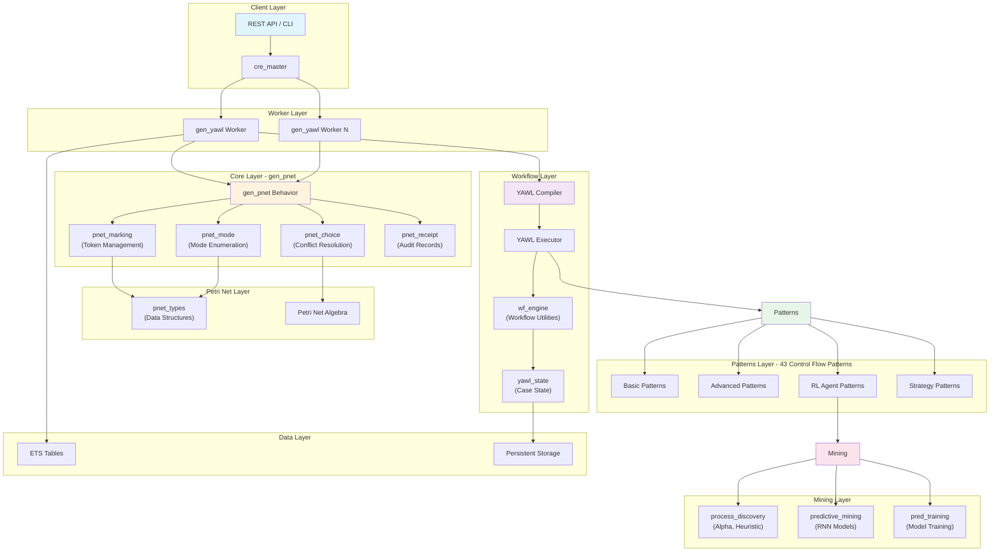

---

## gen_pnet Behavior

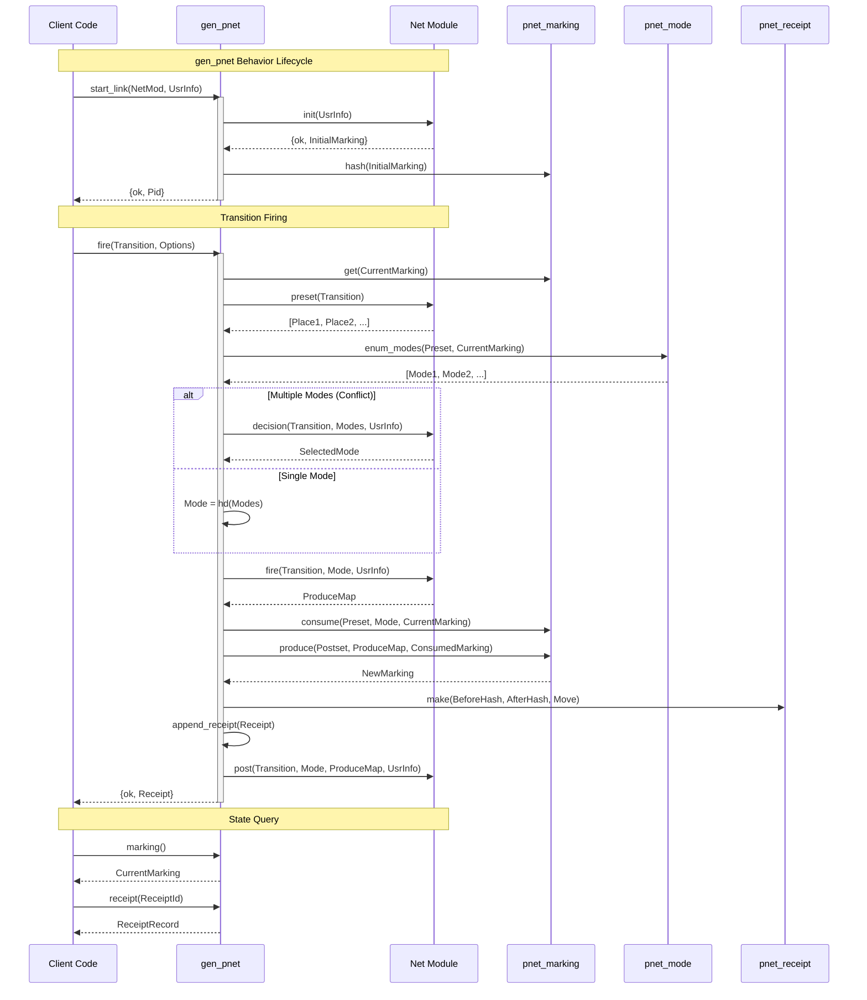

---

## gen_yawl Wrapper

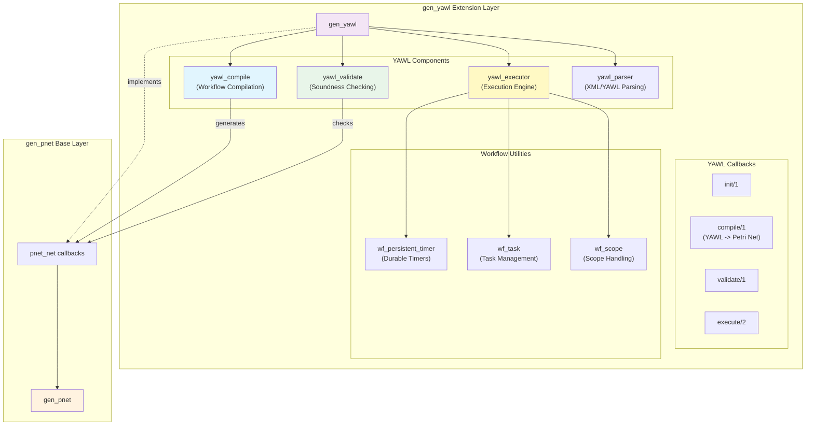

---

## Workflow Execution

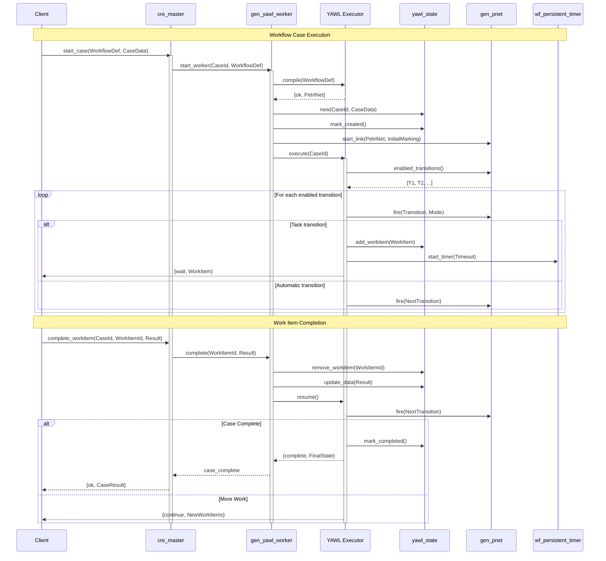

---

## Active Token System

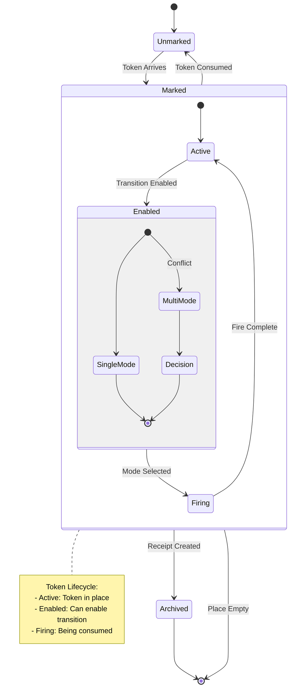

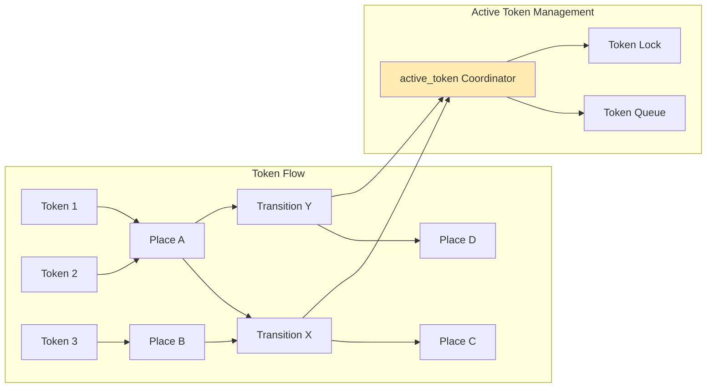

---

## RL Agent Integration

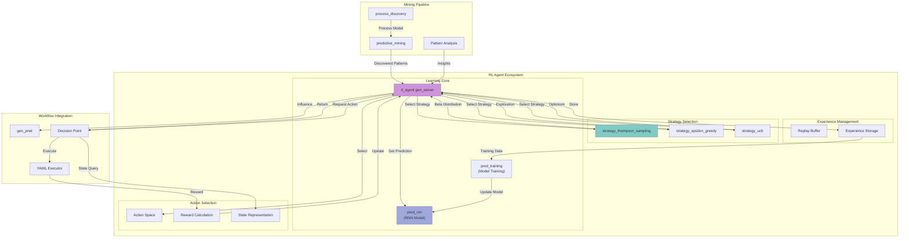

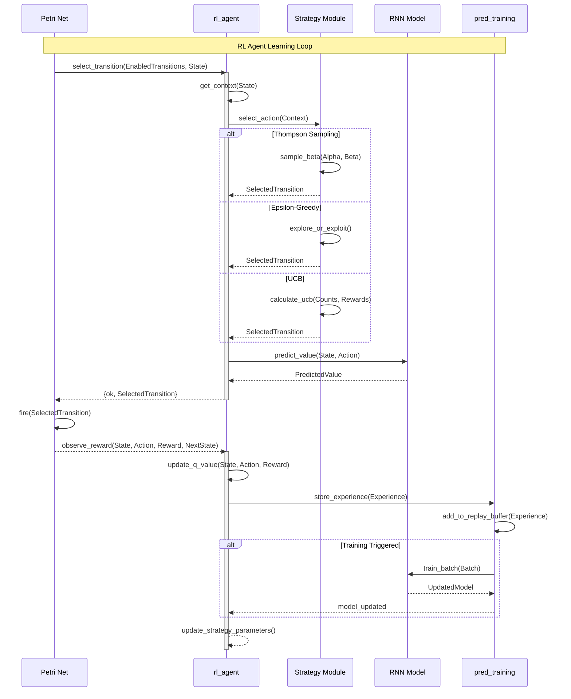

---

## Data Flow - Mining Pipeline

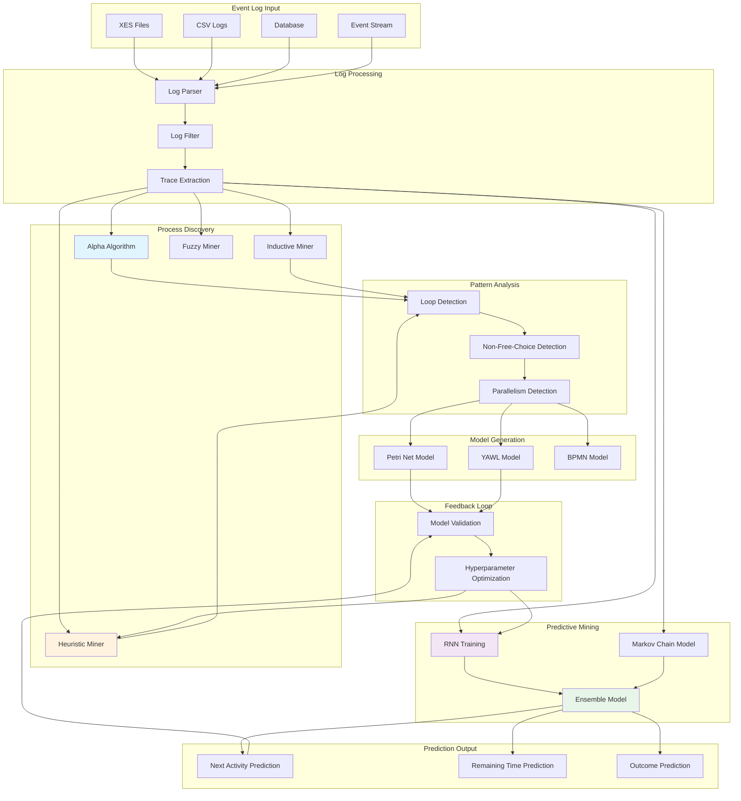

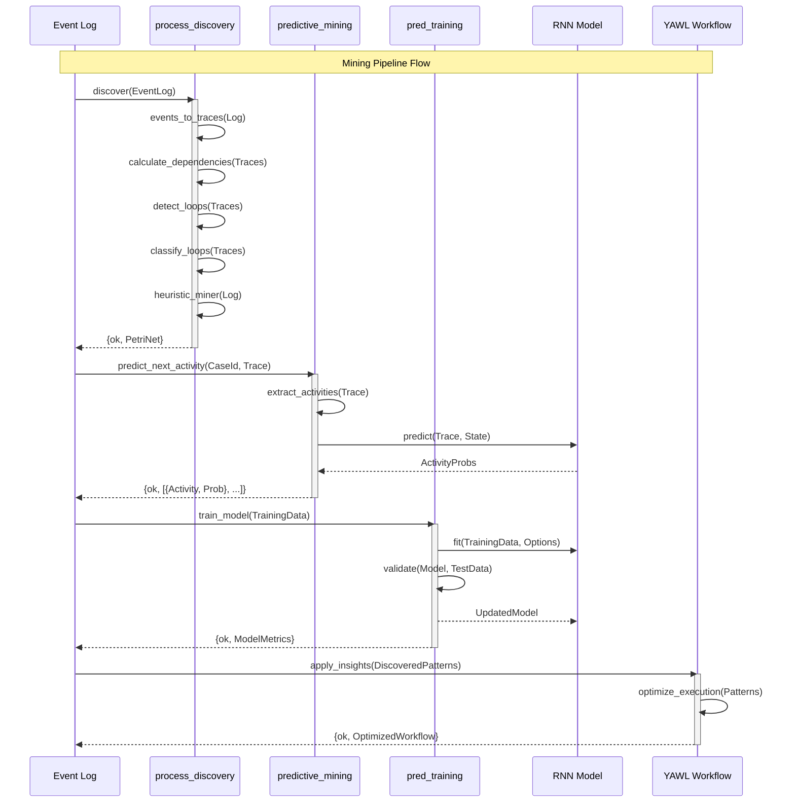

---

## Module Directory Structure

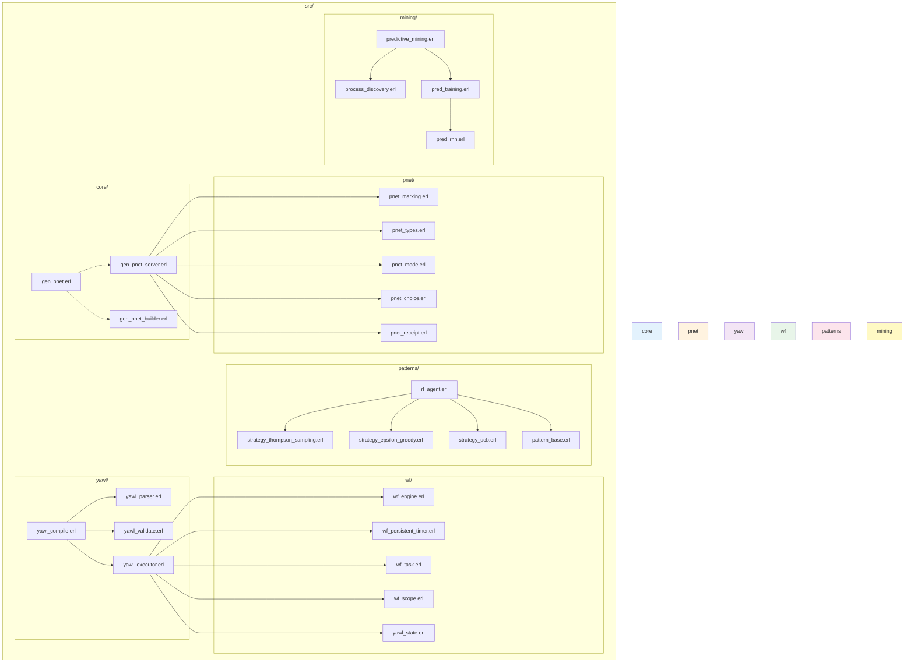

---

## Petri Net State Transitions

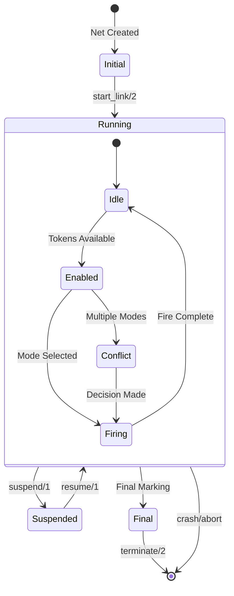

---

## Error Handling and Recovery

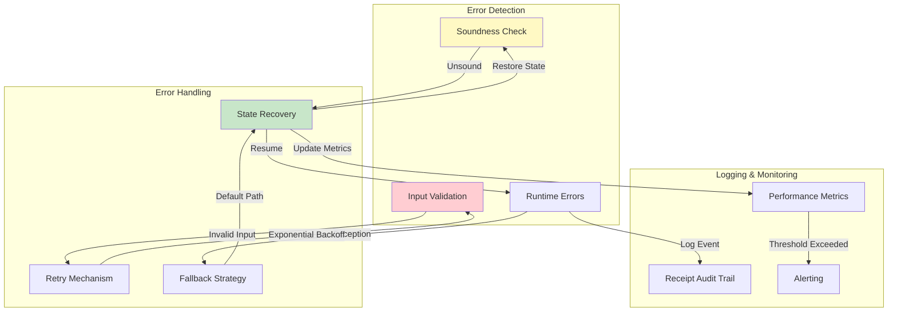

---

## Key Architecture Principles

1. **OTP Compliance**: All components follow OTP gen_server, gen_statem behaviors
2. **Pure Functional Core**: State management is pure functional (yawl_state, pnet_marking)
3. **Immutable Receipts**: All state transitions create immutable audit records
4. **Pluggable Strategies**: RL agents support multiple strategy selection algorithms
5. **Separation of Concerns**: Clear boundaries between core, workflow, patterns, and mining layers
6. **Extensibility**: 43 workflow patterns can be composed for complex workflows
7. **Soundness Verification**: YAWL models are validated for soundness before execution
