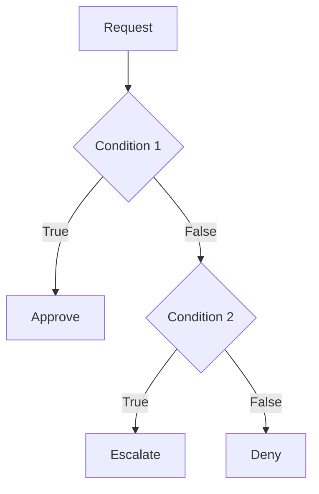
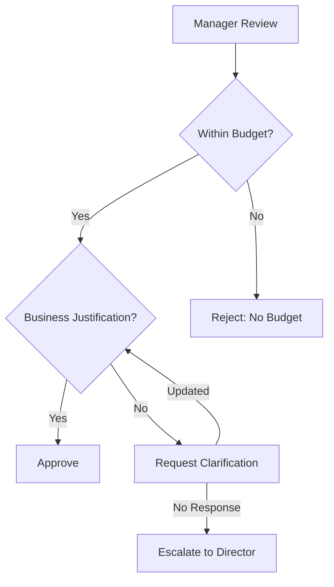
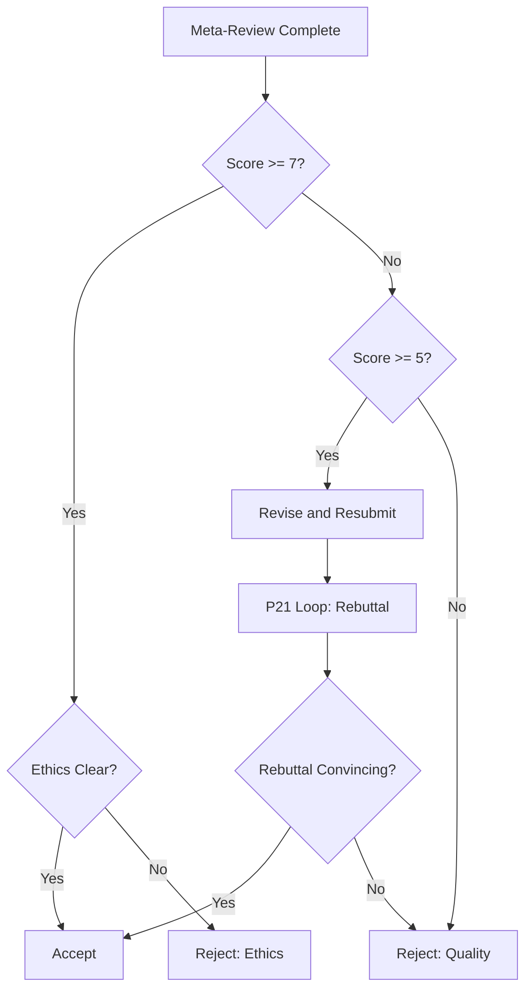
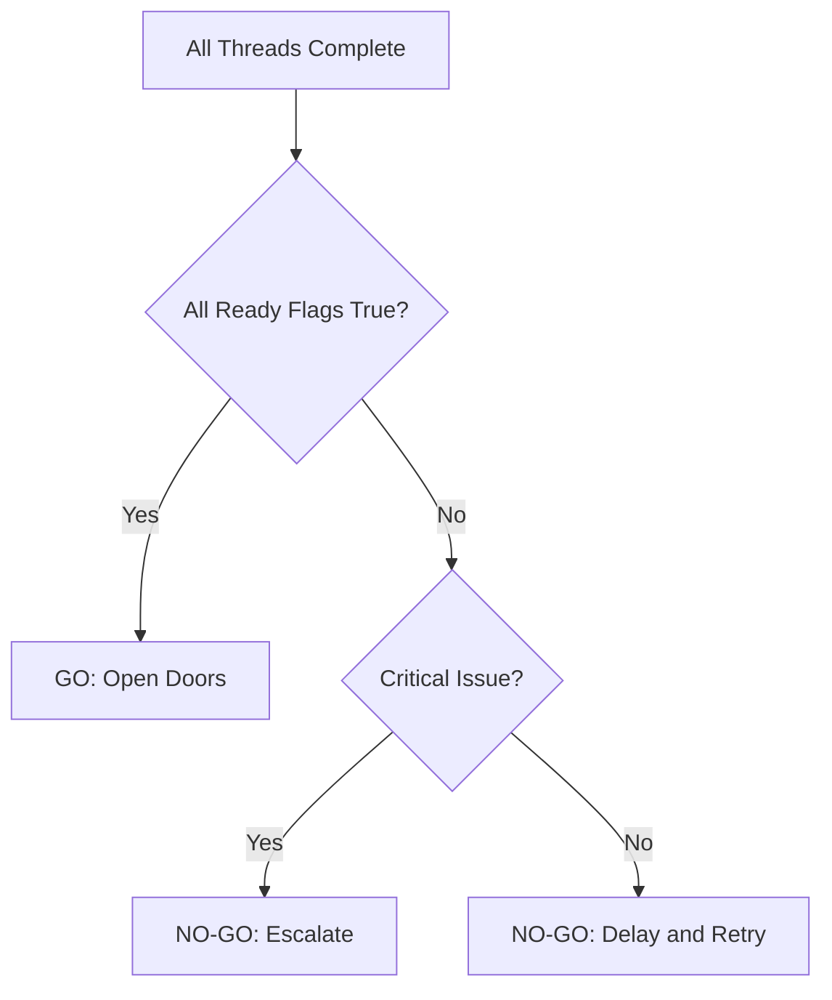

# Business Context Document (BCD) Templates
## Generative Analysis Methodology

**Version:** 1.0.0
**Date:** 2026-02-07
**Status:** Active

---

## Table of Contents

1. [BCD Structure Template](#1-bcd-structure-template)
2. [Example BCD: Simple Order Approval](#2-example-bcd-simple-order-approval)
3. [Example BCD: AGI Symposium Omega](#3-example-bcd-agi-symposium-omega)
4. [BCD Validation Checklist](#4-bcd-validation-checklist)
5. [BCD Change Request Template](#5-bcd-change-request-template)

---

## 1. BCD Structure Template

### Document Header

```markdown
# Business Context Document: [Workflow Name]

**Document ID:** BCD-[YYYYMMDD]-[WORKFLOW_ID]
**Version:** 1.0.0
**Status:** [Draft | Review | Approved | Deprecated]
**Created:** [YYYY-MM-DD]
**Last Modified:** [YYYY-MM-DD]
**Author:** [Author Name]
**Reviewer:** [Reviewer Name]
**Approver:** [Approver Name]

---

## Document Revision History

| Version | Date       | Author      | Changes                          |
|---------|------------|-------------|----------------------------------|
| 1.0.0   | YYYY-MM-DD | Name        | Initial version                  |
```

### Section 1: Executive Summary

```markdown
## 1. Executive Summary

**Purpose:** [Brief statement of why this workflow exists]

**Business Value:** [What value does this workflow deliver?]

**Key Stakeholders:** [Who is affected by this workflow?]

**Success Criteria:**
- [ ] [Measurable success criterion 1]
- [ ] [Measurable success criterion 2]
- [ ] [Measurable success criterion 3]

**Summary of Changes:** [For version updates, what changed?]
```

### Section 2: Role Definition Structure

```markdown
## 2. Role Definitions

| Role ID      | Role Name          | Type         | Responsibilities                              | Permissions         |
|--------------|--------------------|--------------|-----------------------------------------------|---------------------|
| ROLE_001     | [Role Name]        | [Human/System/Service] | [Key responsibilities]                | [Read/Write/Execute] |

### Role Details

#### [Role Name]
- **Description:** [Full role description]
- **Type:** [Human | System | Service]
- **Responsibilities:**
  - [Responsibility 1]
  - [Responsibility 2]
- **Capabilities:**
  - [Capability 1]: [Description]
  - [Capability 2]: [Description]
- **Escalation Path:** [Who to contact if this role is unavailable]
- **Delegation Allowed:** [Yes/No with conditions]
```

### Section 3: Workflow Context

```markdown
## 3. Workflow Context

### 3.1 Business Domain
- **Domain:** [e.g., Financial, Healthcare, Manufacturing]
- **Regulatory Requirements:** [Any applicable regulations]
- **Compliance Requirements:** [Required compliance standards]

### 3.2 Trigger Events
| Event ID    | Event Name          | Source          | Condition                           |
|-------------|---------------------|-----------------|-------------------------------------|
| EVT_001     | [Event Name]        | [External/Internal] | [When this event occurs]      |

### 3.3 Termination Conditions
| Condition ID | Description                              | Type                |
|--------------|------------------------------------------|---------------------|
| TERM_001     | [Description of termination condition]   | [Normal/Exception] |

### 3.4 Data Objects
| Data Object | Type        | Sensitivity | Retention | Owner       |
|-------------|-------------|-------------|-----------|-------------|
| DATA_001    | [Name]      | [PII/Public] | [Policy]  | [Role]      |
```

### Section 4: Pattern Context Template

```markdown
## 4. Pattern Context

### 4.1 Pattern Inventory
| Pattern ID | Pattern Name          | Instance ID        | Location    | Business Purpose                          |
|------------|-----------------------|--------------------|-------------|-------------------------------------------|
| P1         | Sequence              | [Instance Name]    | [Net/Task]  | [Why this pattern exists]                |

### 4.2 Pattern Instances

#### [Instance Name]
- **Pattern:** [P1-P43 from YAWL catalog]
- **Net:** [Parent net name]
- **Business Justification:** [Why this pattern is needed]
- **Configuration:**
  ```yaml
  pattern: [Pattern_ID]
  net: [Net_Name]
  [Pattern-specific fields]
  ```
- **Dependencies:** [What must happen before/after]
- **Error Handling:** [How pattern failures are handled]
- **Metrics:** [KPIs for this pattern]
```

### Section 5: Decision Schema Format

```markdown
## 5. Decision Schemas

### 5.1 Approval Gates

#### [Gate Name]
| Field        | Type        | Required | Description                          |
|--------------|-------------|----------|--------------------------------------|
| [Field_Name] | [Type]      | [Yes/No] | [Field description]                  |

**Decision Logic:**


**SLA:** [Time limit for decision]
**Escalation Path:** [What happens on timeout]

### 5.2 Routing Rules

| Rule ID     | Condition                              | Target               | Priority |
|-------------|----------------------------------------|----------------------|----------|
| RULE_001    | [Expression]                           | [Target Task/Net]    | [1-10]   |
```

### Section 6: Traceability Fields

```markdown
## 6. Traceability

### 6.1 Requirements Traceability
| Requirement ID | Description                              | Source          | Pattern(s)        | Verified |
|----------------|------------------------------------------|-----------------|-------------------|----------|
| REQ_001        | [Requirement description]                | [Stakeholder]   | [P1, P3, etc.]    | [Yes/No] |

### 6.2 Audit Requirements
- **Audit Level:** [Full/Selective/None]
- **Retention Period:** [Time period]
- **Required Fields:**
  - [Field 1]: [Description]
  - [Field 2]: [Description]

### 6.3 Compliance Mapping
| Regulation/Standard | Requirement                               | Workflow Element      | Status       |
|---------------------|-------------------------------------------|-----------------------|--------------|
| [Regulation]        | [Specific requirement]                    | [Task/Pattern/Net]    | [Compliant] |

### 6.4 Change History
| Change ID   | Date       | Component    | Change Type          | Reason               |
|-------------|------------|--------------|----------------------|-----------------------|
| CHG_001     | YYYY-MM-DD | [Component]  | [Add/Modify/Remove]  | [Business reason]    |

### 6.5 Traceability Matrix
```
+------------+-------+-------+-------+-------+-------+
| Requirement | P1    | P2    | P3    | ...   | P43   |
+============+=======+=======+=======+=======+=======+
| REQ_001     | X     |       | X     |       |       |
+------------+-------+-------+-------+-------+-------+
| REQ_002     |       | X     | X     |       |       |
+------------+-------+-------+-------+-------+-------+
```
```

### Section 7: Non-Functional Requirements

```markdown
## 7. Non-Functional Requirements

### 7.1 Performance
- **Throughput:** [Transactions per time unit]
- **Latency:** [Maximum response time]
- **Concurrency:** [Simultaneous instances]

### 7.2 Reliability
- **Availability:** [Uptime percentage]
- **Recovery Time:** [RTO/RPO]
- **Failure Handling:** [Graceful degradation strategy]

### 7.3 Security
- **Authentication:** [Method]
- **Authorization:** [Model]
- **Data Protection:** [Encryption requirements]
- **Audit Trail:** [Logging requirements]

### 7.4 Scalability
- **Horizontal Scaling:** [Yes/No with details]
- **Vertical Scaling:** [Resource limits]
- **Burst Capacity:** [Peak handling strategy]
```

---

## 2. Example BCD: Simple Order Approval

```markdown
# Business Context Document: Purchase Order Approval

**Document ID:** BCD-20260207-PO_APPROVAL
**Version:** 1.0.0
**Status:** Approved
**Created:** 2026-02-07
**Last Modified:** 2026-02-07
**Author:** Procurement Team
**Reviewer:** Finance Director
**Approver:** CFO

---

## 1. Executive Summary

**Purpose:** Standardize purchase order approval workflow across all departments.

**Business Value:** Ensure fiscal responsibility, prevent unauthorized spending, and maintain audit trail for all procurement activities.

**Key Stakeholders:**
- Requesters: All employees
- Department Managers: Budget owners
- Finance Team: Budget verification
- Procurement: Vendor management
- CFO: High-value approvals

**Success Criteria:**
- [ ] 100% of expenditures require appropriate approval
- [ ] Average approval time < 48 hours
- [ ] Zero unauthorized payments
- [ ] Complete audit trail for SOX compliance

---

## 2. Role Definitions

| Role ID      | Role Name          | Type   | Responsibilities                              |
|--------------|--------------------|--------|-----------------------------------------------|
| ROLE_001     | Requester          | Human  | Initiate PO requests, provide justification   |
| ROLE_002     | DeptManager        | Human  | Approve within department budget              |
| ROLE_003     | FinanceReviewer    | Human  | Verify budget availability                    |
| ROLE_004     | ProcurementOfficer | Human  | Vendor selection, contract terms              |
| ROLE_005     | CFO                | Human  | Approve high-value purchases                  |
| ROLE_006     | AutoApproval       | System | Route low-value items                          |

### Role Details

#### Requester (ROLE_001)
- **Description:** Employee initiating purchase request
- **Type:** Human
- **Responsibilities:**
  - Provide complete purchase justification
  - Select appropriate vendor
  - Attach required quotes/documentation
  - Respond to clarification requests
- **Capabilities:**
  - Create PO requests: Submit new purchase orders
  - View status: Check approval progress
  - Modify drafts: Edit before submission
- **Escalation Path:** Department Manager
- **Delegation Allowed:** No (personal responsibility)

#### DeptManager (ROLE_002)
- **Description:** Budget owner for department
- **Type:** Human
- **Responsibilities:**
  - Verify business need
  - Confirm department budget availability
  - Approve or reject requests
- **Capabilities:**
  - Approve: Grant approval for requests
  - Reject: Deny with reason
  - Request info: Ask for clarification
- **Escalation Path:** Finance Director
- **Delegation Allowed:** Yes, to designated backup

#### CFO (ROLE_005)
- **Description:** Chief Financial Officer
- **Type:** Human
- **Responsibilities:**
  - Approve purchases > $50,000
  - Review capital expenditure requests
- **Capabilities:**
  - Approve: Final approval for high-value
  - Delegate: Assign to direct reports
- **Escalation Path:** CEO
- **Delegation Allowed:** Yes, to VP Finance

---

## 3. Workflow Context

### 3.1 Business Domain
- **Domain:** Financial/Procurement
- **Regulatory Requirements:** SOX Section 404, internal controls
- **Compliance Requirements:** Audit trail required for all expenditures

### 3.2 Trigger Events
| Event ID    | Event Name          | Source    | Condition                           |
|-------------|---------------------|-----------|-------------------------------------|
| EVT_001     | PO_Submitted        | External  | Employee submits purchase request   |
| EVT_002     | Manager_Approved    | Internal  | Manager approves request            |
| EVT_003     | Finance_Verified    | Internal  | Budget confirmed                    |
| EVT_004     | Timeout_48h         | System    | No action within 48 hours           |

### 3.3 Termination Conditions
| Condition ID | Description                              | Type                |
|--------------|------------------------------------------|---------------------|
| TERM_001     | Requester withdraws request              | Normal              |
| TERM_002     | All approvals completed                   | Normal              |
| TERM_003     | Rejected at any stage                    | Normal              |
| TERM_004     | Timeout without action (3 escalations)   | Exception           |

### 3.4 Data Objects
| Data Object    | Type        | Sensitivity | Retention | Owner           |
|----------------|-------------|-------------|-----------|-----------------|
| PO_Request     | Document    | Confidential| 7 years   | Finance         |
| Approval_History| Record     | Audit       | Permanent | Compliance      |
| Budget_Records | Reference   | Confidential| 7 years   | Finance         |

---

## 4. Pattern Context

### 4.1 Pattern Inventory
| Pattern ID | Pattern Name          | Instance ID        | Location      | Business Purpose                          |
|------------|-----------------------|--------------------|---------------|-------------------------------------------|
| P1         | Sequence              | P1_approval_seq     | Main          | Sequential approval flow                  |
| P4         | Exclusive Choice      | P4_routing          | Decision      | Route by amount (manager/CFO)            |
| P19        | Cancel Activity       | P19_withdraw        | Any stage     | Allow request withdrawal                  |
| P23        | Transient Trigger     | P23_timeout         | All gates     | Escalate on timeout                      |
| P21        | Structured Loop       | P21_revision_loop   | After reject  | Allow revision and resubmission           |

### 4.2 Pattern Instances

#### P1_approval_seq
- **Pattern:** P1_Sequence
- **Net:** PurchaseOrderApproval
- **Business Justification:** Ensure approvals happen in correct order
- **Configuration:**
  ```yaml
  pattern: P1_Sequence
  net: PurchaseOrderApproval
  from: Submit
  to: Complete
  steps: [Manager_Approval, Finance_Check, Procurement_Review]
  ```
- **Dependencies:** Manager approval before Finance check
- **Error Handling:** Rollback to previous state on failure
- **Metrics:** Completion time, approval rate

#### P4_routing
- **Pattern:** P4_ExclusiveChoice
- **Net:** PurchaseOrderApproval
- **Business Justification:** Route to appropriate approver based on amount
- **Configuration:**
  ```yaml
  pattern: P4_ExclusiveChoice
  net: PurchaseOrderApproval
  at: Amount_Routing
  choices:
    - name: low_value
      condition: amount <= 1000
      target: Manager_Approval
    - name: medium_value
      condition: amount <= 10000
      target: Director_Approval
    - name: high_value
      condition: amount > 10000
      target: CFO_Approval
  ```
- **Dependencies:** Amount field populated
- **Error Handling:** Default to Manager if amount missing
- **Metrics:** Routing accuracy

---

## 5. Decision Schemas

### 5.1 Approval Gates

#### Manager Approval Gate
| Field           | Type        | Required | Description                          |
|-----------------|-------------|----------|--------------------------------------|
| amount          | decimal     | Yes      | Purchase amount in USD               |
| budget_code     | string      | Yes      | Department budget code               |
| justification   | text        | Yes      | Business justification                |
| vendor          | string      | Yes      | Proposed vendor                      |
| attachments     | file[]      | No       | Supporting documents                 |

**Decision Logic:**


**SLA:** 48 hours
**Escalation Path:** Director > Finance Director > CFO

### 5.2 Routing Rules

| Rule ID     | Condition                              | Target               | Priority |
|-------------|----------------------------------------|----------------------|----------|
| RULE_001    | amount <= 1000 AND within_budget       | Manager_Approval     | 1        |
| RULE_002    | amount <= 10000 AND within_budget      | Director_Approval    | 2        |
| RULE_003    | amount > 10000                         | CFO_Approval         | 3        |
| RULE_004    | NOT within_budget                      | Finance_Rejection    | 10       |

---

## 6. Traceability

### 6.1 Requirements Traceability
| Requirement ID | Description                              | Source          | Pattern(s)        | Verified |
|----------------|------------------------------------------|-----------------|-------------------|----------|
| REQ_001        | All POs must have approval               | Policy 5.2      | P1, P4            | Yes      |
| REQ_002        | High-value requires CFO approval         | SOX             | P4, P43           | Yes      |
| REQ_003        | Audit trail for all decisions            | Compliance      | All               | Yes      |
| REQ_004        | Requester can withdraw before approval   | User Story      | P19               | Yes      |
| REQ_005        | Timeout escalation after 48h             | SLA             | P23               | Yes      |

### 6.2 Audit Requirements
- **Audit Level:** Full
- **Retention Period:** 7 years (SOX requirement)
- **Required Fields:**
  - timestamp: ISO 8601 format
  - user_id: Employee ID
  - action: [submit, approve, reject, withdraw, escalate]
  - decision_reason: Text for approvals/rejections
  - ip_address: Network source
  - session_id: For correlation

### 6.3 Compliance Mapping
| Regulation/Standard | Requirement                               | Workflow Element      | Status    |
|---------------------|-------------------------------------------|-----------------------|-----------|
| SOX 404             | Segregation of duties                     | Role definitions      | Compliant |
| SOX 404             | Audit trail                               | All transitions       | Compliant |
| Company Policy 5.2  | Approval hierarchy                        | P4 routing            | Compliant |
| Company Policy 5.2  | CFO approval >$50k                        | RULE_003              | Compliant |

---

## 7. Non-Functional Requirements

### 7.1 Performance
- **Throughput:** 1000 POs per day
- **Latency:** < 2 second page load
- **Concurrency:** 500 simultaneous users

### 7.2 Reliability
- **Availability:** 99.9% uptime
- **Recovery Time:** RTO 1 hour, RPO 0
- **Failure Handling:** Graceful degradation, queue on overload

### 7.3 Security
- **Authentication:** SSO with MFA
- **Authorization:** RBAC based on HR data
- **Data Protection:** TLS 1.3, AES-256 at rest
- **Audit Trail:** Immutable log (WORM storage)

### 7.4 Scalability
- **Horizontal Scaling:** Yes, stateless API servers
- **Vertical Scaling:** Database can scale to 10M records
- **Burst Capacity:** Queue-based for peak periods
```

---

## 3. Example BCD: AGI Symposium Omega

```markdown
# Business Context Document: AGI Symposium Omega

**Document ID:** BCD-20260207-AGI_SYMPOSIUM
**Version:** 1.0.0
**Status:** Approved
**Created:** 2026-02-07
**Last Modified:** 2026-02-07
**Author:** BEAM Workflow Swarm
**Reviewer:** Program Committee
**Approver:** Symposium Chair

---

## 1. Executive Summary

**Purpose:** Coordinate all aspects of AGI Symposium planning, execution, and post-event activities across program, operations, communications, and incident management domains.

**Business Value:** Deliver a world-class AGI research symposium while maintaining safety standards, managing high-risk demonstrations, and ensuring seamless attendee experience across all workstreams.

**Key Stakeholders:**
- Chair: Overall symposium ownership
- Program Chair: Content and program quality
- Track/Area Chairs: Paper review management
- Reviewers: Peer review process
- Ops Lead: Venue, A/V, logistics
- Safety Officer: Demo risk assessment
- Press Lead: Public communications
- Attendees: Symposium participants
- Speakers: Presenters and panelists

**Success Criteria:**
- [ ] All 43 YAWL patterns correctly implemented and tested
- [ ] Complete paper lifecycle from CFP to publication
- [ ] Zero safety incidents during demos
- [ ] >90% attendee satisfaction
- [ ] Complete audit trail for all decisions

---

## 2. Role Definitions

| Role ID      | Role Name          | Type   | Responsibilities                              |
|--------------|--------------------|--------|-----------------------------------------------|
| ROLE_001     | Chair              | Human  | Overall leadership, Go/No-Go decisions         |
| ROLE_002     | Secretary          | Human  | Documentation, minutes, correspondence         |
| ROLE_003     | ProgramChair       | Human  | Program content, paper selection               |
| ROLE_004     | TrackChair         | Human  | Individual track management                   |
| ROLE_005     | AreaChair          | Human  | Research area coordination                     |
| ROLE_006     | Reviewer           | Human  | Paper review, scoring                         |
| ROLE_007     | EthicsChair        | Human  | Ethics review for submissions                 |
| ROLE_008     | ArtifactChair      | Human  | Artifact evaluation (code, data)              |
| ROLE_009     | OpsLead            | Human  | Venue, logistics, operations                  |
| ROLE_010     | VenueLead          | Human  | Venue selection and setup                      |
| ROLE_011     | AVLead             | Human  | Audio/visual and streaming                     |
| ROLE_012     | SafetyOfficer      | Human  | Demo safety assessment                        |
| ROLE_013     | SponsorshipLead    | Human  | Sponsor coordination                          |
| ROLE_014     | FinanceLead        | Human  | Budget management                             |
| ROLE_015     | TravelGrantsLead   | Human  | Travel grant administration                   |
| ROLE_016     | PublicationsChair  | Human  | Proceedings management                        |
| ROLE_017     | PressLead          | Human  | Press relations and declassification          |
| ROLE_018     | Speaker            | Human  | Presentations and panels                      |
| ROLE_019     | Attendee           | Human  | Symposium participation                       |
| ROLE_020     | WorkshopChair      | Human  | Workshop coordination                         |

### Role Details

#### Chair (ROLE_001)
- **Description:** Symposium Chair with overall responsibility
- **Type:** Human
- **Responsibilities:**
  - Make Go/No-Go decisions
  - Approve internal schedule
  - Coordinate across all threads
  - Handle emergency situations
- **Capabilities:**
  - Start case: Initialize symposium workflow
  - Suspend/resume: Pause execution if needed
  - Cancel case: Force majeure termination
  - Monitor: View overall symposium state
- **Escalation Path:** Steering Committee
- **Delegation Allowed:** Yes, to Vice Chair

#### SafetyOfficer (ROLE_012)
- **Description:** Responsible for demo safety assessment
- **Type:** Human
- **Responsibilities:**
  - Assess demo submission risks
  - Approve or reject high-risk demos
  - Monitor demo execution
  - Cancel unsafe demos during event
- **Capabilities:**
  - Safety review: Evaluate demo submissions
  - Cancel region: Stop high-risk demo zone only
  - Emergency stop: Trigger P43 if needed
- **Escalation Path:** Chair
- **Delegation Allowed:** No (safety-critical role)

#### Reviewer (ROLE_006)
- **Description:** Peer reviewer for paper submissions
- **Type:** Human
- **Responsibilities:**
  - Complete assigned reviews on time
  - Provide constructive feedback
  - Score submissions objectively
  - Participate in discussion
- **Capabilities:**
  - View assigned papers
  - Submit review scores
  - Add comments for authors
  - Participate in meta-review
- **Escalation Path:** Area Chair
- **Delegation Allowed:** Yes, with approval

---

## 3. Workflow Context

### 3.1 Business Domain
- **Domain:** Academic Conference Management
- **Regulatory Requirements:** AGI safety guidelines, institutional review
- **Compliance Requirements:** Research ethics, data protection

### 3.2 Trigger Events
| Event ID    | Event Name          | Source    | Condition                           |
|-------------|---------------------|-----------|-------------------------------------|
| EVT_001     | Symposium_Init      | Chair     | Chair starts symposium planning     |
| EVT_002     | CFP_Open            | Program   | Call for papers announced           |
| EVT_003     | Submission_Received | External  | Author submits paper                |
| EVT_004     | Review_Complete     | Reviewer  | All reviews submitted               |
| EVT_005     | Safety_Red_Flag     | Safety    | High-risk demo identified           |
| EVT_006     | Incident_Reported   | Any       | Incident during event               |
| EVT_007     | Emergency_Shutdown  | Chair     | Force majeure declared              |

### 3.3 Termination Conditions
| Condition ID | Description                              | Type                |
|--------------|------------------------------------------|---------------------|
| TERM_001     | Normal symposium completion              | Normal              |
| TERM_002     | Force majeure (P43 triggered)            | Exception           |
| TERM_003     | High-risk demo zone cancelled (P25)      | Partial             |
| TERM_004     | Individual paper withdrawn (P19)         | Normal              |

### 3.4 Data Objects
| Data Object        | Type        | Sensitivity | Retention | Owner           |
|--------------------|-------------|-------------|-----------|-----------------|
| Paper_Submission   | Document    | Confidential| 5 years   | Program Chair   |
| Review_Scores      | Record      | Confidential| 5 years   | Area Chair      |
| Safety_Assessment  | Document    | Restricted  | Permanent | Safety Officer  |
| Incident_Report    | Record      | Confidential| Permanent | Safety Officer  |
| Proceedings        | Publication| Public      | Permanent | Publications    |

---

## 4. Pattern Context

### 4.1 Pattern Inventory (All 43 Patterns)

| Pattern ID | Pattern Name                | Instance ID                    | Net              | Business Purpose                          |
|------------|-----------------------------|--------------------------------|------------------|-------------------------------------------|
| P1         | Sequence                    | P1_seq_paper_lifecycle         | ProgramThread    | Per-paper CFP to program build           |
| P2         | Parallel Split              | P2_parallel_triage_lanes       | ProgramThread    | Split triage into lanes                   |
| P3         | Synchronization             | P3_sync_gonogo                 | Symposium        | Go/No-Go waits all threads               |
| P4         | Exclusive Choice            | P4_choice_decision             | ProgramThread    | Accept/reject/revise per paper           |
| P5         | Simple Merge                | P5_simple_merge_talk_types     | ProgramThread    | Merge invited+accepted talks             |
| P6         | Multiple Choice             | P6_multi_track_assign          | ProgramThread    | Assign to multiple tracks                |
| P7         | Structured Sync Merge       | P7_struct_sync_merge_tracks    | ProgramThread    | Join only activated tracks               |
| P8         | Multiple Merge              | P8_multiple_merge_updates      | Symposium        | Dashboard fan-in from multiple sources   |
| P9         | Discriminator               | P9_discriminator_keynote       | ProgramThread    | First confirmed keynote wins             |
| P10        | Arbitrary Cycles            | P10_arbitrary_rework           | ProgramThread    | Send paper back on exceptions            |
| P11        | Implicit Termination        | P11_implicit_term_microevents  | Symposium        | Micro-workshops end naturally            |
| P12        | MI without Sync             | P12_mi_cfp_blast               | ProgramThread    | CFP broadcast, don't wait stragglers     |
| P13        | MI design-time              | P13_mi_reviews3                | ProgramThread    | Default 3 reviews per paper              |
| P14        | MI runtime-known            | P14_mi_reviewsN_risk           | ProgramThread    | N reviews based on risk                  |
| P15        | MI runtime-unknown          | P15_mi_factcheck_until         | ProgramThread    | Fact check until threshold              |
| P16        | Deferred Choice             | P16_deferred_workshop_slot     | CommsThread      | Workshop slot by first confirmation      |
| P17        | Interleaved Parallel Route  | P17_interleaved_onboarding     | OpsThread        | Per-speaker onboarding                   |
| P18        | Milestone                   | P18_milestone_earlybird        | OpsThread        | Early-bird registration deadline         |
| P19        | Cancel Activity             | P19_cancel_activity_speaker_drop| ProgramThread   | Cancel single talk if speaker drops      |
| P20        | Cancel Case                 | P20_cancel_case_force_majeure  | Symposium        | Cancel whole symposium                   |
| P21        | Structured Loop             | P21_loop_revise                | ProgramThread    | Rebuttal/review until accept/reject      |
| P22        | Recursion                   | P22_recursion_satellite        | Symposium        | Satellite symposium sub-workflow         |
| P23        | Transient Trigger           | P23_transient_fire_alarm       | Symposium        | Fire alarm only during live              |
| P24        | Persistent Trigger          | P24_persistent_visa            | OpsThread        | Visa approval persists until consumed    |
| P25        | Cancel Region               | P25_cancel_region_highrisk     | Symposium        | Cancel demo zone only                    |
| P26        | Cancel MI Activity          | P26_cancel_mi_on_withdraw      | ProgramThread    | Withdrawal cancels all reviewers         |
| P27        | Complete MI Activity        | P27_complete_mi_early          | ProgramThread    | Stop review stage if confident           |
| P28        | Blocking Discriminator       | P28_blocking_discriminator_incident| IncidentThread| Incident blocks comms until handled     |
| P29        | Cancelling Discriminator    | P29_cancel_discriminator_venue  | OpsThread        | First venue wins, cancel others          |
| P30        | Structured Partial Join     | P30_struct_partial_join_schedule| ProgramThread   | 2-of-3 chairs approve schedule           |
| P31        | Blocking Partial Join       | P31_blocking_partial_join_public| ProgramThread   | Internal vs public schedule gate         |
| P32        | Cancelling Partial Join     | P32_cancel_partial_join_demo_safety| Symposium     | 2-of-3 safety review, cancel remaining   |
| P33        | Generalized AND-Join        | P33_generalized_and_join_rework| ProgramThread    | Rework join across active branches       |
| P34        | Static Partial Join MI      | P34_static_partial_join_mi     | ProgramThread    | 3-of-5 reviews sufficient                |
| P35        | Cancelling Partial Join MI  | P35_cancel_partial_join_mi     | ProgramThread    | Cancel remaining reviews after threshold |
| P36        | Dynamic Partial Join MI     | P36_dynamic_partial_join_feedback| Symposium      | Feedback threshold from attendance       |
| P37        | Local Sync Merge            | P37_local_sync_merge_trackwrap | ProgramThread    | Per-track wrap-up                        |
| P38        | General Sync Merge          | P38_general_sync_merge_close   | Symposium        | Close waits for active branches only     |
| P39        | Critical Section            | P39_critical_section_mainhall  | ProgramThread    | Main hall schedule mutex                 |
| P40        | Interleaved Routing         | P40_interleaved_policy_checklist| OpsThread       | Ops policy checklist                     |
| P41        | Thread Merge                | P41_merge_megathreads          | Symposium        | Consolidate readiness before Go/No-Go    |
| P42        | Thread Split                | P42_split_megathreads          | Symposium        | Fork into Program/Ops/Comms/Incident     |
| P43        | Explicit Termination        | P43_explicit_term_emergency    | Symposium        | Emergency hard-stop                      |

### 4.2 Key Pattern Instances

#### P42_split_megathreads (Thread Split)
- **Pattern:** P42_ThreadSplit
- **Net:** Symposium
- **Business Justification:** Symposium requires parallel work across Program, Operations, Communications, and Incident Management
- **Configuration:**
  ```yaml
  pattern: P42_ThreadSplit
  net: Symposium
  split_task: SplitMegaThreads
  branches: [ProgramThread, OpsThread, CommsThread, IncidentThread]
  label: "P42 Thread Split: Program/Ops/Comms/Incident"
  ```
- **Dependencies:** Symposium started
- **Error Handling:** All threads must start or rollback
- **Metrics:** Thread start latency

#### P3_sync_gonogo (Synchronization)
- **Pattern:** P3_Synchronization
- **Net:** Symposium
- **Business Justification:** Go/No-Go decision requires readiness from all threads
- **Configuration:**
  ```yaml
  pattern: P3_Synchronization
  net: Symposium
  join_task: GoNoGo
  waits_for: [ProgramExit, OpsExit, CommsExit]
  label: "P3 Sync: Go/No-Go waits program+ops+comms"
  ```
- **Dependencies:** All three threads complete
- **Error Handling:** Timeout triggers escalation
- **Metrics:** Time to Go/No-Go decision

#### P25_cancel_region_highrisk (Cancel Region)
- **Pattern:** P25_CancelRegion
- **Net:** Symposium
- **Business Justification:** High-risk demos can be cancelled without cancelling entire symposium
- **Configuration:**
  ```yaml
  pattern: P25_CancelRegion
  net: Symposium
  region: Region_HighRisk_Demos
  cancel_event: safety_red_flag
  label: "P25 Cancel Region: high-risk demos cancelled, rest continues"
  ```
- **Dependencies:** Region defined, safety officer has authority
- **Error Handling:** Graceful shutdown of region only
- **Metrics:** Time to cancel region

---

## 5. Decision Schemas

### 5.1 Paper Decision Gate

#### Decision (ProgramThread)
| Field           | Type        | Required | Description                          |
|-----------------|-------------|----------|--------------------------------------|
| paper_id        | string      | Yes      | Unique paper identifier              |
| overall_score   | decimal     | Yes      | Aggregate review score (1-10)        |
| confidence      | decimal     | Yes      | Reviewer confidence (1-10)           |
| ethics_flag     | boolean     | Yes      | Ethics concern identified            |
| artifact_score  | decimal     | No       | Artifact/code evaluation             |
| meta_review     | text        | Yes      | Meta-reviewer recommendation         |

**Decision Logic:**


**SLA:** Decision within 7 days of reviews complete
**Escalation Path:** Program Chair > Track Chairs > Ethics Committee

### 5.2 Go/No-Go Decision Schema

#### GoNoGo (Symposium)
| Field              | Type        | Required | Description                          |
|--------------------|-------------|----------|--------------------------------------|
| program_ready      | boolean     | Yes      | Program thread complete              |
| ops_ready          | boolean     | Yes      | Operations ready                     |
| comms_ready        | boolean     | Yes      | Communications ready                 |
| venue_confirmed    | boolean     | Yes      | Venue contract signed                |
| safety_green       | boolean     | Yes      | Safety assessment passed             |
| registration_open  | boolean     | Yes      | Registration system live             |

**Decision Logic:**


---

## 6. Traceability

### 6.1 Requirements Traceability
| Requirement ID | Description                              | Source          | Pattern(s)                          | Verified |
|----------------|------------------------------------------|-----------------|-------------------------------------|----------|
| REQ_001        | All 43 patterns must be implemented      | System          | P1-P43                              | Yes      |
| REQ_002        | Papers require review before decision     | Process         | P1, P13, P14                        | Yes      |
| REQ_003        | Safety officer can cancel demos only      | Safety          | P25                                 | Yes      |
| REQ_004        | Emergency shutdown stops everything       | Safety          | P43                                 | Yes      |
| REQ_005        | Visa approvals persist until used         | Ops             | P24                                 | Yes      |
| REQ_006        | Go/No-Go waits all threads                | Process         | P3, P41                             | Yes      |
| REQ_007        | Review cycles allow rebuttal              | Fairness        | P21                                 | Yes      |
| REQ_008        | Incidents block public comms until handled| Safety          | P28                                 | Yes      |
| REQ_009        | High-risk papers get more reviews         | Quality         | P14                                 | Yes      |
| REQ_010        | Main hall has scheduling mutex            | Logistics       | P39                                 | Yes      |

### 6.2 Audit Requirements
- **Audit Level:** Full (all transitions logged)
- **Retention Period:** Permanent for safety incidents, 7 years otherwise
- **Required Fields:**
  - workflow_id: Symposium instance identifier
  - thread: [Program, Ops, Comms, Incident]
  - pattern_id: Which pattern executed
  - actor: Role that performed action
  - timestamp: UTC with milliseconds
  - decision: Outcome data
  - reason: Human-readable justification
  - correlation_id: For cross-thread tracing

### 6.3 Compliance Mapping
| Regulation/Standard | Requirement                               | Workflow Element      | Status    |
|---------------------|-------------------------------------------|-----------------------|-----------|
| AGI Safety Guidelines| Demo risk assessment                    | P25, P32, P43         | Compliant |
| Research Ethics     | IRB review for human subjects            | EthicsChair           | Compliant |
| Data Protection     | GDPR compliance for attendee data        | Registration          | Compliant |
| Academic Standards  | Double-blind peer review                 | P13, P14, P21         | Compliant |
| Event Safety        | Incident response capability             | IncidentThread        | Compliant |

---

## 7. Non-Functional Requirements

### 7.1 Performance
- **Throughput:** 1000 concurrent reviews
- **Latency:** < 1 second for state transitions
- **Concurrency:** 500 simultaneous users

### 7.2 Reliability
- **Availability:** 99.95% during event
- **Recovery Time:** RTO 5 minutes, RPO 0
- **Failure Handling:** Graceful degradation of non-critical features

### 7.3 Security
- **Authentication:** OAuth 2.0 + MFA
- **Authorization:** Role-based access control
- **Data Protection:** TLS 1.3, AES-256 at rest
- **Audit Trail:** Immutable write-once logs

### 7.4 Scalability
- **Horizontal Scaling:** Yes, stateless services
- **Vertical Scaling:** Database to 1M+ submissions
- **Burst Capacity:** Queue for peak submission times
```

---

## 4. BCD Validation Checklist

Use this checklist to validate a BCD before submission for review.

### Document Structure
- [ ] Document ID follows format: BCD-YYYYMMDD-WORKFLOW_ID
- [ ] Version number follows semantic versioning (X.Y.Z)
- [ ] Status is one of: Draft, Review, Approved, Deprecated
- [ ] All dates in ISO 8601 format (YYYY-MM-DD)
- [ ] Revision history table is present and accurate
- [ ] Author, Reviewer, and Approver fields populated

### Executive Summary
- [ ] Purpose statement is clear and concise
- [ ] Business value is explicitly stated
- [ ] All key stakeholders are identified
- [ ] Success criteria are measurable
- [ ] At least 3 success criteria defined

### Role Definitions
- [ ] All roles have unique Role IDs
- [ ] Role type is specified (Human/System/Service)
- [ ] Responsibilities are clearly defined
- [ ] Capabilities are listed for each role
- [ ] Escalation paths are defined
- [ ] Delegation rules are specified
- [ ] Role table is complete with all required columns

### Workflow Context
- [ ] Business domain is identified
- [ ] Regulatory requirements are listed
- [ ] Compliance requirements are specified
- [ ] All trigger events are documented
- [ ] Termination conditions are defined
- [ ] Data objects are catalogued with sensitivity levels

### Pattern Context
- [ ] All pattern instances have unique IDs
- [ ] Pattern IDs reference YAWL catalog (P1-P43)
- [ ] Business justification is provided for each pattern
- [ ] Configuration details are complete
- [ ] Dependencies are documented
- [ ] Error handling is specified
- [ ] Metrics/KPIs are defined

### Decision Schemas
- [ ] All decision gates are documented
- [ ] Schema fields are fully specified (name, type, required, description)
- [ ] Decision logic is represented (Mermaid diagram or equivalent)
- [ ] SLA is specified for each gate
- [ ] Escalation paths are defined
- [ ] Routing rules are complete with conditions and targets
- [ ] Routing priorities are assigned

### Traceability
- [ ] Requirements traceability matrix is present
- [ ] All requirements have unique IDs
- [ ] Pattern mapping is complete for all requirements
- [ ] Verification status is indicated
- [ ] Audit requirements are specified
- [ ] Retention periods comply with regulations
- [ ] Compliance mapping shows all relevant standards
- [ ] Change history is maintained

### Non-Functional Requirements
- [ ] Performance requirements are specified
- [ ] Throughput targets are defined
- [ ] Latency requirements are stated
- [ ] Reliability requirements are clear
- [ ] Security requirements are complete
- [ ] Scalability approach is documented

### Quality Checks
- [ ] No placeholder text remains (e.g., "TODO", "TBD")
- [ ] All references are resolvable
- [ ] Diagrams are readable and accurate
- [ ] Terminology is consistent throughout
- [ ] Acronyms are defined on first use
- [ ] Tables are properly formatted
- [ ] No contradictory information exists

### Sign-Off
- [ ] Author has reviewed and signed off
- [ ] Technical review completed
- [ ] Business review completed
- [ ] Security review completed (if applicable)
- [ ] Legal/compliance review completed (if applicable)
- [ ] Approver has granted final approval

---

## 5. BCD Change Request Template

Use this template when requesting changes to an approved BCD.

```markdown
# BCD Change Request

**Request ID:** CR-YYYYMMDD-SEQUENCE
**Related BCD:** [BCD Document ID]
**Date Submitted:** [YYYY-MM-DD]
**Submitter:** [Name, Role]
**Status:** [Pending | Approved | Rejected | Implemented]

---

## Change Summary

| Field           | Value                              |
|-----------------|------------------------------------|
| Change Type     | [Add | Modify | Remove | Replace] |
| Priority        | [Critical | High | Medium | Low] |
| Target Section  | [Section number and name]          |
| Estimated Effort| [e.g., Hours/Days]                 |

---

## Proposed Change

### Current State
[Describe the current state of the workflow/pattern/role]

### Proposed Change
[Describe the proposed change in detail]

### Justification
**Business Reason:**
[Why this change is needed from a business perspective]

**Technical Reason:**
[Why this change is needed from a technical perspective]

**Impact of Not Changing:**
[What happens if this change is not implemented]

---

## Impact Analysis

### Affected Components
| Component       | Type        | Impact Level | Description                  |
|-----------------|-------------|--------------|------------------------------|
| [Component]     | [Pattern/Role/Net] | [High/Med/Low] | [Description] |

### Pattern Changes
| Pattern ID      | Change Type | Description                          |
|-----------------|-------------|--------------------------------------|
| [P1-P43]        | [Add/Mod/Rem]| [Description of change]             |

### Role Changes
| Role ID         | Change Type | Description                          |
|-----------------|-------------|--------------------------------------|
| [ROLE_XXX]      | [Add/Mod/Rem]| [Description of change]             |

### Data Flow Changes
[Describe how data flow changes]

---

## Risk Assessment

| Risk            | Likelihood | Impact | Mitigation Strategy                  |
|-----------------|------------|--------|---------------------------------------|
| [Risk 1]        | [High/Med/Low] | [High/Med/Low] | [Mitigation]             |
| [Risk 2]        | [High/Med/Low] | [High/Med/Low] | [Mitigation]             |

---

## Implementation Plan

### Steps
1. [Step 1 description]
2. [Step 2 description]
3. [Step 3 description]

### Testing Requirements
- [ ] Unit tests for modified patterns
- [ ] Integration tests for affected flows
- [ ] Regression tests for unchanged areas
- [ ] Performance tests if applicable
- [ ] Security review if data/role changes

### Rollback Plan
[How to revert if implementation fails]

---

## Approval Workflow

| Role            | Decision    | Date         | Comments                     |
|-----------------|-------------|--------------|------------------------------|
| [Reviewer 1]    | [Approve/Reject] | [Date]  | [Comments]                   |
| [Reviewer 2]    | [Approve/Reject] | [Date]  | [Comments]                   |
| [Approver]      | [Approve/Reject] | [Date]  | [Comments]                   |

---

## Implementation Notes

[Record any notes, decisions, or deviations during implementation]

---

## Change Completion

**Implementation Date:** [YYYY-MM-DD]
**Implemented By:** [Name]
**Verification Method:** [How change was verified]
**Status:** [Completed | Partial | Failed]

**BCD Version After Change:** [New version number]
**New BCD ID:** [If document ID needs to change]
```

---

## Appendix: Quick Reference

### Pattern Quick Reference (P1-P43)

| ID  | Pattern Name                  | Category             |
|-----|-------------------------------|----------------------|
| P1  | Sequence                      | Basic Control        |
| P2  | Parallel Split                | Basic Control        |
| P3  | Synchronization               | Basic Control        |
| P4  | Exclusive Choice              | Basic Control        |
| P5  | Simple Merge                  | Basic Control        |
| P6  | Multiple Choice               | Advanced Control     |
| P7  | Structured Synchronizing Merge| Advanced Control     |
| P8  | Multiple Merge                | Advanced Control     |
| P9  | Discriminator                 | Advanced Control     |
| P10 | Arbitrary Cycles              | Advanced Control     |
| P11 | Implicit Termination          | Termination          |
| P12 | MI without Synchronization    | Multiple Instance    |
| P13 | MI design-time                | Multiple Instance    |
| P14 | MI runtime-known              | Multiple Instance    |
| P15 | MI runtime-unknown            | Multiple Instance    |
| P16 | Deferred Choice               | State                |
| P17 | Interleaved Parallel Routing  | State                |
| P18 | Milestone                     | State                |
| P19 | Cancel Activity               | Cancellation         |
| P20 | Cancel Case                   | Cancellation         |
| P21 | Structured Loop               | Control              |
| P22 | Recursion                     | Control              |
| P23 | Transient Trigger             | Trigger              |
| P24 | Persistent Trigger            | Trigger              |
| P25 | Cancel Region                 | Cancellation         |
| P26 | Cancel MI Activity            | Multiple Instance    |
| P27 | Complete MI Activity          | Multiple Instance    |
| P28 | Blocking Discriminator        | Advanced Control     |
| P29 | Cancelling Discriminator      | Advanced Control     |
| P30 | Structured Partial Join       | Advanced Control     |
| P31 | Blocking Partial Join         | Advanced Control     |
| P32 | Cancelling Partial Join       | Advanced Control     |
| P33 | Generalized AND-Join          | Advanced Control     |
| P34 | Static Partial Join for MI    | Multiple Instance    |
| P35 | Cancelling Partial Join MI    | Multiple Instance    |
| P36 | Dynamic Partial Join for MI   | Multiple Instance    |
| P37 | Local Synchronizing Merge     | Advanced Control     |
| P38 | General Synchronizing Merge   | Advanced Control     |
| P39 | Critical Section              | State                |
| P40 | Interleaved Routing           | State                |
| P41 | Thread Merge                  | Advanced Control     |
| P42 | Thread Split                  | Advanced Control     |
| P43 | Explicit Termination          | Termination          |

### BCD File Naming Convention

```
BCD-YYYYMMDD-WORKFLOW_NAME.md
```

Example: `BCD-20260207-PO_APPROVAL.md`

### Change Request Naming Convention

```
CR-YYYYMMDD-SEQUENCE.md
```

Example: `CR-20260207-001.md`

---

**End of BCD Templates v1.0.0**
