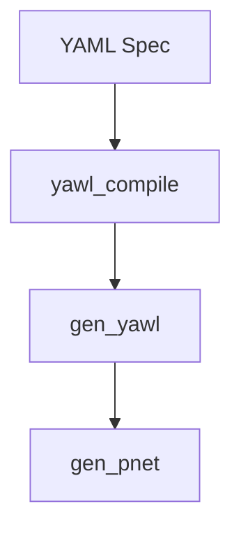

# Comparison Matrices for Generative Analysis

**Version**: 1.0
**Date**: 2026-02-07
**Status**: Active

This document provides comparison matrices to help users choose between different approaches in the CRE (Common Runtime Environment) workflow engine. Each matrix includes dimensions for comparison, scoring, pros/cons, and decision recommendations based on real CRE codebase examples.

---

## Table of Contents

1. [LLM vs Compiled Runtime](#1-llm-vs-compiled-runtime)
2. [Pattern Selection Guide](#2-pattern-selection-guide)
3. [Verification Strategies](#3-verification-strategies)
4. [Documentation Formats](#4-documentation-formats)
5. [Swarm Architectures](#5-swarm-architectures)

---

## 1. LLM vs Compiled Runtime

**Purpose**: Choose between LLM-based workflow generation and compiled Petri net execution for workflow orchestration.

### Comparison Matrix

| Dimension | LLM-Based Runtime | Compiled Runtime (gen_yawl/gen_pnet) | Hybrid Approach |
|-----------|------------------|--------------------------------------|-----------------|
| **Execution Speed** | Slow (100-500ms per decision) | Fast (<1ms per transition) | Medium (varies) |
| **Determinism** | Non-deterministic (temperature-based) | Fully deterministic | Selectable |
| **State Consistency** | Ad-hoc, requires prompt engineering | Guaranteed (Petri net marking) | Engineered |
| **Debuggability** | Chat logs, intermediate parsing | Full state inspection, tracing | Both available |
| **Composition** | Difficult (context limits) | Native (subnet composition) | Pattern-based |
| **Error Recovery** | Retry with prompt adjustment | Automatic (marking rollback) | Strategy-based |
| **Scalability** | Limited by token context | Linear with marking size | Bounded |
| **Formal Verification** | Not applicable | Possible (state space analysis) | Partial |
| **Cold Start Time** | Model load (1-5s) | Module load (<100ms) | Both |
| **Memory Usage** | High (model + context) | Low (marking map only) | Medium |
| **Code Generation** | Natural (primary strength) | Not applicable (requires compiler) | LLM generates spec |
| **Hot Reloading** | Full regeneration possible | Code swap supported | Dual path |

### Scoring (1-5, 5 = Best)

| Criterion | LLM | Compiled | Winner |
|-----------|-----|----------|--------|
| Performance | 2 | 5 | Compiled |
| Flexibility | 5 | 3 | LLM |
| Reliability | 3 | 5 | Compiled |
| Maintainability | 2 | 4 | Compiled |
| Development Speed | 4 | 2 | LLM |
| Production Readiness | 3 | 5 | Compiled |
| **Overall Score** | **19/30** | **24/30** | **Compiled** |

### Pros and Cons

#### LLM-Based Runtime

**Pros:**
- Natural language specification (no DSL learning curve)
- Dynamic behavior generation
- Easy to modify via prompt changes
- Human-readable intermediate states
- No compilation step

**Cons:**
- Non-deterministic execution
- High latency per decision
- Token limits constrain workflow size
- Difficult to reason about state
- No formal guarantees

#### Compiled Runtime

**Pros:**
- Deterministic execution
- Microsecond-level transitions
- Composable (subnet support)
- Proven Petri net semantics
- Full state inspection

**Cons:**
- Requires learning YAWL/Erlang DSL
- Compilation step required
- Less flexible at runtime
- Requires restart for changes

### Decision Recommendations

**Use LLM-Based When:**
- Prototyping new workflows quickly
- Natural language interaction required
- Human-in-the-loop decision making
- Non-deterministic exploration desired
- Education/demonstration scenarios

**Example from CRE:**
```erlang
% test/agi_symposium_omega_agents.erl
% LLM agents complete human tasks in AGI Symposium workflow
create_role_agent(Role, TaskName, Context) ->
    Prompt = build_full_prompt(Role, TaskName, Context),
    zai_client:chat(Prompt).  % LLM generates decision
```

**Use Compiled Runtime When:**
- Production workflows required
- Performance critical (>1000 transitions/sec)
- Deterministic execution essential
- Complex composition needed
- State persistence required

**Example from CRE:**
```erlang
% src/core/gen_yawl.erl
% Fast, deterministic Petri net execution
handle_call(step, _From, WrapperState) ->
    case progress(NetState0, FireTimeout) of
        {delta, Mode, Pm, NewUsrInfo} ->
            {reply, {ok, Receipt}, WrapperState#wrapper_state{net_state = NetState3}}
    end.
```

**Use Hybrid When:**
- LLM generates workflow specifications
- Compiled runtime executes generated code
- Human oversight with automated execution

**Example from CRE:**
```erlang
% test/omega_demo_runner.erl
% LLM agents complete tasks, but gen_yawl handles all workflow state
run_omega_loop(Pid, RoleAgents) ->
    case gen_yawl:step(Pid) of
        {ok, Receipt} ->
            case find_human_task(Receipt) of
                {Place, TaskName} ->
                    Decision = query_llm_agent(RoleAgents, TaskName, Context),
                    gen_yawl:inject(Pid, #{Place => [Decision]})
            end
    end.
```

---

## 2. Pattern Selection Guide

**Purpose**: Select the appropriate YAWL workflow pattern based on scenario requirements.

### Quick Selection Matrix

| Scenario | Recommended Pattern | Module | Complexity |
|----------|---------------------|--------|------------|
| Linear process | Sequence | `sequence.erl` | Low |
| Concurrent independent work | Parallel Split | `parallel_split.erl` | Low |
| Wait for all branches | Synchronization | `synchronization.erl` | Low |
| One of many paths | Exclusive Choice | `exclusive_choice.erl` | Low |
| Merge incoming paths | Simple Merge | `simple_merge.erl` | Low |
| Multiple paths simultaneously | Multiple Choice | `multiple_choice.erl` | Medium |
| First to complete wins | Discriminator | `discriminator.erl` | Medium |
| N of M required | N out of M | `n_out_of_m.erl` | Medium |
| Fixed parallel instances | Multiple Instances (Static) | `multiple_instances_sync.erl` | Medium |
| Dynamic parallel instances | Multiple Instances (Runtime) | Built-in to gen_yawl | High |
| Conditional execution | Milestone | `milestone.erl` | Medium |
| Cancel single activity | Cancel Activity | `cancel_activity.erl` | Medium |
| Cancel entire workflow | Cancel Case | `cancel_case.erl` | High |
| Loop until condition | Structured Loop | `structured_loop.erl` | Medium |
| Arbitrary cycles | Arbitrary Cycles | `arbitrary_cycles.erl` | High |
| Recursion | Recursion | `recursion.erl` | High |
| Interleaved execution | Interleaved Routing | `interleaved_routing.erl` | High |
| Shared resource access | Critical Section | `critical_section.erl` | Medium |
| Protocol communication | Protocol Pattern | Built-in | High |
| Exception handling | Try-Catch Region | `wf_try_region.erl` | High |
| Thread spawning | Thread Split | `thread_split.erl` | Medium |
| Thread joining | Thread Merge | `thread_merge.erl` | Medium |

### Detailed Pattern Categories

#### Basic Control Flow (WCP-01 to WCP-06)

| Pattern | Use Case | Alternatives | Migration Path |
|---------|----------|--------------|----------------|
| Sequence | Linear step-by-step | Parallel Split (serialize) | Add parallel branches later |
| Parallel Split | Independent concurrent tasks | Multiple Choice | Add conditions to branches |
| Synchronization | Wait for all branches | Discriminator (n of m) | Change to partial join |
| Exclusive Choice | Mutually exclusive paths | Multiple Choice | Add conditions for exclusion |
| Simple Merge | Converge alternatives | Synchronization (AND) | Change join semantics |
| Multiple Choice | Enable multiple paths | Parallel Split | Add conditions per branch |

#### Advanced Branching (WCP-07 to WCP-10)

| Pattern | Use Case | Example from CRE |
|---------|----------|------------------|
| Structured Sync Merge | Multi-path convergence with progress tracking | `structured_sync_merge.erl` |
| Multiple Merge | Collect results from multiple paths | `multiple_merge.erl` |
| Discriminator | First-come, first-served | `discriminator.erl` |
| N out of M | Quorum-based decisions | `n_out_of_m.erl` |

#### Multiple Instances (WCP-11 to WCP-17)

| Pattern | Instance Count | Knowledge Time | Sync Required |
|---------|---------------|---------------|--------------|
| No Synchronization | N | Design time | No |
| Static | N | Design time | Yes |
| Runtime | N (calculated) | Before creation | Yes |
| Dynamic | Unbounded | During execution | Yes |
| Deferred Choice | 1 of N | At runtime | N/A |

#### State-Based Patterns (WCP-18 to WCP-20)

| Pattern | Trigger | Scope | CRE Module |
|---------|---------|-------|------------|
| Milestone | State condition reached | Activity guard | `milestone.erl` |
| Cancel Activity | External event | Single task | `cancel_activity.erl` |
| Cancel Case | External event | Entire workflow | `cancel_case.erl` |

### Decision Tree

```
                       [Need workflow?]
                            |
                    Yes /   \ No
                   /        \-- Not a workflow problem
                  |
           [Multiple concurrent tasks?]
              |
       Yes /   \ No
      /         \
[Need to wait?] [Linear path?]
 |              |
Yes            No-- Use Sequence
 |
[Wait for all or first?]
 |
All /           \ First
|                \
Synchronization  Discriminator
```

### Pattern Complexity Scoring

| Complexity Level | Patterns | Lines of Code | Learning Curve |
|------------------|----------|--------------|---------------|
| Basic (1-2) | Sequence, Parallel Split, Exclusive Choice | <100 | Low |
| Intermediate (3-5) | Synchronization, Multiple Choice, Milestone | 100-300 | Medium |
| Advanced (6-8) | Thread Split/Merge, Arbitrary Cycles | 300-500 | High |
| Expert (9+) | Recursion, Interleaved Routing, Cancel Case | 500+ | Very High |

---

## 3. Verification Strategies

**Purpose**: Choose between static analysis, testing, and formal proof for workflow verification.

### Comparison Matrix

| Dimension | Static Analysis | Testing (EUnit/CT) | Formal Proof |
|-----------|-----------------|--------------------|--------------|
| **Coverage** | Code paths only | Exercise actual paths | All possible states |
| **Effort** | Low (automated) | Medium (write tests) | High (model required) |
| **False Positives** | High | None | None |
| **False Negatives** | Possible | Possible (coverage gaps) | None (complete) |
| **Runtime Validation** | No | Yes | No |
| **Execution Time** | Fast (seconds) | Medium (minutes) | Slow (hours-days) |
| **State Space** | Ignored | Sampled | Exhaustively explored |
| **Regression Detection** | Immediate | Via test suite | Via model diff |
| **CRE Tool Support** | Dialyzer, Xref | EUnit, Common Test | Concuerror, McErlang |
| **Production Use** | Essential | Essential | Optional |

### Strategy Selection Matrix

| Scenario | Recommended Strategy | Tool | Example from CRE |
|----------|---------------------|------|------------------|
| Type safety | Static Analysis | Dialyzer | `rebar3 dialyzer` |
| Race conditions | Formal Analysis | Concuerror | `rebar3 concuerror` |
| Unit behavior | Testing | EUnit | `*_test.erl` files |
| Integration | Testing | Common Test | `*_SUITE.erl` files |
| Documentation examples | Testing | Doctest | `*_doctest.erl` files |
| Deadlock detection | Formal Analysis | Concuerror | NATO test suites |
| API contracts | Static Analysis | Typified specs | `*-spec()` attributes |
| Coverage measurement | Testing | Cover | `rebar3 cover` |

### Scoring (1-5, 5 = Best)

| Criterion | Static | Testing | Formal |
|-----------|--------|---------|--------|
| Setup Cost | 5 | 3 | 1 |
| Execution Speed | 5 | 3 | 1 |
| Bug Finding | 3 | 4 | 5 |
| Coverage Assurance | 2 | 4 | 5 |
| Maintenance | 4 | 3 | 2 |
| Production Suitability | 5 | 5 | 2 |
| **Overall Score** | **24/30** | **22/30** | **16/30** |

### Recommended Verification Pyramid

```
                    Formal Proof (1%)
                   /------------------\
                  /   State space      \
                 /    verification       \
                /--------------------------\
               /
              /
    Static Analysis (19%)
   /---------------------------\
  /  Dialyzer + Xref + Typing  \
 /-------------------------------/
|
|
Testing (80%)
/---------------------------------------------------\
/  EUnit (40%)  Common Test (30%)  Doctest (10%)   \
/---------------------------------------------------/
```

### Strategy Combinations

**For Production Deployments:**
1. Static Analysis (Dialyzer) - catch type errors
2. Unit Tests (EUnit) - cover each module
3. Integration Tests (Common Test) - verify workflows
4. Coverage Report - ensure 80%+ coverage

**For Safety-Critical Workflows:**
1. All production steps above
2. Concuerror analysis - verify concurrency properties
3. State space analysis - verify boundedness
4. Property-based testing - QuickCheck/Proper

**Example from CRE:**

```bash
# Full verification pipeline
rebar3 compile                    # Compilation
rebar3 dialyzer                   # Static analysis
rebar3 eunit                      # Unit tests
rebar3 ct                         # Integration tests
rebar3 cover --export             # Coverage report
rebar3 as concuerror compile     # Concurrency testing
rebar3 concuerror                 # Run Concuerror
```

### Coverage Targets by Module Type

| Module Type | Target Coverage | Rationale |
|-------------|-----------------|-----------|
| Core (gen_yawl, gen_pnet) | 100% | Critical path |
| Patterns (src/patterns/*) | 95% | Well-defined semantics |
| Workflow (src/wf/*) | 90% | Business logic |
| Utilities (src/yawl/*) | 85% | Helper functions |
| Tests (test/*) | Not required | Self-verifying |

---

## 4. Documentation Formats

**Purpose**: Choose between BCD (Block-Comment Documentation), diagrams, and formal specifications.

### Comparison Matrix

| Dimension | BCD (Block Comments) | Diagrams (Mermaid) | Formal Specs |
|-----------|---------------------|-------------------|--------------|
| **Readability** | High (for developers) | High (for architects) | Low (formal notation) |
| **Maintenance** | Easy (in-source) | Medium (separate files) | Hard (specialized tools) |
| **Precision** | Low (natural language) | Medium (visual) | High (mathematical) |
| **Tool Support** | Native (Edoc, ExDoc) | Mermaid, PlantUML | Specialized |
| **Code Synchronization** | Automatic (same file) | Manual | Manual |
| **Generation** | From code | From tools/BCD | From formal models |
| **Searchability** | Text search | Visual inspection | Symbolic |
| **Version Control** | Line-based diff | Merge conflicts | Tool-dependent |
| **CRE Examples** | All `*.erl` modules | `docs/mermaid-diagrams/` | YAWL XML specs |

### Format Selection Guide

| Scenario | Recommended Format | Output | CRE Example |
|----------|-------------------|--------|-------------|
| API documentation | BCD (Edoc) | HTML/PDF | `gen_yawl.erl` moduledoc |
| Architecture overview | Diagram (C4/Mermaid) | SVG/PNG | `docs/mermaid-diagrams/` |
| Workflow specification | Formal (YAWL XML/YAML) | Executable | `agi_symposium_omega.yaml` |
| Quick reference | BCD Tables | Markdown | `YAWL_PATTERN_REFERENCE.md` |
| Tutorial | BCD + Code | Markdown | `tutorials/getting_started.md` |
| State machine | Diagram + Formal | Mermaid + XML | Pattern documentation |
| Deployment guide | BCD + Diagrams | Markdown | `DEPLOYMENT.md` |

### Documentation Quality Matrix

| Quality Attribute | BCD | Diagrams | Formal Specs |
|-------------------|-----|----------|-------------|
| Accuracy | 4/5 | 3/5 | 5/5 |
| Completeness | 3/5 | 4/5 | 5/5 |
| Accessibility | 5/5 | 4/5 | 2/5 |
| Maintainability | 4/5 | 2/5 | 3/5 |
| Actionability | 4/5 | 5/5 | 3/5 |

### CRE Documentation Patterns

**Module Documentation (BCD):**
```erlang
%% @doc YAWL Workflow Execution Engine
%%
%% This module implements the core workflow execution engine for YAWL
%% specifications. It supports:
%%   - Workflow case lifecycle management
%%   - Petri net-based execution using gen_pnet
%%   - Support for YAWL net elements
%%
%% @end
-module(yawl_engine).
```

**Architecture Diagram:**


**Formal Specification:**
```xml
<specification xmlns="http://www.yawlfoundation.org/yawls">
  <decomposition id="task" isRoot="false" />
  <net id="root">
    <inputCondition id="input" />
    <task id="task1" />
    <outputCondition id="output" />
  </net>
</specification>
```

### Recommended Documentation Stack

| Layer | Format | Tool | Purpose |
|-------|--------|------|---------|
| Code | BCD (Edoc) | rebar3 edoc | API reference |
| Architecture | Diagrams | Mermaid | Visual overview |
| Specification | Formal | YAWL XML/YAML | Executable spec |
| Tutorials | BCD + Code | Markdown | Learning |
| Reference | Tables | Markdown | Quick lookup |

---

## 5. Swarm Architectures

**Purpose**: Choose between pattern-based, agent-based, and hybrid swarm architectures for multi-agent workflows.

### Comparison Matrix

| Dimension | Pattern-Based | Agent-Based | Hybrid |
|-----------|---------------|------------|--------|
| **Orchestration** | Workflow engine | Agent negotiation | Both |
| **Coordination** | Petri net semantics | Message passing | Coordinated |
| **Scalability** | Linear with marking | Complex (emergent) | Tunable |
| **Predictability** | High (deterministic) | Low (emergent) | Medium |
| **Flexibility** | Low (compiled) | High (runtime) | Medium |
| **Fault Tolerance** | Engine-level | Agent-level | Both |
| **State Management** | Centralized (marking) | Distributed | Hybrid |
| **Composition** | Subnet composition | Agent hierarchy | Pattern + Agent |
| **CRE Implementation** | gen_yawl patterns | agi_symposium_omega_agents | omega_demo_runner |
| **Use Case** | Deterministic workflows | Exploratory tasks | Supervised learning |

### Architecture Patterns

#### Pattern-Based (Petri Net Swarms)

**Description**: Workflow patterns define agent interaction topology.

**Example from CRE:**
```erlang
% AGI Symposium Omega: 20 roles, 43 patterns
% Workflow defines which agent acts when
-spec find_human_task(Marking, Transitions) -> {Place, TaskName} | undefined.
```

**Characteristics:**
- Deterministic execution order
- Pattern-based synchronization
- State in Petri net marking
- Agents as task executors only

#### Agent-Based (Autonomous Swarms)

**Description**: Agents self-organize through message passing.

**Characteristics:**
- Emergent behavior
- Peer-to-peer messaging
- Distributed state
- Agents decide next actions

#### Hybrid (Pattern-Guided Agents)

**Description**: Workflow defines constraints, agents execute tasks.

**Example from CRE:**
```erlang
% omega_demo_runner orchestrates, LLM agents decide
run_omega_loop(Pid, RoleAgents) ->
    % gen_yawl provides structure (what task)
    case gen_yawl:step(Pid) of
        {ok, Receipt} ->
            % LLM agent provides decision (how to complete)
            Decision = query_llm_agent(RoleAgents, TaskName, Context),
            gen_yawl:inject(Pid, #{Place => [Decision]})
    end.
```

**Characteristics:**
- Workflow topology (gen_yawl)
- Agent decision making (LLM)
- Hybrid state (marking + agent memory)
- Best of both approaches

### Selection Criteria

| Criterion | Pattern-Based | Agent-Based | Hybrid |
|-----------|---------------|------------|--------|
| Need for determinism | Required (5/5) | Not needed (1/5) | Preferred (3/5) |
| Task complexity | Low-Medium | High | Any |
| Human oversight | Easy | Difficult | Medium |
| Failure recovery | Engine handles | Agent must handle | Shared |
| Training required | Erlang/YAWL | Agent framework | Both |
| CRE support | Full (gen_yawl) | Partial (agents) | Full (omega) |

### Swarm Size Recommendations

| Swarm Size | Recommended Architecture | CRE Example |
|------------|------------------------|-------------|
| 1-5 agents | Pattern-based | Basic workflows |
| 5-20 agents | Hybrid | AGI Symposium Omega (20 roles) |
| 20-100 agents | Agent-based with patterns | Large-scale simulations |
| 100+ agents | Pure agent-based | Distributed systems |

### Communication Patterns

| Pattern | Latency | Scalability | CRE Implementation |
|---------|---------|-------------|-------------------|
| Centralized (gen_server) | Low | Low-Medium | gen_yawl |
| Pub/Sub | Medium | High | Not implemented |
| Gossip | High | Very High | Not implemented |
| Hierarchical | Low-Medium | High | Pattern subnets |

### Decision Flow

```
                   [Need multi-agent?]
                         |
              Yes /     \ No
             /           \-- Single process sufficient
            |
       [Must be deterministic?]
            |
     Yes /   \ No
    /         \
[Use         [Explore
 Pattern-     Agent-based
  Based]      or Hybrid]
```

---

## Appendix: Quick Reference

### Module Location Map

| Architecture | Runtime Location | Pattern Location | Agent Location |
|--------------|------------------|------------------|----------------|
| Pattern-Based | `src/core/gen_yawl.erl` | `src/patterns/*.erl` | N/A |
| Agent-Based | N/A | N/A | `test/agi_symposium_omega_agents.erl` |
| Hybrid | `src/core/gen_yawl.erl` | `src/patterns/*.erl` | `test/omega_demo_runner.erl` |

### Command Reference

| Task | Command |
|------|---------|
| Compile workflow | `rebar3 compile` |
| Run tests | `rebar3 ct` |
| Static analysis | `rebar3 dialyzer` |
| Coverage report | `rebar3 cover --export` |
| Concurrency testing | `rebar3 concuerror` |
| Generate docs | `rebar3 edoc` |

### Documentation Location Map

| Format | Directory | Examples |
|--------|-----------|----------|
| BCD (Edoc) | Module headers | All `src/**/*.erl` files |
| Diagrams | `docs/mermaid-diagrams/` | C4, sequence, Gantt charts |
| Tutorials | `docs/tutorials/` | Getting started, patterns |
| Reference | `docs/` | API, patterns, quick reference |
| Specs | `test/fixtures/` | YAML, XML workflow specs |

---

## Change History

| Version | Date | Changes | Author |
|---------|------|---------|--------|
| 1.0 | 2026-02-07 | Initial document | CRE Team |

---

## References

1. `YAWL_PATTERNS_REFERENCE.md` - Complete pattern documentation
2. `TESTING.md` - Testing strategy and organization
3. `THESIS_PHD_WORKFLOW_SWARM.md` - Swarm architecture theory
4. `VERIFICATION_REPORT.md` - Verification methodology
5. `gen_yawl.erl` - Compiled runtime implementation
6. `yawl_engine.erl` - Legacy engine implementation

---

**Document Status**: Active
**Maintenance**: Update as new patterns and architectures are added to CRE
**Feedback**: Submit issues via git workflow
