# CRE Compilation Pipeline Diagrams

This document contains comprehensive Mermaid diagrams showing the complete YAWL workflow compilation pipeline from YAML specifications to executable Petri net code.

---

## Table of Contents

1. [YAML Compilation Pipeline Overview](#yaml-compilation-pipeline-overview)
2. [Stage 1: YAML Parsing](#stage-1-yaml-parsing)
3. [Stage 2: Pattern Expansion](#stage-2-pattern-expansion)
4. [Stage 3: Net Structure Generation](#stage-3-net-structure-generation)
5. [Stage 4: Module Code Generation](#stage-4-module-code-generation)
6. [Stage 5: Runtime Execution](#stage-5-runtime-execution)
7. [Pattern Expansion Detail](#pattern-expansion-detail)
8. [Receipt Generation and Verification](#receipt-generation-and-verification)
9. [Complete End-to-End Flow](#complete-end-to-end-flow)

---

## YAML Compilation Pipeline Overview

The compilation pipeline transforms YAWL YAML specifications into executable gen_pnet modules through five stages:

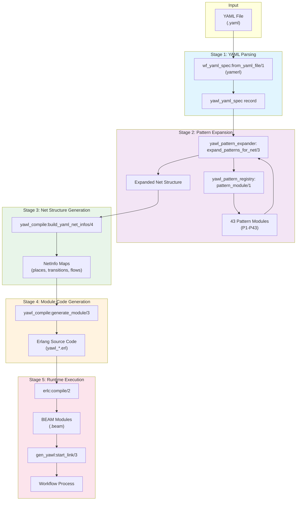

---

## Stage 1: YAML Parsing

The YAML parsing stage converts raw YAML into the internal `yawl_yaml_spec` record format using the `yamerl` parser.

```mermaid
sequenceDiagram
    participant File as YAML File
    participant Yamerl as yamerl_constr
    participant Parser as wf_yaml_spec
    participant Validator as yawl_validate

    File->>Yamerl: Read file contents
    Yamerl->>Yamerl: Parse YAML structure
    Yamerl-->>Parser: Erlang terms (maps/lists)

    Parser->>Parser: normalize_yaml_data/1
    Parser->>Parser: parse_specification_set/1

    Note over Parser
        Extract:
        - yawl_yaml_version (must be "0.2")
        - specificationSet data
        - nets (nodes, flows, variables)
        - pattern_instances
        - pattern_registry
    end

    Parser->>Parser: parse_nets/1
    Note over Parser
        For each net:
        - Extract task IDs
        - Find input/output conditions
        - Build decomposition_info
    end

    Parser->>Parser: extract_tasks_from_nets/1
    Parser->>Parser: extract_flows_from_nets/1
    Parser->>Parser: extract_conditions_from_nets/1

    Parser->>Validator: validate/1
    Validator-->>Parser: ok | {error, [Reason]}

    Parser-->>Actor: {ok, #yawl_yaml_spec{}}
```

### YAML Specification Structure

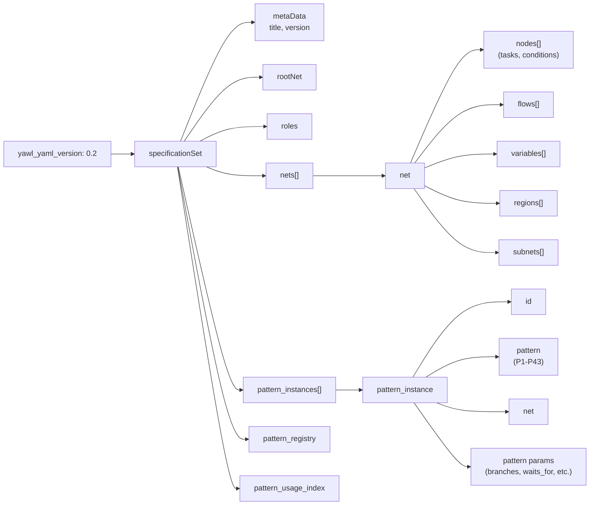

---

## Stage 2: Pattern Expansion

Pattern expansion converts pattern instances into concrete Petri net structures (places, transitions, flows).

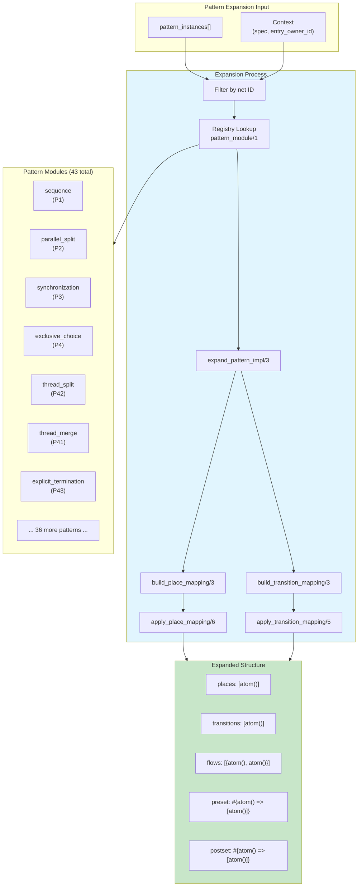

### Pattern Expansion Sequence

```mermaid
sequenceDiagram
    participant Exp as yawl_pattern_expander
    participant Reg as yawl_pattern_registry
    participant Pat as Pattern Module
    participant Net as Net Structure

    Exp->>Exp: expand_patterns_for_net/3<br/>(Instances, NetId, Context)

    loop For each pattern instance
        Exp->>Exp: net_matches/2<br/>(filter by net ID)

        Exp->>Reg: pattern_module/1<br/>(PatternId)
        Reg-->>Exp: ModuleName | undefined

        alt Module found
            Exp->>Pat: place_lst/0
            Pat-->>Exp: [p_start, p_task1, ...]

            Exp->>Pat: trsn_lst/0
            Pat-->>Exp: [t_start, t_complete1, ...]

            Exp->>Pat: preset/1 (per transition)
            Pat-->>Exp: [atom()]

            Exp->>Exp: build_place_mapping/3<br/>(map p_thread1->YAML names)
            Exp->>Exp: build_transition_mapping/3<br/>(rename transitions)

            Exp->>Net: merge_net_structures/2
        end
    end

    Exp-->>Actor: #{
        places => [...],
        transitions => [...],
        flows => [...],
        preset => #{},
        postset => #{}
    }
```

---

## Stage 3: Net Structure Generation

Net structure generation builds complete NetInfo maps for each decomposition net.

```mermaid
flowchart TD
    subgraph Inputs["Inputs"]
        Spec["yawl_yaml_spec"]
        Nets["net IDs"]
        Expanded["Expanded patterns"]
    end

    subgraph Build["build_yaml_net_infos/4"]
        GetRoot["Get root_net"]
        loop For each net
            GetTasks["wf_yaml_spec:tasks/2"]
            GetEntry["compute_entry_owner_id/3"]
            Expand["yawl_pattern_expander:<br/>expand_patterns_for_net/3"]
            GetIO["net_input/output_condition/2"]
            GetVars["wf_yaml_spec:variables/2"]
            GetRegions["wf_yaml_spec:net_regions/2"]
            BuildRegion["build_region_places_map/5"]
        end
    end

    subgraph NetInfo["NetInfo Map"]
        ID["id: binary()"]
        SpecID["spec_id: binary()"]
        IsRoot["is_root: boolean()"]
        Tasks["tasks: [atom()]"]
        Places["places: [atom()]<br/>(expanded + all referenced)"]
        Transitions["transitions: [atom()]"]
        Preset["preset: #{atom() => [atom()]}"]
        Postset["postset: #{atom() => [atom()]}"]
        Flows["flows: [{atom(), atom()}]"]
        IOCond["input/output_condition"]
        Vars["variables: [variable_def()]"]
        Regions["regions: #{binary() => [atom()]}"]
    end

    Spec --> Build
    Nets --> Build
    Expanded --> Build
    Build --> NetInfo

    style Build fill:#e8f5e9
    style NetInfo fill:#c8e6c9
```

### Place Resolution Strategy

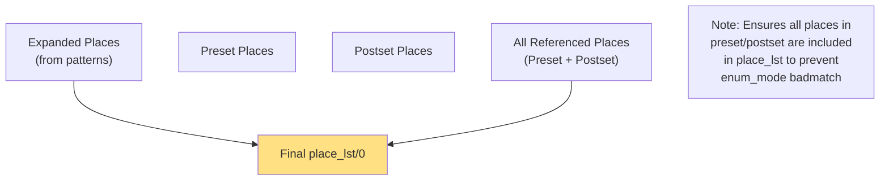

---

## Stage 4: Module Code Generation

Module code generation creates complete Erlang source files implementing the gen_pnet behavior.

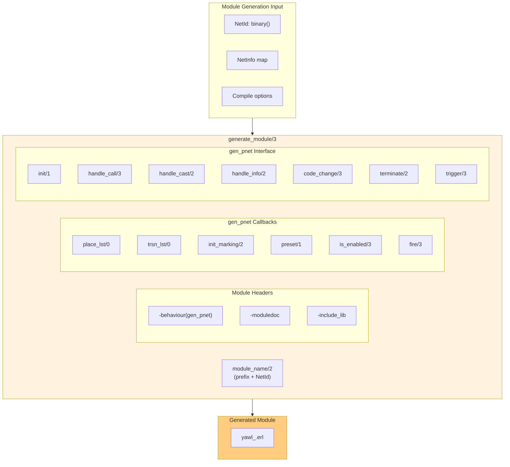

### Generated Module Structure

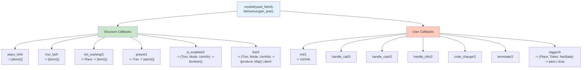

### Fire/3 Clause Generation

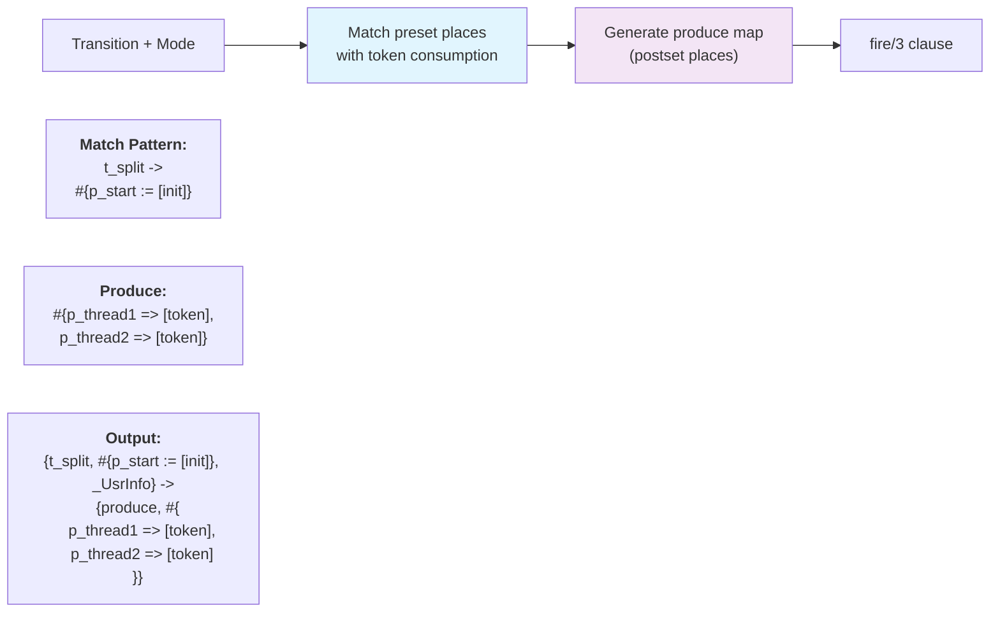

---

## Stage 5: Runtime Execution

Runtime execution manages workflow instances through the gen_yawl behavior.

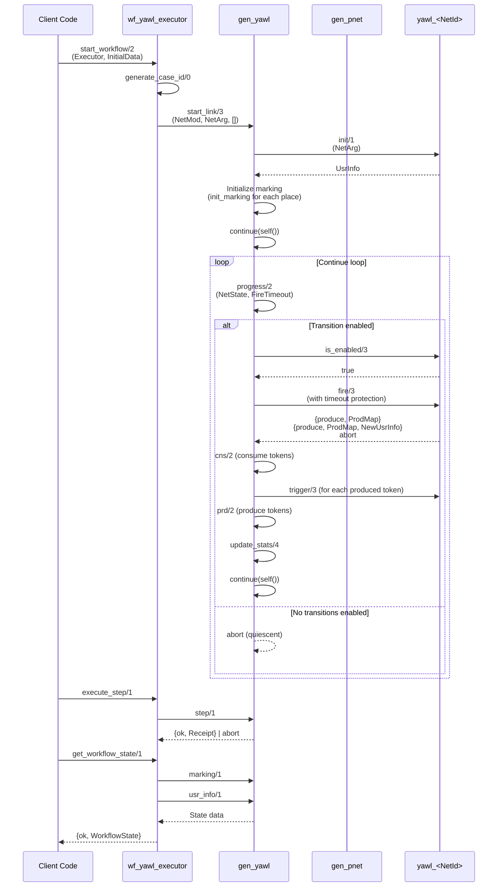

### gen_yawl State Management

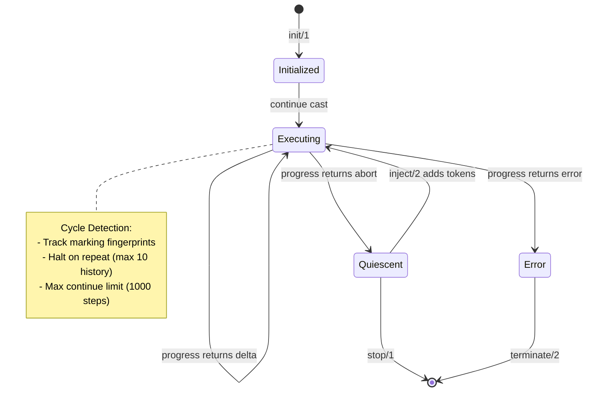

---

## Pattern Expansion Detail

Detailed view of how pattern instances are expanded into concrete structures.

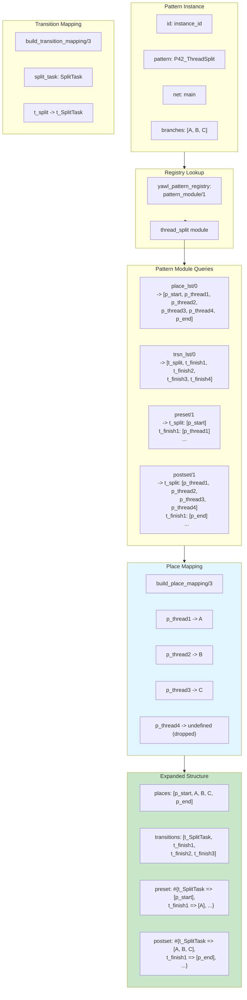

### All 43 Workflow Patterns

```mermaid
flowchart LR
    subgraph Basic["Basic Control Flow (P1-P11)"]
        P1["P1_Sequence"]
        P2["P2_ParallelSplit"]
        P3["P3_Synchronization"]
        P4["P4_ExclusiveChoice"]
        P5["P5_SimpleMerge"]
        P6["P6_MultipleChoice"]
        P7["P7_StructuredSyncMerge"]
        P8["P8_MultipleMerge"]
        P9["P9_Discriminator"]
        P10["P10_ArbitraryCycles"]
        P11["P11_ImplicitTermination"]
    end

    subgraph MI["Multiple Instances (P12-P15)"]
        P12["P12_MI_NoSync"]
        P13["P13_MI_DesignTime"]
        P14["P14_MI_RuntimeKnown"]
        P15["P15_MI_RuntimeUnknown"]
    end

    subgraph Advanced["Advanced (P16-P25)"]
        P16["P16_DeferredChoice"]
        P17["P17_InterleavedParallelRouting"]
        P18["P18_Milestone"]
        P19["P19_CancelActivity"]
        P20["P20_CancelCase"]
        P21["P21_StructuredLoop"]
        P22["P22_Recursion"]
        P23["P23_TransientTrigger"]
        P24["P24_PersistentTrigger"]
        P25["P25_CancelRegion"]
    end

    subgraph Discriminators["Discriminators (P28-P29)"]
        P28["P28_BlockingDiscriminator"]
        P29["P29_CancellingDiscriminator"]
    end

    subgraph Partial["Partial Joins (P30-P36)"]
        P30["P30_StructuredPartialJoin"]
        P31["P31_BlockingPartialJoin"]
        P32["P32_CancellingPartialJoin"]
        P33["P33_GeneralizedANDJoin"]
        P34["P34_StaticPartialJoinMI"]
        P35["P35_CancellingPartialJoinMI"]
        P36["P36_DynamicPartialJoinMI"]
    end

    subgraph Extended["Extended (P37-P43)"]
        P37["P37_LocalSyncMerge"]
        P38["P38_GeneralSyncMerge"]
        P39["P39_CriticalSection"]
        P40["P40_InterleavedRouting"]
        P41["P41_ThreadMerge"]
        P42["P42_ThreadSplit"]
        P43["P43_ExplicitTermination"]
    end

    Basic --> MI
    MI --> Advanced
    Advanced --> Discriminators
    Discriminators --> Partial
    Partial --> Extended

    style Basic fill:#e3f2fd
    style MI fill:#f3e5f5
    style Advanced fill:#e8f5e9
    style Discriminators fill:#fff3e0
    style Partial fill:#fce4ec
    style Extended fill:#e0f2f1
```

---

## Receipt Generation and Verification

Receipts provide immutable audit records for state transitions in the Petri net.

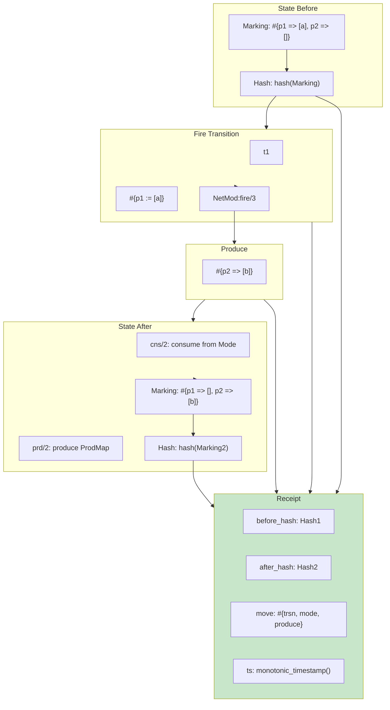

### Receipt Structure and Classification

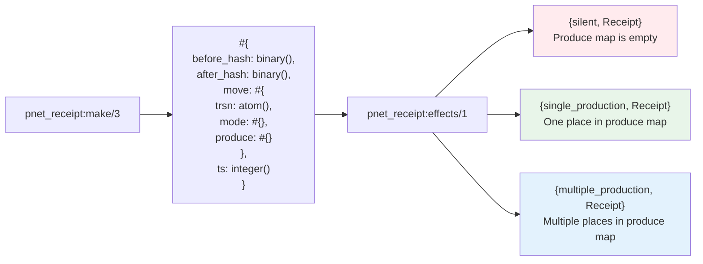

### Receipt Verification Chain

```mermaid
sequenceDiagram
    participant Fire as fire/3
    participant Hash as hash/1
    participant Receipt as pnet_receipt
    participant Verify as Verification

    Fire->>Hash: Hash state before (Marking1)
    Hash-->>Fire: BeforeHash

    Fire->>Fire: Execute transition logic
    Fire->>Fire: Build produce map

    Fire->>Hash: Hash state after (Marking2)
    Hash-->>Fire: AfterHash

    Fire->>Receipt: make/3<br/>(BeforeHash, AfterHash, Move)
    Receipt->>Receipt: timestamp/0
    Receipt-->>Fire: Receipt

    Fire-->>Verify: Receipt

    Note over Verify
        Verification:
        1. Recompute hash of current marking
        2. Match against receipt.after_hash
        3. Verify transition was valid
        4. Check timestamp ordering
    end

    Verify->>Verify: validate_receipt/1
```

---

## Complete End-to-End Flow

The complete workflow from YAML file to executing process with receipts.

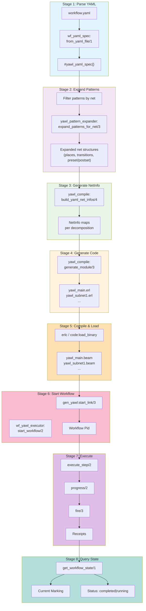

### One-Shot Execution Flow

```mermaid
sequenceDiagram
    participant Client
    participant Exec as wf_yawl_executor
    participant Pid as Workflow Pid

    Client->>Exec: execute_workflow/3<br/>(FilePath, InitialData, Options)

    Exec->>Exec: load_workflow/1
    Exec->>Exec: compile_workflow/1

    Exec->>Exec: start_workflow/2
    Exec->>Pid: gen_yawl:start_link

    Exec->>Pid: execute_step/2<br/>(MaxSteps)

    loop Until quiescent or MaxSteps
        Pid->>Pid: progress/2
        Pid->>Pid: fire/3
        Pid-->>Exec: Receipt
    end

    Exec->>Pid: get_workflow_state/1
    Pid-->>Exec: {ok, WorkflowState}

    Exec->>Pid: stop_workflow/1

    Exec-->>Client: {ok, #{
        receipts := [...],
        final_state := WorkflowState,
        case_id := ...
    }}
```

---

## Key Module Interactions

### Module Dependency Graph

```mermaid
flowchart LR
    subgraph Parsing["Parsing Layer"]
        YAML["wf_yaml_spec"]
    end

    subgraph Patterns["Pattern Layer"]
        Registry["yawl_pattern_registry"]
        Expander["yawl_pattern_expander"]
        Patterns["43 Pattern Modules"]
    end

    subgraph Compilation["Compilation Layer"]
        Compile["yawl_compile"]
    end

    subgraph Execution["Execution Layer"]
        Executor["wf_yawl_executor"]
        GenYawl["gen_yawl"]
        GenPnet["gen_pnet"]
    end

    subgraph Runtime["Runtime Layer"]
        Receipt["pnet_receipt"]
    end

    YAML --> Expander
    Registry --> Expander
    Patterns --> Expander
    Expander --> Compile
    Compile --> Executor
    Executor --> GenYawl
    GenYawl --> GenPnet
    GenYawl --> Receipt

    style Parsing fill:#e1f5fe
    style Patterns fill:#f3e5f5
    style Compilation fill:#e8f5e9
    style Execution fill:#fff3e0
    style Runtime fill:#ffe0b2
```

### Data Flow Through Compilation

```mermaid
flowchart LR
    subgraph Input["Input Data"]
        YAML["YAML File<br/>(text)"]
    end

    subgraph P1["Parse: wf_yaml_spec"]
        S1["yawl_yaml_spec record<br/>(spec, patterns, nets)"]
    end

    subgraph P2["Expand: yawl_pattern_expander"]
        S2["net_structure map<br/>(places, transitions, flows)"]
    end

    subgraph P3["Build: yawl_compile"]
        S3["NetInfo map<br/>(+ regions, variables)"]
    end

    subgraph P4["Generate: yawl_compile"]
        S4["Erlang source<br/>(binary)"]
    end

    subgraph P5["Compile: erlc"]
        S5["BEAM code<br/>(.beam file)"]
    end

    subgraph P6["Run: gen_yawl"]
        S6["Workflow state<br/>(marking, usr_info)"]
    end

    subgraph P7["Receipt: pnet_receipt"]
        S7["Receipt record<br/>(before_hash, after_hash, move, ts)"]
    end

    YAML --> P1
    P1 --> P2
    P2 --> P3
    P3 --> P4
    P4 --> P5
    P5 --> P6
    P6 --> P7

    style S1 fill:#e1f5fe
    style S2 fill:#f3e5f5
    style S3 fill:#e8f5e9
    style S4 fill:#fff3e0
    style S5 fill:#ffe0b2
    style S6 fill:#f8bbd0
    style S7 fill:#e1bee7
```

---

## Appendix: Module Reference

### Core Modules

| Module | Purpose | Key Functions |
|--------|---------|---------------|
| `wf_yaml_spec` | Parse YAML 0.2 specs | `from_yaml_file/1`, `validate/1` |
| `yawl_pattern_registry` | Map patterns to modules | `pattern_module/1`, `all_patterns/0` |
| `yawl_pattern_expander` | Expand patterns to net structures | `expand_pattern/2`, `expand_patterns_for_net/3` |
| `yawl_compile` | Generate gen_pnet modules | `compile/2`, `generate_module/3` |
| `gen_yawl` | Workflow runtime (gen_pnet wrapper) | `start_link/3`, `step/1`, `drain/2` |
| `wf_yawl_executor` | High-level execution API | `load_workflow/1`, `execute_workflow/3` |
| `pnet_receipt` | Immutable audit records | `make/3`, `effects/1` |

### Pattern Modules (P1-P43)

| Code | Pattern | Module |
|------|---------|--------|
| P1 | Sequence | `sequence` |
| P2 | Parallel Split | `parallel_split` |
| P3 | Synchronization | `synchronization` |
| P4 | Exclusive Choice | `exclusive_choice` |
| P5 | Simple Merge | `simple_merge` |
| P6 | Multiple Choice | `multiple_choice` |
| P7 | Structured Sync Merge | `structured_sync_merge` |
| P8 | Multiple Merge | `multiple_merge` |
| P9 | Discriminator | `discriminator` |
| P10 | Arbitrary Cycles | `arbitrary_cycles` |
| P11 | Implicit Termination | `implicit_termination` |
| P12-P15 | Multiple Instances | `multiple_instances_sync` |
| P16 | Deferred Choice | `deferred_choice` |
| P17 | Interleaved Routing | `interleaved_routing` |
| P18 | Milestone | `milestone` |
| P19 | Cancel Activity | `cancel_activity` |
| P20 | Cancel Case | `cancel_case` |
| P21 | Structured Loop | `structured_loop` |
| P22 | Recursion | `recursion` |
| P23 | Transient Trigger | `transient_trigger` |
| P24 | Persistent Trigger | `persistent_trigger` |
| P25 | Cancel Region | `cancel_region` |
| P26 | Cancel MI Activity | `cancel_mi_activity` |
| P27 | Complete MI Activity | `complete_mi_activity` |
| P28 | Blocking Discriminator | `blocking_discriminator` |
| P29 | Cancelling Discriminator | `cancelling_discriminator` |
| P30 | Structured Partial Join | `structured_partial_join` |
| P31 | Blocking Partial Join | `blocking_partial_join` |
| P32 | Cancelling Partial Join | `cancelling_partial_join` |
| P33 | Generalized AND Join | `generalized_and_join` |
| P34 | Static Partial Join MI | `static_partial_join_mi` |
| P35 | Cancelling Partial Join MI | `cancelling_partial_join_mi` |
| P36 | Dynamic Partial Join MI | `dynamic_partial_join_mi` |
| P37 | Local Sync Merge | `local_sync_merge` |
| P38 | General Sync Merge | `general_sync_merge` |
| P39 | Critical Section | `critical_section` |
| P40 | Interleaved Routing | `interleaved_routing` |
| P41 | Thread Merge | `thread_merge` |
| P42 | Thread Split | `thread_split` |
| P43 | Explicit Termination | `explicit_termination` |
