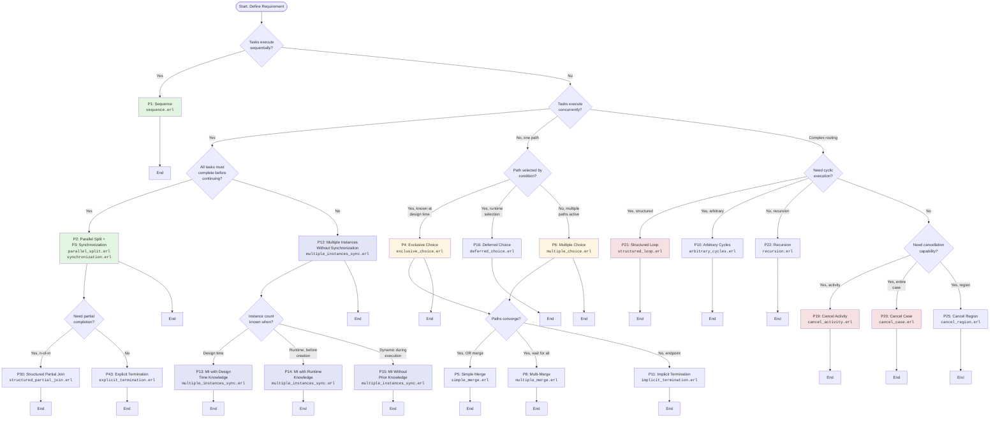
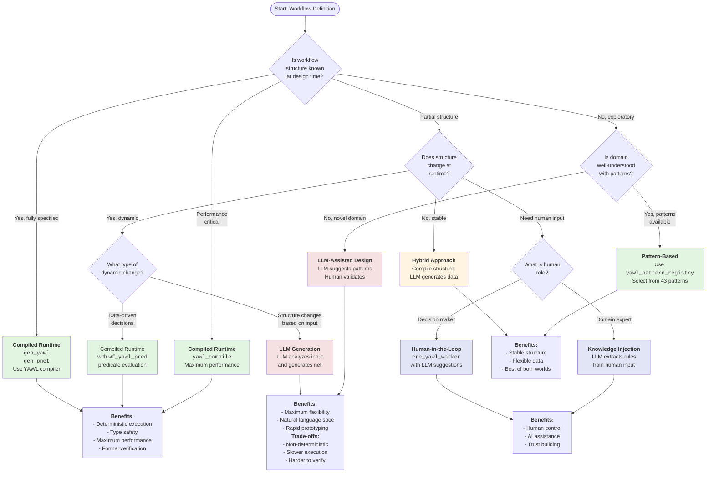
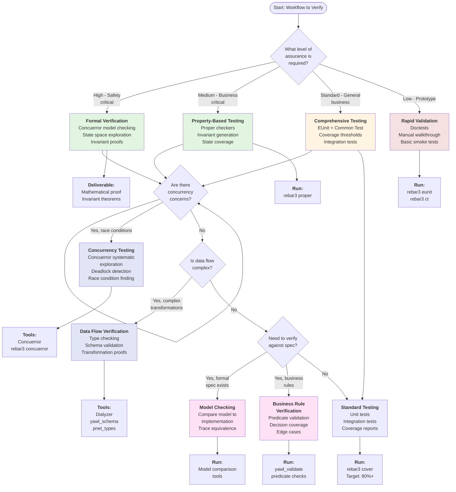

# Generative Analysis Decision Trees

**Decision support for workflow pattern selection, engine choice, type modeling, and verification strategies.**

This document provides practical decision trees to guide users through the key design decisions when implementing workflows in CRE. Each decision tree includes a Mermaid flowchart, explanation of decision points, examples for each path, and references to related documentation.

---

## Table of Contents

1. [Pattern Selection Tree](#1-pattern-selection-tree)
2. [Engine Choice Tree](#2-engine-choice-tree)
3. [Type Definition Tree](#3-type-definition-tree)
4. [Verification Strategy Tree](#4-verification-strategy-tree)

---

## 1. Pattern Selection Tree

**Question: Which workflow pattern should I use for this requirement?**

The pattern selection tree helps you identify the appropriate YAWL workflow control pattern based on your requirements.

### Mermaid Flowchart



### Decision Points Explained

| Decision Point | Question | Guidance |
|----------------|----------|----------|
| **Q1** | Tasks execute sequentially? | Use Sequence (P1) for linear processes where each task depends on the previous one. |
| **Q2** | Tasks execute concurrently? | Determines if you need parallel execution patterns or single-path routing. |
| **Q3** | All tasks must complete before continuing? | Distinguishes between AND-join (synchronization) and fire-and-forget parallelism. |
| **Q4** | Path selected by condition? | Differentiates between deterministic choice and deferred/runtime selection. |
| **Q5** | Paths converge? | Determines the merge pattern needed after branching. |
| **Q6** | Need partial completion? | Use quorum-based patterns when you don't need all branches to complete. |
| **Q7** | Instance count known when? | Critical for selecting the right Multiple Instance pattern variant. |
| **Q8** | Need cyclic execution? | Determines loop, recursion, or cycle pattern usage. |
| **Q9** | Need cancellation capability? | Cancellation scope matters: activity, case, or region. |

### Path Examples

#### Sequential Path (P1: Sequence)
**Use Case:** Document approval workflow
```erlang
% Step 1: Draft -> Step 2: Review -> Step 3: Approve -> Step 4: Publish
Draft --[submit]--> Review --[approve]--> Approve --[publish]--> Publish
```
**Reference:** `docs/YAWL_PATTERNS_REFERENCE.md` - WCP-01

#### Parallel Split + Synchronization Path (P2 + P3)
**Use Case:** Background checks for hiring
```erlang
Start --[AND-split]--> [Reference Check, Background Check, Drug Test]
[Reference Check, Background Check, Drug Test] --[AND-join]--> Make Offer
```
**Reference:** `docs/YAWL_PATTERNS_REFERENCE.md` - WCP-02, WCP-03

#### Multiple Instances Without Synchronization Path (P12)
**Use Case:** Sending notifications
```erlang
% Spawn N notification workers, no need to wait for completion
Broadcast --> [Instance 1, Instance 2, ..., Instance N] --> Continue immediately
```
**Reference:** `docs/YAWL_PATTERNS_REFERENCE.md` - WCP-12

#### Exclusive Choice Path (P4)
**Use Case:** Order processing based on customer tier
```erlang
Order --> {tier == platinum} --> ExpressLane
Order --> {tier == gold}     --> PriorityLane
Order --> {tier == silver}   --> StandardLane
Order --> {else}             --> EconomyLane
```
**Reference:** `docs/YAWL_PATTERNS_REFERENCE.md` - WCP-04

#### Multiple Choice Path (P6)
**Use Case:** Risk assessment (multiple checks may apply)
```erlang
Application --> {high_value}   --> FraudCheck
Application --> {new_customer} --> IdentityVerify
Application --> {international} --> ComplianceReview
% Multiple paths may activate simultaneously
```
**Reference:** `docs/YAWL_PATTERNS_REFERENCE.md` - WCP-06

#### Multiple Instance Paths (P13-P15)
**Use Case:** Batch processing
- **P13 (Design Time):** Fixed 4 processors for known workload
- **P14 (Runtime):** Calculate N = ceil(items/100), spawn N workers
- **P15 (Dynamic):** Stream items, spawn workers as items arrive

**Reference:** `docs/YAWL_PATTERNS_REFERENCE.md` - WCP-13, WCP-14, WCP-15

#### Loop Path (P21)
**Use Case:** Retry pattern
```erlang
Attempt --> {success} --> Complete
Attempt --> {failure && retries < max} --> Loop back to Attempt
Attempt --> {failure && retries >= max} --> Fail
```
**Reference:** `docs/YAWL_PATTERNS_REFERENCE.md` - WCP-21

#### Cancellation Paths (P19, P20, P25)
**Use Case:** Emergency shutdown
- **P19 (Activity):** Cancel specific long-running task
- **P20 (Case):** Cancel entire workflow instance
- **P25 (Region):** Cancel all activities in a subprocess

**Reference:** `docs/YAWL_PATTERNS_REFERENCE.md` - WCP-19, WCP-20, WCP-25

### Book Chapter References

| Pattern Category | Chapter Reference |
|------------------|-------------------|
| Basic Control Flow (P1-P10) | `docs/tutorials/basic_patterns_tutorial.md` |
| Advanced Synchronization (P7-P10) | `docs/CORE_YAWL_PATTERNS_GUIDE.md` |
| Multiple Instances (P11-P17) | `docs/patterns/ADVANCED_PATTERNS.md` |
| State-Based Patterns (P18-P20) | `docs/YAWL_PATTERNS_WORKBOOK.md` |
| Extended Control Flow (P21-P28) | `docs/tutorials/advanced_patterns_tutorial.md` |

---

## 2. Engine Choice Tree

**Question: When should I use LLM-based generation vs compiled runtime?**

This decision tree helps you choose between using LLMs for workflow generation and using the compiled gen_yawl/gen_pnet runtime.

### Mermaid Flowchart



### Decision Points Explained

| Decision Point | Question | Guidance |
|----------------|----------|----------|
| **Q1** | Is workflow structure known at design time? | Fully specified workflows should use compilation for performance and safety. |
| **Q2** | Does structure change at runtime? | Dynamic structures require LLM generation or pattern composition. |
| **Q3** | What type of dynamic change? | Data-driven decisions use predicates; structure changes require LLM. |
| **Q4** | Is domain well-understood with patterns? | Established domains have 43 YAWL patterns to draw from. |
| **Q5** | What is human role? | Determines human-in-the-loop integration strategy. |

### Path Examples

#### Compiled Runtime Path
**Use Case:** Financial settlement workflow
```erlang
% Fully specified at design time
-spec compile_settlement() -> {ok, module()}.
compile_settlement() ->
    yawl_compile:compile("settlement.yaml").

% Execution is deterministic and fast
yawl_executor:execute(CompiledModule, InitialData).
```
**Reference:** `docs/YAWL_COMPILE_COMPLETE_GUIDE.md`

#### Hybrid Approach Path
**Use Case:** Order processing with dynamic discounts
```erlang
% Structure is fixed, but discount rules change
Structure = compile_structure("order_process.yaml"),
DiscountRules = llm_generate_rules(customer_profile),
Result = execute_with_rules(Structure, OrderData, DiscountRules).
```
**Reference:** `docs/HUMAN_IN_THE_LOOP.md`

#### Pattern-Based Path
**Use Case:** Document approval (standard patterns)
```erlang
% Select from 43 known patterns
Pattern = yawl_pattern_registry:get(<<"P19_CancelActivity">>),
State = cancel_activity:new(ApprovalTask, CancelFun),
gen_yawl:start_link(cancel_activity, State, []).
```
**Reference:** `docs/43_PATTERNS_COMPLETE.md`

#### LLM Generation Path
**Use Case:** Ad-hoc scientific workflow
```erlang
% LLM analyzes natural language and generates workflow
UserInput = "Process data, apply transformation, notify if anomaly",
WorkflowSpec = llm_workflow_agent:generate(UserInput),
Compiled = yawl_compile:compile_spec(WorkflowSpec).
```
**Reference:** `docs/AGI_SYMPOSIUM_SIMULATION_COMPLETE.md`

#### Human-in-the-Loop Path
**Use Case:** Compliance approval
```erlang
% Worker waits for human decision
cre_yawl_worker:execute_task(
    compliance_review,
    #{llm_suggestion => LLMRecommendation},
    fun(HumanDecision) -> continue(HumanDecision) end
).
```
**Reference:** `docs/HUMAN_IN_THE_LOOP.md`

### Book Chapter References

| Engine Type | Chapter Reference |
|-------------|-------------------|
| Compiled Runtime (gen_yawl/gen_pnet) | `docs/GEN_PNET_USER_GUIDE.md` |
| YAWL Compiler | `docs/YAWL_COMPILE_COMPLETE_GUIDE.md` |
| Pattern Registry | `docs/core/yawl_pattern_registry.erl` |
| Human-in-the-Loop | `docs/HUMAN_IN_THE_LOOP.md` |
| LLM Integration | `docs/AGI_SYMPOSIUM_SIMULATION_COMPLETE.md` |
| Pattern-Based Design | `docs/patterns/PATTERN_IMPLEMENTATION_GUIDE.md` |

---

## 3. Type Definition Tree

**Question: How should I model this data concept in CRE?**

This decision tree guides you through defining types for workflow tokens, places, and data structures using the `pnet_types` module.

### Mermaid Flowchart

```mermaid
flowchart TD
    START([Start: Data Concept to Model]) --> Q1{What does<br/>this concept<br/>represent?}

    Q1 -->|A state location| PLACE[<b>place()</b><br/>Type: <code>atom()</code><br/><br/>Example:<br/><code>p_start, p_active, p_done</code>]
    Q1 -->|An action/transition| TRSN[<b>trsn()</b><br/>Type: <code>atom()</code><br/><br/>Example:<br/><code>t_activate, t_complete</code>]
    Q1 -->|Data in flow| Q2{Is data<br/>structured?}

    Q2 -->|No, simple value| TOKEN_SIMPLE[<b>token()</b><br/>Type: <code>term()</code><br/><br/>Examples:<br/><code>start, done, 42, true</code>]
    Q2 -->|Yes, has fields| Q3{Does data<br/>need<br/>validation?}

    Q3 -->|No| TOKEN_RECORD[<b>token() as record</b><br/>Type: <code>term()</code><br/><br/>Example:<br/><code>#task{id=1, data=...</code>]
    Q3 -->|Yes| TOKEN_TYPED[<b>token() with typed record</b><br/>Use <code>pnet_types</code><br/>export_type]

    Q1 -->|Collection of<br/>tokens| Q4{Are duplicates<br/>allowed?}

    Q4 -->|Yes, multiset| MARKING[<b>marking()</b><br/>Type: <code>#{place() => [token()]}</code><br/><br/>Map places to token lists]
    Q4 -->|No, unique| MODE[<b>mode()</b><br/>Type: <code>#{place() => [token()]}</code><br/><br/>Used for enablement checks]

    Q1 -->|Transition firing| MOVE[<b>move()</b><br/>Record:<br/><code>#{trsn := trsn(),<br/>mode := mode(),<br/>produce := produce_map()}</code>]

    Q1 -->|With variables| Q5{Need variable<br/>binding?}

    Q5 -->|Yes| CMODE[<b>cmode()</b><br/>Type: <code>{binding(), mode()}</code><br/><br/>Colored Petri net mode]
    Q5 -->|No| MODE2[Use <b>mode()</b>]

    Q1 -->|Execution audit| RECEIPT[<b>receipt()</b><br/>Record:<br/><code>#{before_hash, after_hash,<br/>move, ts}</code>]

    PLACE --> VALID1[<b>Validation:</b><br/><code>pnet_types:is_place/1</code>]
    TRSN --> VALID2[<b>Validation:</b><br/><code>pnet_types:is_trsn/1</code>]
    MARKING --> VALID3[<b>Validation:</b><br/><code>pnet_types:is_marking/1</code>]
    MODE --> VALID4[<b>Validation:</b><br/><code>pnet_types:is_mode/1</code>]
    MOVE --> VALID5[<b>Validation:</b><br/><code>pnet_types:is_move/1</code>]
    CMODE --> VALID6[<b>Validation:</b><br/><code>pnet_types:is_cmode/1</code>]
    RECEIPT --> VALID7[<b>Validation:</b><br/>Custom audit validation]

    TOKEN_SIMPLE --> USE1[<b>Use in marking:</b><br/><code>#{p_start => [start]}</code>]
    TOKEN_RECORD --> USE2[<b>Use in marking:</b><br/><code>#{p_work => [#task{...}]}</code>]
    TOKEN_TYPED --> USE3[<b>Define type:</b><br/><code>-export_type([task/0]).</code>]

    style PLACE fill:#e1f5e1
    style TRSN fill:#e1f5e1
    style MARKING fill:#fff4e1
    style MODE fill:#fff4e1
    style MOVE fill:#e1e5f5
    style CMODE fill:#e1e5f5
    style RECEIPT fill:#f5e1e1
```

### Decision Points Explained

| Decision Point | Question | Guidance |
|----------------|----------|----------|
| **Q1** | What does this concept represent? | Primary classification: place, transition, token, or collection. |
| **Q2** | Is data structured? | Simple values vs complex records determines token representation. |
| **Q3** | Does data need validation? | Exported types enable Dialyzer verification. |
| **Q4** | Are duplicates allowed? | Markings are multisets (duplicates OK); modes typically require uniqueness. |
| **Q5** | Need variable binding? | Colored Petri nets use cmode with variable substitution. |

### Type Definitions

#### place() - State Locations
```erlang
-type place() :: atom().

% Valid examples
p_start, p_active, p_done, p_complete, p_branch_1, p_waiting

% Validation
pnet_types:is_place(p_start).      % true
pnet_types:is_place("p_start").    % false
```

#### trsn() - Transitions
```erlang
-type trsn() :: atom().

% Valid examples
t_activate, t_execute, t_complete, t_split, t_merge, t_check

% Validation
pnet_types:is_trsn(t_activate).    % true
```

#### token() - Data in Flow
```erlang
-type token() :: term().

% Simple tokens
start, done, complete, 42, true, <<"data">

% Structured tokens (records)
-record(work_item, {id :: binary(), payload :: map()}).
#work_item{id = <<"abc">>, payload = #{}}.

% Colored tokens with variables
{var, X}, {bound, X, Value}
```

#### marking() - Token Distribution
```erlang
-type marking() :: #{place() => [token()]}.

% Examples
#{p_start => [start], p_active => [], p_done => []}.
#{p_work => [#work_item{id = <<"1">>}, #work_item{id = <<"2">>}]}.

% Validation
pnet_types:is_marking(#{p_start => [a]}).         % true
pnet_types:is_marking(#{p_start => a}).           % false (not a list)
pnet_types:is_marking(#{<<"p_start">> => [a]}).   % false (not atom)
```

#### mode() - Enablement Check
```erlang
-type mode() :: #{place() => [token()]}.

% Same structure as marking, different semantics
% Mode specifies what tokens are required for enablement
#{p_start => [start], p_data => [input]}.

% Validation
pnet_types:is_mode(#{p_start => [start]}).        % true
```

#### cmode() - Colored Mode
```erlang
-type cmode() :: {binding(), mode()}.
-type binding() :: #{var() => term()}.
-type var() :: atom().

% Colored mode with variable binding
{{#{X => 42}}, #{p_start => [{var, X}]}}.

% Substitution: X becomes 42 in the mode
```

#### move() - Transition Firing
```erlang
-type move() :: #{trsn := trsn(),
                  mode := mode() | cmode(),
                  produce := produce_map()}.
-type produce_map() :: #{place() => [token()]}.

% Complete move specification
#{trsn => t_activate,
  mode => #{p_start => [start]},
  produce => #{p_start => [], p_active => [work]}}.

% Validation
pnet_types:is_move(Move).  % true if well-formed
```

### Path Examples

#### Simple State Tracking
```erlang
% Define places for a simple workflow
Places = [p_start, p_processing, p_done, p_end].

% Initial marking
InitMarking = #{p_start => [start], p_processing => [], p_done => [], p_end => []}.

% First transition firing
Move1 = #{trsn => t_start,
           mode => #{p_start => [start]},
           produce => #{p_start => [], p_processing => [work]}},
```
**Reference:** `docs/PNET_TYPES_GUIDE.md`

#### Structured Data Token
```erlang
% Define typed record
-record(order, {id :: binary(), items :: [binary()], total :: float()}).
-type order() :: #order{}.
-export_type([order/0]).

% Use in marking
Marking = #{p_pending => [#order{id = <<"O123">>, items = [<<"A">>], total = 99.99}]}.
```
**Reference:** `docs/PNET_TYPES_TUTORIAL.md`

#### Colored Petri Net
```erlang
% Variable binding for data-dependent routing
Binding = #{CustomerType => premium, Amount => 5000},
ColoredMode = {Binding, #{p_start => [start]}},

% is_enabled/3 checks binding against conditions
is_enabled(t_premium_route, {{#{CustomerType := premium}}, _}, _) -> true;
is_enabled(t_standard_route, {{#{CustomerType := standard}}, _}, _) -> true.
```
**Reference:** `docs/tutorials/colored_tokens_tutorial.md`

#### Receipt Tracking
```erlang
% Record execution for audit trail
BeforeHash = crypto:hash(md5, term_to_binary(Marking)),
AfterHash = crypto:hash(md5, term_to_binary(NewMarking)),
Receipt = #{
    before_hash => BeforeHash,
    after_hash => AfterHash,
    move => Move,
    ts => erlang:system_time(millisecond)
}.
```
**Reference:** `docs/pnet_marking_algebra.md`

### Book Chapter References

| Type Concept | Chapter Reference |
|--------------|-------------------|
| Basic Types (place, trsn, token) | `docs/PNET_TYPES_GUIDE.md` |
| Marking Algebra | `docs/pnet_marking_algebra.md` |
| Type Validation | `docs/PNET_TYPES_API_REFERENCE.md` |
| Colored Petri Nets | `docs/tutorials/colored_tokens_tutorial.md` |
| Receipt Tracking | `docs/pnet_marking_implementation.md` |

---

## 4. Verification Strategy Tree

**Question: How do I prove correctness of my workflow?**

This decision tree helps you select the appropriate verification strategy for your workflow implementation.

### Mermaid Flowchart



### Decision Points Explained

| Decision Point | Question | Guidance |
|----------------|----------|----------|
| **Q1** | What level of assurance is required? | Safety-critical requires formal methods; prototypes need basic validation. |
| **Q2** | Are there concurrency concerns? | Concurrent workflows require Concuerror for systematic testing. |
| **Q3** | Is data flow complex? | Complex transformations need type checking and schema validation. |
| **Q4** | Need to verify against spec? | Determines if you need model comparison or business rule validation. |

### Verification Levels

#### Level 1: Rapid Validation (Prototypes)
**Goal:** Quick feedback that basic functionality works
```bash
# Run doctests
rebar3 eunit

# Basic smoke test
rebar3 ct --suite basic_smoke_SUITE
```
**Coverage:** 40-60%
**Reference:** `docs/TESTING.md` - Doctest Usage

#### Level 2: Standard Testing (General Business)
**Goal:** Comprehensive test coverage with integration tests
```bash
# Full test suite
rebar3 eunit
rebar3 ct

# Coverage report
rebar3 cover --export
```
**Coverage:** 80%+
**Reference:** `docs/TESTING.md` - Test Coverage Reporting

#### Level 3: Property-Based Testing (Business Critical)
**Goal:** Find edge cases through invariant generation
```erlang
% Property: Multiple instances should complete
prop_mi_completion() ->
    ?FORALL(Input, valid_input(),
            begin
                {ok, Result} = multiple_instances_sync:run(Input),
                is_complete(Result)
            end).

% Property: Marking evolution is monotonic
prop_marking_monotonic() ->
    ?FORALL({Marking, Move}, {marking(), move()},
            begin
                {ok, NewMarking} = pnet_marking:apply(Marking, Move),
                token_count(NewMarking) >= token_count(Marking)
            end).
```
**Run:** `rebar3 proper`
**Reference:** `docs/TESTING.md` - Property-Based Testing

#### Level 4: Concurrency Testing (Parallel Workflows)
**Goal:** Find race conditions and deadlocks
```bash
# Systematic concurrency exploration
rebar3 as concuerror compile
rebar3 concuerror
```
**Tools:** Concuerror
**Reference:** `docs/NATO_CONCUERROR_TESTS.md`

#### Level 5: Formal Verification (Safety Critical)
**Goal:** Mathematical proof of correctness
```erlang
% Invariant: No tokens lost
-spec token_conservation(marking(), move()) -> boolean().
token_conservation(Before, #{mode := Consume, produce := Produce}) ->
    Consumed = lists:sum([length(Ts) || {_, Ts} <- maps:to_list(Consume)]),
    Produced = lists:sum([length(Ts) || {_, Ts} <- maps:to_list(Produce)]),
    token_count(Before) - Consumed + Produced =:= token_count(After).

% Theorem: Well-formed nets always terminate
-spec termination_guaranteed(net_def()) -> boolean().
```
**Deliverable:** Mathematical proof, invariant theorems
**Reference:** `docs/VERIFICATION_REPORT.md`

### Verification Strategies by Pattern

| Pattern | Verification Strategy | Key Invariants |
|---------|----------------------|----------------|
| **Sequence (P1)** | Standard Testing | Tokens move forward, no skips |
| **Parallel Split (P2)** | Concurrency Testing | All branches receive tokens |
| **Synchronization (P3)** | Property-Based | No deadlock, all branches join |
| **Exclusive Choice (P4)** | Standard Testing | Exactly one path taken |
| **Multiple Choice (P6)** | Property-Based | At least one path, maybe multiple |
| **Multiple Instances (P12-P15)** | Concurrency + Properties | All instances complete (or subset for P12) |
| **Structured Loop (P21)** | Property-Based | Loop terminates, progress invariant |
| **Cancellation (P19-P20)** | Concurrency Testing | Clean shutdown, no orphan tokens |

### Example Verification Workflows

#### Example 1: Sequence Pattern Verification
```erlang
%% Standard test approach
sequence_test_() ->
    [?_test(begin
        % Setup
        State = sequence:new(fun(X) -> X * 2 end),
        {ok, Pid} = gen_yawl:start_link(sequence, State, []),

        % Execute
        {ok, Result} = sequence:execute(Pid, 5),

        % Verify
        ?assertEqual(10, Result),
        ?assertEqual(#{p_done => [done]}, gen_yawl:marking(Pid))
    end)].

%% Property-based approach
prop_sequence_preserves_data() ->
    ?FORALL(Input, integer(),
            begin
                State = sequence:new(fun identity/1),
                {ok, Result} = sequence:run(State, Input),
                Input =:= Result
            end).
```

#### Example 2: Parallel Split Verification
```erlang
%% Concurrency test
parallel_split_concurrence_test_() ->
    {setup, fun() -> application:ensure_all_started(cre) end,
     fun(_) -> application:stop(cre) end,
     fun(_) ->
        [?_test(begin
            Branches = [
                fun() -> timer:sleep(100), a end,
                fun() -> timer:sleep(200), b end,
                fun() -> timer:sleep(50), c end
            ],
            State = parallel_split:new(Branches),
            {ok, Results} = parallel_split:run(State),

            % All branches completed
            ?assertEqual(3, length(Results)),

            % All unique results present
            ?assert(lists:member(a, Results)),
            ?assert(lists:member(b, Results)),
            ?assert(lists:member(c, Results))
        end)]
     end}.
```

#### Example 3: Cancellation Verification
```erlang
%% Verify cancellation region
cancel_region_cleanup_test_() ->
    [?_test(begin
        % Create cancellable workflow
        State = cancel_region:new([
            fun long_task/1,
            fun another_task/1
        ], cancel_condition),

        {ok, Pid} = gen_yawl:start_link(cancel_region, State, []),

        % Trigger cancellation
        cancel_region:cancel(Pid),

        % Verify cleanup
        {ok, FinalState} = gen_yawl:call(Pid, get_state),
        ?assertEqual(cancelled, FinalState#pattern_state.status),

        % No orphan processes
        ?assertEqual([], supervisor:which_children(supervisor_of(Pid)))
    end)].
```

### Book Chapter References

| Verification Type | Chapter Reference |
|-------------------|-------------------|
| EUnit Testing | `docs/TESTING.md` - EUnit Usage |
| Common Test Integration | `docs/TESTING.md` - Common Test Setup |
| Property-Based Testing | `docs/TESTING.md` - Property-Based Tests |
| Concuerror Concurrency | `docs/NATO_CONCUERROR_TESTS.md` |
| Type Checking | `docs/PNET_TYPES_GUIDE.md` - Type Validation |
| Schema Validation | `docs/SCHEMA_VALIDATION_INTEGRATION.md` |
| Coverage Reporting | `docs/TESTING.md` - Test Coverage |
| Verification Report | `docs/VERIFICATION_REPORT.md` |
| Test Organization | `docs/TEST_ORGANIZATION.md` |

---

## Appendix: Quick Reference

### Pattern Module Locations

| Category | Directory | Example Modules |
|----------|-----------|-----------------|
| Basic Control Flow | `src/patterns/` | `sequence.erl`, `parallel_split.erl` |
| Advanced Synchronization | `src/patterns/` | `discriminator.erl`, `n_out_of_m.erl` |
| Multiple Instances | `src/patterns/` | `multiple_instances_sync.erl` |
| State-Based | `src/patterns/` | `milestone.erl`, `cancel_activity.erl` |
| Extended Control Flow | `src/patterns/` | `structured_loop.erl`, `recursion.erl` |
| Data Flow | `src/patterns/` | `data_transform.erl`, `data_distribute.erl` |
| Resource | `src/patterns/` | `resource_allocation.erl`, `role_based_allocation.erl` |
| Exception Handling | `src/patterns/` | `cancel_region.erl`, `critical_section.erl` |

### Type Validation Functions

```erlang
% Core type validators (pnet_types)
pnet_types:is_marking/1      % Validate marking structure
pnet_types:is_mode/1         % Validate mode structure
pnet_types:is_place/1        % Validate place atom
pnet_types:is_trsn/1         % Validate transition atom
pnet_types:is_binding/1      % Validate variable binding
pnet_types:is_cmode/1        % Validate colored mode
pnet_types:is_move/1         % Validate move structure
pnet_types:is_produce_map/1  % Validate produce map
pnet_types:is_consume_map/1  % Validate consume map
```

### Test Commands Reference

```bash
# Unit tests
rebar3 eunit                              # All EUnit tests
rebar3 eunit -m MODULE                    # Specific module
rebar3 eunit -f FUNCTION                  # Specific function

# Integration tests
rebar3 ct                                 # All Common Test suites
rebar3 ct --suite SUITE                   # Specific suite
rebar3 ct --case CASE                    # Specific test case

# Coverage
rebar3 cover                              # Generate coverage
rebar3 cover --module=MODULE             # Module coverage
rebar3 cover --export                    # Export HTML report

# Property-based testing
rebar3 proper                             # Run all properties
rebar3 proper -m MODULE                   # Specific module

# Concurrency testing
rebar3 as concuerror compile              # Compile for Concuerror
rebar3 concuerror                         # Run concurrency tests
```

### Documentation Index

| Topic | Document |
|-------|----------|
| Pattern Selection | `docs/YAWL_PATTERNS_REFERENCE.md` |
| Pattern Implementation | `docs/patterns/PATTERN_IMPLEMENTATION_GUIDE.md` |
| Type System | `docs/PNET_TYPES_GUIDE.md` |
| Engine Choice | `docs/GEN_PNET_USER_GUIDE.md` |
| Testing | `docs/TESTING.md` |
| Verification | `docs/VERIFICATION_REPORT.md` |
| Complete API | `docs/COMPLETE_API_REFERENCE.md` |

---

**Document Version:** 1.0.0
**Last Updated:** 2026-02-07
**For CRE Version:** 0.3.0
