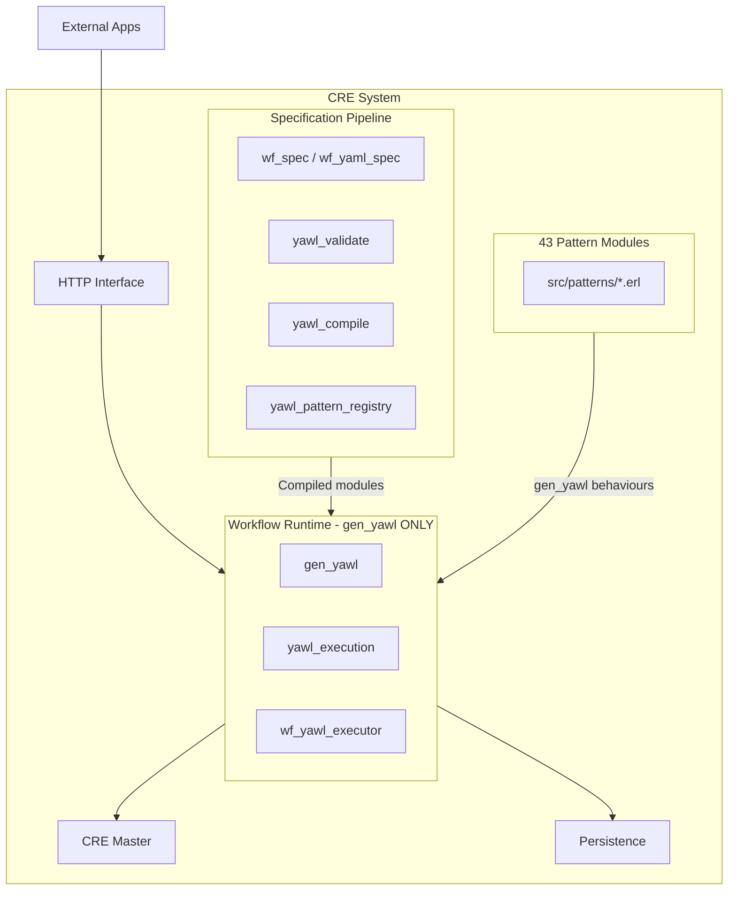

# CRE C4 Level 1 - Container Diagram (Mermaid)

```mermaid
flowchart TB
    subgraph creSystem [CRE System]
        subgraph specPipeline [Specification Pipeline]
            wf_spec[wf_spec / wf_yaml_spec]
            yawl_validate[yawl_validate]
            yawl_compile[yawl_compile]
            pattern_reg[yawl_pattern_registry]
        end

        subgraph workflowRuntime [Workflow Runtime - gen_yawl ONLY]
            gen_yawl[gen_yawl]
            yawl_exec[yawl_execution]
            wf_exec[wf_yawl_executor]
        end

        subgraph patternModules [43 Pattern Modules]
            patterns[src/patterns/*.erl]
        end

        creMaster[CRE Master]
        httpInterface[HTTP Interface]
        persistence[Persistence]
    end

    extApps[External Apps] --> httpInterface
    httpInterface --> workflowRuntime
    specPipeline -->|Compiled modules| workflowRuntime
    patternModules -->|gen_yawl behaviours| workflowRuntime
    workflowRuntime --> creMaster
    workflowRuntime --> persistence
```

**Rule:** All workflow execution uses gen_yawl. Never gen_pnet directly.
