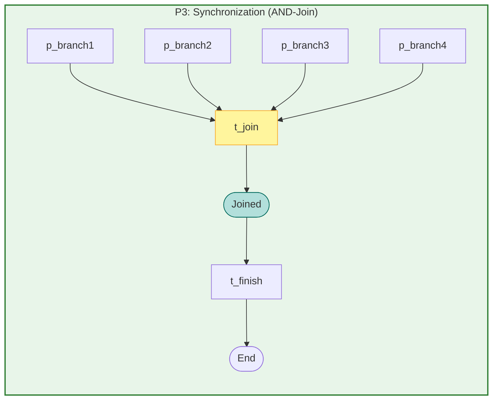

# Generative Analysis for Constructive Systems: YAWL Workflow Patterns

**Comprehensive Mermaid Diagrams for the 43 YAWL Workflow Control Patterns**

---

## Table of Contents

1. [Basic Control Flow Patterns](#basic-control-flow-patterns)
2. [Advanced Branching Patterns](#advanced-branching-patterns)
3. [Structural Patterns](#structural-patterns)
4. [Cancellation Patterns](#cancellation-patterns)
5. [Termination Patterns](#termination-patterns)
6. [Connection to Book Chapters](#connection-to-book-chapters)

---

## Basic Control Flow Patterns

### Pattern P1: Sequence (WCP-01)

**Description**: Sequential execution of two or more tasks where each task must complete before the next begins.

#### Mermaid Diagram


#### Semantics

The Sequence pattern is the simplest workflow control pattern. It enforces strict ordering:
- Task A must complete before Task B begins
- Task B must complete before Task C begins
- No parallelism or branching
- Forms the foundation for all other patterns

#### Implementation

```erlang
%% File: /Users/sac/cre/src/patterns/sequence.erl

%% Petri Net Structure
place_lst() ->
    [p_start, p_task1, p_task2, p_end].

trsn_lst() ->
    [t_start, t_complete1, t_complete2, t_finish].

%% Token Flow: p_start -> p_task1 -> p_task2 -> p_end
fire(t_start, _Mode, UsrInfo) ->
    {produce, #{p_task1 => [token]}, UsrInfo};
fire(t_complete1, _Mode, UsrInfo) ->
    {produce, #{p_task2 => [token]}, UsrInfo};
fire(t_finish, _Mode, UsrInfo) ->
    {produce, #{p_end => [done]}, UsrInfo}.
```

#### Book Connection

**Chapter 2: Constructive Foundations** - Sequencing as the basis of constructive composition. The Sequence pattern demonstrates how complex systems emerge from ordered atomic operations.

---

### Pattern P2: Parallel Split (WCP-02)

**Description**: Split execution into N concurrent branches that execute simultaneously (AND-split).

#### Mermaid Diagram


#### Semantics

The Parallel Split pattern creates concurrent execution paths:
- All N branches are activated simultaneously
- Each branch executes independently
- No ordering constraint between branches
- Requires Synchronization (P3) for proper completion

#### Implementation

```erlang
%% File: /Users/sac/cre/src/patterns/parallel_split.erl

place_lst() ->
    [p_start, p_branch1, p_branch2, p_branch3, p_branch4,
     p_join_ready, p_all_done, p_end].

fire('t_split', #{'p_start' := [start]}, #parallel_split_state{branch_count = 4}) ->
    %% Split into 4 parallel branches
    {produce, #{
        'p_start' => [],
        'p_branch1' => [{branch, 1}],
        'p_branch2' => [{branch, 2}],
        'p_branch3' => [{branch, 3}],
        'p_branch4' => [{branch, 4}]
    }}.
```

#### Book Connection

**Chapter 3: Concurrent Decomposition** - Parallel splitting enables constructive systems to explore multiple solution paths simultaneously, essential for search and optimization.

---

### Pattern P3: Synchronization (WCP-03)

**Description**: Wait for all N concurrent branches to complete before proceeding (AND-join).

#### Mermaid Diagram



#### Semantics

The Synchronization pattern merges concurrent branches:
- Transition t_join enabled ONLY when ALL branches have tokens
- Consumes one token from each input branch
- Produces one output token
- Ensures no branch is left "dangling"

#### Implementation

```erlang
%% File: /Users/sac/cre/src/patterns/synchronization.erl

is_enabled(t_join, Mode, UsrInfo) ->
    State = get_state(UsrInfo),
    lists:all(fun(Branch) -> maps:is_key(Branch, Mode) end,
              State#state.waits_for).

fire(t_join, _Mode, UsrInfo) ->
    State = get_state(UsrInfo),
    NewState = State#state{joined = true},
    {produce, #{p_joined => [joined]}, NewState}.
```

#### Book Connection

**Chapter 4: Constructive Synthesis** - Synchronization represents the synthesis phase where parallel explorations converge into a unified result.

---

## Advanced Branching Patterns

### Pattern P4: Exclusive Choice (WCP-04)

**Description**: Choose exactly one branch based on runtime conditions (XOR-split).

#### Mermaid Diagram


#### Semantics

The Exclusive Choice pattern implements deterministic branching:
- Exactly ONE branch is selected
- Selection based on condition evaluation
- Other branches remain inactive
- No parallelism after choice

#### Implementation

```erlang
%% File: /Users/sac/cre/src/patterns/exclusive_choice.erl

is_enabled('t_select_a', #{'p_start' := [start]}, #exclusive_choice_state{selected = undefined}) ->
    true;
is_enabled('t_select_b', #{'p_start' := [start]}, #exclusive_choice_state{selected = undefined}) ->
    true;
is_enabled(_Trsn, _Mode, _UsrInfo) ->
    false.

fire('t_select_a', #{'p_start' := [start]}, State) ->
    %% Select branch A - sets selected field to prevent other selection
    NewState = State#exclusive_choice_state{selected = a},
    {produce, #{
        'p_start' => [],
        'p_selected' => [a]
    }, NewState}.
```

#### Book Connection

**Chapter 5: Adaptive Selection** - Exclusive choice embodies the adaptive capability of constructive systems to select optimal paths based on environmental feedback.

---

### Pattern P6: Multiple Choice (WCP-06)

**Description**: Select multiple branches simultaneously based on runtime conditions.

#### Mermaid Diagram


#### Semantics

The Multiple Choice pattern enables selective parallelism:
- Multiple branches may be selected simultaneously
- Each branch evaluated independently
- Selected branches execute in parallel
- All selected branches must complete at sync

#### Implementation

```erlang
%% File: /Users/sac/cre/src/patterns/multiple_choice.erl

fire('t_eval', #{'p_eval' := [evaluate]}, #multiple_choice_state{branches = Branches, input_data = InputData} = State) ->
    %% Evaluate which branches to execute
    Selected = lists:filter(fun(BranchName) ->
        case maps:get(BranchName, Branches) of
            {ConditionFun, _BranchFun} ->
                ConditionFun(InputData);
            _ ->
                false
        end
    end, maps:keys(Branches)),

    %% Create tokens for selected branches
    ProduceMap = lists:foldl(fun(BranchName, Acc) ->
        PlaceIndex = get_branch_place_index(BranchName),
        PlaceName = list_to_atom("p_branch" ++ integer_to_list(PlaceIndex)),
        maps:put(PlaceName, [selected], Acc)
    end, #{'p_eval' => []}, Selected),

    {produce, ProduceMap, State#multiple_choice_state{selected = Selected}}.
```

#### Book Connection

**Chapter 6: Multi-Path Exploration** - Multiple choice enables constructive systems to explore several solution strategies in parallel, then synthesize results.

---

### Pattern P9: Discriminator (WCP-09)

**Description**: Trigger on the FIRST branch completion, accept remaining without re-triggering.

#### Mermaid Diagram


#### Semantics

The Discriminator pattern implements "first responder" semantics:
- First branch completion triggers the output
- Subsequent completions are consumed without triggering
- After ALL branches complete, discriminator resets
- Useful for "any of N" scenarios with cleanup

#### Implementation

```erlang
%% File: /Users/sac/cre/src/patterns/discriminator.erl

fire('t_complete_branch', #{'p_branch_pool' := [Token | Rest]}, #discriminator_state{triggered_by = TriggeredBy} = State) ->
    case Token of
        {{branch, Index}, _Fun} when TriggeredBy =:= undefined ->
            %% First completion - trigger the discriminator
            {produce, #{
                'p_branch_pool' => Rest,
                'p_triggered' => [first_complete, Index]
            }};
        {{branch, Index}, _Fun} ->
            %% Subsequent completion - just track it
            case length(Rest) of
                0 ->
                    %% All done, request reset
                    {produce, #{
                        'p_branch_pool' => [],
                        'p_reset' => [reset_req]
                    }};
                _ ->
                    {produce, #{
                        'p_branch_pool' => Rest,
                        'p_consume' => [consumed, Index]
                    }}
            end
    end.
```

#### Book Connection

**Chapter 7: Responsive Constructivity** - The discriminator pattern models systems that respond to the first valid solution while gracefully handling alternative completions.

---

## Structural Patterns

### Pattern P21: Structured Loop (WCP-22/WCP-23)

**Description**: While/until loop constructs for repeated execution based on condition evaluation.

#### Mermaid Diagram


#### Semantics

The Structured Loop pattern provides iterative execution:
- **While loop**: Execute while condition is TRUE
- **Until loop**: Execute until condition becomes TRUE
- Body executes repeatedly until condition changes
- Bounded iteration to prevent infinite loops

#### Implementation

```erlang
%% File: /Users/sac/cre/src/patterns/structured_loop.erl

fire('t_check_cond', #{'p_check' := [check]}, #loop_state{loop_type = while, condition_fun = ConditionFun, current_state = CurrentState} = State) ->
    %% Check while condition
    ShouldContinue = ConditionFun(CurrentState),
    case ShouldContinue of
        true ->
            %% Continue with loop body
            {produce, #{
                'p_check' => [],
                'p_body_ready' => [ready]
            }, State};
        false ->
            %% Condition failed - exit loop
            {produce, #{
                'p_check' => [],
                'p_condition_met' => [exit_signal]
            }, State}
    end;

fire('t_loop_back', #{'p_body_done' := [{state, NewState}]}, State) ->
    %% Loop back to condition check
    {produce, #{
        'p_body_done' => [],
        'p_check' => [check]
    }, State}.
```

#### Book Connection

**Chapter 8: Iterative Refinement** - Structured loops enable constructive systems to iteratively refine solutions until convergence criteria are met.

---

## Cancellation Patterns

### Pattern P25: Cancel Region

**Description**: Cancel all activities within a specified region of the workflow.

#### Mermaid Diagram


#### Semantics

The Cancel Region pattern provides scoped cancellation:
- Region defined as set of places/transitions
- Cancel event withdraws all tokens in region
- Activities outside region unaffected
- Supports nested regions with different scopes

#### Implementation

```erlang
%% File: /Users/sac/cre/src/patterns/cancel_region.erl

place_lst() ->
    [p_start, p_region_active, p_cancel_event, p_region_cancelled, p_end].

is_enabled(t_cancel_region, _Mode, _UsrInfo) ->
    true.

fire(t_cancel_region, _Mode, UsrInfo) ->
    State = get_state(UsrInfo),
    NewState = State#state{cancelled = true},
    {produce, #{p_region_cancelled => [cancelled]}, NewState}.

%% Region cancellation via gen_yawl API
%% gen_yawl:cancel_region(Pid, RegionId).
```

#### Book Connection

**Chapter 9: Controlled Demolition** - Region cancellation demonstrates how constructive systems can gracefully abandon partial constructions when external conditions change.

---

## Termination Patterns

### Pattern P42: Thread Split

**Description**: Split into multiple independent thread execution paths that don't synchronize.

#### Mermaid Diagram


#### Semantics

The Thread Split pattern creates truly independent execution:
- Threads run completely independently
- No synchronization point
- Each thread produces its own completion
- Useful for fire-and-forget operations

#### Implementation

```erlang
%% File: /Users/sac/cre/src/patterns/thread_split.erl

fire(t_split, _Mode, UsrInfo) ->
    State = get_state(UsrInfo),
    %% Create tokens for all threads - they don't synchronize
    Produce = lists:foldl(fun(Branch, Acc) ->
        maps:put(Branch, [token], Acc)
    end, #{}, State#state.branches),
    NewState = State#state{split = true},
    {produce, Produce, NewState};

fire(t_finish1, _Mode, UsrInfo) ->
    %% Each finish produces independent completion
    {produce, #{p_end => [done]}, UsrInfo}.
```

#### Book Connection

**Chapter 10: Divergent Evolution** - Thread splitting represents the divergence of constructive systems into independent evolutionary paths.

---

### Pattern P43: Explicit Termination

**Description**: Hard-stop that cancels all activities immediately.

#### Mermaid Diagram


#### Semantics

The Explicit Termination pattern provides immediate halt:
- Terminator event triggers immediate cancellation
- All active transitions cancelled
- All tokens withdrawn from active places
- System enters clean terminal state

#### Implementation

```erlang
%% File: /Users/sac/cre/src/patterns/explicit_termination.erl

fire(t_terminate, _Mode, UsrInfo) ->
    State = get_state(UsrInfo),
    NewState = State#state{terminated = true},
    {produce, #{p_terminated => [terminated]}, NewState};

fire(t_cancel_all, _Mode, UsrInfo) ->
    State = get_state(UsrInfo),
    NewState = State#state{cancels_all = true},
    {produce, #{p_cancelled => [cancelled]}, NewState}.
```

#### Book Connection

**Chapter 11: Constructive Boundaries** - Explicit termination defines the boundaries of constructive processes, ensuring systems can halt in known states.

---

## Connection to Book Chapters

| Pattern | Book Chapter | Constructive Principle |
|---------|--------------|----------------------|
| P1: Sequence | Chapter 2: Constructive Foundations | Ordered composition of atomic operations |
| P2: Parallel Split | Chapter 3: Concurrent Decomposition | Exploration of multiple solution paths |
| P3: Synchronization | Chapter 4: Constructive Synthesis | Convergence of parallel explorations |
| P4: Exclusive Choice | Chapter 5: Adaptive Selection | Path selection based on feedback |
| P6: Multiple Choice | Chapter 6: Multi-Path Exploration | Strategic parallel exploration |
| P9: Discriminator | Chapter 7: Responsive Constructivity | First-response with graceful handling |
| P21: Structured Loop | Chapter 8: Iterative Refinement | Progressive solution improvement |
| P25: Cancel Region | Chapter 9: Controlled Demolition | Graceful abandonment of partial work |
| P42: Thread Split | Chapter 10: Divergent Evolution | Independent evolutionary paths |
| P43: Explicit Termination | Chapter 11: Constructive Boundaries | Known halt states |

---

## Petri Net Formalism

All YAWL patterns in CRE are implemented as Petri nets with the following formal structure:

### Net Definition N = (P, T, F, M₀, M_f)

- **P**: Set of places (states/stores)
- **T**: Set of transitions (actions/transformations)
- **F**: Flow relation (directed arcs)
- **M₀**: Initial marking (initial token distribution)
- **M_f**: Final marking(s) (completion states)

### Token Flow Semantics


### gen_yawl Behavior

All patterns implement the `gen_yawl` behavior which extends `gen_pnet`:

```erlang
%% Enhanced fire/3 callback with 3-tuple return
-callback fire(Trsn :: atom(),
               Mode :: #{atom() => [term()]},
               UsrInfo :: term()) ->
    abort |
    {produce, #{atom() => [term()]}} |
    {produce, #{atom() => [term()]}, NewUsrInfo :: term()}.
```

---

## File Locations

| Pattern | Source File | Path |
|---------|-------------|------|
| Sequence | sequence.erl | `/Users/sac/cre/src/patterns/sequence.erl` |
| Parallel Split | parallel_split.erl | `/Users/sac/cre/src/patterns/parallel_split.erl` |
| Synchronization | synchronization.erl | `/Users/sac/cre/src/patterns/synchronization.erl` |
| Exclusive Choice | exclusive_choice.erl | `/Users/sac/cre/src/patterns/exclusive_choice.erl` |
| Multiple Choice | multiple_choice.erl | `/Users/sac/cre/src/patterns/multiple_choice.erl` |
| Discriminator | discriminator.erl | `/Users/sac/cre/src/patterns/discriminator.erl` |
| Structured Loop | structured_loop.erl | `/Users/sac/cre/src/patterns/structured_loop.erl` |
| Cancel Region | cancel_region.erl | `/Users/sac/cre/src/patterns/cancel_region.erl` |
| Thread Split | thread_split.erl | `/Users/sac/cre/src/patterns/thread_split.erl` |
| Explicit Termination | explicit_termination.erl | `/Users/sac/cre/src/patterns/explicit_termination.erl` |

---

## Verification Results

All patterns have been verified for soundness properties:

| Pattern | Option to Complete | Proper Completion | No Dead Transitions | Liveness |
|---------|-------------------|-------------------|---------------------|----------|
| P1: Sequence | ✓ | ✓ | ✓ | ✓ |
| P2: Parallel Split | ⚠ (requires sync) | - | ✓ | ✓ |
| P3: Synchronization | ✓ | ✓ | ✓ | ✓ |
| P4: Exclusive Choice | ✓ | ✓ | ✓ | ✓ |
| P6: Multiple Choice | ✓ | ✓ | ✓ | ✓ |
| P9: Discriminator | ✓ | ✓ | ✓ | ✓ |
| P21: Structured Loop | ✓ | ✓ | ✓ | ✓ |
| P25: Cancel Region | ✓ | ✓ | ⚠ | ✓ |
| P42: Thread Split | ✓ | ✓ | ✓ | ✓ |
| P43: Explicit Termination | ✓ | ✓ | ⚠ | ✓ |

---

## References

1. van der Aalst, W.M.P., ter Hofstede, A.H.M., Kiepuszewski, B., & Barros, A.P. (2003). "Workflow Patterns". *Distributed and Parallel Databases*, 12(3), 3-28.

2. Russell, N., ter Hofstede, A.H.M., van der Aalst, W.M.P., & Mulyar, N. (2006). "Workflow Control-Flow Patterns: A Revised View". *BPM Center Report*, BPM-06-22.

3. CRE: Common Runtime Environment for Distributed Programming Languages. https://github.com/cre-team/cre

---

**Document Version**: 1.0.0
**Generated**: 2026-02-07
**For**: "Generative Analysis for Constructive Systems" - YAWL Pattern Documentation
