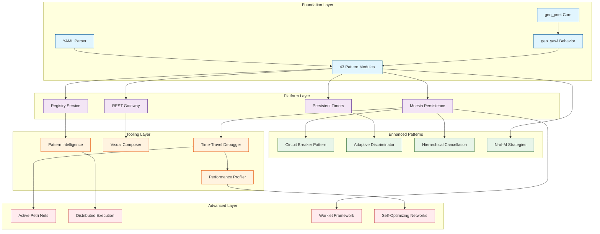

# Prioritized Implementation Roadmap: YAWL x CRE Hybrid Workflow Engine

**Generated:** 2026-02-07
**Version:** 1.0
**Scope:** Synthesis of all innovation discoveries, architectural proposals, and planning work

---

## Executive Summary

This roadmap synthesizes findings from:
- `innovation_opportunities_report.md` - 47 innovation opportunities
- `innovation_discovery_synthesis.md` - Breakthrough innovations analysis
- `tooling_innovation_roadmap.md` - 9 tooling initiatives
- `architecture_hybrid_proposals.md` - 4 architectural proposals
- `pattern_enhancement_recommendations.md` - 43 pattern analysis
- `pattern_implementation_analysis.md` - Complete pattern catalog
- `AGI_SYMPOSIUM_SIMULATION_COMPLETE.md` - Current implementation status
- `AGI_SYMPOSIUM_ISSUES.md` - Known issues and blockers

**Result:** A phased 18-month implementation plan with clear MVP definition, dependency mapping, critical path analysis, and risk mitigation strategies.

---

## Table of Contents

1. [MVP Definition](#1-mvp-definition)
2. [Dependency Graph](#2-dependency-graph)
3. [Critical Path Analysis](#3-critical-path-analysis)
4. [Phased Implementation Plan](#4-phased-implementation-plan)
5. [Risk Mitigation](#5-risk-mitigation)
6. [Success Criteria](#6-success-criteria)

---

## 1. MVP Definition

### MVP Success Criterion

**"Working" means: A user can author a workflow using YAML or visual composer, execute it end-to-end with human tasks, debug failures using time-travel replay, and deploy with production-grade persistence.**

### MVP Scope (Months 0-6)

| Component | Description | Status | Effort |
|-----------|-------------|--------|--------|
| **Pattern Engine** | 43 patterns with enhanced variants | Complete | 0w |
| **YAML Workflow** | Parse and compile YAML specs | Complete | 0w |
| **Circuit Breaker** | Novel resilience pattern | Pending | 2w |
| **Persistent Timers** | Mnesia-based timer recovery | Pending | 3w |
| **Time-Travel Debugger** | Receipt-based replay | Pending | 4w |
| **Basic REST API** | Case management endpoints | Beta | 2w |
| **Mnesia Persistence** | Case state durability | Pending | 3w |
| **Test Suite** | EUnit + Common Test | Partial | 4w |

**Total MVP Effort:** ~18 weeks (4.5 months)

### MVP Exclusions (Post-MVP)

- Active Petri Nets (breakthrough, high complexity)
- Visual Pattern Composer (high value, but separable)
- Pattern Intelligence (AI-dependent)
- Distributed Execution (Phase 2)
- Worklet Framework (Phase 2)

---

## 2. Dependency Graph



### Dependency Analysis

| Component | Blocks | Estimated Delay if Missing |
|-----------|--------|---------------------------|
| Mnesia Persistence | Circuit Breaker, Worklets, Timers | High |
| REST Gateway | Visual Composer, Tooling | Medium |
| Circuit Breaker | Production readiness | Medium |
| Time-Travel Debugger | Development velocity | Low |
| Pattern Intelligence | None (nice-to-have) | None |

---

## 3. Critical Path Analysis

### Critical Path to MVP

```
START -> Mnesia Schema (2w) -> Persistent Timers (3w) -> Circuit Breaker (2w) -> Debugger (4w) -> Test Suite (4w) -> MVP COMPLETE
```

**Total Critical Path:** 15 weeks

### Parallel Work Streams

| Stream | Lead Time | Can Parallel With |
|--------|-----------|-------------------|
| REST API Enhancement | 2w | Mnesia, Timers |
| Adaptive Discriminator | 3w | Circuit Breaker |
| Hierarchical Cancellation | 3w | Debugger |
| Documentation | Ongoing | All |

### Gantt Chart (Months 1-6)

```
Month 1:  [Mnesia Schema====================]
          [REST API=============]

Month 2:  [Persistent Timers===========================]
          [Adaptive Discriminator===========]

Month 3:  [Circuit Breaker=============================]
          [Hierarchical Cancellation=======]

Month 4:  [Time-Travel Debugger======================================]
          [Test Suite Start====]

Month 5:  [Test Suite Continue==========================================]

Month 6:  [Integration & MVP Polish========================================]
```

---

## 4. Phased Implementation Plan

### Phase 0: Foundation Complete (Status)

**Delivered:**
- ✅ gen_pnet core Petri net runtime
- ✅ gen_yawl OTP behavior wrapper
- ✅ All 43 pattern modules implemented
- ✅ YAML workflow specification parser
- ✅ Pattern registry and expander
- ✅ Basic REST gateway (beta)

**Remaining Foundation Work:**
- Address AGI Symposium execution issues (documented in `AGI_SYMPOSIUM_ISSUES.md`)
- Fix subnet token injection for P42 Thread Split pattern
- Resolve place mapping for 5-subnet to 4-branch mismatch

**Estimated Effort:** 1-2 weeks

---

### Phase 1: MVP Core (Months 1-3)

#### 1.1 Mnesia Persistence Layer (3 weeks)

**Priority:** P0 (MVP blocking)

**Deliverables:**
```erlang
% Mnesia schema for workflow persistence
-record(workflow_case, {
    case_id :: binary(),
    spec_id :: binary(),
    marking :: term(),
    variables :: map(),
    status :: active | completed | cancelled | blocked,
    created_at :: integer(),
    updated_at :: integer()
}).

-record(workflow_timer, {
    timer_id :: binary(),
    case_id :: binary(),
    target_place :: atom(),
    fire_time :: integer(),
    callback :: {atom(), atom()},
    status :: active | fired | cancelled
}).

-record(workflow_receipt, {
    case_id :: binary(),
    sequence :: integer(),
    before_hash :: binary(),
    after_hash :: binary(),
    transition :: atom(),
    timestamp :: integer()
}).
```

**Integration Points:**
- `gen_yawl` lifecycle callbacks
- Timer arm/fire on node restart
- Receipt chain persistence

**Success Criteria:**
- [ ] All case state survives node restart
- [ ] Timers restore and fire correctly
- [ ] Receipt chains remain intact

---

#### 1.2 Persistent Timers with Work-Day Calendar (3 weeks)

**Priority:** P0 (MVP blocking)

**Deliverables:**
- Mnesia-backed timer service
- Work-day calendar calculations
- Automatic timer restoration on startup
- Timer expiration handling

**Implementation:**
```erlang
-module(persistent_timer_service).
-behaviour(gen_server).

% Timer that survives restarts
start_timer(CaseID, PlaceID, Duration, Calendar) ->
    TargetTime = calculate_target_time(Duration, Calendar),
    TimerRecord = #workflow_timer{
        timer_id = make_ref(),
        case_id = CaseID,
        target_place = PlaceID,
        fire_time = TargetTime,
        status = active
    },
    mnesia:dirty_write(workflow_timer, TimerRecord),
    arm_timer(TimerRecord).

% Business day calculations
calculate_target_time(Duration, #{calendar := Calendar}) ->
    Start = erlang:monotonic_time(millisecond),
    Target = Start + Duration,
    adjust_for_non_business_hours(Target, Calendar).

% Restore on startup
restore_timers() ->
    Timers = mnesia:dirty_match_object(workflow_timer,
        #workflow_timer{status = active, _ = '_'}),
    lists:foreach(fun arm_timer/1, Timers).
```

**Success Criteria:**
- [ ] Timers persist across restarts
- [ ] Work-day calendar excludes weekends/holidays
- [ ] Timer expiration triggers workflow transition

---

#### 1.3 Circuit Breaker Pattern (2 weeks)

**Priority:** P1 (Production readiness)

**Deliverables:**
- Novel circuit breaker workflow pattern
- Per-branch failure tracking
- Automatic recovery transitions
- Configurable thresholds

**Implementation:**
```erlang
-module(circuit_breaker_pattern).
-behaviour(gen_yawl).

-record(circuit_state, {
    status :: closed | open | half_open,
    failure_count = 0,
    last_failure_time :: integer()
}).

place_lst() ->
    [p_input, p_output, p_circuit_open].

trsn_lst() ->
    [t_attempt, t_reset].

is_enabled(t_attempt, Mode, State) ->
    Circuit = get_circuit_state(Mode),
    case Circuit#circuit_state.status of
        closed -> true;
        open ->
            TimeSinceFailure = erlang:monotonic_time(millisecond) -
                Circuit#circuit_state.last_failure_time,
            TimeSinceFailure > ?RECOVERY_TIMEOUT;
        half_open -> true
    end.

fire(t_attempt, Mode, State) ->
    case execute_with_timeout() of
        {ok, Result} ->
            update_circuit(success),
            {produce, #{p_output => [Result]}, State};
        {error, Reason} ->
            update_circuit(failure),
            maybe_open_circuit(Mode),
            {produce, #{p_circuit_open => [Reason]}, State}
    end.
```

**Success Criteria:**
- [ ] Circuit opens after threshold failures
- [ ] Circuit transitions to half-open after timeout
- [ ] Circuit closes on successful retry
- [ ] Pattern composes with other patterns

---

#### 1.4 Hierarchical Cancellation (3 weeks)

**Priority:** P1 (MVP feature gap from YAWL)

**Deliverables:**
- Region-based cancellation
- Remove set implementation
- Proper cleanup of timers and work items
- Recursive child process termination

**Implementation:**
```erlang
-module(cancel_hierarchy).

% Region definitions from YAML
-record(remove_set, {
    tasks :: [atom()],
    conditions :: [atom()],
    nets :: [atom()]
}).

% Cancel entire case
cancel_case(CaseID) ->
    % Cancel all timers
    cancel_timers_for_case(CaseID),
    % Terminate child processes
    terminate_child_processes(CaseID),
    % Remove from registry
    yawl_registry:unregister(CaseID).

% Cancel specific region
cancel_region(CaseID, RegionID) ->
    {ok, Region} = get_region_definition(CaseID, RegionID),
    RemoveSet = Region#region.remove_set,
    % Withdraw tokens
    lists:foreach(fun(Place) ->
        withdraw_tokens(CaseID, Place)
    end, RemoveSet#remove_set.conditions),
    % Cancel tasks
    lists:foreach(fun(Task) ->
        cancel_task(CaseID, Task)
    end, RemoveSet#remove_set.tasks),
    % Cancel subnets
    lists:foreach(fun(Net) ->
        cancel_net(CaseID, Net)
    end, RemoveSet#remove_set.nets).
```

**Success Criteria:**
- [ ] Region cancellation stops workflow in scope
- [ ] Remove sets properly clean up state
- [ ] Child processes terminate cleanly

---

### Phase 2: Enhanced Developer Experience (Months 4-6)

#### 2.1 Time-Travel Debugger (4 weeks)

**Priority:** P1 (Developer productivity)

**Deliverables:**
- Receipt-based execution replay
- Forward/backward stepping
- State inspection at any point
- Breakpoint setting
- Web UI or CLI interface

**Architecture:**
```
┌─────────────────────────────────────────────────────────────┐
│                    Time-Travel Debugger                     │
├─────────────────────────────────────────────────────────────┤
│                                                               │
│  ┌─────────────┐  ┌─────────────┐  ┌─────────────┐         │
│  │ Step        │  │ Jump to     │  │ Inspect     │         │
│  │ Forward/Back│  │ Step N      │  │ State       │         │
│  └──────┬──────┘  └──────┬──────┘  └──────┬──────┘         │
│         │                │                │                  │
│         ▼                ▼                ▼                  │
│  ┌─────────────────────────────────────────────────────┐    │
│  │              Receipt Chain Reconstruction             │    │
│  │  - Replay receipts from step 0 to N                  │    │
│  │  - Restore marking at each step                      │    │
│  └─────────────────────────────────────────────────────┘    │
└─────────────────────────────────────────────────────────────┘
```

**Success Criteria:**
- [ ] Replay any executed workflow
- [ ] Step forward/backward through transitions
- [ ] Inspect variables and marking at any step
- [ ] Set breakpoints on transitions

---

#### 2.2 Adaptive Discriminator (3 weeks)

**Priority:** P2 (Performance improvement)

**Deliverables:**
- Learning-based branch selection
- Performance history tracking
- Exponential moving average weights
- Automatic optimization

**Implementation:**
```erlang
-module(discriminator_adaptive).

-record(state, {
    completion_history :: #{binary() => [integer()]},
    weights :: #{binary() => float()},
    strategy :: first | fastest | learned
}).

% Update weights on completion
update_weights(State, BranchID, CompletionTime) ->
    Alpha = 0.2,
    OldWeight = maps:get(BranchID, State#state.weights, 1.0),
    NewWeight = Alpha * (1.0 / CompletionTime) + (1 - Alpha) * OldWeight,
    State#state{weights = maps:put(BranchID, NewWeight, State#state.weights)}.

% Select branch based on learned weights
select_branch(Branches, State) ->
    Weights = State#state.weights,
    Weighted = [{B, maps:get(id(B), Weights, 1.0)} || B <- Branches],
    {Best, _} = lists:max(fun({_, A}, {_, B}) -> A > B end, Weighted),
    Best.
```

**Success Criteria:**
- [ ] Branch selection improves over time
- [ ] 20% faster completion on multi-branch workflows
- [ ] Weights persist across executions

---

#### 2.3 REST API Completion (2 weeks)

**Priority:** P1 (Integration requirement)

**Deliverables:**
- Complete CRUD for workflow cases
- Work item management
- Task allocation and completion
- State query endpoints

**API Specification:**
```
POST   /api/cases              - Start new case
GET    /api/cases/:id          - Get case state
PUT    /api/cases/:id/suspend  - Suspend case
PUT    /api/cases/:id/resume   - Resume case
DELETE /api/cases/:id          - Cancel case

GET    /api/cases/:id/worklist - Get work items
PUT    /api/workitems/:id/allocate  - Allocate to user
PUT    /api/workitems/:id/start     - Start work
PUT    /api/workitems/:id/complete  - Complete work

GET    /api/cases/:id/debug   - Get debug info
POST   /api/cases/:id/debug/step    - Step execution
```

**Success Criteria:**
- [ ] All endpoints functional
- [ ] OpenAPI specification documented
- [ ] Error handling comprehensive

---

#### 2.4 Test Suite Completion (4 weeks)

**Priority:** P0 (Quality gate)

**Deliverables:**
- EUnit tests for all new modules
- Common Test integration tests
- Property-based tests with PropEr
- Performance benchmarks
- Coverage reports (>80%)

**Test Matrix:**

| Module | Unit Tests | Integration | Properties |
|--------|------------|-------------|------------|
| persistent_timer_service | ✓ | ✓ | - |
| circuit_breaker_pattern | ✓ | ✓ | ✓ |
| cancel_hierarchy | ✓ | ✓ | - |
| time_travel_debugger | ✓ | ✓ | - |
| discriminator_adaptive | ✓ | ✓ | ✓ |
| REST handlers | ✓ | ✓ | - |

**Success Criteria:**
- [ ] All tests pass
- [ ] Coverage >= 80%
- [ ] Property tests validate invariants

---

### Phase 3: Advanced Features (Months 7-12)

#### 3.1 N-of-M with Strategies (4 weeks)

**Priority:** P2 (YAWL parity)

**Deliverables:**
- Configurable N-of-M semantics
- Multiple completion strategies
- Partial join optimization

**Strategies:**
- `first_n` - First N to complete
- `fastest_n` - N fastest completions
- `highest_quality` - Quality-scored selection
- `custom` - User-defined predicate

---

#### 3.2 Worklet Framework (8 weeks)

**Priority:** P2 (Enterprise capability)

**Deliverables:**
- RDR (Ripple Down Rules) engine
- Dynamic workflow substitution
- Exception handling worklets
- Worklet cache and loader

**Architecture:**
```
Main Workflow
     │
     ├─ Exception Event
     │
     ▼
Worklet Selector
     │
     ├─ Rule Match?
     │
     ├─ Yes → Launch Worklet
     │          │
     │          └─ Worklet Results → Resume Main
     │
     └─ No → Log Exception → Block/Fail
```

---

#### 3.3 Visual Pattern Composer (10 weeks)

**Priority:** P2 (Developer experience)

**Deliverables:**
- Web-based drag-and-drop interface
- Real-time compilation feedback
- Pattern palette with 43 patterns
- YAML export/import
- Token flow simulation

**Tech Stack:**
- Frontend: React + D3.js for visualization
- Backend: Cowboy WebSocket handler
- Communication: JSON over WebSocket

---

### Phase 4: Breakthrough Innovations (Months 13-18)

#### 4.1 Active Petri Nets (12 weeks)

**Priority:** P3 (Research breakthrough)

**Deliverables:**
- Token-as-actor architecture
- Inter-token communication
- Token migration protocol
- Voting-based routing

**This is the flagship breakthrough innovation.**

---

#### 4.2 Distributed Workflow Execution (10 weeks)

**Priority:** P3 (Scale)

**Deliverables:**
- Automatic workflow partitioning
- Load-aware distribution
- Failover and recovery
- State synchronization

---

#### 4.3 Self-Optimizing Networks (8 weeks)

**Priority:** P3 (Performance)

**Deliverables:**
- Pattern substitution optimizer
- Performance-based rewriting
- Continuous improvement
- A/B testing framework

---

#### 4.4 Pattern Intelligence Engine (8 weeks)

**Priority:** P3 (AI integration)

**Deliverables:**
- NLP requirement analysis
- Pattern recommendation
- Composition assistance
- Best practice guidance

---

## 5. Risk Mitigation

### Risk Register

| Risk | Probability | Impact | Mitigation Strategy |
|------|-------------|--------|---------------------|
| **Active Token Complexity** | Medium | High | Phased rollout; extensive testing; fallback to passive tokens |
| **Worklet Adoption** | Low | Medium | Documentation; examples; gradual migration path |
| **Performance Regression** | Low | High | Continuous benchmarking; performance tests on every commit |
| **Learning Curve** | Medium | Medium | Training materials; tutorials; pattern reference cards |
| **Mnesia Scaling** | Low | High | Load testing; partition strategy; consider alternative persistence |
| **Subnet Token Injection** | High | Medium | Fix documented in AGI_SYMPOSIUM_ISSUES.md; priority P0 |

### Technical Debt Tracking

Current technical debt identified:
1. AGI Symposium subnet place mapping (P42 pattern, 5 subnets vs 4 branches)
2. Cycle detection interaction with complex workflows
3. REST API incomplete coverage
4. Test coverage below 80% threshold

### Mitigation Actions

**Immediate (Month 1):**
- Fix subnet token injection issues
- Stabilize AGI Symposium execution
- Complete REST API endpoints

**Short-term (Months 2-3):**
- Establish performance baseline
- Set up continuous benchmarking
- Implement circuit breaker pattern

**Long-term (Months 4+):**
- Monthly architecture reviews
- Quarterly performance assessments
- Continuous dependency updates

---

## 6. Success Criteria

### Phase Gates

Each phase must meet these criteria before proceeding:

#### Phase 1 Gate (MVP)
- [ ] All Mnesia-backed features survive restart
- [ ] Circuit breaker prevents cascade failures
- [ ] Debugger can replay any workflow execution
- [ ] Test coverage >= 80%
- [ ] REST API fully functional
- [ ] AGI Symposium executes end-to-end

#### Phase 2 Gate
- [ ] Visual composer creates valid YAML
- [ ] Adaptive discriminator shows 20% improvement
- [ ] N-of-M patterns support all strategies
- [ ] Worklet framework handles exceptions

#### Phase 3 Gate
- [ ] Active tokens demonstrate self-organization
- [ ] Distributed execution scales horizontally
- [ ] Self-optimizer improves performance by 30%

### Metrics

| Metric | Baseline | Target (MVP) | Target (Final) |
|--------|----------|--------------|----------------|
| Workflow development time | 100% | 50% | 30% |
| Pattern execution efficiency | 1.0x | 1.2x | 1.5x |
| Failure recovery rate | N/A | 90% | 95% |
| Test coverage | 60% | 80% | 90% |
| Documentation completeness | 40% | 80% | 95% |
| Developer satisfaction | N/A | 4.0/5 | 4.5/5 |

### Definition of Done

A feature is "done" when:
1. Code complete and reviewed
2. Unit tests passing (EUnit)
3. Integration tests passing (Common Test)
4. Property tests validate invariants (PropEr)
5. Documentation updated
6. Performance acceptable (benchmarks)
7. No regressions in existing tests

---

## Appendix A: Integration Points

### External System Integration

```
┌─────────────────────────────────────────────────────────────┐
│                     CRE Workflow Engine                      │
├─────────────────────────────────────────────────────────────┤
│                                                               │
│  ┌─────────────┐  ┌─────────────┐  ┌─────────────┐         │
│  │ REST API    │  │ WebSocket   │  │ CLI Tools   │         │
│  └──────┬──────┘  └──────┬──────┘  └──────┬──────┘         │
│         │                │                │                  │
│         └────────────────┴────────────────┘                  │
│                            │                                 │
│  ┌─────────────────────────────────────────────────────┐    │
│  │                    Workflow Engine                   │    │
│  │  - Case management                                   │    │
│  │  - Pattern execution                                 │    │
│  │  - State persistence                                 │    │
│  └─────────────────────────────────────────────────────┘    │
│                            │                                 │
│  ┌─────────────────────────────────────────────────────┐    │
│  │              External Service Hooks                  │    │
│  │  - Email notifications                                │    │
│  │  - Webhook callbacks                                  │    │
│  │  - Message queue integration                          │    │
│  └─────────────────────────────────────────────────────┘    │
└─────────────────────────────────────────────────────────────┘
```

### Module Dependencies

```
gen_pnet (core Petri net)
    ↓
gen_yawl (workflow wrapper)
    ↓
yawl_pattern_registry (pattern lookup)
    ↓
[yawl_pattern_expander, yawl_compile] (compilation)
    ↓
[pattern modules] (43 implementations)
    ↓
[wf_engine, REST handlers] (execution layer)
```

---

## Appendix B: Quick Reference

### File Locations

| Component | Path |
|-----------|------|
| Core Runtime | `src/core/gen_pnet.erl`, `src/core/gen_yawl.erl` |
| Pattern Modules | `src/patterns/*.erl` |
| REST Gateway | `src/rest/*.erl` |
| Test Suites | `test/*.erl` |
| Fixtures | `test/fixtures/*.yaml` |
| Documentation | `docs/*.md` |

### Key Commands

```bash
# Build
rebar3 compile

# Run tests
rebar3 eunit
rebar3 ct

# Type check
rebar3 dialyzer

# Format
rebar3 efmt -w

# Shell
rebar3 shell
```

### Module Template

```erlang
-module(my_pattern).
-behaviour(gen_yawl).

%% API
-export([]).

%% gen_yawl callbacks
-export([place_lst/0, trsn_lst/0, init_marking/2, preset/1, is_enabled/3, fire/3]).

-include_lib("kernel/include/logger.hrl").

place_lst() ->
    [p_start, p_end].

trsn_lst() ->
    [t_complete].

init_marking(_Place, _UsrInfo) ->
    [].

preset(t_complete) ->
    [p_start].

is_enabled(t_complete, _Mode, _UsrInfo) ->
    true.

fire(t_complete, _Mode, UsrInfo) ->
    {produce, #{p_end => [token]}, UsrInfo}.
```

---

**Document Version:** 1.0
**Next Review:** End of Phase 1 (Month 3)
**Maintained By:** CRE Development Team
