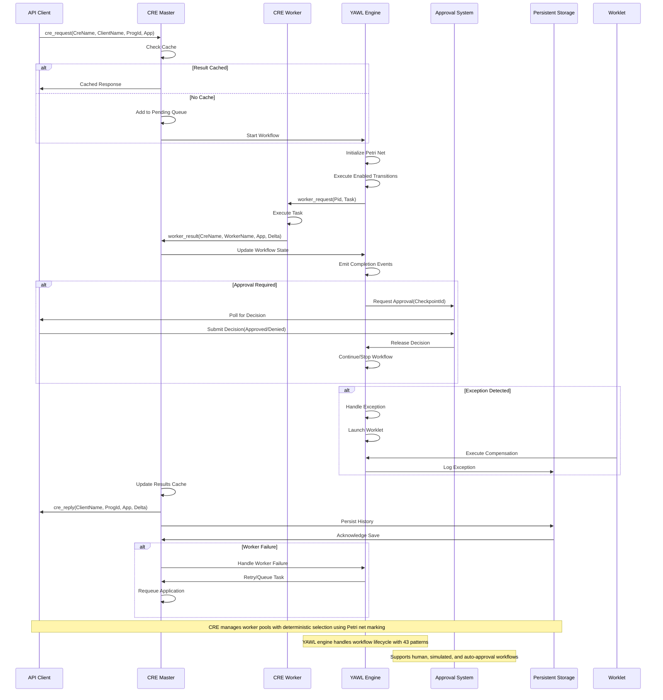

```mermaid
sequenceDiagram
    participant Client as API Client
    participant Master as CRE Master
    participant Worker as CRE Worker
    participant Engine as YAWL Engine
    participant Approval as Approval System
    participant Storage as Persistent Storage

    %% Initial Request Flow
    Client->>Master: cre_request(CreName, ClientName, ProgId, App)
    Master->>Master: Check Cache
    alt Result Cached
        Master->>Client: Cached Response
    else No Cache
        Master->>Master: Add to Pending Queue
        Master->>Engine: Start Workflow
    end

    %% Workflow Execution
    Engine->>Engine: Initialize Petri Net
    Engine->>Engine: Execute Enabled Transitions
    Engine->>Worker: worker_request(Pid, Task)
    Worker->>Worker: Execute Task
    Worker->>Master: worker_result(CreName, WorkerName, App, Delta)
    Master->>Engine: Update Workflow State
    Engine->>Engine: Emit Completion Events

    %% Human Approval Flow
    alt Approval Required
        Engine->>Approval: Request Approval(CheckpointId)
        Approval->>Client: Poll for Decision
        Client->>Approval: Submit Decision(Approved/Denied)
        Approval->>Engine: Release Decision
        Engine->>Engine: Continue/Stop Workflow
    end

    %% Exception Handling
    alt Exception Detected
        Engine->>Engine: Handle Exception
        Engine->>Engine: Launch Worklet
        Worklet->>Engine: Execute Compensation
        Engine->>Storage: Log Exception
    end

    %% Response Flow
    Master->>Master: Update Results Cache
    Master->>Client: cre_reply(ClientName, ProgId, App, Delta)
    Master->>Storage: Persist History
    Storage->>Master: Acknowledge Save

    %% Error Handling
    alt Worker Failure
        Master->>Engine: Handle Worker Failure
        Engine->>Master: Retry/Queue Task
        Master->>Master: Requeue Application
    end

    Note over Client,Storage: CRE manages worker pools with deterministic selection using Petri net marking
    Note over Engine: YAWL engine handles workflow lifecycle with 43 patterns
    Note over Approval: Supports human, simulated, and auto-approval workflows
```