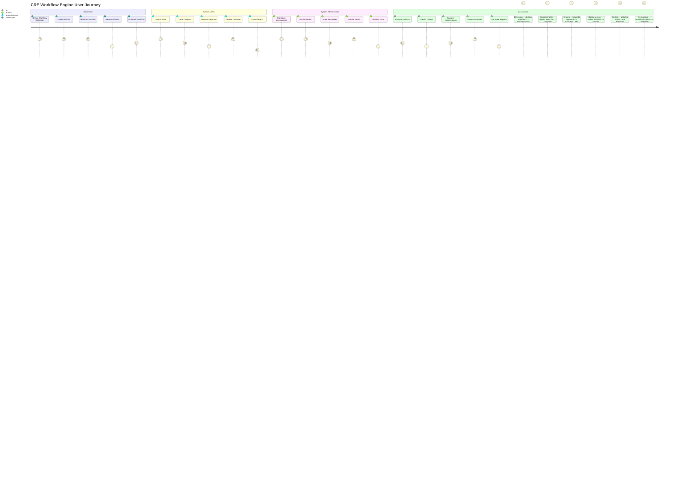

```mermaid
journey
    title CRE Workflow Engine User Journey
    section Developer
        Create Workflow Definition: 5: Developer
        Deploy to CRE: 5: Developer
        Monitor Execution: 5: Developer
        Review Results: 3: Developer
        Optimize Workflow: 4: Developer

    section Business User
        Submit Task: 5: Business User
        Track Progress: 4: Business User
        Request Approval: 3: Business User
        Review Outcome: 5: Business User
        Export Report: 2: Business User

    section System Administrator
        Configure Environment: 5: Admin
        Monitor Health: 5: Admin
        Scale Resources: 4: Admin
        Handle Alerts: 5: Admin
        Backup Data: 3: Admin

    section AI Assistant
        Analyze Patterns: 4: AI
        Predict Delays: 3: AI
        Suggest Optimizations: 4: AI
        Detect Anomalies: 5: AI
        Generate Reports: 3: AI

    %% Key Interaction Points
    Developer -- deploys workflow --> Business User: Workflow Ready
    Business User -- triggers execution --> System: Task Started
    System -- requests approval --> Business User: Human in Loop
    Business User -- makes decision --> System: Approved/Rejected
    System -- updates status --> AI Assistant: Data Available
    AI Assistant -- provides insights --> Developer: Optimization Needed
```