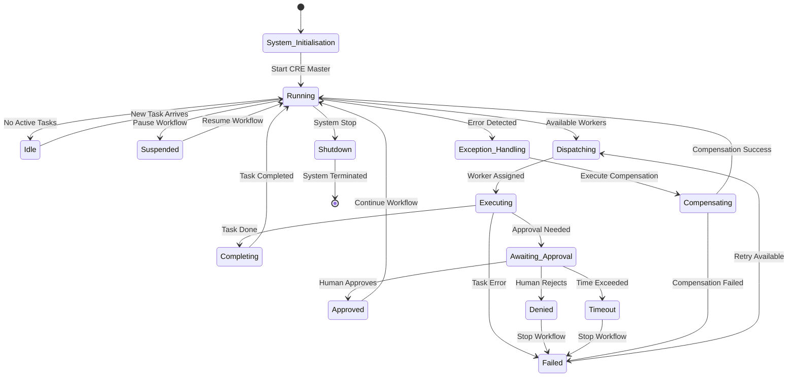

```mermaid
stateDiagram-v2
    [*] --> System_Initialisation

    %% Main Workflow States
    System_Initialisation --> Running: Start CRE Master
    Running --> Idle: No Active Tasks
    Idle --> Running: New Task Arrives
    Running --> Suspended: Pause Workflow

    %% Task Execution States
    Running --> Dispatching: Available Workers
    Dispatching --> Executing: Worker Assigned
    Executing --> Completing: Task Done
    Completing --> Running: Task Completed
    Executing --> Failed: Task Error
    Failed --> Dispatching: Retry Available

    %% Human Approval States
    Executing --> Awaiting_Approval: Approval Needed
    Awaiting_Approval --> Approved: Human Approves
    Awaiting_Approval --> Denied: Human Rejects
    Awaiting_Approval --> Timeout: Time Exceeded
    Approved --> Running: Continue Workflow
    Denied --> Failed: Stop Workflow
    Timeout --> Failed: Stop Workflow

    %% System States
    Suspended --> Running: Resume Workflow
    Running --> Shutdown: System Stop
    Shutdown --> [*]: System Terminated

    %% Exception Handling States
    Running --> Exception_Handling: Error Detected
    Exception_Handling --> Compensating: Execute Compensation
    Compensating --> Running: Compensation Success
    Compensating --> Failed: Compensation Failed

    %% Note: Each state represents different aspects of CRE workflow execution
```
```