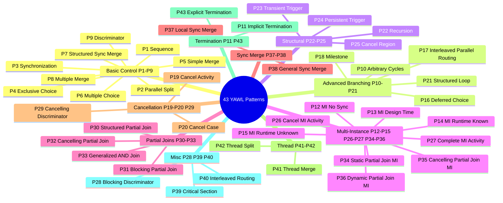
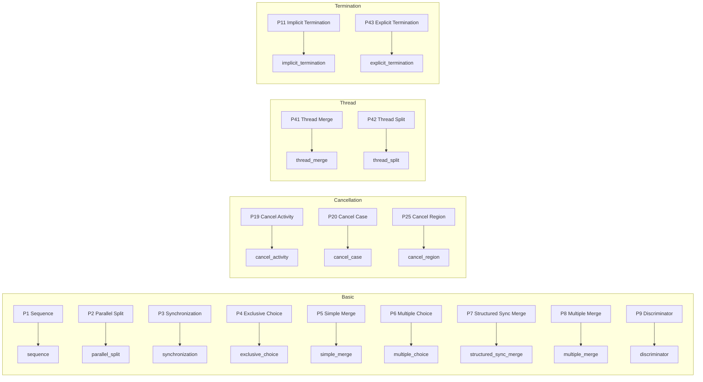
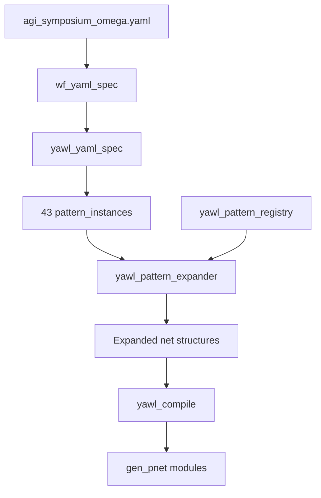

# YAWL Patterns Overview — All 43 Patterns

## Pattern Categories

```mermaid
mindmap
  root((43 YAWL Patterns))
    Basic Control P1-P9
      P1 Sequence
      P2 Parallel Split
      P3 Synchronization
      P4 Exclusive Choice
      P5 Simple Merge
      P6 Multiple Choice
      P7 Structured Sync Merge
      P8 Multiple Merge
      P9 Discriminator
    Advanced Branching P10-P21
      P10 Arbitrary Cycles
      P16 Deferred Choice
      P17 Interleaved Parallel Routing
      P18 Milestone
      P21 Structured Loop
    Structural P22-P25
      P22 Recursion
      P23 Transient Trigger
      P24 Persistent Trigger
      P25 Cancel Region
    Multi-Instance P12-P15 P26-P27 P34-P36
      P12 MI No Sync
      P13 MI Design Time
      P14 MI Runtime Known
      P15 MI Runtime Unknown
      P26 Cancel MI Activity
      P27 Complete MI Activity
      P34 Static Partial Join MI
      P35 Cancelling Partial Join MI
      P36 Dynamic Partial Join MI
    Partial Joins P30-P33
      P30 Structured Partial Join
      P31 Blocking Partial Join
      P32 Cancelling Partial Join
      P33 Generalized AND Join
    Sync Merge P37-P38
      P37 Local Sync Merge
      P38 General Sync Merge
    Cancellation P19-P20 P29
      P19 Cancel Activity
      P20 Cancel Case
      P29 Cancelling Discriminator
    Thread P41-P42
      P41 Thread Merge
      P42 Thread Split
    Termination P11 P43
      P11 Implicit Termination
      P43 Explicit Termination
    Misc P28 P39 P40
      P28 Blocking Discriminator
      P39 Critical Section
      P40 Interleaved Routing
```

## Pattern → Module Mapping

```mermaid
flowchart LR
    subgraph Basic
        P1[P1 Sequence] --> sequence
        P2[P2 Parallel Split] --> parallel_split
        P3[P3 Synchronization] --> synchronization
        P4[P4 Exclusive Choice] --> exclusive_choice
        P5[P5 Simple Merge] --> simple_merge
        P6[P6 Multiple Choice] --> multiple_choice
        P7[P7 Structured Sync Merge] --> structured_sync_merge
        P8[P8 Multiple Merge] --> multiple_merge
        P9[P9 Discriminator] --> discriminator
    end

    subgraph Cancellation
        P19[P19 Cancel Activity] --> cancel_activity
        P20[P20 Cancel Case] --> cancel_case
        P25[P25 Cancel Region] --> cancel_region
    end

    subgraph Thread
        P41[P41 Thread Merge] --> thread_merge
        P42[P42 Thread Split] --> thread_split
    end

    subgraph Termination
        P11[P11 Implicit Termination] --> implicit_termination
        P43[P43 Explicit Termination] --> explicit_termination
    end
```

## Compilation Pipeline

```mermaid
flowchart TD
    YAML[agi_symposium_omega.yaml] --> Parser[wf_yaml_spec]
    Parser --> Spec[yawl_yaml_spec]
    Spec --> Instances[43 pattern_instances]
    Instances --> Expander[yawl_pattern_expander]
    Expander --> Nets[Expanded net structures]
    Nets --> Compiler[yawl_compile]
    Compiler --> Modules[gen_pnet modules]
    Registry[yawl_pattern_registry] --> Expander
```
