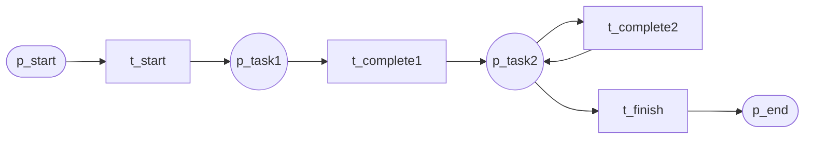
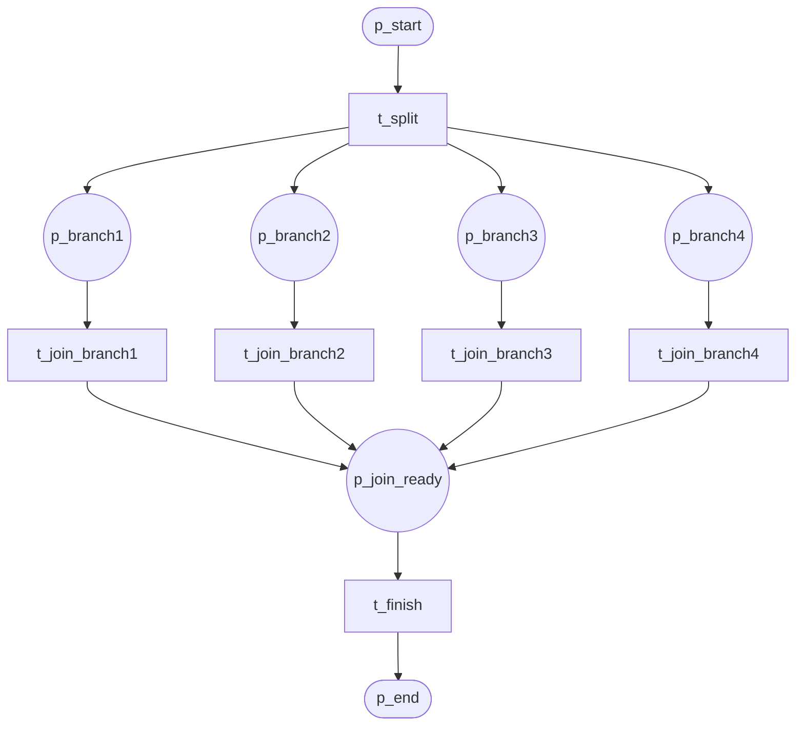
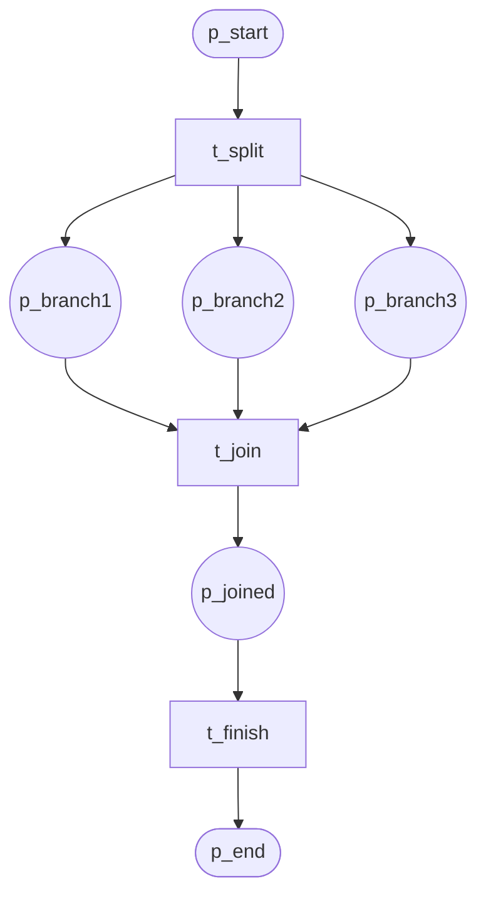
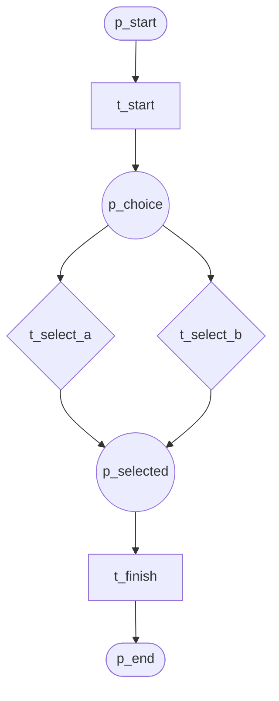
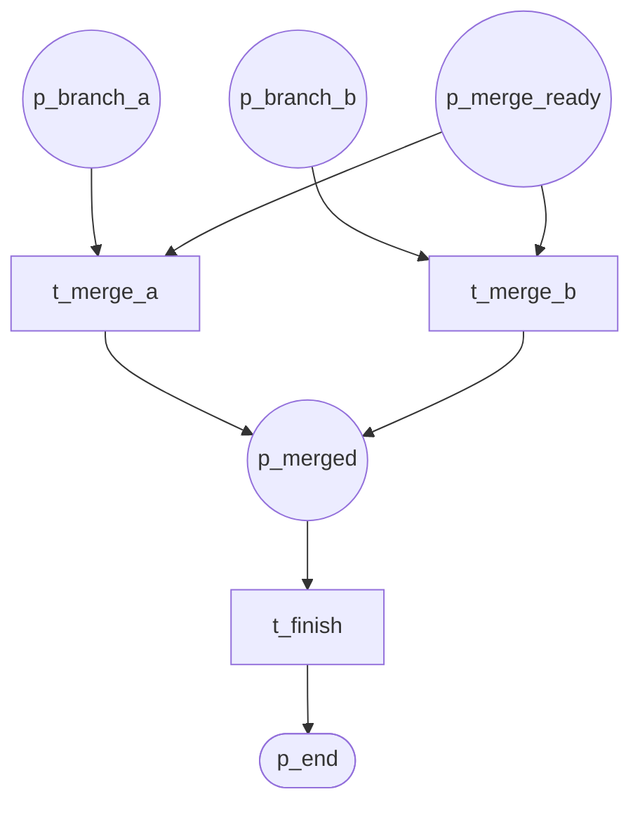
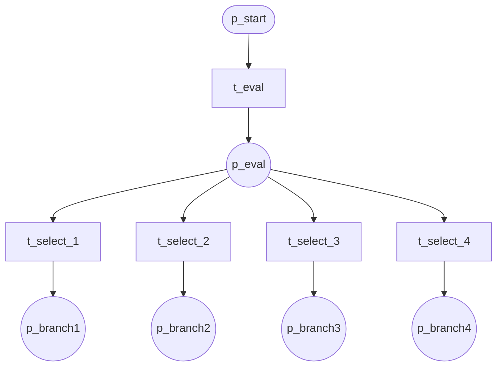
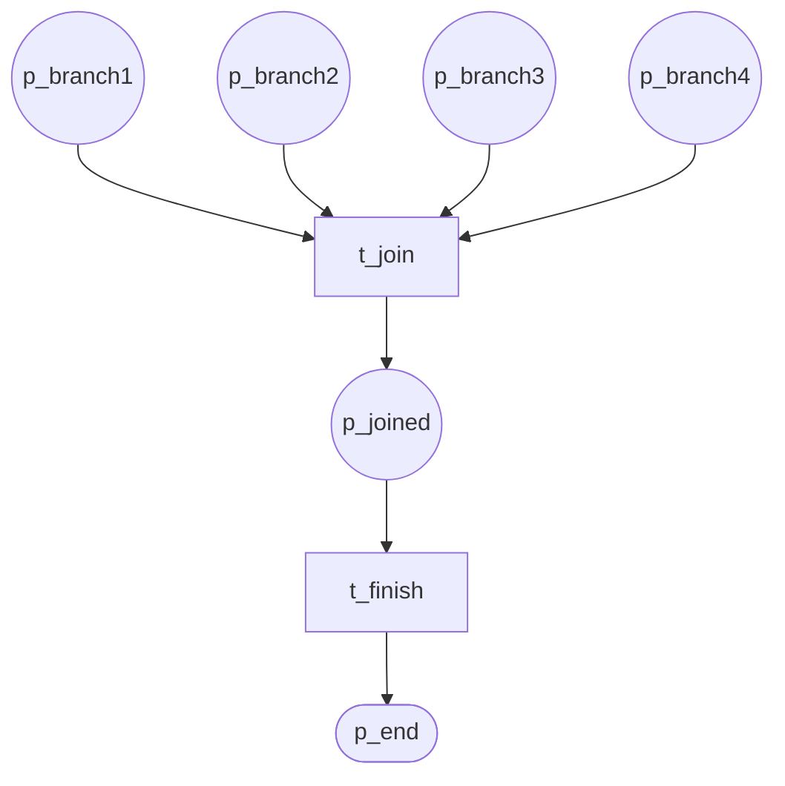
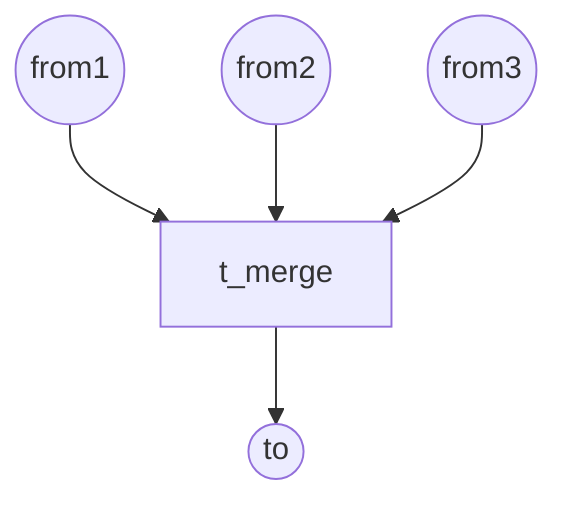
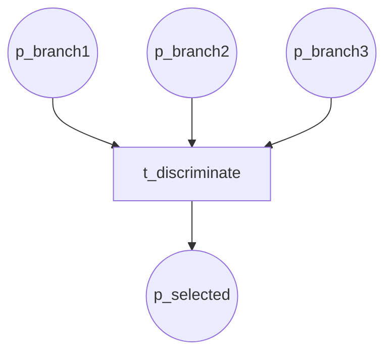

# Basic Control Patterns (P1–P9)

## P1 Sequence

Sequential execution of tasks.

**Module:** `sequence`

---

## P2 Parallel Split

AND-split into N concurrent branches.

**Module:** `parallel_split`

---

## P3 Synchronization

AND-join waiting for all branches.

**Module:** `synchronization`

---

## P4 Exclusive Choice

XOR-split: exactly one branch selected.

**Module:** `exclusive_choice`

---

## P5 Simple Merge

Simple merge of two branches.

**Module:** `simple_merge`

---

## P6 Multiple Choice

OR-split: one or more branches selected.

**Module:** `multiple_choice`

---

## P7 Structured Sync Merge

Structured merge with synchronization.

**Module:** `structured_sync_merge`

---

## P8 Multiple Merge

Multiple merge (fan-in from multiple sources).

**Module:** `multiple_merge`

---

## P9 Discriminator

First branch wins; others discarded.

**Module:** `discriminator`
