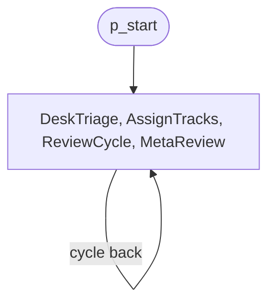
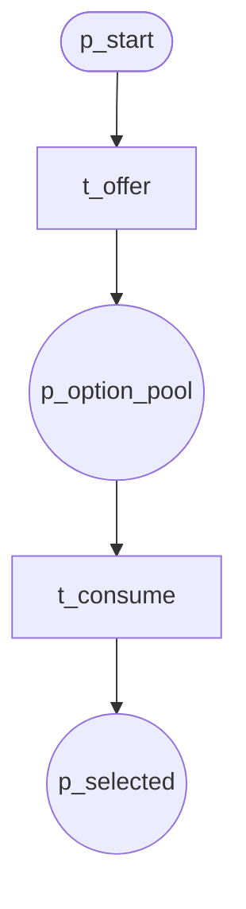
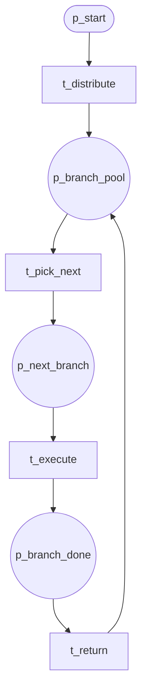
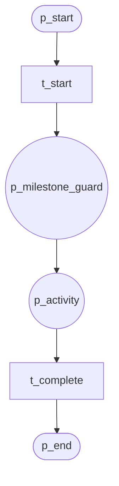
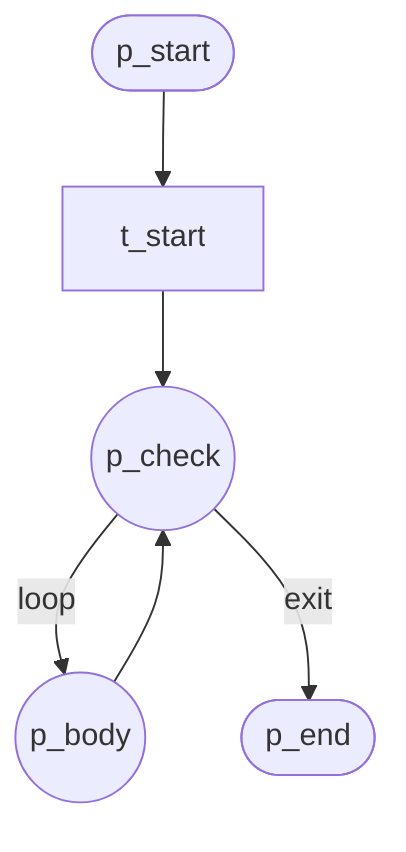

# Advanced Branching Patterns (P10–P21)

## P10 Arbitrary Cycles

Unrestricted backward flow; cycles allowed.

**Module:** `arbitrary_cycles`

---

## P16 Deferred Choice

Runtime choice; external event selects branch.

**Module:** `deferred_choice`

---

## P17 Interleaved Parallel Routing

Interleaved execution of branches.

**Module:** `interleaved_routing`

---

## P18 Milestone

Activity enabled only when milestone reached.

**Module:** `milestone`

---

## P21 Structured Loop

Structured loop with entry/body/exit.

**Module:** `structured_loop`
