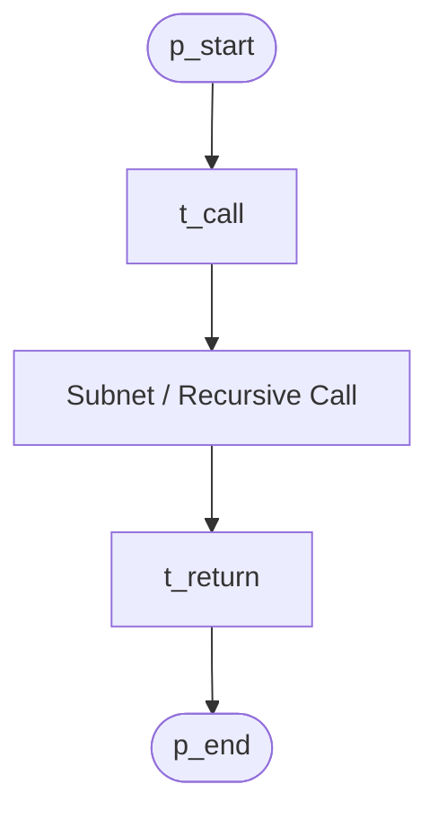
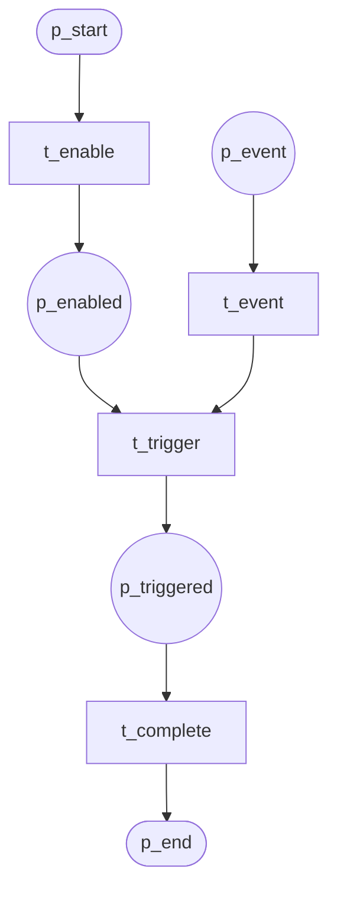
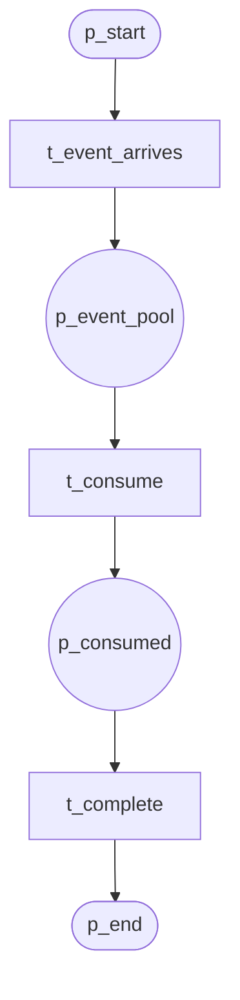
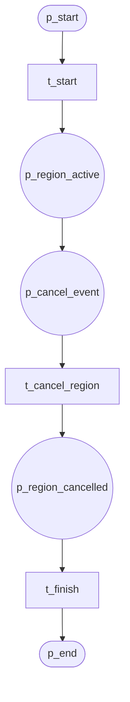

# Structural Patterns (P22–P25)

## P22 Recursion

Subnet invocation; same net called recursively.

**Module:** `recursion`

---

## P23 Transient Trigger

Event must occur while task enabled; transient.

**Module:** `transient_trigger`

---

## P24 Persistent Trigger

Event persists in pool until consumed.

**Module:** `persistent_trigger`

---

## P25 Cancel Region

Cancel activities within a region.

**Module:** `cancel_region`
