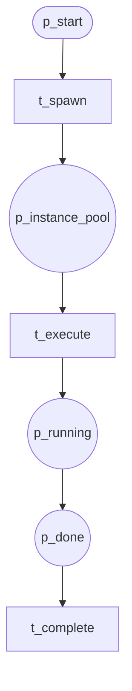
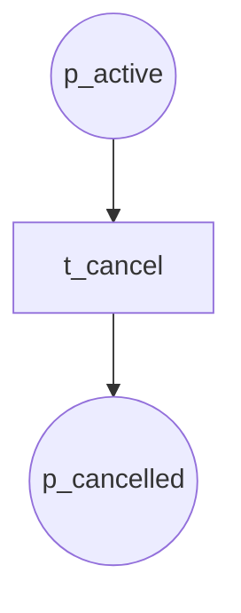
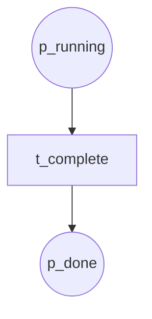
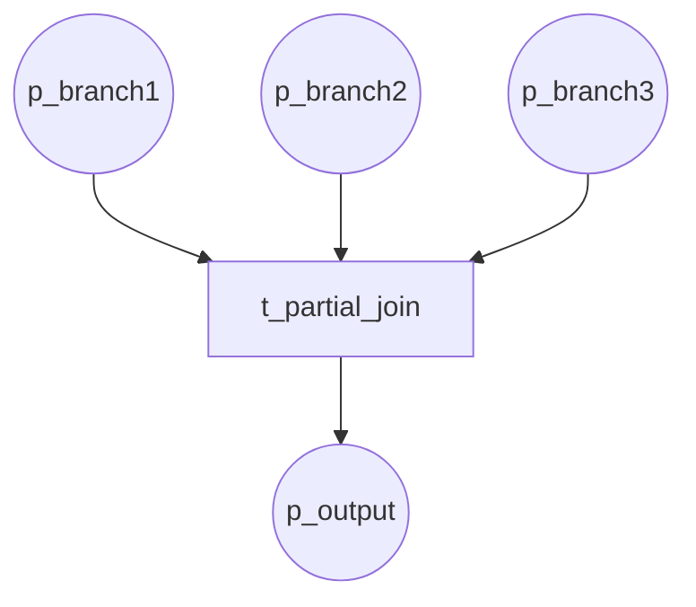
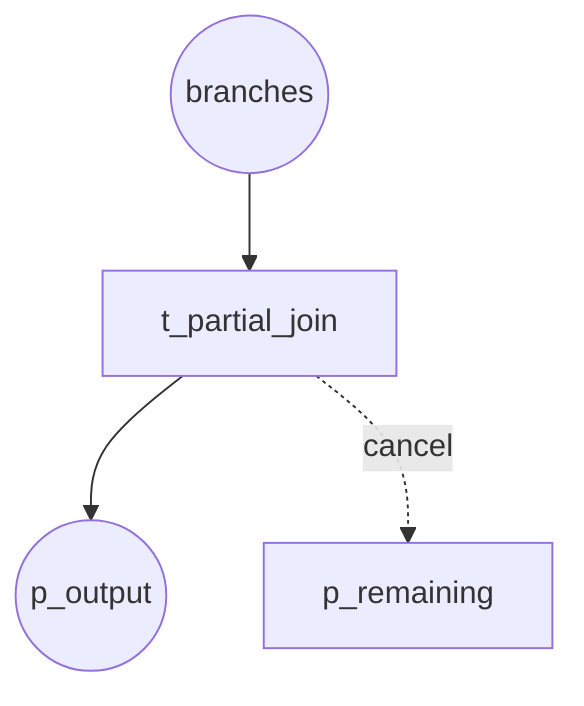
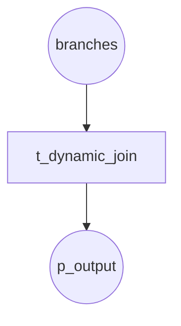

# Multi-Instance Patterns (P12–P15, P26–P27, P34–P36)

## P12–P15 Multi-Instance (No Sync / Design Time / Runtime Known / Unknown)

**Module:** `multiple_instances_sync`

---

## P26 Cancel MI Activity

Cancel one or more multi-instance activities.

**Module:** `cancel_mi_activity`

---

## P27 Complete MI Activity

Early completion of multi-instance (N-of-M done).

**Module:** `complete_mi_activity`

---

## P34 Static Partial Join MI

Static N-of-M join for multi-instance.

**Module:** `static_partial_join_mi`

---

## P35 Cancelling Partial Join MI

N-of-M join; remaining cancelled.

**Module:** `cancelling_partial_join_mi`

---

## P36 Dynamic Partial Join MI

Dynamic N-of-M threshold (e.g. from variable).

**Module:** `dynamic_partial_join_mi`
