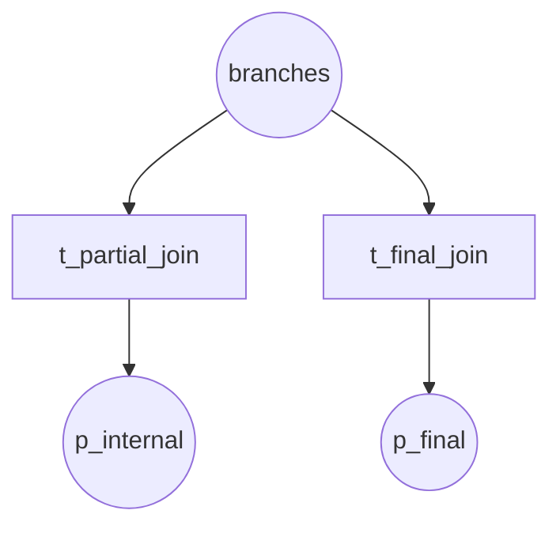
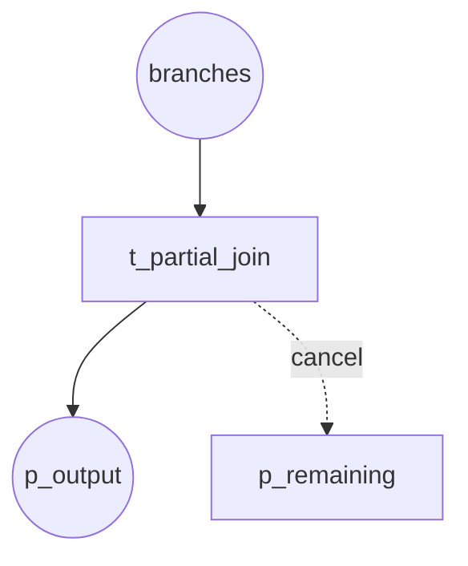
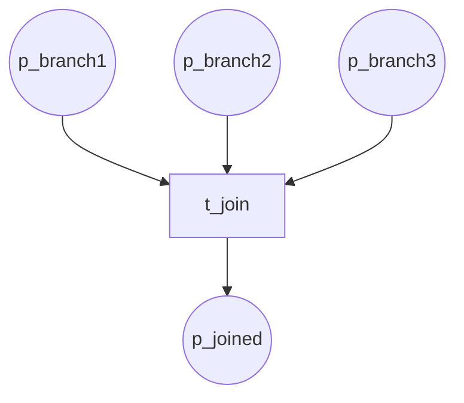
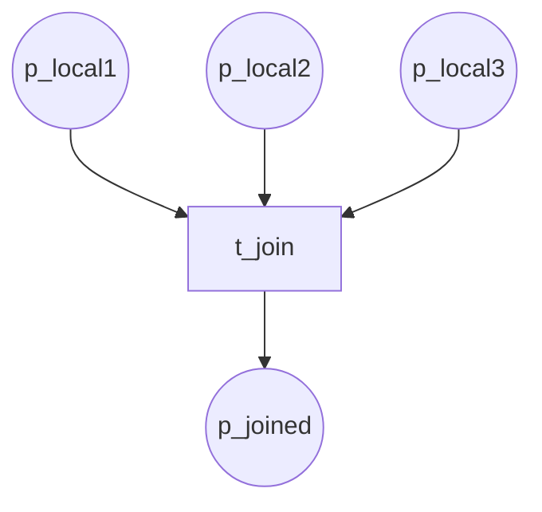

# Synchronization Patterns (P30–P33, P37–P38)

## P30 Structured Partial Join

N-of-M join; fixed threshold.

**Module:** `structured_partial_join`

---

## P31 Blocking Partial Join

N-of-M; internal output early, final when all complete.

**Module:** `blocking_partial_join`

---

## P32 Cancelling Partial Join

N-of-M; remaining branches cancelled.

**Module:** `cancelling_partial_join`

---

## P33 Generalized AND Join

Rejoin across active branches (arbitrary cycles).

**Module:** `generalized_and_join`

---

## P37 Local Sync Merge

Per-scope merge (e.g. per-track).

**Module:** `local_sync_merge`

---

## P38 General Sync Merge

Merge across unstructured active branches.

**Module:** `general_sync_merge`
