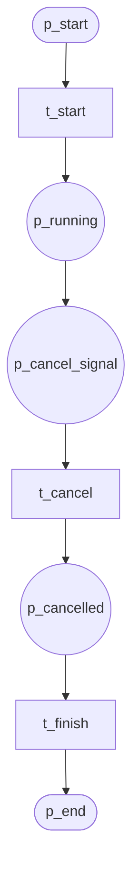
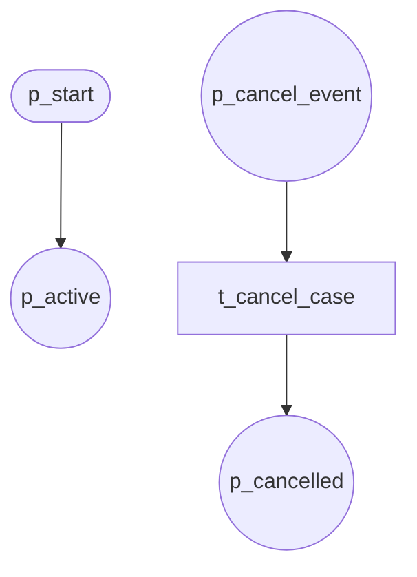
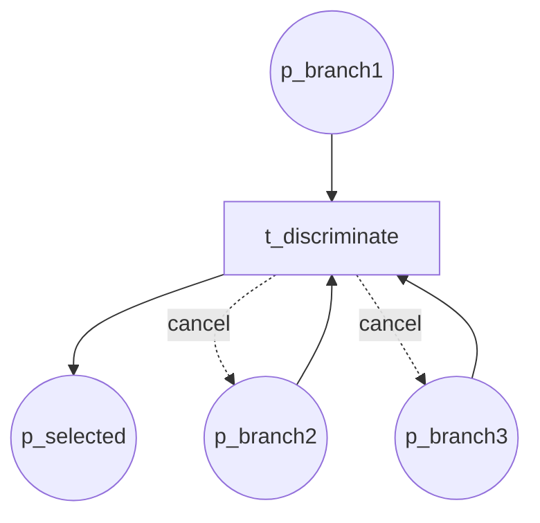

# Cancellation Patterns (P19–P20, P25–P26, P29, P32, P35)

## P19 Cancel Activity

Cancel a single activity.

**Module:** `cancel_activity`

---

## P20 Cancel Case

Cancel entire workflow case.

**Module:** `cancel_case`

---

## P25 Cancel Region

Cancel region (see [04-patterns-structural](04-patterns-structural.md)).

**Module:** `cancel_region`

---

## P26 Cancel MI Activity

Cancel multi-instance activity (see [05-patterns-multi-instance](05-patterns-multi-instance.md)).

**Module:** `cancel_mi_activity`

---

## P29 Cancelling Discriminator

First branch wins; cancel remaining.

**Module:** `cancelling_discriminator`

---

## P32 Cancelling Partial Join

N-of-M join; cancel remaining (see [06-patterns-sync](06-patterns-sync.md)).

**Module:** `cancelling_partial_join`

---

## P35 Cancelling Partial Join MI

N-of-M for multi-instance; cancel remaining (see [05-patterns-multi-instance](05-patterns-multi-instance.md)).

**Module:** `cancelling_partial_join_mi`
