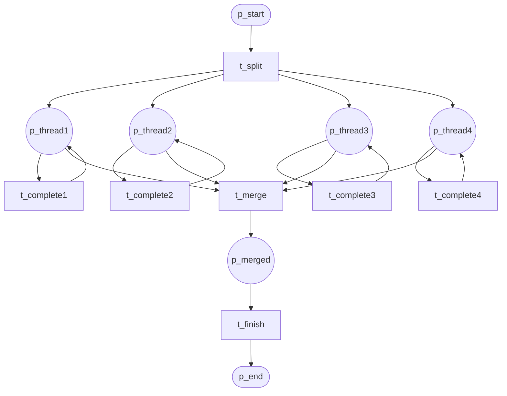
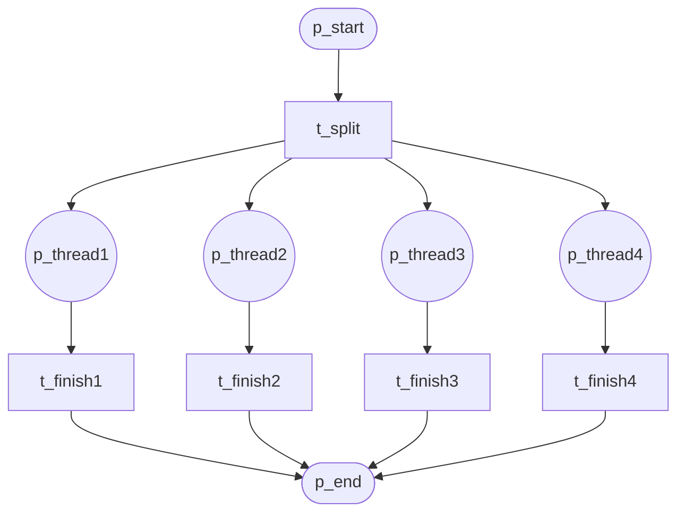
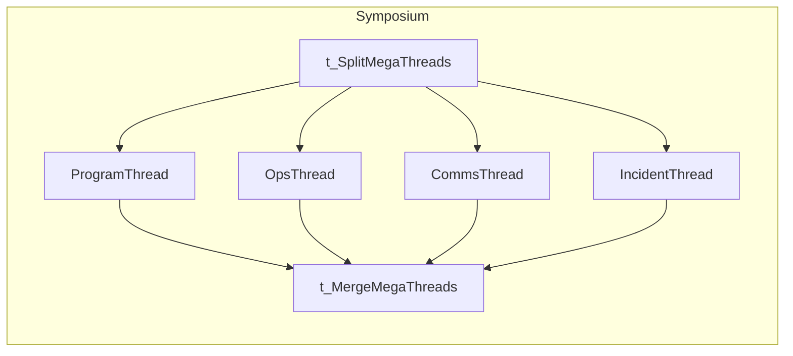

# Thread Patterns (P41–P42)

## P41 Thread Merge

Merge multiple threads into one.

**Module:** `thread_merge`

---

## P42 Thread Split

Split into multiple independent threads.

**Module:** `thread_split`

---

## AGI Symposium Ω Usage

