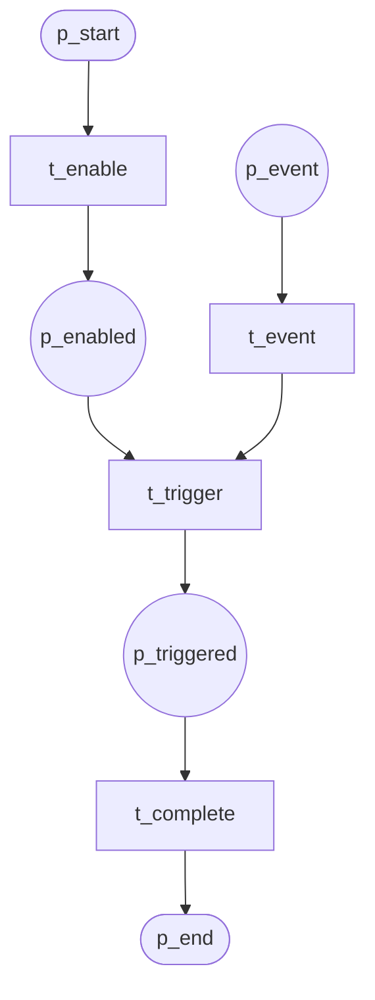
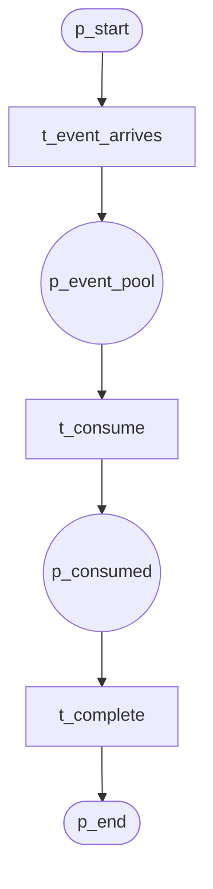

# Trigger Patterns (P23–P24)

## P23 Transient Trigger

Event must occur *while* task is enabled. Event is transient—lost if not consumed immediately.

**Module:** `transient_trigger`

---

## P24 Persistent Trigger

Event persists in pool until consumed by waiting task.

**Module:** `persistent_trigger`
