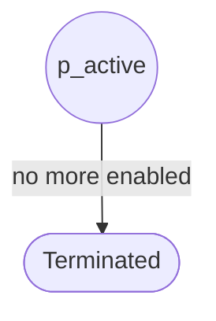
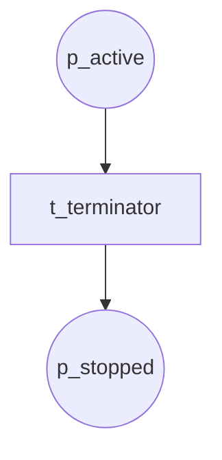

# Termination Patterns (P11, P43)

## P11 Implicit Termination

Workflow ends when no more enabled transitions (natural termination).

**Module:** `implicit_termination`

---

## P43 Explicit Termination

Hard-stop; terminator transition cancels all.

**Module:** `explicit_termination`
