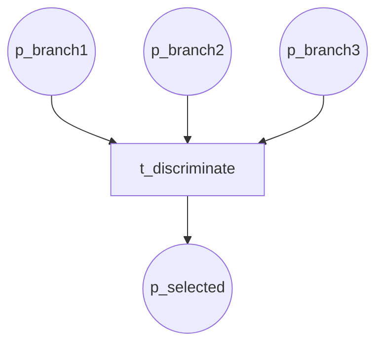
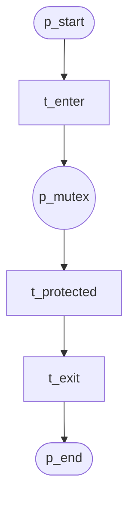
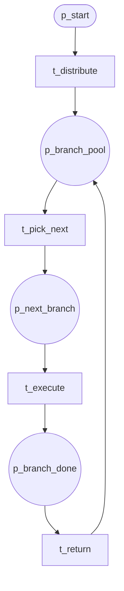

# Miscellaneous Patterns (P28, P39, P40)

## P28 Blocking Discriminator

First branch wins; others block until join.

**Module:** `blocking_discriminator`

---

## P39 Critical Section

Mutex-protected section.

**Module:** `critical_section`

---

## P40 Interleaved Routing

Same as P17; interleaved execution.

**Module:** `interleaved_routing`
