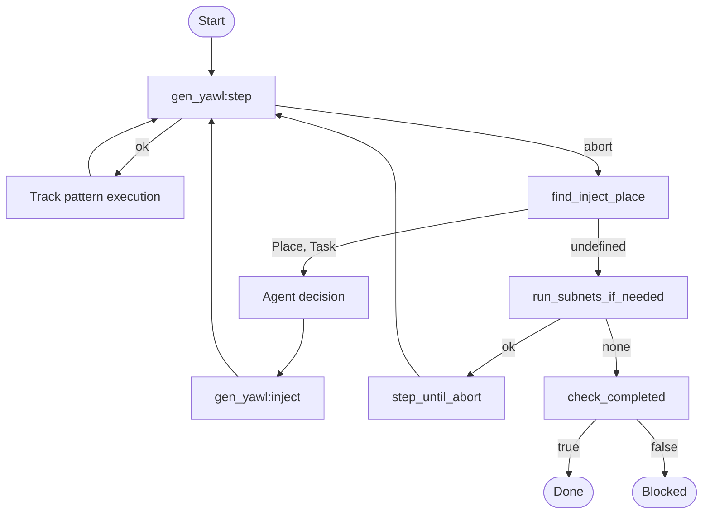
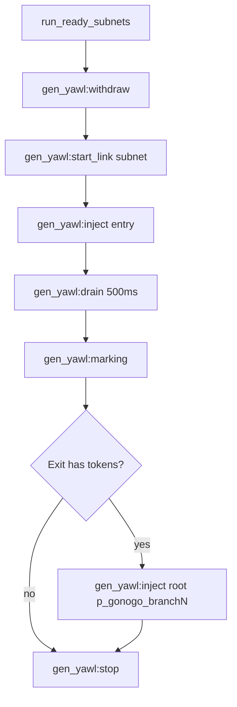

# Execution Flow

## Omega Demo Loop



## Gen YAWL Step

```mermaid
flowchart TD
    Step[gen_yawl:step] --> Enabled[find_enabled_transitions]
    Enabled -->|[]| Abort[abort]
    Enabled -->|[_|_]| Pick[pick transition]
    Pick --> Fire[fire transition]
    Fire --> Consume[consume preset]
    Consume --> Produce[produce postset]
    Produce --> Ok[{ok, Receipt}]
```

## Subnet Execution


