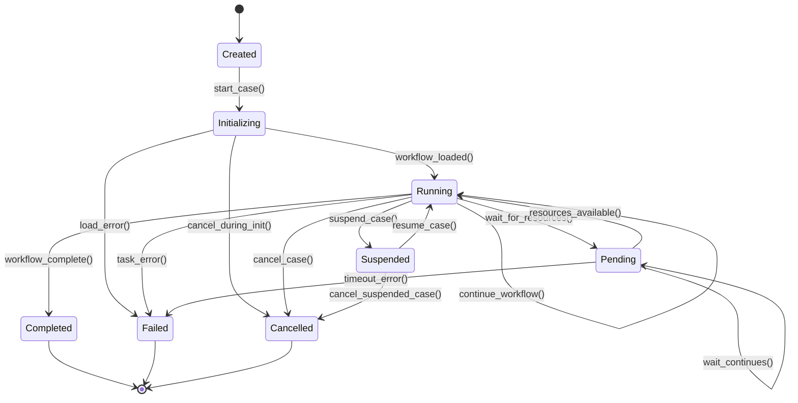

# Case Lifecycle State Diagram

```mermaid
stateDiagram-v2
    [*] --> Created
    Created --> Initializing: start_case()
    Initializing --> Running: workflow_loaded()
    Initializing --> Failed: load_error()
    Initializing --> Cancelled: cancel_during_init()

    Running --> Running: continue_workflow()
    Running --> Pending: wait_for_resources()
    Running --> Suspended: suspend_case()
    Running --> Completed: workflow_complete()
    Running --> Failed: task_error()
    Running --> Cancelled: cancel_case()

    Pending --> Running: resources_available()
    Pending --> Pending: wait_continues()
    Pending --> Failed: timeout_error()

    Suspended --> Running: resume_case()
    Suspended --> Cancelled: cancel_suspended_case()

    Completed --> [*]
    Failed --> [*]
    Cancelled --> [*]
```
