# AGI Symposium Ω Workflow

## High-Level Flow

## Sync Place Namespaces

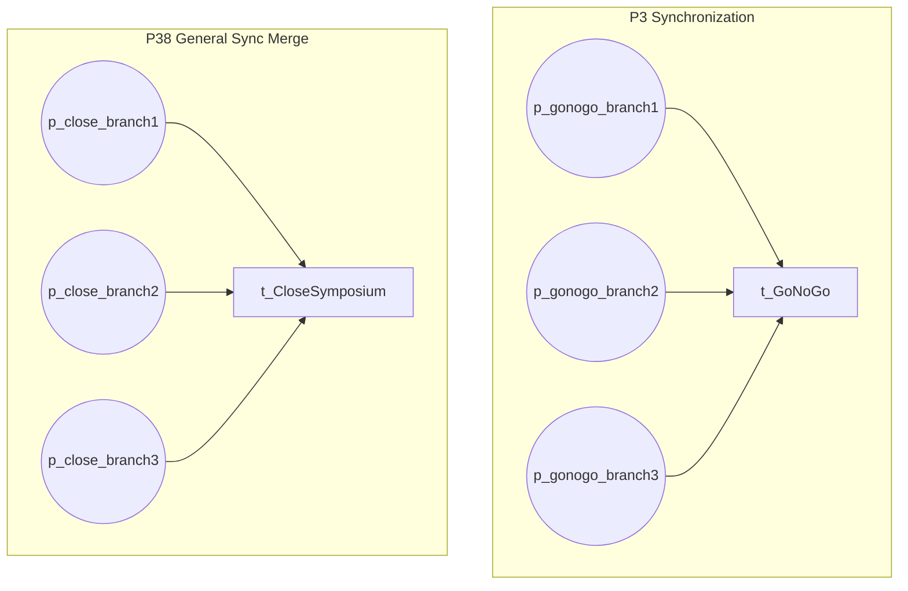

## Pattern Instances (43)

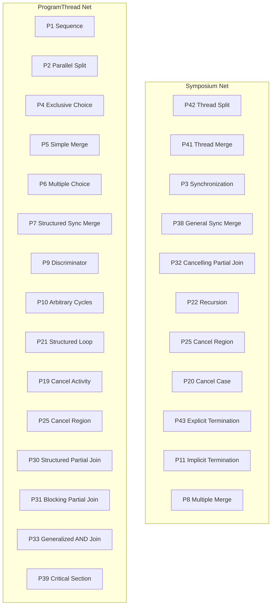

## Execution Flow and Blocking Points

Shows where the Omega demo can stop and why.

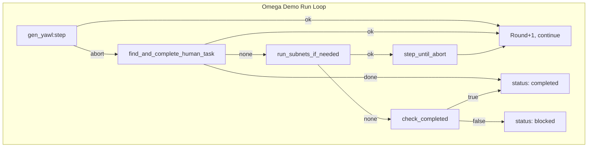

## Token Flow and Subnet Wiring

Shows where tokens must flow for GoNoGo to fire.

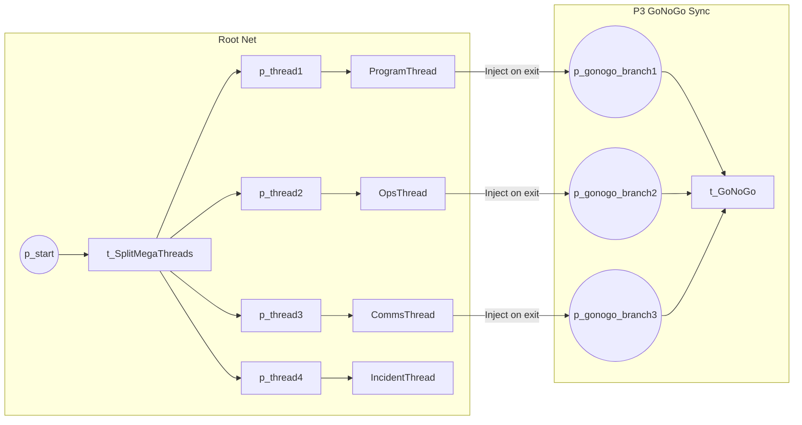

## Cycle Detection (when enabled)

When `max_marking_history > 0`, this path can halt execution.

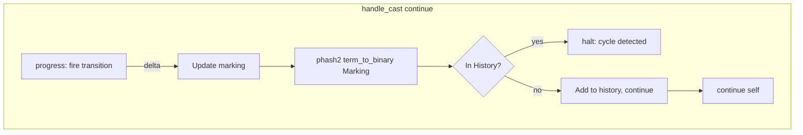

## Issue Identification

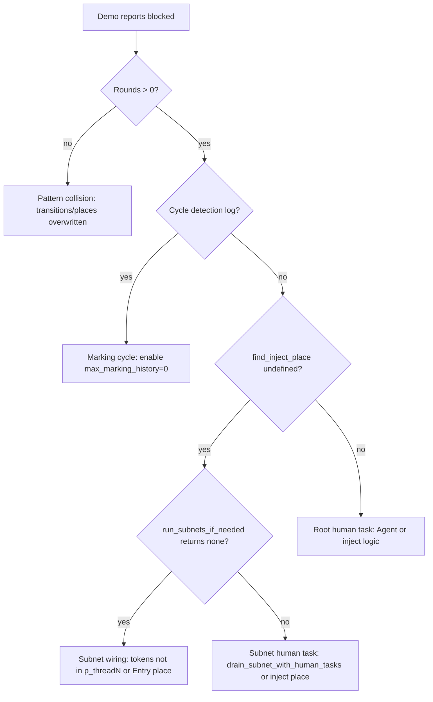

## Subnet Run Flow

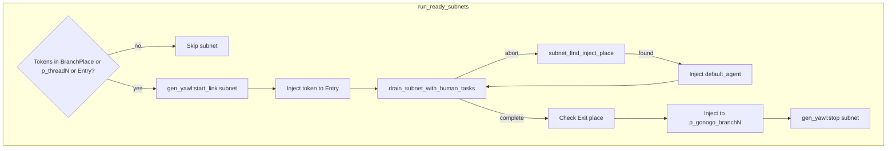

## Place Name Mapping (P42 vs YAML)

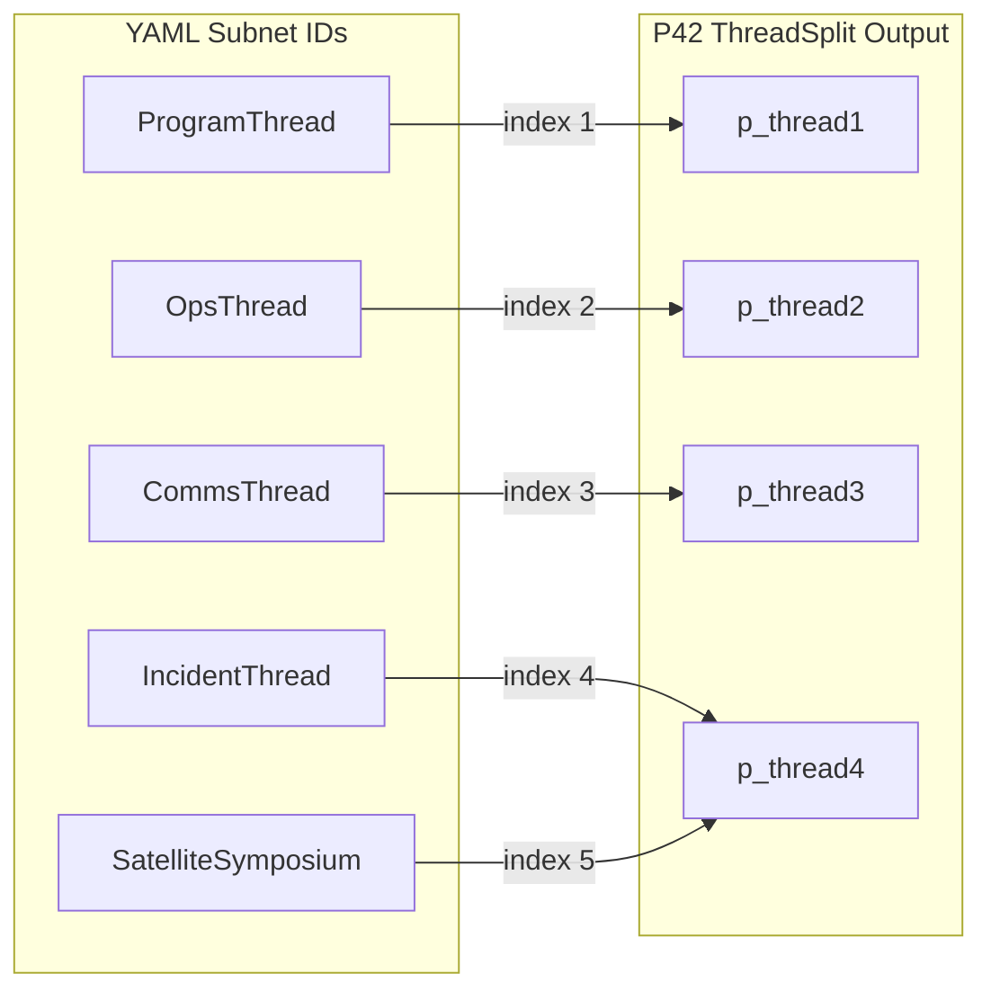

## 7. Code-Level Call Chain (Entry to Blocked)

Trace the execution path from `run_omega_loop` to `blocked` with modules and functions. Includes return paths and `step_until_abort`.

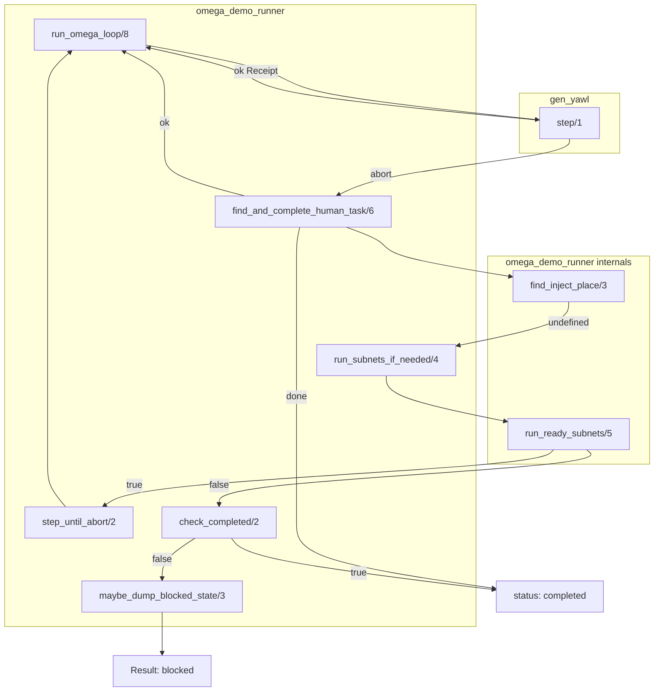

## 8. Root Human Task Resolution (find_inject_place)

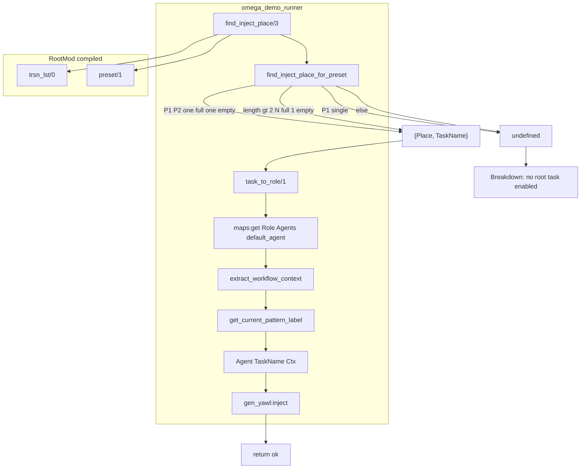

## 9. Subnet Run Breakdown (run_ready_subnets)

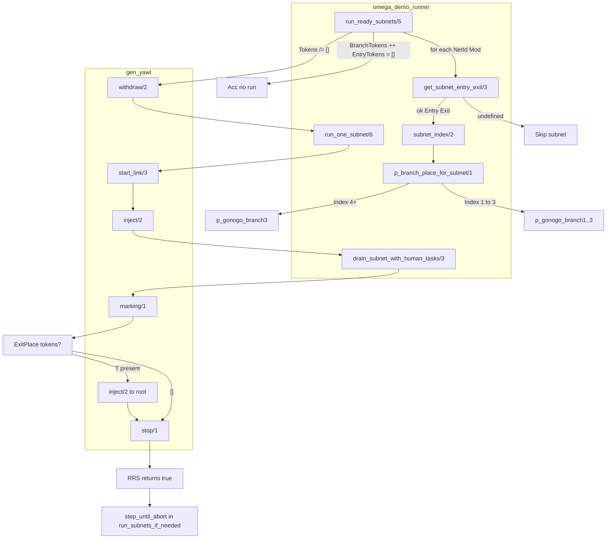

## 10. Subnet Drain Breakdown (drain_subnet_with_human_tasks)

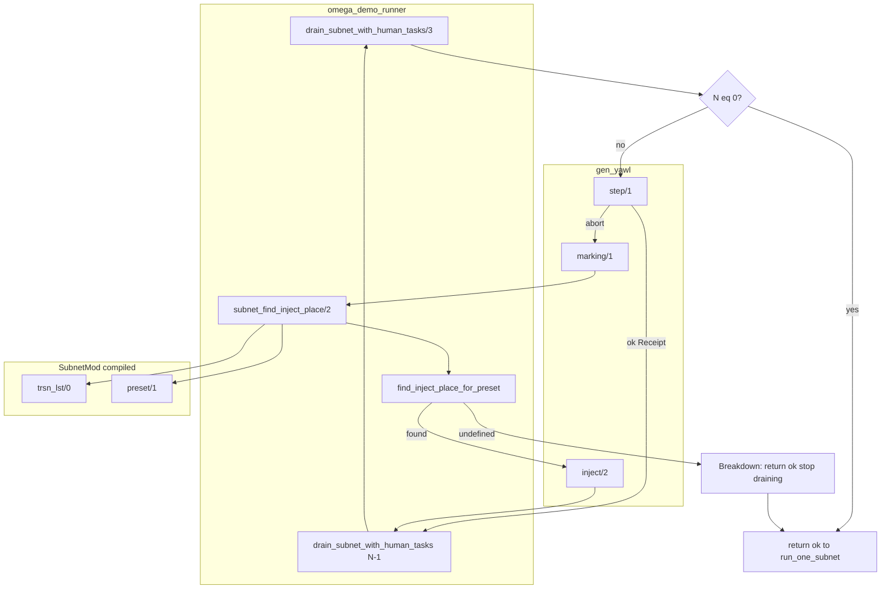

## 11. Place/Token Data Flow

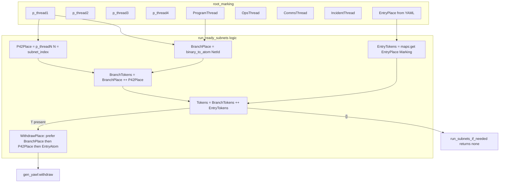
