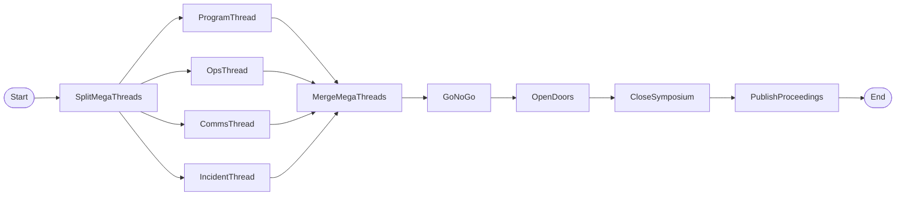
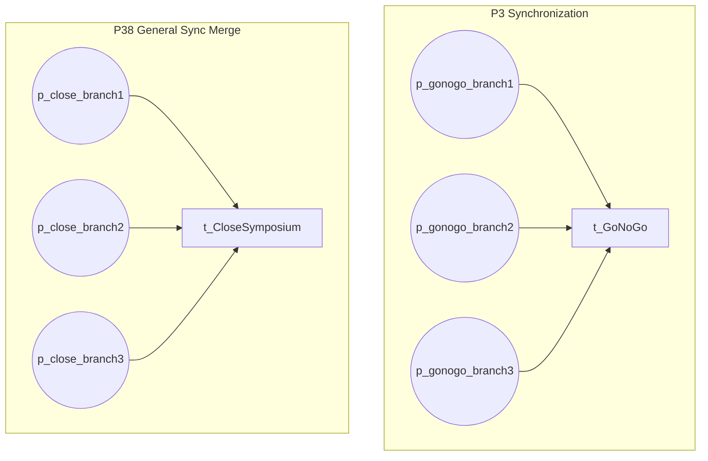
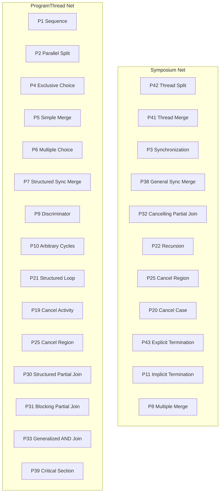

# AGI Symposium Ω Workflow

## High-Level Flow

```mermaid
flowchart LR
    Start([Start]) --> Split[SplitMegaThreads]
    Split --> Program[ProgramThread]
    Split --> Ops[OpsThread]
    Split --> Comms[CommsThread]
    Split --> Incident[IncidentThread]
    Program --> Merge[MergeMegaThreads]
    Ops --> Merge
    Comms --> Merge
    Incident --> Merge
    Merge --> GoNoGo[GoNoGo]
    GoNoGo --> OpenDoors[OpenDoors]
    OpenDoors --> Close[CloseSymposium]
    Close --> Publish[PublishProceedings]
    Publish --> End([End])
```

## Sync Place Namespaces

```mermaid
flowchart TD
    subgraph P3[P3 Synchronization]
        p_g1((p_gonogo_branch1))
        p_g2((p_gonogo_branch2))
        p_g3((p_gonogo_branch3))
        p_g1 --> t_gn[t_GoNoGo]
        p_g2 --> t_gn
        p_g3 --> t_gn
    end

    subgraph P38[P38 General Sync Merge]
        p_c1((p_close_branch1))
        p_c2((p_close_branch2))
        p_c3((p_close_branch3))
        p_c1 --> t_cs[t_CloseSymposium]
        p_c2 --> t_cs
        p_c3 --> t_cs
    end
```

## Pattern Instances (43)

```mermaid
flowchart TD
    subgraph Symposium[Symposium Net]
        P42[P42 Thread Split]
        P41[P41 Thread Merge]
        P3[P3 Synchronization]
        P38[P38 General Sync Merge]
        P32[P32 Cancelling Partial Join]
        P22[P22 Recursion]
        P25[P25 Cancel Region]
        P20[P20 Cancel Case]
        P43[P43 Explicit Termination]
        P11[P11 Implicit Termination]
        P8[P8 Multiple Merge]
    end

    subgraph ProgramThread[ProgramThread Net]
        P1[P1 Sequence]
        P2[P2 Parallel Split]
        P4[P4 Exclusive Choice]
        P5[P5 Simple Merge]
        P6[P6 Multiple Choice]
        P7[P7 Structured Sync Merge]
        P9[P9 Discriminator]
        P10[P10 Arbitrary Cycles]
        P21[P21 Structured Loop]
        P19[P19 Cancel Activity]
        P25p[P25 Cancel Region]
        P30[P30 Structured Partial Join]
        P31[P31 Blocking Partial Join]
        P33[P33 Generalized AND Join]
        P39[P39 Critical Section]
    end
```
