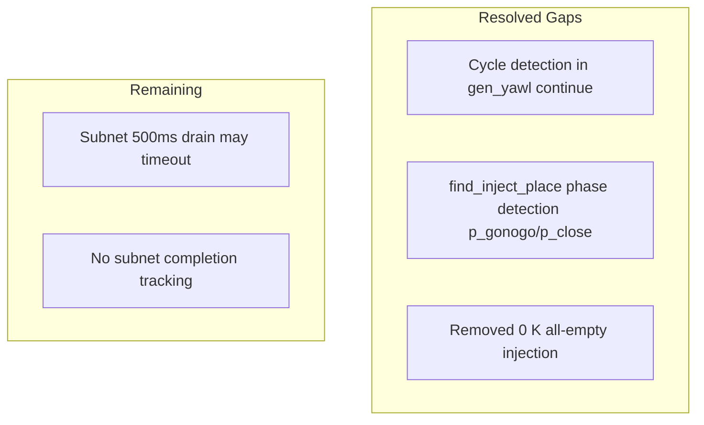

# Gap Analysis — Mermaid Diagrams vs Implementation

**Reference:** Mermaid diagrams in `docs/mermaid/` (01–14)  
**Sources:** `PLAN_GAP_ANALYSIS.md`, `omega_demo_issues_and_capabilities_map`, `yawl_pattern_expander.erl`, `agi_symposium_omega.yaml`

**Last updated:** After plan implementation (close gaps).

---

## Summary

| Category | Status | Gaps |
|----------|--------|------|
| 43 Pattern Modules | ✅ Implemented | 0 |
| Pattern Expansion (place/transition mapping) | ✅ Implemented | All 43 patterns have expansion support |
| Complex Pattern Parameters | ⚠️ Partial | P21 loop, P30 m/n, P39 mutex expanded; runtime semantics vary |
| Variables | ✅ Implemented | `generate_init_usr_info` |
| Regions | ✅ Implemented | `build_region_places_map` extracts places from P25; `cancel_region/2` API |
| Node/Task Types | ❌ Not used | kind, taskType ignored |
| Subnet Entry/Exit | ✅ Runtime | Compile-time wiring not explicit |
| Demo Execution | ✅ Fixed | I-001: cycle detection, phase detection (p_gonogo/p_close), no {0,K} injection |

---

## 1. Pattern Parameter Support (Expander vs YAML)

### Supported by `build_place_mapping` / `build_transition_mapping`

| Pattern | Parameters Used | Status |
|---------|-----------------|--------|
| P1 Sequence | `from`, `to` | ✅ |
| P2 Parallel Split | `split_task`, `branches` | ✅ |
| P3 Synchronization | `join_task`, `waits_for` | ✅ |
| P4 Exclusive Choice | `at`, `choices` | ✅ |
| P5 Simple Merge | `froms`, `to` | ✅ |
| P6 Multiple Choice | `at`, `branches` | ✅ |
| P7 Structured Sync Merge | `froms`, `join` | ✅ |
| P8 Multiple Merge | `froms`, `to` | ✅ |
| P9 Discriminator | `winner_to` | ✅ |
| P17, P40 Interleaved | `tasks` | ✅ |
| P18 Milestone | `gate_task`, `milestone` | ✅ |
| P19 Cancel Activity | `target`, `cancel_event` | ✅ |
| P20 Cancel Case | `cancel_event` | ✅ |
| P21 Structured Loop | `entry` | ✅ |
| P22 Recursion | `call` | ✅ |
| P23 Transient Trigger | `event`, `enabled_only_in` | ✅ |
| P24 Persistent Trigger | `consumed_in` | ✅ |
| P25 Cancel Region | `region`, `cancel_event` | ✅ |
| P26–P27 MI | `mi_task` | ✅ |
| P28 Blocking Discriminator | `trigger`, `blocks_until` | ✅ |
| P29 Cancelling Discriminator | `race` | ✅ |
| P30 Structured Partial Join | `join` | ✅ |
| P31 Blocking Partial Join | `partial_out`, `final_out` | ✅ |
| P32 Cancelling Partial Join | — | ✅ |
| P33 Generalized AND Join | `join`, `froms` | ✅ |
| P34–P36 MI Partial Join | — | ✅ |
| P37 Local Sync Merge | `join` | ✅ |
| P38 General Sync Merge | `join`, `froms` (inferred) | ✅ |
| P39 Critical Section | `mutex`, `protected` | ✅ |
| P41 Thread Merge | `merge_task`, `waits_for` / `branches` | ✅ |
| P42 Thread Split | `split_task`, `branches` | ✅ |
| P43 Explicit Termination | `terminator` | ✅ |
| P12–P15 MI | `task` | ✅ |

### Parameters With Partial/Stub Expansion

| Pattern | Parameter | Notes |
|---------|-----------|-------|
| P21 Structured Loop | `body`, `exit_condition` | Place mapping only; no loop structure expansion |
| P30–P32 | `m`, `n` | Transition mapping; m/n semantics in pattern module |
| P39 Critical Section | `mutex`, `protected` | Place mapping; mutex semantics in pattern module |

---

## 2. Mermaid Diagram → Code Coverage

### Diagram Coverage

| File | Patterns | All in Registry? | All Expand? |
|------|----------|------------------|-------------|
| 02-patterns-basic | P1–P9 | ✅ | ✅ |
| 03-patterns-advanced | P10, P16–P18, P21 | ✅ | ✅ |
| 04-patterns-structural | P22–P25 | ✅ | ✅ |
| 05-patterns-multi-instance | P12–P15, P26–P27, P34–P36 | ✅ | ✅ |
| 06-patterns-sync | P30–P33, P37–P38 | ✅ | ✅ |
| 07-patterns-cancellation | P19–P20, P25–P26, P29, P32, P35 | ✅ | ✅ |
| 08-patterns-thread | P41–P42 | ✅ | ✅ |
| 09-patterns-triggers | P23–P24 | ✅ | ✅ |
| 10-patterns-termination | P11, P43 | ✅ | N/A |
| 11-patterns-misc | P28, P39, P40 | ✅ | ✅ |

### Missing from Diagrams

- **P10 Arbitrary Cycles**: Diagram is placeholder; real structure involves cycle back-edges
- **P12–P15 MI**: Diagram generic; no `instances`, `instances_expr`, `stop_condition` representation
- **P22 Recursion**: Subnet call not shown as Petri net pattern
- **P30–P33**: N-of-M semantics not shown (m, n, threshold)

---

## 3. PLAN_GAP_ANALYSIS Resolution

| PLAN_GAP Item | Status | Notes |
|---------------|--------|-------|
| Subnets entry/exit | ✅ | Runtime wiring in `run_one_subnet`; expander maps `waits_for` → branch places |
| Variables | ✅ | `generate_init_usr_info` in yawl_compile |
| Regions | ✅ | `build_region_places_map` extracts places from P25; `cancel_region/2` in gen_yawl; regions passed via NetArg |
| Nodes kind | ❌ | Not used in compilation |
| TaskType | ❌ | Not used |
| Pattern expansion algorithm | ✅ | All 43 patterns have build_place_mapping / build_transition_mapping |
| Complex parameters | ⚠️ | `entry`/`body`/`exit_condition`, `m`/`n`, `mutex`/`protected` partially expanded |

---

## 4. Execution Gaps (from 12-execution-flow)

| Gap | Severity | Location | Status |
|-----|----------|----------|--------|
| Cycle detection | High | `gen_yawl` handle_cast continue | ✅ Fixed: marking history, max_continue |
| Infinite loop | High | `find_inject_place` / P3/P38 | ✅ Fixed: phase detection, no {0,K} |
| Phase detection | Medium | `p_joined` shared | ✅ Fixed: use p_close_branch*, has_tokens_in_any |
| Subnet timeout | Medium | `run_one_subnet` 500ms | Open |
| Subnet completion | Low | No run/completed/blocked tracking | Open |

---

## 5. YAML → Mermaid Alignment

### Omega Pattern Instances (43) vs Diagrams

| Instance ID | Pattern | Net | Diagram Exists? | Params in Expander? |
|-------------|---------|-----|-----------------|---------------------|
| P42_split_megathreads | P42 | Symposium | ✅ 08 | ✅ |
| P41_merge_megathreads | P41 | Symposium | ✅ 08 | ✅ |
| P3_sync_gonogo | P3 | Symposium | ✅ 02 | ✅ |
| P38_general_sync_merge_close | P38 | Symposium | ✅ 06 | ✅ |
| P2_parallel_triage_lanes | P2 | ProgramThread | ✅ 02 | ✅ |
| P1_seq_paper_lifecycle | P1 | ProgramThread | ✅ 02 | ✅ |
| P4_choice_decision | P4 | ProgramThread | ✅ 02 | ✅ |
| P21_loop_revise | P21 | ProgramThread | ✅ 03 | ✅ |
| P10_arbitrary_rework | P10 | ProgramThread | ✅ 03 | ✅ |
| P6_multi_track_assign | P6 | ProgramThread | ✅ 02 | ✅ |
| P7_struct_sync_merge_tracks | P7 | ProgramThread | ✅ 02 | ✅ |
| P5_simple_merge_talk_types | P5 | ProgramThread | ✅ 02 | ✅ |
| P12_mi_cfp_blast | P12 | ProgramThread | ✅ 05 | ✅ |
| P13_mi_reviews3 | P13 | ProgramThread | ✅ 05 | ✅ |
| P14_mi_reviewsN_risk | P14 | ProgramThread | ✅ 05 | ✅ |
| P15_mi_factcheck_until | P15 | ProgramThread | ✅ 05 | ✅ |
| P34_static_partial_join_mi | P34 | ProgramThread | ✅ 05 | ✅ |
| P35_cancel_partial_join_mi | P35 | ProgramThread | ✅ 05 | ✅ |
| P27_complete_mi_early | P27 | ProgramThread | ✅ 05 | ✅ |
| P26_cancel_mi_on_withdraw | P26 | ProgramThread | ✅ 05 | ✅ |
| P16_deferred_workshop_slot | P16 | CommsThread | ✅ 03 | ✅ |
| P17_interleaved_onboarding | P17 | OpsThread | ✅ 03 | ✅ |
| P40_interleaved_policy_checklist | P40 | OpsThread | ✅ 11 | ✅ |
| P18_milestone_earlybird | P18 | OpsThread | ✅ 03 | ✅ |
| P23_transient_fire_alarm | P23 | Symposium | ✅ 09 | ✅ |
| P24_persistent_visa | P24 | OpsThread | ✅ 09 | ✅ |
| P29_cancel_discriminator_venue | P29 | OpsThread | ✅ 07 | ✅ |
| P9_discriminator_keynote | P9 | ProgramThread | ✅ 02 | ✅ |
| P28_blocking_discriminator_incident | P28 | IncidentThread | ✅ 11 | ✅ |
| P8_multiple_merge_updates | P8 | Symposium | ✅ 02 | ✅ |
| P37_local_sync_merge_trackwrap | P37 | ProgramThread | ✅ 06 | ✅ |
| P39_critical_section_mainhall | P39 | ProgramThread | ✅ 11 | ✅ |
| P30_struct_partial_join_schedule | P30 | ProgramThread | ✅ 06 | ✅ |
| P31_blocking_partial_join_public | P31 | ProgramThread | ✅ 06 | ✅ |
| P32_cancel_partial_join_demo_safety | P32 | Symposium | ✅ 06 | ✅ |
| P33_generalized_and_join_rework | P33 | ProgramThread | ✅ 06 | ✅ |
| P36_dynamic_partial_join_feedback | P36 | Symposium | ✅ 05 | ✅ |
| P11_implicit_termination_microevents | P11 | Symposium | ✅ 10 | N/A |
| P22_recursion_satellite | P22 | Symposium | ✅ 04 | ✅ |
| P25_cancel_region_highrisk | P25 | Symposium | ✅ 04 | ✅ |
| P19_cancel_activity_speaker_drop | P19 | ProgramThread | ✅ 07 | ✅ |
| P20_cancel_case_force_majeure | P20 | Symposium | ✅ 07 | ✅ |
| P43_explicit_termination_emergency | P43 | Symposium | ✅ 10 | N/A |

**Summary:** All 43 instances have parameter expansion support.

---

## 6. Recommended Next Steps

1. **Low:** Increase subnet drain timeout or make configurable.
2. **Low:** Add subnet completion tracking (run/completed/blocked).
3. **Low:** Document which YAML params are fully expanded vs partial per pattern.
