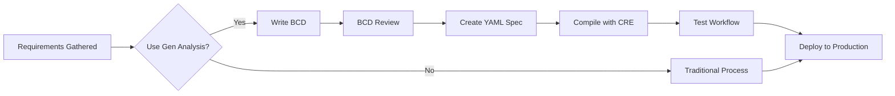

# Generative Analysis Migration Guide

## Adopting Generative Analysis Practices in Existing Teams

**Version:** 1.0.0
**Last Updated:** 2026-02-07
**Target Audience:** Development teams, technical leads, engineering managers

---

## Table of Contents

1. [Executive Summary](#executive-summary)
2. [Prerequisites Checklist](#prerequisites-checklist)
3. [Phase 1: Assessment](#phase-1-assessment)
4. [Phase 2: Pilot Project](#phase-2-pilot-project)
5. [Phase 3: Tool Setup](#phase-3-tool-setup)
6. [Phase 4: Training Rollout](#phase-4-training-rollout)
7. [Phase 5: Full Adoption](#phase-5-full-adoption)
8. [Phase 6: Measuring Success](#phase-6-measuring-success)
9. [Common Blockers and Solutions](#common-blockers-and-solutions)
10. [Timeline Estimates](#timeline-estimates)
11. [Success Criteria](#success-criteria)

---

## Executive Summary

**Generative Analysis** is a methodology for building constructive systems using formal specification, automatic code generation, and verifiable execution. This guide provides a practical roadmap for teams adopting these practices.

### What is Generative Analysis?

Generative Analysis combines three core practices:

1. **Business Context Documents (BCDs)** - Formal specification of business requirements with type signatures, decision schemas, and traceability
2. **Pattern-Based Compilation** - Declarative specifications compile automatically to executable code
3. **Verifiable Execution** - Petri net semantics provide formal verification of system behavior

### Key Benefits

| Benefit | Description |
|---------|-------------|
| **Traceability** | Every requirement maps to specific code modules |
| **Correctness** | Formal verification catches errors before runtime |
| **Maintainability** | Pure functional modules are easy to test and modify |
| **Agility** | Change specifications, recompile, redeploy |
| **Reliability** | Fault-tolerant Erlang/OTP runtime |

### The CRE Platform

This guide uses **CRE (Common Runtime Environment)** as the reference implementation:
- YAWL workflow engine with 43 control patterns
- Declarative YAML specifications
- Automatic compilation to Petri net modules
- Full observability with OpenTelemetry

---

## Prerequisites Checklist

Before starting migration, ensure your organization meets these prerequisites.

### Organizational Prerequisites

- [ ] **Executive Sponsorship** - Leadership support for methodology change
- [ ] **Team Buy-In** - Developers willing to learn new patterns
- [ ] **Time Allocation** - Minimum 20% time for learning and experimentation
- [ ] **Failure Tolerance** - Acceptance of learning curve during pilot

### Technical Prerequisites

- [ ] **Erlang/OTP Knowledge** - Team comfortable with functional programming
- [ ] **Workflow Understanding** - Familiarity with business process modeling
- [ ] **Testing Culture** - Existing test-driven development practices
- [ ] **CI/CD Pipeline** - Automated build and deployment infrastructure

### Tool Prerequisites

| Tool | Minimum Version | Purpose |
|------|-----------------|---------|
| Erlang/OTP | 25.0 | Runtime environment |
| rebar3 | 3.18.0 | Build tool |
| Git | 2.30+ | Version control |
| CRE | 0.3.0 | Workflow engine |

### Knowledge Prerequisites

Before starting, team members should understand:

- **Petri Net Basics** - Places, transitions, tokens, markings
- **YAWL Patterns** - At least the 6 core patterns (Sequence, Parallel Split, etc.)
- **Functional Programming** - Immutability, pure functions, pattern matching
- **BCD Structure** - Role definitions, workflow variables, decision schemas

**Recommended Preparation:**
- Read `/docs/ARCHITECTURE.md` - System design overview
- Read `/docs/WORKFLOW_PATTERNS_LEARNING_PATH.md` - Pattern education
- Complete `/docs/YAWL_PATTERNS_WORKBOOK.md` - Hands-on exercises

---

## Phase 1: Assessment

**Duration:** 1-2 weeks
**Goal:** Evaluate current workflow for Generative Analysis adoption

### 1.1 Current State Analysis

Evaluate your existing development process against Generative Analysis principles.

#### Assessment Matrix

| Dimension | Current State | Target State | Gap |
|-----------|---------------|--------------|-----|
| **Specification** | Ad-hoc requirements | Formal BCDs | ___ |
| **Code Generation** | Manual implementation | Pattern-based compilation | ___ |
| **Verification** | Runtime testing only | Formal verification | ___ |
| **Traceability** | Limited | Full requirement-to-code mapping | ___ |
| **Observability** | Basic logging | Full OpenTelemetry | ___ |

#### Workflow Analysis Worksheet

Answer these questions for your current workflow:

```
1. How are requirements documented today?
   _________________________________________________

2. How do requirements translate to code?
   _________________________________________________

3. How is correctness verified?
   _________________________________________________

4. How are changes managed?
   _________________________________________________

5. What are the biggest pain points?
   _________________________________________________
```

### 1.2 Identify Candidate Workflows

Select initial workflows suitable for Generative Analysis.

#### Ideal Candidate Characteristics

- **Well-defined inputs/outputs** - Clear data transformation
- **Stateful execution** - Multiple steps with intermediate states
- **Decision points** - Conditional routing based on data
- **External integrations** - Service calls with timeouts/retries
- **Business value** - Measurable impact on operations

#### Candidate Scoring Template

| Workflow | Complexity | Business Value | Integration Density | Change Frequency | Total Score |
|----------|------------|----------------|---------------------|------------------|-------------|
| Example: Order Processing | Medium | High | High | Low | 8/10 |
| [Your workflow 1] | | | | | |
| [Your workflow 2] | | | | | |

**Score:** 1-5 for each dimension. Target workflows with scores > 15.

### 1.3 Skill Gap Analysis

Assess team readiness for Generative Analysis.

#### Skill Assessment

| Skill Area | Current Level | Required Level | Gap | Training Plan |
|------------|---------------|----------------|-----|---------------|
| Erlang/OTP | ___/5 | 3/5 | ___ | |
| Functional Programming | ___/5 | 3/5 | ___ | |
| Petri Nets | ___/5 | 2/5 | ___ | |
| YAWL Patterns | ___/5 | 2/5 | ___ | |
| BCD Writing | ___/5 | 3/5 | ___ | |
| Formal Verification | ___/5 | 2/5 | ___ | |

**Scoring:** 1=None, 2=Basic, 3=Competent, 4=Advanced, 5=Expert

### 1.4 Infrastructure Readiness

Verify your infrastructure supports Generative Analysis.

#### Checklist

- [ ] Erlang/OTP 25+ available in development environment
- [ ] rebar3 installed and configured
- [ ] CRE can be cloned and compiled
- [ ] Git repository with CI/CD pipeline
- [ ] Code review process in place
- [ ] Testing infrastructure (EUnit/Common Test)
- [ ] Documentation system (EDoc or similar)

---

## Phase 2: Pilot Project

**Duration:** 4-6 weeks
**Goal:** Validate Generative Analysis on a single workflow

### 2.1 Pilot Selection Criteria

Choose a pilot project using these criteria:

#### Recommended Pilot Characteristics

- **Duration:** 1-2 weeks of development effort
- **Complexity:** 3-5 YAWL patterns maximum
- **Team:** 2-3 developers (including one champion)
- **Risk:** Low business impact if pilot fails
- **Visibility:** High enough to demonstrate value

#### Example Pilot Projects

| Project | Patterns | Duration | Business Value |
|---------|----------|----------|----------------|
| Document Approval | Sequence, Exclusive Choice, Human Task | 1 week | Medium |
| Data Pipeline | Parallel Split, Synchronization, Multi-Instance | 2 weeks | High |
| Order Processing | Sequence, Choice, Loop, Exception | 2 weeks | High |

### 2.2 Pilot Execution Steps

Follow this step-by-step process for your pilot.

#### Week 1: Specification

**Goal:** Create complete BCD for pilot workflow

1. **Stakeholder Interview**
   ```
   - What is the workflow trigger?
   - What are the inputs?
   - What decisions are made?
   - What are the outputs?
   - What are the error conditions?
   ```

2. **Write BCD**
   - Use `/docs/BCD_CRE_Retrospective.md` as template
   - Define role specifications with type signatures
   - Document workflow variables
   - Specify decision schemas
   - Map requirements to patterns

3. **Review BCD**
   - Peer review with technical team
   - Stakeholder review for correctness
   - Iterate until approved

#### Week 2-3: Implementation

**Goal:** Compile and deploy pilot workflow

1. **Create YAML Specification**
   ```yaml
   nets:
     - id: pilot_workflow
       variables:
         - name: status
           type: enum
           values: [pending, approved, rejected]
       patterns:
         - id: P1_Sequence
           ...
   ```

2. **Compile with CRE**
   ```bash
   # Compile specification
   wf_yawl_executor:load_workflow_from_yaml("pilot_workflow.yaml").

   # Test locally
   wf_yawl_executor:execute_workflow(...).

   # Run tests
   rebar3 ct --suite=pilot_workflow_SUITE.
   ```

3. **Deploy to Staging**
   - Package release with `rebar3 release`
   - Deploy to staging environment
   - Execute integration tests

#### Week 4: Verification

**Goal:** Validate correctness and collect metrics

1. **Functional Verification**
   ```erlang
   % Verify initial marking
   {ok, Marking} = gen_yawl:marking(Pid).

   % Execute step-by-step
   {ok, Receipt} = wf_yawl_executor:execute_step(Pid).

   % Verify final state
   {ok, FinalState} = wf_yawl_executor:get_workflow_state(Pid).
   ```

2. **Collect Metrics**
   - Execution time
   - Token throughput
   - Error rate
   - Resource usage

3. **Document Lessons Learned**
   - What worked well?
   - What was challenging?
   - What would you do differently?

### 2.3 Pilot Success Criteria

Declare pilot success when ALL criteria are met:

- [ ] BCD completed and approved
- [ ] YAML specification compiles without errors
- [ ] All test cases pass (100% pass rate)
- [ ] Workflow executes correctly in staging
- [ ] Metrics collected and baseline established
- [ ] Team retrospectives completed

### 2.4 Pilot Report Template

Create a pilot report following this structure:

```markdown
# Pilot Project Report: [Workflow Name]

## Executive Summary
[2-3 sentence summary of pilot results]

## BCD Highlights
- Roles: [list]
- Patterns: [list]
- Variables: [list]

## Implementation Results
- Compilation: [Success/Failure]
- Test Pass Rate: [X%]
- Execution Time: [X ms]
- Issues Encountered: [list]

## Metrics Collected
[Table of baseline metrics]

## Lessons Learned
### What Worked
- ...

### What Was Challenging
- ...

### Recommendations for Full Rollout
- ...

## Go/No-Go Decision
[ ] GO - Proceed with full adoption
[ ] NO-GO - Address issues first

Reasoning: ...
```

---

## Phase 3: Tool Setup

**Duration:** 1 week
**Goal:** Install and configure CRE for team use

### 3.1 Installation

#### Step 1: Install Prerequisites

```bash
# macOS
brew install erlang rebar3

# Ubuntu/Debian
sudo apt-get install erlang rebar3

# Verify installation
erl -version  # Should show OTP 25+
rebar3 version
```

#### Step 2: Clone and Build CRE

```bash
# Clone repository
git clone https://github.com/your-org/cre.git
cd cre

# Install dependencies
rebar3 deps

# Compile
rebar3 compile

# Run tests to verify
rebar3 ct
```

#### Step 3: Set Up Development Environment

```bash
# Create development branch
git checkout -b dev/generative-analysis

# Set up pre-commit hooks (optional)
# scripts/setup-hooks.sh
```

### 3.2 IDE Configuration

#### VS Code

Install extensions:
```json
{
  "recommendations": [
    "erlang-ls/erlang-ls",
    "usernamehw.errorlens",
    "ms-azuretools.vscode-docker"
  ]
}
```

Configure settings:
```json
{
  "erlang.languageServer.path": "/path/to/erlang_ls",
  "files.associations": {
    "*.erl": "erlang",
    "*.hrl": "erlang"
  }
}
```

#### Emacs (with Erlang mode)

```elisp
(require 'erlang-start)
(setq erlang-root-dir "/usr/local/lib/erlang")
(add-to-list 'load-path "/usr/local/lib/erlang/lib/tools-<version>/emacs")
```

### 3.3 CI/CD Integration

#### GitHub Actions Example

```yaml
name: CRE Workflow CI

on:
  push:
    paths:
      - 'workflows/**/*.yaml'
      - 'src/**/*.erl'

jobs:
  compile:
    runs-on: ubuntu-latest
    steps:
      - uses: actions/checkout@v3
      - name: Setup Erlang
        uses: erlef/setup-beam@v1
        with:
          otp-version: '25'
      - name: Install Dependencies
        run: rebar3 deps
      - name: Compile
        run: rebar3 compile
      - name: Compile Workflows
        run: |
          rebar3 shell --eval "
            {ok, _} = wf_yawl_executor:load_workflow_from_yaml(\"workflows/pilot.yaml\"),
            halt().
          "
      - name: Run Tests
        run: rebar3 ct
```

### 3.4 Monitoring Setup

#### OpenTelemetry Integration

```erlang
% sys.config
[
  {cre, [
    {telemetry_enabled, true},
    {otel_exporter, otlp},
    {otel_endpoint, "http://otel-collector:4317"}
  ]}.
]
```

#### Dashboard Configuration

Configure Grafana dashboard with panels:
- Workflow execution rate
- Average execution time
- Token throughput
- Error rate by pattern
- Active workflow instances

---

## Phase 4: Training Rollout

**Duration:** 2-3 weeks
**Goal:** Teach team BCDs, patterns, and verification

### 4.1 Training Curriculum

#### Module 1: Generative Analysis Fundamentals (1 day)

**Learning Objectives:**
- Understand Generative Analysis principles
- Read and interpret BCDs
- Map requirements to patterns

**Topics:**
- What is Generative Analysis?
- BCD structure and purpose
- Role definitions
- Workflow variables
- Decision schemas

**Exercises:**
- Read sample BCD
- Identify roles, variables, decisions
- Map requirements to patterns

#### Module 2: YAWL Patterns (2 days)

**Learning Objectives:**
- Understand all 43 YAWL patterns
- Select appropriate patterns for requirements
- Compose patterns into workflows

**Topics:**
- Basic Control Flow (P1-P11)
- Advanced Branching (P12-P20)
- Structural Patterns (P21-P28)
- Cancellation and Termination (P29-P43)

**Exercises:**
- Complete `/docs/YAWL_PATTERNS_WORKBOOK.md`
- Pattern identification drills
- Pattern composition exercises

#### Module 3: BCD Writing (2 days)

**Learning Objectives:**
- Write complete BCDs
- Define type signatures
- Specify decision schemas
- Ensure traceability

**Topics:**
- BCD template structure
- Role definition best practices
- Workflow variable specification
- Decision schema patterns
- Traceability documentation

**Exercises:**
- Write BCD for simple workflow
- Peer review exercise
- BCD to compilation verification

#### Module 4: CRE Development (2 days)

**Learning Objectives:**
- Use CRE APIs
- Write YAML specifications
- Compile and test workflows
- Debug workflow issues

**Topics:**
- YAML specification syntax
- Pattern instance configuration
- Compilation process
- Testing workflows
- Debugging techniques

**Exercises:**
- Create YAML from BCD
- Compile and execute workflow
- Write and run tests
- Debug common issues

### 4.2 Training Delivery

#### Recommended Approach

**Week 1:** Classroom-style training
- In-person or video sessions
- Interactive exercises
- Q&A sessions

**Week 2:** Pair programming
- Senior + junior pairs
- Real BCD development
- Code review sessions

**Week 3:** Independent practice
- Solo workflow development
- Mentorship office hours
- Group retrospectives

#### Training Materials

| Material | Location | Purpose |
|----------|----------|---------|
| Slide Deck | `/docs/training/` | Lecture content |
| Workbook | `/docs/YAWL_PATTERNS_WORKBOOK.md` | Hands-on exercises |
| BCD Template | `/docs/templates/bcd_template.md` | Starting point |
| Quick Reference | `/docs/QUICK_REFERENCE.md` | Cheat sheet |
| Video Tutorials | Internal LMS | Self-paced learning |

### 4.3 Skill Verification

#### Assessment Checklist

After training, verify each team member can:

- [ ] Read and interpret a BCD
- [ ] Identify appropriate YAWL patterns for requirements
- [ ] Write a BCD with all required sections
- [ ] Create YAML specification from BCD
- [ ] Compile workflow with CRE
- [ ] Write and execute tests
- [ ] Debug common workflow issues
- [ ] Explain traceability from requirement to code

#### Certification Exercise

Have each team member complete a certification exercise:

1. Given a set of requirements
2. Write complete BCD
3. Create YAML specification
4. Compile and test workflow
5. Present solution to team

**Passing:** All sections complete, workflow executes correctly, team approval.

---

## Phase 5: Full Adoption

**Duration:** 8-12 weeks
**Goal:** Expand Generative Analysis to all workflow development

### 5.1 Adoption Strategy

#### Incremental Rollout Plan

**Week 1-2:** Planning
- Prioritize workflow backlog
- Assign teams to workflows
- Set up infrastructure

**Week 3-6:** First Wave (2-3 workflows)
- High value, medium complexity
- Full BCD development
- Complete testing
- Production deployment

**Week 7-10:** Second Wave (3-5 workflows)
- Medium value, any complexity
- Team independence
- Minimal guidance needed

**Week 11-12:** Third Wave (remaining workflows)
- All remaining workflows
- Full team capability
- Sustainable pace

### 5.2 Process Integration

#### Integrate with Existing Development Process



#### Updated Development Workflow

1. **Requirements Gathering** (unchanged)
2. **BCD Creation** (NEW - replaces some design docs)
3. **BCD Review** (NEW - technical + stakeholder)
4. **YAML Specification** (NEW - replaces some code)
5. **Compilation** (NEW - automated)
6. **Testing** (enhanced - include workflow tests)
7. **Code Review** (modified - review BCD + YAML)
8. **Deployment** (unchanged)

### 5.3 Team Structure

#### Recommended Roles

| Role | Responsibilities | Skills Required |
|------|------------------|-----------------|
| **BCD Author** | Write BCDs, define patterns | Domain knowledge, YAWL patterns |
| **Workflow Developer** | Create YAML, compile, test | CRE APIs, Erlang/OTP |
| **Verification Engineer** | Formal verification, testing | Petri nets, testing |
| **CRE Champion** | Mentorship, best practices | All of the above |

#### Team Composition (Example)

For a team of 6 developers:
- 2 BCD Authors (can be domain experts)
- 3 Workflow Developers
- 1 Verification Engineer
- 1 CRE Champion (additional role)

### 5.4 Quality Gates

#### Gate 1: BCD Completeness

Before proceeding to YAML:
- [ ] All roles defined with type signatures
- [ ] All workflow variables specified
- [ ] All decisions have schemas
- [ ] Traceability matrix complete
- [ ] Peer review completed

#### Gate 2: Compilation Success

Before proceeding to testing:
- [ ] YAML specification compiles
- [ ] No compilation warnings
- [ ] All patterns resolved
- [ ] Type checking passes

#### Gate 3: Test Coverage

Before proceeding to deployment:
- [ ] Unit tests pass (100%)
- [ ] Integration tests pass (100%)
- [ ] Coverage >= 80%
- [ ] Performance tests meet SLA
- [ ] Security tests pass

#### Gate 4: Production Readiness

Before deploying to production:
- [ ] All quality gates passed
- [ ] Stakeholder approval obtained
- [ ] Rollback plan documented
- [ ] Monitoring configured
- [ ] Runbook created

### 5.5 Documentation Standards

#### BCD Documentation Template

```markdown
# Business Context Document: [Workflow Name]

## Document Header
| Field | Value |
|-------|-------|
| BCD ID | [UNIQUE-ID] |
| Workflow ID | [WORKFLOW-ID] |
| Role | [ROLE] |
| Version | [VERSION] |
| Date | [DATE] |
| Status | [DRAFT|REVIEW|APPROVED] |

## 1. Business Context
[Problem statement, design philosophy, domain requirements]

## 2. Role Definitions
[Type signatures for all roles]

## 3. Pattern Context
[YAWL patterns used, with explanations]

## 4. Workflow Variables
[Variable definitions, types, initial values]

## 5. Decision Schema
[Type signatures for key decisions]

## 6. Traceability
[Requirements to implementation mapping]
```

#### README Requirements

Each workflow must have a README.md with:

```markdown
# [Workflow Name]

## Overview
[Brief description]

## BCD
[Link to BCD document]

## Patterns Used
- P1: Sequence
- P4: Exclusive Choice
- ...

## Usage
[How to run this workflow]

## Testing
[Test coverage information]

## Metrics
[Key performance indicators]
```

---

## Phase 6: Measuring Success

**Duration:** Ongoing
**Goal:** Track adoption and measure impact

### 6.1 Adoption Metrics

Track these metrics monthly:

| Metric | Description | Target |
|--------|-------------|--------|
| **BCD Coverage** | % of workflows with BCDs | 100% |
| **Pattern Usage** | # of workflows using YAWL patterns | Increasing |
| **Compilation Success** | % of successful compilations | > 95% |
| **Test Coverage** | Average test coverage | > 80% |
| **Team Proficiency** | Team self-assessment score | > 3/5 |

### 6.2 Quality Metrics

Track improvement in software quality:

| Metric | Before | After 3mo | After 6mo | Target |
|--------|--------|-----------|-----------|--------|
| **Defect Density** | defects/KLOC | ___ | ___ | < 1 |
| **Test Pass Rate** | % | ___ | ___ | > 95% |
| **Production Incidents** | count/month | ___ | ___ | < 2 |
| **Mean Time to Recovery** | hours | ___ | ___ | < 1 |

### 6.3 Productivity Metrics

Measure development efficiency:

| Metric | Description | Target |
|--------|-------------|--------|
| **Time to BCD** | Days from requirements to approved BCD | < 5 |
| **Time to Deploy** | Days from BCD to production | < 10 |
| **Development Velocity** | Workflows per month per team | > 2 |
| **Rework Rate** | % of workflows requiring significant rework | < 10% |

### 6.4 Business Value Metrics

Connect to business outcomes:

| Metric | Description | Target |
|--------|-------------|--------|
| **Workflow Reliability** | % of successful executions | > 99.5% |
| **Execution Time** | Average workflow duration | Baseline + improve |
| **Throughput** | Workflows per day | Increasing |
| **Cost Reduction** | Infrastructure/operational cost savings | > 10% |

### 6.5 Feedback Loops

#### Monthly Retrospective

Gather feedback on:
- What's working well?
- What needs improvement?
- Blockers and challenges?
- Ideas for optimization?

#### Quarterly Review

Assess progress against goals:
- Adoption metrics on track?
- Quality improving?
- Productivity increasing?
- Business value realized?

Adjust strategy based on findings.

---

## Common Blockers and Solutions

### Blocker 1: Resistance to Change

**Symptoms:**
- Team prefers existing practices
- Skepticism about new methodology
- Fear of learning curve

**Solutions:**
- Start with enthusiastic volunteers for pilot
- Demonstrate quick wins early
- Provide extensive training and support
- Share success stories from other teams
- Allow gradual adoption (hybrid approach)

### Blocker 2: Lack of Erlang/OTP Experience

**Symptoms:**
- Team unfamiliar with functional programming
- Difficulty understanding pattern semantics
- Slow development pace

**Solutions:**
- Invest in training (Phase 4)
- Pair programming with experienced developers
- Start with simpler patterns
- Provide reference implementations
- Create pattern libraries for reuse

### Blocker 3: BCD Writing Challenges

**Symptoms:**
- Incomplete BCDs
- Missing type signatures
- Poor traceability

**Solutions:**
- Provide comprehensive BCD template
- Peer review all BCDs
- Create BCD writing checklist
- Use examples from `/docs/BCD_CRE_Retrospective.md`
- Assign BCD champions for help

### Blocker 4: Compilation Errors

**Symptoms:**
- YAML fails to compile
- Pattern resolution failures
- Type mismatches

**Solutions:**
- Validate YAML before compilation
- Use YAML linter in CI
- Check pattern registry for correct names
- Review type signatures carefully
- Enable verbose compilation output

### Blocker 5: Testing Difficulties

**Symptoms:**
- Hard to test workflows
- Flaky tests
- Low coverage

**Solutions:**
- Write tests alongside BCD (TDD)
- Use `wf_yawl_executor` test utilities
- Mock external services
- Test each pattern independently
- Use property-based testing for data

### Blocker 6: Production Deployment Issues

**Symptoms:**
- Workflows fail in production
- Performance problems
- Monitoring gaps

**Solutions:**
- Staging environment matching production
- Load testing before deployment
- Comprehensive monitoring (OpenTelemetry)
- Rollback procedure tested
- Runbook for common issues

### Blocker 7: Insufficient Management Support

**Symptoms:**
- Lack of time allocation
- Pressure to skip methodology
- Resource constraints

**Solutions:**
- Present clear ROI case
- Demonstrate pilot success
- Show metrics improvement
- Connect to strategic goals
- Escalate through sponsors

---

## Timeline Estimates

### Overall Timeline

| Phase | Duration | Prerequisites | Dependencies |
|-------|----------|---------------|--------------|
| **Phase 1: Assessment** | 1-2 weeks | Management approval | None |
| **Phase 2: Pilot** | 4-6 weeks | Assessment complete | CRE installed |
| **Phase 3: Tool Setup** | 1 week | Pilot approved | Infrastructure |
| **Phase 4: Training** | 2-3 weeks | Tools ready | Training materials |
| **Phase 5: Full Adoption** | 8-12 weeks | Training complete | Pilot success |
| **Phase 6: Measurement** | Ongoing | Adoption started | Metrics system |

**Total:** 4-6 months to full adoption

### Detailed Timeline (Gantt)

```
Month 1:
Week 1-2:  [==== Phase 1: Assessment ====]
Week 3-4:  [== Phase 3: Tool Setup ==]

Month 2:
Week 5-8:  [======== Phase 2: Pilot ========]
Week 5-6:  [== Phase 4: Training (Module 1-2) ==]
Week 7-8:  [== Phase 4: Training (Module 3-4) ==]

Month 3:
Week 9-10: [==== Phase 5: Wave 1 (2-3 workflows) ====]
Week 11-12:[==== Phase 5: Wave 2 (3-5 workflows) ====]

Month 4:
Week 13-14:[==== Phase 5: Wave 3 (remaining) ====]
Week 15-16:[== Phase 6: Measurement & Optimization ==]
```

### Critical Path

The critical path for adoption is:

1. **Assessment** → 2. **Pilot Selection** → 3. **Pilot Execution** → 4. **Pilot Success** → 5. **Training** → 6. **Full Adoption**

Any delay in the pilot cascades to full adoption. Keep pilot focused and achievable.

### Buffer Planning

Add 20% buffer to each phase for:
- Unplanned issues
- Team availability
- Learning curve
- Technical blockers

---

## Success Criteria

### Phase Exit Criteria

Each phase must meet these criteria before proceeding:

#### Phase 1 (Assessment) Exit Criteria
- [ ] Assessment matrix completed
- [ ] Candidate workflows identified and scored
- [ ] Skill gap analysis completed
- [ ] Infrastructure readiness verified
- [ ] Pilot project selected

#### Phase 2 (Pilot) Exit Criteria
- [ ] BCD completed and approved
- [ ] YAML specification compiles
- [ ] Tests pass with 100% success rate
- [ ] Metrics baseline established
- [ ] Go/No-Go decision: GO

#### Phase 3 (Tool Setup) Exit Criteria
- [ ] CRE installed in all environments
- [ ] IDEs configured for all developers
- [ ] CI/CD pipeline updated
- [ ] Monitoring configured
- [ ] Documentation accessible

#### Phase 4 (Training) Exit Criteria
- [ ] All training modules delivered
- [ ] Skill verification completed for 80%+ of team
- [ ] Certification exercises completed
- [ ] Feedback collected and incorporated

#### Phase 5 (Full Adoption) Exit Criteria
- [ ] All target workflows using Generative Analysis
- [ ] 100% BCD coverage
- [ ] All quality gates passing
- [ ] Team operating independently

#### Phase 6 (Measurement) Ongoing Criteria
- [ ] Metrics dashboard in place
- [ ] Monthly retrospectives scheduled
- [ ] Quarterly reviews conducted
- [ ] Continuous improvement plan active

### Overall Success Criteria

Declare full adoption success when:

**Adoption:**
- [ ] 100% of workflows use Generative Analysis
- [ ] 100% BCD coverage
- [ ] 90%+ team proficient

**Quality:**
- [ ] Defect density < 1/KLOC
- [ ] Test pass rate > 95%
- [ ] Production incidents < 2/month

**Productivity:**
- [ ] Time to BCD < 5 days
- [ ] Time to deploy < 10 days
- [ ] Rework rate < 10%

**Business Value:**
- [ ] Workflow reliability > 99.5%
- [ ] Measurable cost savings > 10%
- [ ] Stakeholder satisfaction > 4/5

### Anti-Patterns to Avoid

| Anti-Pattern | Description | How to Avoid |
|--------------|-------------|--------------|
| **Big Bang** | Attempt to convert all workflows at once | Incremental adoption with pilot |
| **Documentation Debt** | BCDs created after implementation | BCD-first workflow |
| **Pattern Overuse** | Using complex patterns unnecessarily | Start simple, add complexity |
| **Skipping Verification** | Insufficient testing | Strict quality gates |
| **Hero Culture** | Dependence on single expert | Cross-train team, share knowledge |
| **Metric Gaming** | Optimizing metrics vs. real value | Focus on business outcomes |

---

## Appendix

### A. Quick Reference Commands

```bash
# Compile workflow
wf_yawl_executor:load_workflow_from_yaml("workflow.yaml").

# Execute workflow
wf_yawl_executor:execute_workflow("workflow.yaml", InitialData, Options).

# Get workflow state
wf_yawl_executor:get_workflow_state(Pid).

# Inject token
gen_yawl:inject(Pid, #{place => [token]}).

# Run tests
rebar3 ct --suite=workflow_SUITE.

# Generate coverage
rebar3 cover.
```

### B. BCD Template

See `/docs/templates/bcd_template.md` for complete template.

### C. Pattern Quick Reference

See `/docs/YAWL_PATTERNS_REFERENCE.md` for complete pattern catalog.

### D. Training Materials

Location: `/docs/training/`

### E. Support Resources

- **Documentation:** `/docs/`
- **Examples:** `/examples/`
- **Tests:** `/test/`
- **Issue Tracker:** GitHub Issues
- **Discussion:** Team Slack/Discord

---

## Document Control

| Version | Date | Author | Changes |
|---------|------|--------|---------|
| 1.0.0 | 2026-02-07 | CRE Team | Initial release |

---

**End of Migration Guide**

For questions or feedback, please contact the CRE team or open an issue on the project repository.
