# YAWL Workflow Patterns Reference Card

**CRE - Common Runtime Environment**
*43 Workflow Control Patterns with Petri Net Semantics*

---

## Quick Reference Table

| ID | Pattern Name | Category | Module |
|----|--------------|----------|--------|
| P1 | Sequence | Control Flow | `sequence` |
| P2 | Parallel Split | Control Flow | `parallel_split` |
| P3 | Synchronization | Control Flow | `synchronization` |
| P4 | Exclusive Choice | Control Flow | `exclusive_choice` |
| P5 | Simple Merge | Control Flow | `simple_merge` |
| P6 | Multiple Choice | Control Flow | `multiple_choice` |
| P7 | Structured Synchronization Merge | Control Flow | `structured_sync_merge` |
| P8 | Multiple Merge | Control Flow | `multiple_merge` |
| P9 | Discriminator | Control Flow | `discriminator` |
| P10 | Arbitrary Cycles | Control Flow | `arbitrary_cycles` |
| P11 | Implicit Termination | Control Flow | `implicit_termination` |
| P12 | MI: No Synchronization | Multi-Instance | `multiple_instances_sync` |
| P13 | MI: Design Time | Multi-Instance | `multiple_instances_sync` |
| P14 | MI: Runtime Known | Multi-Instance | `multiple_instances_sync` |
| P15 | MI: Runtime Unknown | Multi-Instance | `multiple_instances_sync` |
| P16 | Deferred Choice | Control Flow | `deferred_choice` |
| P17 | Interleaved Parallel Routing | Control Flow | `interleaved_routing` |
| P18 | Milestone | Control Flow | `milestone` |
| P19 | Cancel Activity | Exception | `cancel_activity` |
| P20 | Cancel Case | Exception | `cancel_case` |
| P21 | Structured Loop | Control Flow | `structured_loop` |
| P22 | Recursion | Control Flow | `recursion` |
| P23 | Transient Trigger | Control Flow | `transient_trigger` |
| P24 | Persistent Trigger | Control Flow | `persistent_trigger` |
| P25 | Cancel Region | Exception | `cancel_region` |
| P26 | Cancel MI Activity | Exception | `cancel_mi_activity` |
| P27 | Complete MI Activity | Multi-Instance | `complete_mi_activity` |
| P28 | Blocking Discriminator | Advanced Control | `blocking_discriminator` |
| P29 | Cancelling Discriminator | Advanced Control | `cancelling_discriminator` |
| P30 | Structured Partial Join | Advanced Control | `structured_partial_join` |
| P31 | Blocking Partial Join | Advanced Control | `blocking_partial_join` |
| P32 | Cancelling Partial Join | Advanced Control | `cancelling_partial_join` |
| P33 | Generalized AND Join | Advanced Control | `generalized_and_join` |
| P34 | Static Partial Join MI | Multi-Instance | `static_partial_join_mi` |
| P35 | Cancelling Partial Join MI | Multi-Instance | `cancelling_partial_join_mi` |
| P36 | Dynamic Partial Join MI | Multi-Instance | `dynamic_partial_join_mi` |
| P37 | Local Synchronization Merge | Advanced Control | `local_sync_merge` |
| P38 | General Synchronization Merge | Advanced Control | `general_sync_merge` |
| P39 | Critical Section | Resource | `critical_section` |
| P40 | Interleaved Routing | Advanced Control | `interleaved_routing` |
| P41 | Thread Merge | Advanced Control | `thread_merge` |
| P42 | Thread Split | Advanced Control | `thread_split` |
| P43 | Explicit Termination | Control Flow | `explicit_termination` |

---

## Pattern Categories

### Control Flow Patterns (Basic)
- Sequence, Parallel Split, Synchronization, Exclusive Choice, Simple Merge
- Multiple Choice, Structured Sync Merge, Multiple Merge, Discriminator
- Arbitrary Cycles, Implicit Termination, Structured Loop, Recursion

### Advanced Control Flow Patterns
- Blocking Discriminator, Cancelling Discriminator, Structured Partial Join
- Blocking Partial Join, Cancelling Partial Join, Generalized AND Join
- Local Sync Merge, General Sync Merge, Thread Split/Merge
- Interleaved Routing, Transient/Persistent Trigger

### Multi-Instance Patterns
- MI (No Sync, Design Time, Runtime Known, Runtime Unknown)
- Static/Dynamic Partial Join MI, Cancelling Partial Join MI
- Complete MI Activity, Cancel MI Activity

### Exception Handling Patterns
- Cancel Activity, Cancel Case, Cancel Region

### Resource Patterns
- Critical Section, Direct Resource Creation, Resource Allocation/Deallocation
- Resource Initialization, Role-Based Allocation

### State-Based Patterns
- Milestone, Deferred Choice

---

## Detailed Pattern Cards

### P1: Sequence

**Category:** Control Flow - Basic

**Description:** Sequential execution of tasks where each task must complete before the next begins.

**Petri Net Structure:**
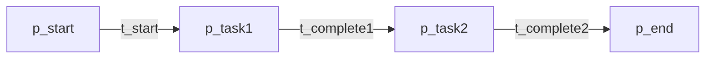

**Places:** `p_start`, `p_task1`, `p_task2`, `p_end`

**Transitions:** `t_start`, `t_complete1`, `t_complete2`, `t_finish`

**Erlang Module:** `sequence`

**Usage Example:**
```erlang
% Execute tasks A then B
sequence:run(#{from => task_a, to => task_b}).
```

**Composition Notes:**
- Compose sequentially by linking end of one to start of next
- Cannot form cycles directly (use P10 Arbitrary Cycles)

**Soundness Properties:**
- Option to complete: Always true
- Proper completion: All tasks execute exactly once
- No dead transitions: All transitions fire exactly once
- Liveness: No deadlock states

---

### P2: Parallel Split

**Category:** Control Flow - Basic

**Description:** Splits a single thread into multiple concurrent branches that execute in parallel.

**Petri Net Structure:**
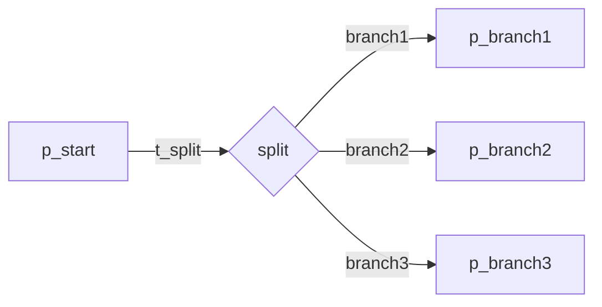

**Places:** `p_start`, `p_branch1`, `p_branch2`, `p_branch3`, `p_branch4`, `p_join_ready`, `p_all_done`, `p_end`

**Transitions:** `t_split`, `t_join_branch1`, `t_join_branch2`, `t_join_branch3`, `t_join_branch4`, `t_finish`

**Erlang Module:** `parallel_split`

**Usage Example:**
```erlang
% Execute 2 branches in parallel
BranchFuns = [fun() -> task_a() end, fun() -> task_b() end],
parallel_split:execute(BranchFuns, InputData).
```

**Composition Notes:**
- Must be paired with P3 (Synchronization) for proper completion
- All branches execute concurrently

**Soundness Properties:**
- Option to complete: Requires synchronization
- Proper completion: Requires synchronization
- No dead transitions: All branches execute
- Liveness: True

---

### P3: Synchronization (AND-Join)

**Category:** Control Flow - Basic

**Description:** Merges multiple concurrent branches, waiting for ALL to complete before continuing.

**Petri Net Structure:**
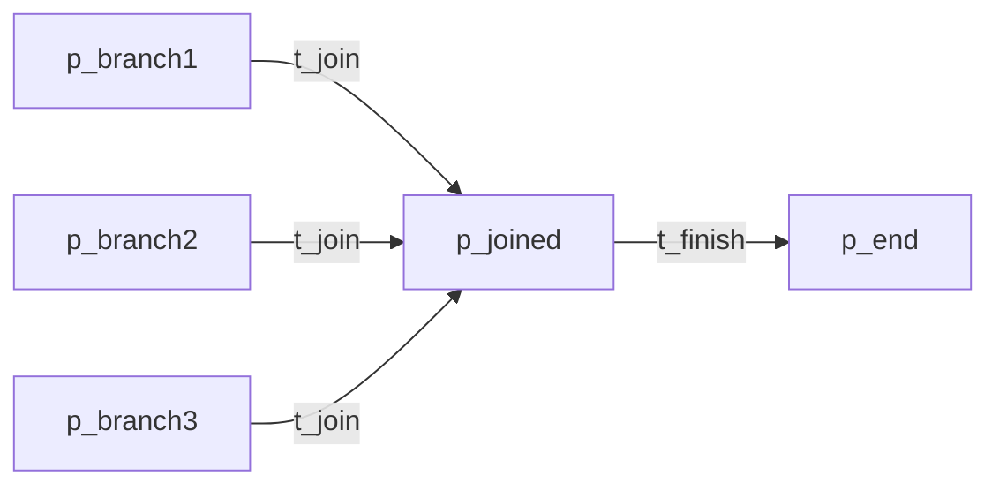

**Places:** `p_start`, `p_branch1`, `p_branch2`, `p_branch3`, `p_joined`, `p_end`

**Transitions:** `t_split`, `t_complete1`, `t_complete2`, `t_complete3`, `t_join`, `t_finish`

**Erlang Module:** `synchronization`

**Usage Example:**
```erlang
% Wait for all branches to complete
synchronization:run(#{waits_for => [p_branch1, p_branch2, p_branch3]}).
```

**Composition Notes:**
- Pair with P2 (Parallel Split)
- t_join enabled only when ALL branches have tokens

**Soundness Properties:**
- Option to complete: Always true
- Proper completion: All branches must complete
- No dead transitions: True
- Liveness: True

---

### P4: Exclusive Choice (XOR-Split)

**Category:** Control Flow - Basic

**Description:** Diverges to exactly one of multiple branches based on condition evaluation.

**Petri Net Structure:**
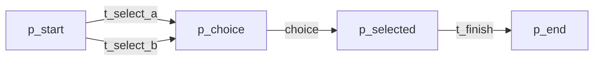

**Places:** `p_start`, `p_choice`, `p_selected`, `p_end`

**Transitions:** `t_select_a`, `t_select_b`, `t_finish`

**Erlang Module:** `exclusive_choice`

**Usage Example:**
```erlang
% Choose branch based on condition
Branches = #{
    branch_a => {fun(X) -> X > 0 end, fun(X) -> X * 2 end},
    branch_b => {fun(X) -> X < 0 end, fun(X) -> X + 1 end}
},
exclusive_choice:execute(Branches, InputData).
```

**Composition Notes:**
- Mutual exclusion: exactly one branch selected
- Pair with P5 (Simple Merge) for XOR join

**Soundness Properties:**
- Option to complete: Always true
- Proper completion: Exactly one output per input
- No dead transitions: One selection always fires
- Mutual exclusion: True

---

### P5: Simple Merge (XOR-Join)

**Category:** Control Flow - Basic

**Description:** Merges multiple branches without synchronization - any incoming branch proceeds.

**Petri Net Structure:**
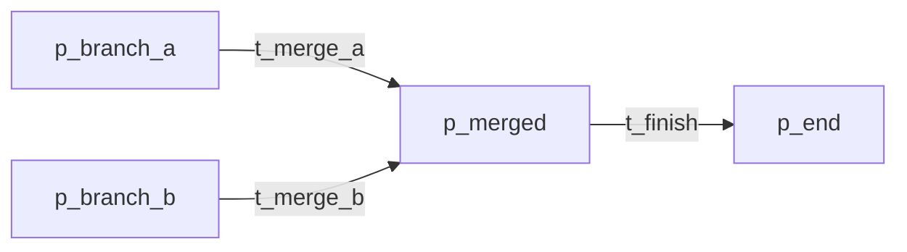

**Places:** `p_start`, `p_branch_a`, `p_branch_b`, `p_merge_ready`, `p_merged`, `p_end`

**Transitions:** `t_split_a`, `t_split_b`, `t_merge_a`, `t_merge_b`, `t_finish`

**Erlang Module:** `simple_merge`

**Usage Example:**
```erlang
% Merge from branch_a or branch_b
simple_merge:execute(
    simple_merge:new(
        fun(X) -> {branch_a, X * 2} end,
        fun(X) -> {branch_b, X + 1} end
    ),
    {branch_a, InputData}
).
```

**Composition Notes:**
- Counterpart to P4 (Exclusive Choice)
- No waiting for all branches - first to arrive proceeds

**Soundness Properties:**
- Option to complete: Always true
- Proper completion: One input produces one output
- No dead transitions: True

---

### P6: Multiple Choice (OR-Split)

**Category:** Control Flow - Basic

**Description:** Selects multiple branches simultaneously based on condition evaluation.

**Petri Net Structure:**
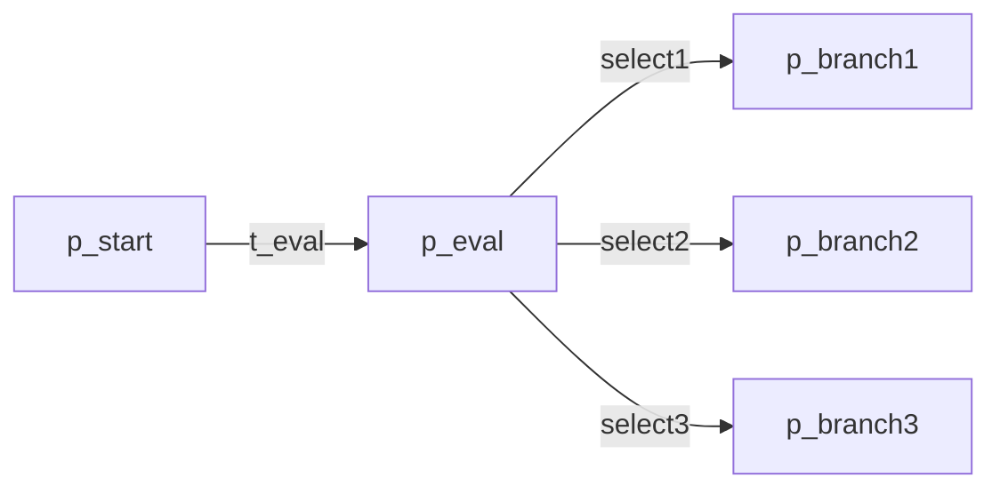

**Places:** `p_start`, `p_eval`, `p_branch1-4`, `p_active_1-4`, `p_done_1-4`, `p_sync`, `p_complete`

**Transitions:** `t_start`, `t_eval`, `t_select_1-4`, `t_exec_1-4`, `t_finish_1-4`, `t_sync`, `t_complete`

**Erlang Module:** `multiple_choice`

**Usage Example:**
```erlang
% Select multiple branches based on conditions
Options = #{
    branch1 => {fun(X) -> X > 0 end, fun(X) -> X * 2 end},
    branch2 => {fun(X) -> X < 10 end, fun(X) -> X + 1 end}
},
multiple_choice:execute(Options, 5).  % Both branches selected
```

**Composition Notes:**
- Multiple branches may be selected (0 to N)
- Pair with P7 (Structured Sync Merge) or P9 (Discriminator)

**Soundness Properties:**
- Option to complete: Always true
- Proper completion: All selected branches complete
- No dead transitions: True

---

### P7: Structured Synchronization Merge

**Category:** Control Flow - Basic

**Description:** N-way merge requiring ALL paths to have been activated before proceeding.

**Places:** `p_merge`, `p_branch_1-N`, `p_end`

**Transitions:** `t_sync_merge`

**Erlang Module:** `structured_sync_merge`

**Composition Notes:**
- Unlike P9 (Discriminator), ALL paths must complete
- Pair with P6 (Multiple Choice)

**Soundness Properties:**
- All branches required: True
- Option to complete: True

---

### P8: Multiple Merge

**Category:** Control Flow - Basic

**Description:** Merges multiple branches without synchronization - any incoming branch can proceed.

**Erlang Module:** `multiple_merge`

**Composition Notes:**
- Similar to P5 but for N branches
- No synchronization requirement

---

### P9: Discriminator

**Category:** Control Flow - Basic

**Description:** N-way merge triggering on FIRST completion, accepting remaining without re-triggering.

**Petri Net Structure:**
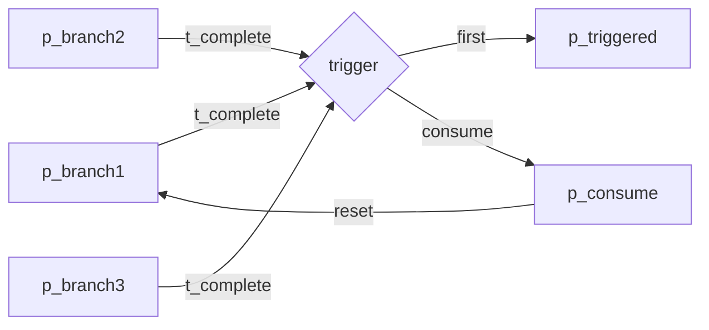

**Places:** `p_input`, `p_branch_pool`, `p_trigger_ready`, `p_triggered`, `p_consume`, `p_reset`, `p_output`

**Transitions:** `t_split`, `t_complete_branch`, `t_trigger`, `t_consume_remaining`, `t_reset`, `t_output`

**Erlang Module:** `discriminator`

**Usage Example:**
```erlang
% First branch to complete triggers output
BranchFuns = [fun slow_task/0, fun fast_task/0, fun medium_task/0],
discriminator:execute(BranchFuns, InputData).
```

**Composition Notes:**
- Exactly ONE output token per N input tokens
- Resets after all branches consumed

**Soundness Properties:**
- Option to complete: Always true
- Proper completion: One output per N inputs
- First completion triggers: True
- No dead transitions: All branches consumed

---

### P10: Arbitrary Cycles

**Category:** Control Flow - Basic

**Description:** Allows cyclic execution paths without structural restrictions.

**Erlang Module:** `arbitrary_cycles`

**Composition Notes:**
- Enables loop constructs
- Must ensure termination conditions

---

### P11: Implicit Termination

**Category:** Control Flow - Basic

**Description:** Workflow terminates when no more activities are enabled.

**Erlang Module:** `implicit_termination`

**Soundness Properties:**
- Automatic termination when quiescent state reached

---

### P12-P15: Multiple Instances Patterns

**Category:** Multi-Instance

**Description:** Create multiple concurrent instances of a subprocess.

| Pattern | Instance Count | When Known | Synchronization |
|---------|---------------|------------|-----------------|
| P12 | N | Design time | No sync |
| P13 | N | Design time | Yes |
| P14 | N | Runtime (known) | Yes |
| P15 | Dynamic | Runtime (unknown) | Yes |

**Petri Net Structure (P13 - Design Time with Sync):**
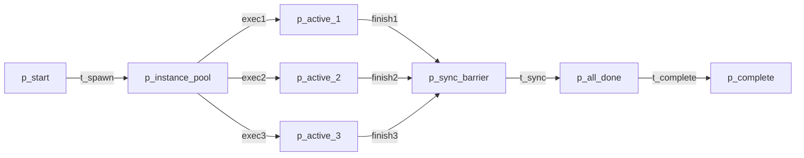

**Erlang Module:** `multiple_instances_sync`

**Usage Example:**
```erlang
% Spawn 3 instances with synchronization
Subprocess = fun(X) -> X * 2 end,
InputData = [1, 2, 3],
multiple_instances_sync:execute(Subprocess, InputData).
```

**Composition Notes:**
- P13: Fixed N, all must complete
- P15: Dynamic N, termination when no more data

**Soundness Properties:**
- Option to complete: Always true (all instances complete)
- Proper completion: All instances complete exactly once
- No dead transitions: All instances reach sync point

---

### P16: Deferred Choice

**Category:** State-Based / Control Flow

**Description:** Choice made at runtime based on which branch becomes available first.

**Petri Net Structure:**
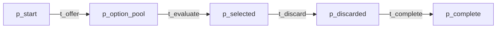

**Places:** `p_start`, `p_offer_pending`, `p_option_pool`, `p_selected`, `p_discarded`, `p_complete`

**Transitions:** `t_offer`, `t_evaluate_option`, `t_select`, `t_discard_others`, `t_complete`

**Erlang Module:** `deferred_choice`

**Usage Example:**
```erlang
% First available option is selected
Options = #{
    option_a => {fun() -> wait_for_event_a() end, 1},
    option_b => {fun() -> wait_for_event_b() end, 2}
},
deferred_choice:execute(Options, EvalData).
```

**Composition Notes:**
- Non-deterministic from static analysis
- Priority-based selection when multiple available

**Soundness Properties:**
- Option to complete: Always true
- Proper completion: Exactly one option selected
- No dead transitions: All options evaluated

---

### P17: Interleaved Parallel Routing

**Category:** Control Flow - Advanced

**Description:** Multiple branches execute in any order (non-deterministic interleaving).

**Petri Net Structure:**
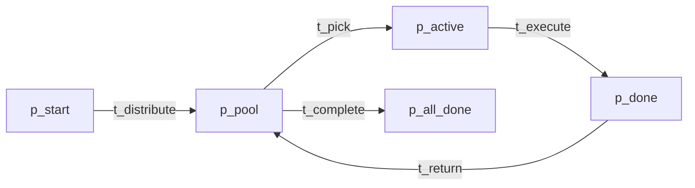

**Places:** `p_start`, `p_pool`, `p_next`, `p_active`, `p_done`, `p_all_done`, `p_end`

**Transitions:** `t_distribute`, `t_pick`, `t_execute`, `t_return`, `t_complete`

**Erlang Module:** `interleaved_routing`

**Usage Example:**
```erlang
% Execute branches in interleaved fashion
Branches = [fun task_a/1, fun task_b/1, fun task_c/1],
interleaved_routing:execute(Branches, InputData).
```

**Composition Notes:**
- All branches complete exactly once
- Execution order is non-deterministic

**Soundness Properties:**
- Option to complete: Always true
- Proper completion: All branches complete
- Interleaving: True

---

### P18: Milestone

**Category:** State-Based

**Description:** Activity enabled only when a specific milestone state has been reached.

**Petri Net Structure:**
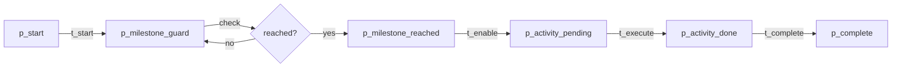

**Places:** `p_start`, `p_milestone_guard`, `p_milestone_ready`, `p_milestone_reached`, `p_activity_pending`, `p_activity_active`, `p_activity_done`, `p_complete`

**Transitions:** `t_start`, `t_check_milestone`, `t_reach_milestone`, `t_enable_activity`, `t_execute`, `t_complete`

**Erlang Module:** `milestone`

**Usage Example:**
```erlang
% Execute activity only after milestone reached
ActivityFun = fun() -> critical_task() end,
MilestoneFun = fun(State) -> State =:= reached end,
milestone:execute(ActivityFun, MilestoneFun, InitialState).
```

**Composition Notes:**
- Acts as guard condition for activity
- Milestone state persists once reached

**Soundness Properties:**
- Option to complete: Always true (milestone eventually reached)
- Proper completion: Activity executes only after milestone
- No dead transitions: True
- State-based: True

---

### P19: Cancel Activity

**Category:** Exception Handling

**Description:** A running activity can be cancelled by an external signal.

**Petri Net Structure:**
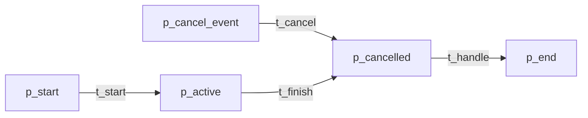

**Places:** `p_start`, `p_active`, `p_cancel_event`, `p_cancelled`, `p_end`

**Transitions:** `t_start`, `t_cancel`, `t_finish`

**Erlang Module:** `cancel_activity`

**Usage Example:**
```erlang
% Start activity that can be cancelled
cancel_activity:start(#{target => my_task, cancel_event => timeout}).
```

**Composition Notes:**
- Either activity completes OR cancellation succeeds
- Resources must be properly released on cancel

**Soundness Properties:**
- Option to complete: True
- Proper completion: Activity or cancel completes
- Cancellable: True
- No dead transitions: False (cancel may leave enabled)

---

### P20: Cancel Case

**Category:** Exception Handling

**Description:** Entire workflow case can be cancelled, terminating all activities.

**Erlang Module:** `cancel_case`

**Composition Notes:**
- Global cancellation terminates all execution
- Propagates to all subprocesses

---

### P21: Structured Loop

**Category:** Control Flow - Basic

**Description:** Repeat a set of activities until a condition is met.

**Erlang Module:** `structured_loop`

**Composition Notes:**
- Bounded iteration recommended
- Must have clear termination condition

---

### P22: Recursion

**Category:** Control Flow - Basic

**Description:** Process calls itself with modified parameters.

**Erlang Module:** `recursion`

**Composition Notes:**
- Must ensure base case is reachable
- Stack depth considerations

---

### P23: Transient Trigger

**Category:** Control Flow - Advanced

**Description:** Trigger is consumed when fired and must be re-established.

**Erlang Module:** `transient_trigger`

**Composition Notes:**
- One-shot trigger behavior
- Requires re-arming for repeated use

---

### P24: Persistent Trigger

**Category:** Control Flow - Advanced

**Description:** Trigger remains active after firing.

**Erlang Module:** `persistent_trigger`

**Composition Notes:**
- Multi-shot trigger behavior
- Remains enabled until explicitly deactivated

---

### P25: Cancel Region

**Category:** Exception Handling

**Description:** Scoped cancellation affecting only specified activities.

**Erlang Module:** `cancel_region`

**Composition Notes:**
- Activities outside region continue
- Region boundaries are well-defined

---

### P26: Cancel MI Activity

**Category:** Exception / Multi-Instance

**Description:** Cancel specific instances within a multi-instance pattern.

**Erlang Module:** `cancel_mi_activity`

**Composition Notes:**
- Selective cancellation of instances
- Remaining instances continue

---

### P27: Complete MI Activity

**Category:** Multi-Instance

**Description:** Explicit completion signal for multi-instance pattern.

**Erlang Module:** `complete_mi_activity`

**Composition Notes:**
- Completes all active instances
- Synchronization point

---

### P28: Blocking Discriminator

**Category:** Advanced Control Flow

**Description:** Discriminator that blocks new triggers until reset complete.

**Erlang Module:** `blocking_discriminator`

**Composition Notes:**
- No overlap between cycles
- Explicit reset required

---

### P29: Cancelling Discriminator

**Category:** Advanced Control Flow

**Description:** Discriminator with cancellation capability.

**Erlang Module:** `cancelling_discriminator`

**Composition Notes:**
- Can cancel pending branches
- Resets after cancellation

---

### P30: Structured Partial Join

**Category:** Advanced Control Flow

**Description:** Join subset of branches with structure preservation.

**Erlang Module:** `structured_partial_join`

**Composition Notes:**
- Requires minimum N branches
- Maintains structural constraints

---

### P31: Blocking Partial Join

**Category:** Advanced Control Flow

**Description:** Partial join with blocking semantics.

**Erlang Module:** `blocking_partial_join`

**Composition Notes:**
- Waits for minimum branch count
- Blocks until threshold met

---

### P32: Cancelling Partial Join

**Category:** Advanced Control Flow

**Description:** Partial join with cancellation support.

**Erlang Module:** `cancelling_partial_join`

**Composition Notes:**
- Can cancel waiting branches
- Cleanup on cancellation

---

### P33: Generalized AND Join

**Category:** Advanced Control Flow

**Description:** AND-join with N-way synchronization and threshold support.

**Petri Net Structure:**
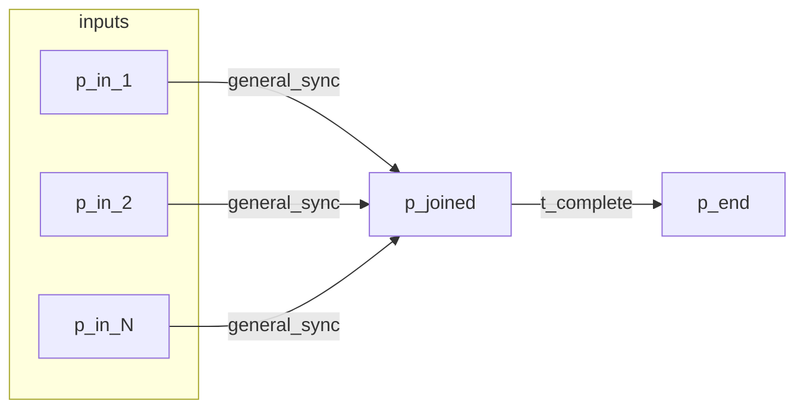

**Erlang Module:** `generalized_and_join`

**Usage Example:**
```erlang
% Join N branches with threshold
generalized_and_join:execute(Branches, Threshold).
```

**Composition Notes:**
- Supports N-way synchronization
- Configurable threshold

---

### P34: Static Partial Join MI

**Category:** Multi-Instance

**Description:** Partial join for multi-instance with static instance count.

**Erlang Module:** `static_partial_join_mi`

**Composition Notes:**
- Known instance count at design time
- Partial completion supported

---

### P35: Cancelling Partial Join MI

**Category:** Multi-Instance

**Description:** Partial join for MI with cancellation support.

**Erlang Module:** `cancelling_partial_join_mi`

**Composition Notes:**
- Can cancel pending instances
- Cleanup on cancellation

---

### P36: Dynamic Partial Join MI

**Category:** Multi-Instance

**Description:** Partial join for MI with dynamic instance count.

**Erlang Module:** `dynamic_partial_join_mi`

**Composition Notes:**
- Instance count determined at runtime
- Dynamic completion threshold

---

### P37: Local Synchronization Merge

**Category:** Advanced Control Flow

**Description:** Synchronization limited to specific workflow scope.

**Erlang Module:** `local_sync_merge`

**Composition Notes:**
- Scoped synchronization
- No global effects

---

### P38: General Synchronization Merge

**Category:** Advanced Control Flow

**Description:** Flexible synchronization merge with configurable semantics.

**Erlang Module:** `general_sync_merge`

**Composition Notes:**
- N-way merge with options
- Configurable behavior

---

### P39: Critical Section

**Category:** Resource

**Description:** Provides mutual exclusion for shared resource access.

**Petri Net Structure:**
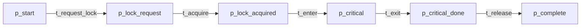

**Places:** `p_start`, `p_lock_request`, `p_lock_wait`, `p_lock_acquired`, `p_critical`, `p_critical_done`, `p_lock_release`, `p_complete`

**Transitions:** `t_request_lock`, `t_acquire_lock`, `t_enter_critical`, `t_execute`, `t_exit_critical`, `t_release_lock`, `t_complete`

**Erlang Module:** `critical_section`

**Usage Example:**
```erlang
% Execute function within critical section
CriticalFun = fun(X) ->
    % Access shared resource
    shared_resource:update(X)
end,
critical_section:execute(CriticalFun, my_lock_id, InputData).
```

**Composition Notes:**
- Mutual exclusion guaranteed
- Uses ETS-based locking
- Lock automatically released on completion

**Soundness Properties:**
- Option to complete: Always true (lock eventually acquired)
- Proper completion: Critical section executes exactly once
- Mutual exclusion: Only one process in critical section
- Liveness: Fair scheduling prevents starvation

---

### P40: Interleaved Routing

**Category:** Advanced Control Flow

**Description:** Non-deterministic interleaving of branch execution.

**Erlang Module:** `interleaved_routing`

**Composition Notes:**
- Branches execute one at a time
- Order is non-deterministic

---

### P41: Thread Merge

**Category:** Advanced Control Flow

**Description:** Merge parallel threads of execution.

**Erlang Module:** `thread_merge`

**Composition Notes:**
- Combine results from multiple threads
- No synchronization requirement

---

### P42: Thread Split

**Category:** Advanced Control Flow

**Description:** Split execution into multiple threads.

**Erlang Module:** `thread_split`

**Composition Notes:**
- Create concurrent execution threads
- Pair with Thread Merge

---

### P43: Explicit Termination

**Category:** Control Flow - Basic

**Description:** Workflow has explicit termination point.

**Erlang Module:** `explicit_termination`

**Composition Notes:**
- Clear termination condition
- No implicit termination

---

## Pattern Composition Rules

### Valid Compositions

| Split Pattern | Valid Join Patterns | Notes |
|---------------|---------------------|-------|
| P2 (Parallel Split) | P3 (Synchronization) | AND-split/AND-join pair |
| P4 (Exclusive Choice) | P5 (Simple Merge) | XOR-split/XOR-join pair |
| P6 (Multiple Choice) | P7 (Structured Sync Merge), P9 (Discriminator) | OR-split with appropriate join |
| P2 (Parallel Split) | P9 (Discriminator) | First-completion semantics |
| P42 (Thread Split) | P41 (Thread Merge) | Thread-based parallelism |

### Invalid Compositions

- P2 (Parallel Split) + P5 (Simple Merge): May cause lost synchronization
- P4 (Exclusive Choice) + P3 (Synchronization): Deadlock (only one branch arrives)

### Nesting Rules

1. **Multi-Instance Patterns**: Can contain any control flow pattern
2. **Exception Patterns**: Can wrap any workflow region
3. **Critical Section**: Should not contain blocking operations outside the section
4. **Cancellation Patterns**: Must have well-defined scope boundaries

### Cycle Composition

- Use P10 (Arbitrary Cycles) for unstructured loops
- Use P21 (Structured Loop) for bounded iteration
- Ensure termination conditions are reachable

---

## Soundness Properties Reference

### Property Definitions

| Property | Description | Verification |
|----------|-------------|--------------|
| **Option to Complete** | From any reachable marking, a final marking is reachable | Model checking on reachability graph |
| **Proper Completion** | Final marking contains exactly one completion token | State space analysis |
| **No Dead Transitions** | No transition is permanently enabled but never fires | Liveness analysis |
| **Liveness** | No deadlock states except final markings | Deadlock detection |
| **Mutual Exclusion** | Only one process in critical section | Invariant checking |
| **Boundedness** | All places have bounded token count | Coverability tree analysis |

### Soundness by Category

| Pattern Category | Option to Complete | Proper Completion | No Dead Transitions |
|------------------|-------------------|-------------------|-------------------|
| Basic Control Flow | Always | Always | Always |
| Advanced Control | Condition-dependent | Condition-dependent | Usually |
| Multi-Instance | Always (with sync) | Always | Always |
| Exception | Always | On completion path | No |
| Resource | Always | Always | Always |

---

## API Quick Reference

### Common Pattern Functions

All pattern modules export these common functions:

```erlang
% Create new pattern state
Pattern:new(Options) -> State

% Start pattern as gen_yawl process
Pattern:start(State) -> {ok, Pid} | {error, Reason}

% Execute pattern synchronously
Pattern:execute(Options, InputData) -> {ok, Result} | {error, Reason}

% Get current pattern state
Pattern:get_state(Pid) -> {ok, State} | {error, Reason}

% Run pattern (start + execute + stop)
Pattern:run(Options, InputData) -> {ok, Result} | {error, Reason}
```

### Pattern-Specific Functions

```erlang
% Critical Section
critical_section:execute(Fun, LockId, InputData)

% Discriminator
discriminator:execute(BranchFuns, InputData)
discriminator:reset(Pid)

% Milestone
milestone:execute(ActivityFun, MilestoneFun, InitialState)
milestone:set_milestone(Pid)

% Multiple Instances
multiple_instances_sync:execute(Subprocess, InputDataList)

% Deferred Choice
deferred_choice:execute(Options, EvalData)
deferred_choice:select_option(Pid, OptionId)
```

---

## Mermaid Diagram Templates

### Basic Control Flow (Sequence)


### Parallel Split + Synchronization
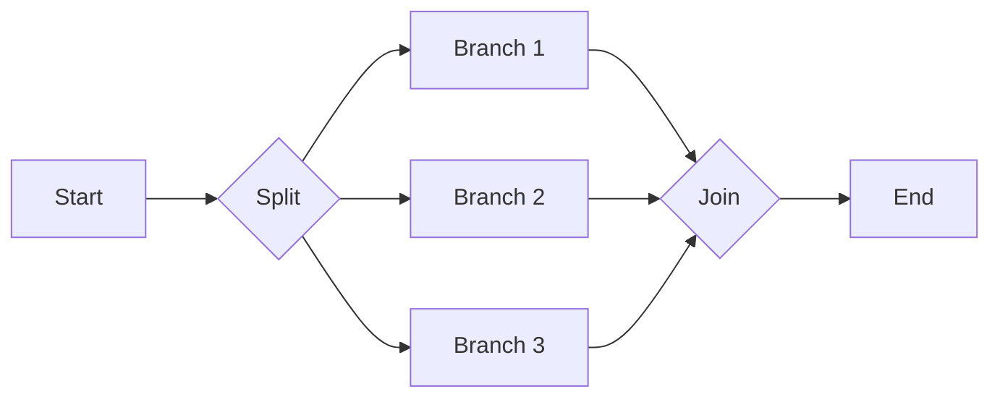

### Exclusive Choice + Simple Merge
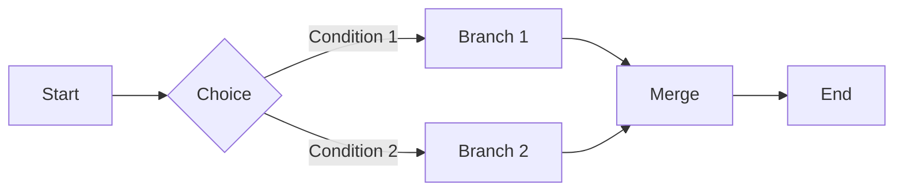

### Discriminator
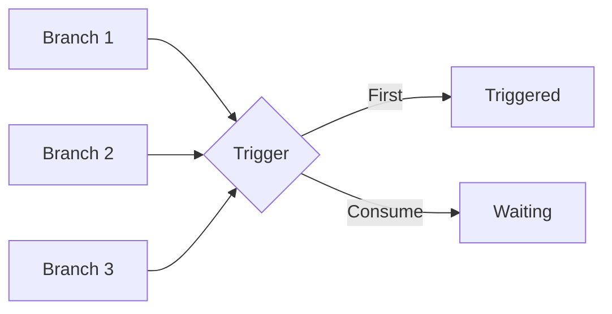

### Critical Section
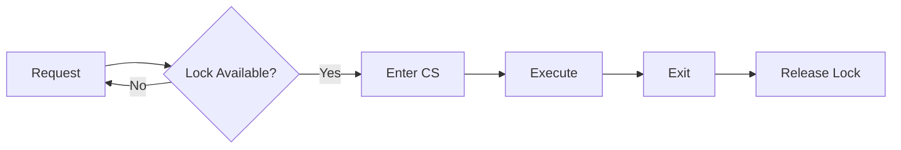

### Multiple Instances
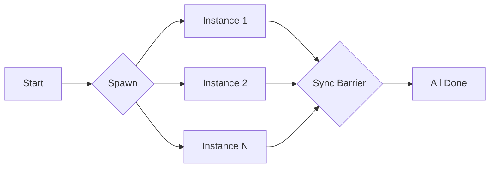

---

## References

1. **van der Aalst, W.M.P., et al.** (2003). "Workflow Patterns"
2. **Russell, N., et al.** (2005). "Workflow Control Patterns"
3. **Workflow Patterns Coalition**: http://www.workflowpatterns.com

---

## Module Index

| Module | Pattern(s) | File |
|--------|------------|------|
| `sequence` | P1 | `/src/patterns/sequence.erl` |
| `parallel_split` | P2 | `/src/patterns/parallel_split.erl` |
| `synchronization` | P3 | `/src/patterns/synchronization.erl` |
| `exclusive_choice` | P4 | `/src/patterns/exclusive_choice.erl` |
| `simple_merge` | P5 | `/src/patterns/simple_merge.erl` |
| `multiple_choice` | P6 | `/src/patterns/multiple_choice.erl` |
| `structured_sync_merge` | P7 | `/src/patterns/structured_sync_merge.erl` |
| `multiple_merge` | P8 | `/src/patterns/multiple_merge.erl` |
| `discriminator` | P9 | `/src/patterns/discriminator.erl` |
| `arbitrary_cycles` | P10 | `/src/patterns/arbitrary_cycles.erl` |
| `implicit_termination` | P11 | `/src/patterns/implicit_termination.erl` |
| `multiple_instances_sync` | P12-P15 | `/src/patterns/multiple_instances_sync.erl` |
| `deferred_choice` | P16 | `/src/patterns/deferred_choice.erl` |
| `interleaved_routing` | P17, P40 | `/src/patterns/interleaved_routing.erl` |
| `milestone` | P18 | `/src/patterns/milestone.erl` |
| `cancel_activity` | P19 | `/src/patterns/cancel_activity.erl` |
| `cancel_case` | P20 | `/src/patterns/cancel_case.erl` |
| `structured_loop` | P21 | `/src/patterns/structured_loop.erl` |
| `recursion` | P22 | `/src/patterns/recursion.erl` |
| `transient_trigger` | P23 | `/src/patterns/transient_trigger.erl` |
| `persistent_trigger` | P24 | `/src/patterns/persistent_trigger.erl` |
| `cancel_region` | P25 | `/src/patterns/cancel_region.erl` |
| `cancel_mi_activity` | P26 | `/src/patterns/cancel_mi_activity.erl` |
| `complete_mi_activity` | P27 | `/src/patterns/complete_mi_activity.erl` |
| `blocking_discriminator` | P28 | `/src/patterns/blocking_discriminator.erl` |
| `cancelling_discriminator` | P29 | `/src/patterns/cancelling_discriminator.erl` |
| `structured_partial_join` | P30 | `/src/patterns/structured_partial_join.erl` |
| `blocking_partial_join` | P31 | `/src/patterns/blocking_partial_join.erl` |
| `cancelling_partial_join` | P32 | `/src/patterns/cancelling_partial_join.erl` |
| `generalized_and_join` | P33 | `/src/patterns/generalized_and_join.erl` |
| `static_partial_join_mi` | P34 | `/src/patterns/static_partial_join_mi.erl` |
| `cancelling_partial_join_mi` | P35 | `/src/patterns/cancelling_partial_join_mi.erl` |
| `dynamic_partial_join_mi` | P36 | `/src/patterns/dynamic_partial_join_mi.erl` |
| `local_sync_merge` | P37 | `/src/patterns/local_sync_merge.erl` |
| `general_sync_merge` | P38 | `/src/patterns/general_sync_merge.erl` |
| `critical_section` | P39 | `/src/patterns/critical_section.erl` |
| `thread_merge` | P41 | `/src/patterns/thread_merge.erl` |
| `thread_split` | P42 | `/src/patterns/thread_split.erl` |
| `explicit_termination` | P43 | `/src/patterns/explicit_termination.erl` |

---

## Pattern Registry

The `yawl_pattern_registry` module maps pattern names to implementations:

```erlang
%% Get module for pattern
yawl_pattern_registry:pattern_module(<<"P1_Sequence">>).
% => sequence

%% Get all patterns
yawl_pattern_registry:all_patterns().
% => [<<"P1_Sequence">>, ..., <<"P43_ExplicitTermination">>]

%% Validate pattern
yawl_pattern_registry:validate_pattern(<<"P1_Sequence">>).
% => true
```

---

*Document Version: 1.0.0*
*Last Updated: 2025*
*CRE Team - Common Runtime Environment*
