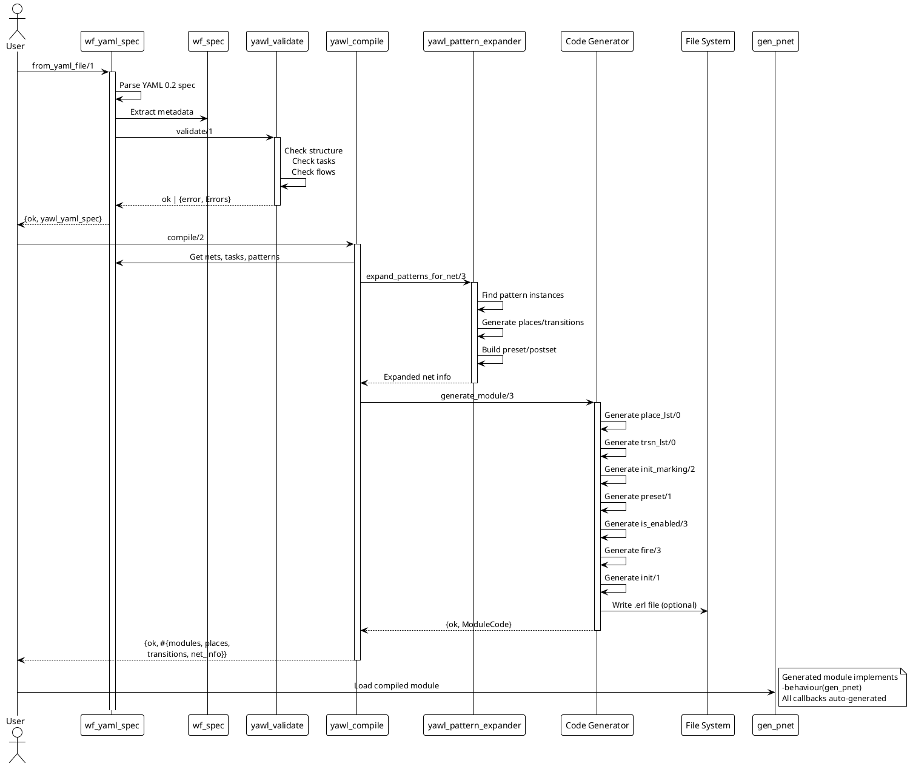
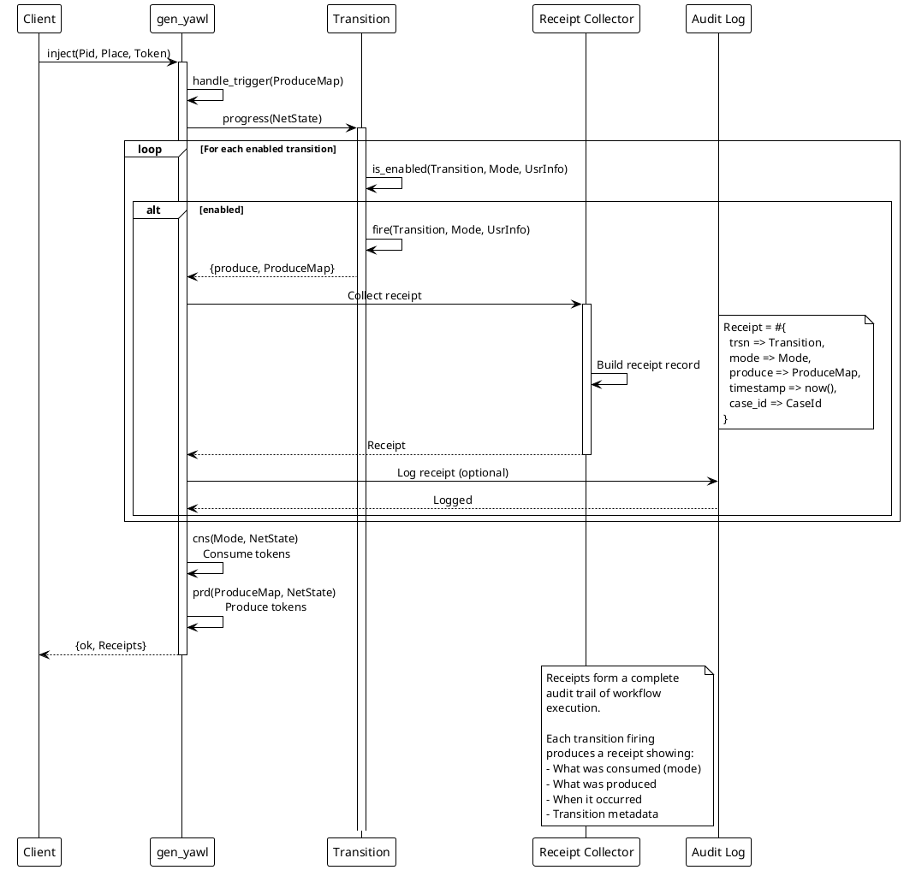
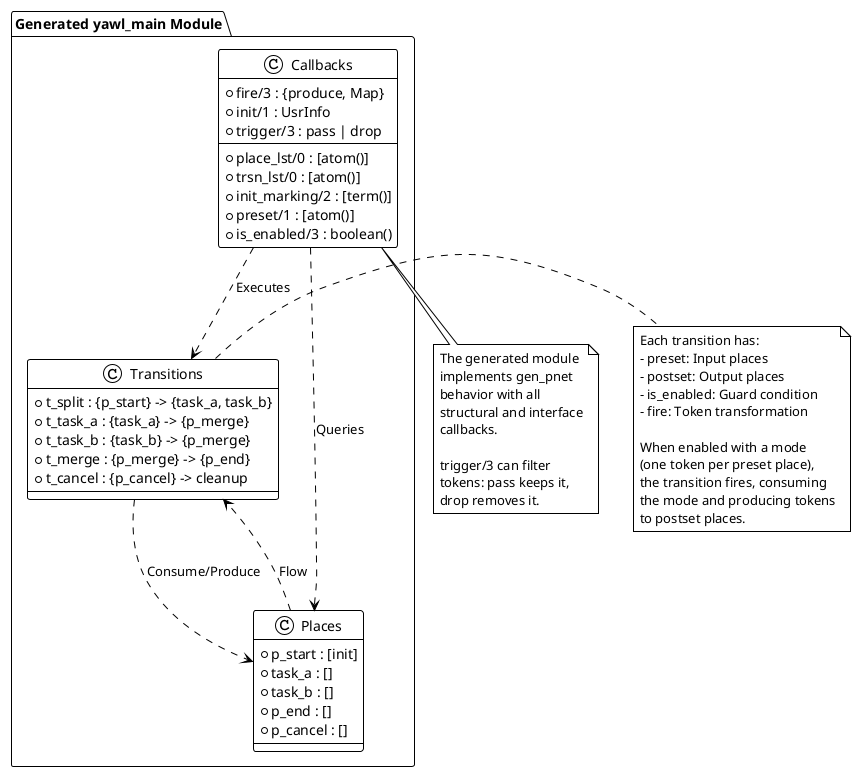
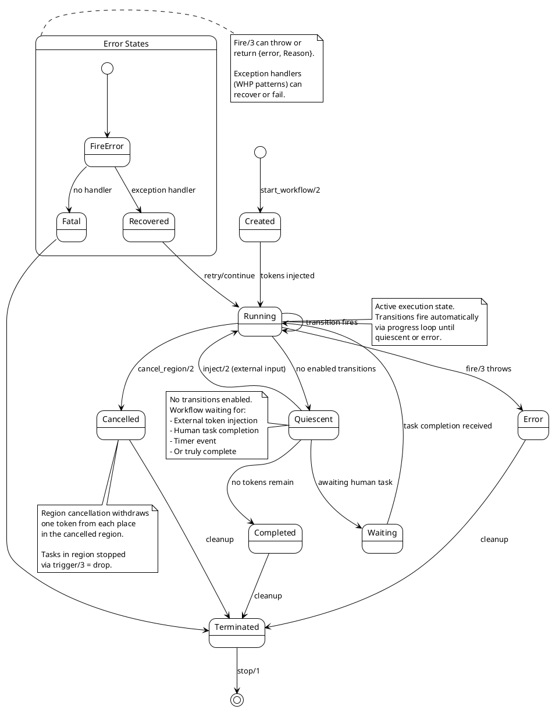
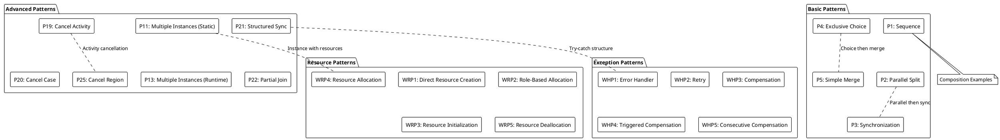

# CRE Architecture - PlantUML Diagrams

This document contains PlantUML diagrams for the CRE (Common Runtime Environment) architecture, illustrating the system design, compilation pipeline, runtime components, and workflow patterns.

---

## 1. System Architecture Overview

```plantuml
@startuml cre-system-architecture
!theme plain
skinparam componentStyle rectangle

package "CRE System" {

  [YAML Parser]\n(wf_yaml_spec) as yaml
  [XML Parser]\n(wf_spec) as xml
  [Validator]\n(yawl_validate) as validate
  [Compiler]\n(yawl_compile) as compile
  [Pattern Expander]\n(yawl_pattern_expander) as expand

  package "Runtime" {
    [gen_yawl\nOTP Runner] as gen_yawl
    [gen_pnet\nPetri Net Behavior] as gen_pnet
    [cre_master\nWorker Pool Manager] as master
  }

  package "Workers" {
    [cre_worker\nTask Worker] as worker
    [cre_yawl_worker\nYAWL Worker] as yawl_worker
  }

  package "Patterns" {
    [cre_yawl_patterns\n43 YAWL Patterns] as patterns
  }

  package "API" {
    [wf_yawl_executor\nWorkflow Executor] as executor
    [cre_yawl_client\nYAWL Client] as client
    [cre_client API\nInterface] as api
  }

  package "Utilities" {
    [pnet_marking\nMarking Algebra] as marking
    [pnet_choice\nDeterministic Choice] as choice
    [wf_task\nTask Constructors] as task
    [wf_scope\nBoundary Mapping] as scope
  }
}

yaml --> validate : Parse
xml --> validate : Parse
validate --> compile : Validate
compile --> expand : Expand Patterns
expand --> executor : Generate Code
executor --> gen_yawl : Start Workflow
gen_yawl --> gen_pnet : Inherits
gen_yawl --> master : Register
master --> worker : Dispatch Tasks
worker --> yawl_worker : Extends
patterns --> expand : Pattern Definitions

note right of gen_yawl
  Single OTP runner
  wraps gen_pnet
  Supports 3-tuple fire/3
  for usr_info updates
end note

note right of master
  Petri net marking-based
  worker pool management
  Uses pnet_marking for
  state tracking
end note

note bottom of patterns
  43 YAWL workflow patterns
  WCP-11 through WCP-28
  Exception handling
  Resource patterns
end note

@enduml
```

---

## 2. Compilation Pipeline



---

## 3. Runtime Architecture (gen_yawl and gen_pnet)

```plantuml
@startuml runtime-architecture
!theme plain
skinparam componentStyle rectangle

package "OTP Behavior Layer" {
  [gen_server] as gen_server
}

package "CRE Petri Net Layer" {
  [gen_pnet] as gen_pnet
  interface NetCallbacks {
    + place_lst/0
    + trsn_lst/0
    + init_marking/2
    + preset/1
    + is_enabled/3
    + fire/3
    + init/1
    + handle_call/3
    + handle_cast/2
    + handle_info/2
    + trigger/3
    + code_change/3
    + terminate/2
  }
}

package "YAWL Workflow Layer" {
  [gen_yawl] as gen_yawl
  interface EnhancedFire {
    + fire/3
    ...
    returns: {produce, Map} | {produce, Map, UsrInfo}
  }
}

package "Generated Workflow" {
  [yawl_main\nAuto-generated] as yawl_main
  [yawl_subprocess\nAuto-generated] as yawl_sub
}

package "Runtime State" {
  record net_state #{
    marking :: #{atom() => [term()]}
    net_mod :: atom()
    usr_info :: term()
    stats :: #stats{} | undefined
    tstart :: integer()
    cnt :: integer()
  }

  record wrapper_state #{
    net_mod :: atom()
    net_state :: #net_state{}
    fire_timeout :: pos_integer()
    progress_timeout :: pos_integer()
    marking_history :: [integer()]
    regions :: #{binary() => [atom()]}
  }
}

gen_server ||..|> gen_pnet : extends
gen_pnet ||..|> gen_yawl : wraps
gen_yawl ..|> NetCallbacks : implements
NetCallbacks <|.. yawl_main : implements
NetCallbacks <|.. yawl_sub : implements
EnhancedFire <|.. yawl_main : implements
EnhancedFire <|.. yawl_sub : implements

gen_yawl --> wrapper_state : maintains
gen_pnet --> net_state : maintains

note right of gen_yawl
  gen_yawl wraps gen_pnet to
  support 3-tuple fire/3 returns
  for automatic usr_info updates.

  Adds cycle detection and
  region cancellation support.
end note

note bottom of yawl_main
  Auto-generated from
  YAWL specification by
  yawl_compile

  One module per
  decomposition net
end note

@enduml
```

---

## 4. Worker Execution Model (cre_worker)

```plantuml
@startuml worker-execution
!theme plain

state "cre_worker Petri Net" as worker_net {
  state "Idle" as idle
  state "Stagein" as stagein
  state "StageinOk" as stagein_ok
  state "StageinError" as stagein_error
  state "PreSync" as presync
  state "Run" as run
  state "Result" as result
  state "Stageout" as stageout
  state "StageoutOk" as stageout_ok
  state "StageoutError" as stageout_error
  state "PostSync" as postsync
  state "Error" as error
  state "WorkerResult" as worker_result

  idle --> stagein : prep_stagein
  stagein --> stagein_ok : do_stagein (ok)
  stagein --> stagein_error : do_stagein (fail)

  stagein_ok --> presync : sync_inok
  stagein_error --> presync : sync_inerror

  presync --> presync : accumulate
  presync --> run : all complete
  presync --> error : any failed : ret_preerror

  run --> result : execute success
  run --> error : execute fail

  result --> stageout : prep_stageout
  stageout --> stageout_ok : do_stageout (ok)
  stageout --> stageout_error : do_stageout (fail)

  stageout_ok --> postsync : sync_outok
  stageout_error --> postsync : sync_outerror

  postsync --> postsync : accumulate
  postsync --> worker_result : all complete
  postsync --> error : any failed : ret_posterror

  error --> worker_result : return_error
  worker_result --> idle : complete
}

note right of worker_net
  cre_worker implements a complete
  task lifecycle as a Petri net with
  12 places and 13 transitions.

  Each task follows:
  1. Request -> Stagein (prepare inputs)
  2. Stagein -> PreSync (accumulate results)
  3. PreSync -> Run (when complete)
  4. Run -> Result -> Stageout
  5. Stageout -> PostSync (accumulate results)
  6. PostSync -> WorkerResult (when complete)
end note

' Places in the worker Petri net
rectangle Places {
  [WorkerRequest] as p1
  [Stagein] as p2
  [StageinOk] as p3
  [StageinError] as p4
  [PreSync] as p5
  [Result] as p6
  [Stageout] as p7
  [StageoutOk] as p8
  [StageoutError] as p9
  [PostSync] as p10
  [Error] as p11
  [WorkerResult] as p12
}

note bottom of Places
  12 Places in cre_worker Petri Net

  Tokens represent:
  - Task requests
  - File staging operations
  - Execution results
  - Synchronization state
  - Final results
end note

@enduml
```

---

## 5. Swarm Coordination Through Workflows

```plantuml
@startuml swarm-coordination
!theme plain
skinparam componentStyle rectangle

package "Agent Swarm" {
  [Coordinator Agent] as coord
  [Research Agent] as research
  [Coder Agent] as coder
  [Tester Agent] as tester
  [Reviewer Agent] as reviewer
}

package "CRE Workflow Engine" {
  [gen_yawl\nWorkflow Runtime] as runtime
  [yawl_main\nOrchestration Net] as workflow
  [cre_master\nWorker Pool] as pool
}

package "Pattern Library" {
  [parallel_split\nP2] as p2
  [synchronization\nP4] as p4
  [exclusive_choice\nP5] as p5
  [sequence\nP1] as p1
  [multi_instance\nP13] as p13
  [discriminator\nP7] as p7
}

package "Task Execution" {
  [cre_yawl_worker\nTask Worker] as worker
  [Task Handler] as handler
}

coord -> runtime : start_workflow(InitialData)
activate runtime
runtime -> workflow : Execute workflow
workflow -> p2 : Split into parallel branches

p2 -> pool : Dispatch tasks
activate pool
pool -> worker : Assign task
worker -> handler : Execute business logic
handler --> worker : Result
worker --> pool : worker_result/4
pool --> workflow : Collect results
deactivate pool

workflow -> p4 : Synchronize branches
workflow -> p5 : Route based on condition
workflow -> p13 : Create multiple instances
workflow -> p7 : Take first completion

workflow --> runtime : Final receipts
runtime --> coord : get_workflow_state/1
deactivate runtime

note right of workflow
  The workflow encodes the
  agent coordination protocol
  as a Petri net structure.

  Each pattern corresponds
  to a coordination primitive:
  - P2: Parallel dispatch
  - P4: Barrier sync
  - P5: Conditional routing
  - P13: Multi-agent parallel
  - P7: First-response selection
end note

note bottom of pool
  cre_master maintains
  worker availability using
  Petri net marking algebra

  Workers register dynamically
  Tasks dispatched via marking
end note

@enduml
```

---

## 6. Receipt Collection (Audit Trail)



---

## 7. Petri Net Structure (Generated Module)



---

## 8. State Machine: Workflow Case Lifecycle



---

## 9. Component Diagram: Core Modules

```plantuml
@startuml core-components
!theme plain
skinparam componentStyle rectangle

package "Core Behavior" {
  [gen_pnet.erl] as genpnet
  [gen_yawl.erl] as genyawl
}

package "Pure Helpers" {
  [pnet_types.erl] as types
  [pnet_marking.erl] as marking
  [pnet_mode.erl] as mode
  [pnet_choice.erl] as choice
}

package "Workflow Utilities" {
  [wf_timerq.erl] as timerq
  [wf_task.erl] as wftask
  [wf_scope.erl] as scope
  [wf_yaml_spec.erl] as yaml
  [wf_spec.erl] as xmlspec
  [yawl_compile.erl] as compile
  [yawl_validate.erl] as validate
}

package "Pattern Modules" {
  [sequence.erl] as seq
  [parallel_split.erl] as par
  [synchronization.erl] as sync
  [exclusive_choice.erl] as xor
  [multi_instance.erl] as mi
  [cancel_region.erl] as cancel
  ... 37 more patterns ...
}

package "Worker Behaviors" {
  [cre_worker.erl] as creworker
  [cre_yawl_worker.erl] as yawlworker
}

package "Coordination" {
  [cre_master.erl] as master
  [cre_client.erl] as client
  [cre_yawl_client.erl] as yawlclient
}

genpnet --> types : uses
genpnet --> marking : uses
genpnet --> mode : uses
genpnet --> choice : uses

genyawl --> genpnet : wraps
genyawl --> marking : uses

compile --> xmlspec : parses
compile --> yaml : parses
compile --> validate : uses

seq ..| genpnet : implements
par ..| genpnet : implements
sync ..| genpnet : implements
xor ..| genpnet : implements
mi ..| genpnet : implements
cancel ..| genpnet : implements

creworker ..| genpnet : implements
yawlworker ..| creworker : extends

master --> marking : uses
master --> choice : uses
master --> wftask : uses

client --> master : coordinates
yawlclient --> client : implements

note right of genpnet
  Pure functional
  Petri net behavior
  No internal state
  Complete net execution
  via progress loop
end note

note left of marking
  Multiset algebra for
  token management

  Operations:
  - new/1
  - get/2
  - set/3
  - add/2
  - take/2
  - apply/2
end note

note bottom of pattern_modules
  Each pattern implements
  gen_pnet behavior

  Places encode pattern state
  Transitions encode pattern logic

  43 patterns covering:
  - Control flow (WCP 1-10)
  - Advanced control (WCP 11-28)
  - Exception handling (WHP 1-5)
  - Resource patterns (WRP 1-5)
end note

@enduml
```

---

## 10. Data Flow: YAWL Specification to Running Workflow

```plantuml
@startuml data-flow
!theme plain
skinparam backgroundColor #FEFEFE

package "Specification" {
  file "workflow.yawl" as yawl
  file "workflow.yaml" as yaml
}

package "Parse & Validate" {
  [wf_spec:from_xml/1] as xml_parser
  [wf_yaml_spec:from_yaml/1] as yaml_parser
  [yawl_validate:validate/1] as validator
}

package "Compilation" {
  [yawl_pattern_expander] as expander
  [yawl_compile:compile/2] as compiler
}

package "Code Generation" {
  [generate_module/3] as generator
  file "yawl_main.erl" as gen_main
  file "yawl_subnet.erl" as gen_sub
}

package "Runtime" {
  [wf_yawl_executor] as executor
  [gen_yawl:start_link/3] as runtime
  [compiled module] as running
}

package "Execution" {
  [inject/2] as inject
  [step/1] as step
  [drain/2] as drain
  [marking/1] as marking
}

yawl -> xml_parser
xml_parser -> validator : yawl_spec
yaml -> yaml_parser
yaml_parser -> validator : yawl_yaml_spec

validator -> expander : validated spec
expander -> compiler : expanded nets
compiler -> generator : net_info
generator -> gen_main : write file
generator -> gen_sub : write file

gen_main -> executor : load_workflow/1
executor -> runtime : start_workflow/2
runtime -> running : spawn process

running -> inject : add tokens
inject -> step : fire once
step -> drain : fire to completion
drain -> marking : query state

note right of expander
  Pattern expansion converts
  pattern instances to concrete
  places and transitions.

  Example:
  P2_ParallelSplit ->
    places: p_start, p_split,
           p_branch_1, p_branch_2
    transitions: t_split
end note

note left of runtime
  gen_yawl wraps the generated
  module, providing:
  - Cycle detection
  - Region cancellation
  - 3-tuple fire/3 support
  - Timeout protection
end note

note bottom of marking
  The marking shows all
  tokens in all places:
  #{p_start => [],
   p_active => [token1],
   p_done => [done]}

  Empty marking means
  workflow complete.
end note

@enduml
```



---

## 11. Pattern Composition



---

## 12. cre_master Worker Pool Management

```plantuml
@startuml master-pool
!theme plain

state "cre_master Worker Pool" as pool {
  state "Idle Workers" as idle
  state "Busy Workers" as busy
  state "Pending Tasks" as pending
  state "Active Executions" as active

  idle --> busy : add_worker/2
  busy --> idle : worker_result (available)

  idle --> active : dispatch task
  active --> pending : worker takes task
  active --> idle : task complete

  pending --> active : worker available
  pending --> idle : worker failed
}

participant "Worker Process" as worker
participant "cre_master" as master

worker -> master : add_worker(CreName, Pid)
activate master
master -> master : Add to p_idle_workers marking
master --> worker : registered
deactivate master

master -> master : cre_request (task arrives)
master -> master : Add to p_pending_tasks marking
master -> worker : Dispatch (if idle available)

worker -> master : worker_result(Pid, A, R)
activate master
master -> master : Update marking
  - Remove from p_busy_workers
  - Check p_pending_tasks
  - If tasks & workers: dispatch
master -> worker : May assign next task
master --> worker : result acknowledged
deactivate master

note right of master
  cre_master uses Petri net
  marking algebra to track:

  - p_idle_workers: Available workers
  - p_busy_workers: Working workers
  - p_pending_tasks: Waiting tasks

  Dispatch is automatic when
  both workers and tasks
  are present.
end note

note bottom of pool
  Deterministic worker selection
  via pnet_choice ensures
  reproducible execution.

  Load balancing via random
  selection from available
  idle workers.
end note

@enduml
```

---

## Rendering Instructions

To render these diagrams:

1. **Online**: Copy each `@startuml ... @enduml` block to https://plantuml.com/plantuml/

2. **VS Code**: Install PlantUML extension, preview this file

3. **Command Line**:
   ```bash
   # Install PlantUML
   brew install plantuml

   # Render a specific diagram
   plantuml diagrams.puml -o output/

   # Render all diagrams in this file
   for diagram in system-architecture compilation-pipeline runtime-architecture; do
     plantuml -tpng -ooutput/ "$diagram.puml"
   done
   ```

4. **As Markdown**: With the PlantUML Markdown preview extension

---

## Module Reference

| Module | Purpose |
|--------|---------|
| `gen_pnet` | Generic Petri net OTP behavior |
| `gen_yawl` | YAWL wrapper with 3-tuple fire/3 support |
| `yawl_compile` | YAWL to gen_pnet code generator |
| `wf_spec` | YAWL XML parser |
| `wf_yaml_spec` | YAWL YAML 0.2 parser |
| `yawl_validate` | Specification validator |
| `yawl_pattern_expander` | Pattern instance expansion |
| `wf_yawl_executor` | High-level workflow executor API |
| `cre_master` | Worker pool manager |
| `cre_worker` | Base worker behavior |
| `cre_yawl_worker` | YAWL task worker |
| `cre_yawl_client` | YAWL client implementation |
| `pnet_marking` | Token marking algebra |
| `pnet_choice` | Deterministic selection |
| `pnet_types` | Type definitions |

---

## Pattern Catalog (43 Patterns)

| ID | Name | Module |
|----|------|--------|
| P1 | Sequence | sequence |
| P2 | Parallel Split | parallel_split |
| P3 | Synchronization | synchronization |
| P4 | Exclusive Choice | exclusive_choice |
| P5 | Simple Merge | simple_merge |
| P6 | Multiple Choice | multiple_choice |
| P7 | Discriminator | discriminator |
| P8 | Multiple Merge | multiple_merge |
| P9 | Synchronizing Merge | synchronizing_merge |
| P10 | General Sync Merge | general_sync_merge |
| P11 | Implicit Termination | implicit_termination |
| P12 | Multiple Instances (No Sync) | multiple_instances_no_sync |
| P13 | Multiple Instances (Static) | multiple_instances_static |
| P14 | Multiple Instances (Runtime) | multiple_instances_runtime |
| P15 | Multiple Instances (Dynamic) | multiple_instances_dynamic |
| P16 | Deferred Choice | deferred_choice |
| P17 | Interleaved Routing | interleaved_routing |
| P18 | Milestone | milestone |
| P19 | Cancel Activity | cancel_activity |
| P20 | Cancel Case | cancel_case |
| P21 | Structured Sync Merge | structured_sync_merge |
| P22 | Partial Join | partial_join |
| P23 | Structured Loop | structured_loop |
| P24 | Recursion | recursion |
| P25 | Cancel Region | cancel_region |
| P26 | Interleaved Loop | interleaved_loop |
| P27 | Critical Section | critical_section |
| P28 | Thread Split | thread_split |
| P29 | Thread Merge | thread_merge |
| P30 | Param Pass | param_pass |
| P31 | N-out-of-M | n_out_of_m |
| P32 | Arbitrary Cycles | arbitrary_cycles |
| WHP1 | Error Handler | error_handler |
| WHP2 | Retry | retry |
| WHP3 | Compensation | compensation |
| WHP4 | Triggered Compensation | triggered_compensation |
| WHP5 | Consecutive Compensation | consecutive_compensation |
| WRP1 | Direct Resource Creation | direct_resource_creation |
| WRP2 | Role-Based Allocation | role_based_allocation |
| WRP3 | Resource Initialization | resource_initialization |
| WRP4 | Resource Allocation | resource_allocation |
| WRP5 | Resource Deallocation | resource_deallocation |

---

*Generated for CRE YAWL Engine Architecture Documentation*
