# YAWL Workflow Engine - State Machine Diagrams

This document provides detailed Mermaid state diagrams for all key state transitions in the YAWL (Yet Another Workflow Language) workflow execution lifecycle within the CRE (Common Runtime Environment).

---

## Table of Contents

1. [Workflow Lifecycle](#1-workflow-lifecycle)
2. [Task Token Lifecycle](#2-task-token-lifecycle)
3. [Receipt Chain Lifecycle](#3-receipt-chain-lifecycle)
4. [Exception Handling Lifecycle](#4-exception-handling-lifecycle)
5. [Swarm Coordination Lifecycle](#5-swarm-coordination-lifecycle)
6. [Human Task Lifecycle](#6-human-task-lifecycle)
7. [Resource Allocation Lifecycle](#7-resource-allocation-lifecycle)
8. [Cancellation Token Lifecycle](#8-cancellation-token-lifecycle)

---

## 1. Workflow Lifecycle

The workflow lifecycle tracks a workflow from specification loading through execution to completion or termination.

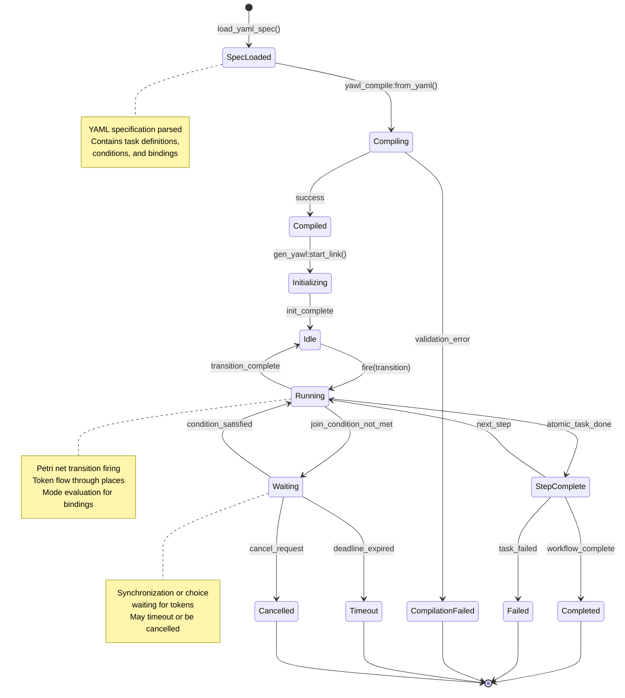

### Workflow States

| State | Description | Transitions From |
|-------|-------------|-----------------|
| `SpecLoaded` | YAML specification parsed into internal format | `[*]` |
| `Compiling` | YAWL compiler generating Petri net module | `SpecLoaded` |
| `Compiled` | Successfully compiled workflow module | `Compiling` |
| `Initializing` | gen_server initialization process | `Compiled` |
| `Idle` | Ready to execute, waiting for tokens | `Initializing`, `Running` |
| `Running` | Actively executing transitions | `Idle`, `Waiting`, `StepComplete` |
| `Waiting` | Blocked on synchronization/conditions | `Running` |
| `StepComplete` | Atomic task completed successfully | `Running` |
| `Completed` | Workflow finished successfully | `StepComplete` |
| `Failed` | Workflow terminated with error | `Running`, `StepComplete` |
| `CompilationFailed` | Spec validation failed | `Compiling` |
| `Timeout` | Deadline exceeded | `Waiting` |
| `Cancelled` | External cancellation request | `Waiting`, `Running` |

### Key Events

- **`load_yaml_spec()`**: Parses YAML workflow specification
- **`yawl_compile:from_yaml()`**: Compiles YAML to Erlang module
- **`fire(transition)`**: Initiates Petri net transition firing
- **`deadline_expired`**: Timeout trigger from `wf_timerq`
- **`cancel_request`**: External cancellation via gen_yawl:cancel()

---

## 2. Task Token Lifecycle

Task tokens represent units of work flowing through the Petri net. Each token has a lifecycle from creation to completion.

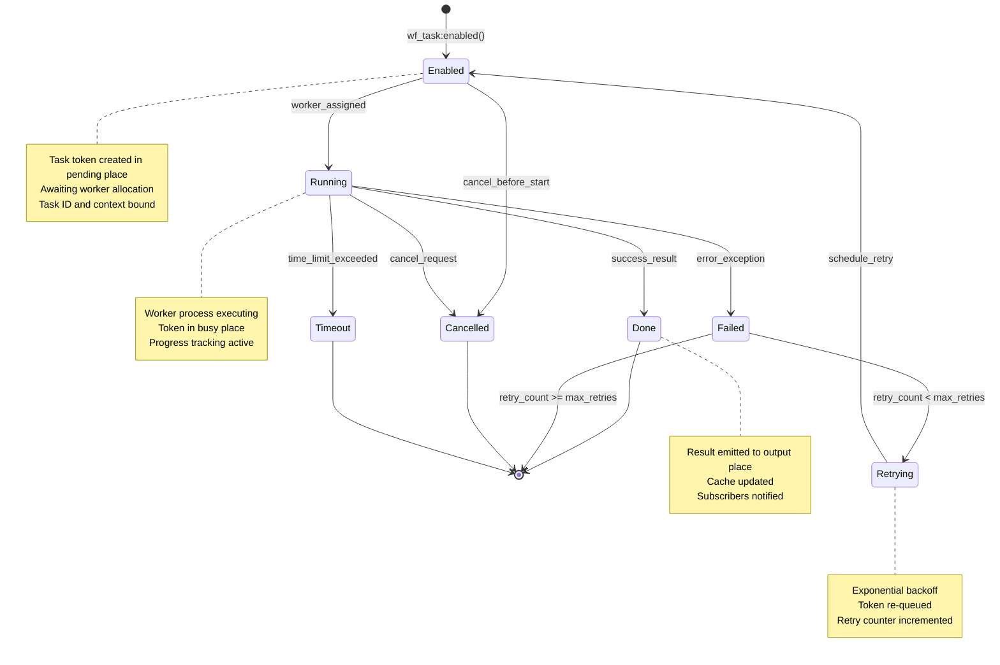

### Task Token States

| State | Place | Description |
|-------|-------|-------------|
| `Enabled` | `p_pending_tasks` | Task created, awaiting worker |
| `Running` | `p_busy_workers` | Worker actively executing |
| `Done` | Output place | Completed successfully |
| `Failed` | Error handling | Exception occurred |
| `Cancelled` | Terminated | Cancelled before/during execution |
| `Timeout` | Timeout handling | Time limit exceeded |
| `Retrying` | Re-queue | Scheduled for retry attempt |

### Token Transitions

```erlang
%% From cre_master.erl - token lifecycle management

%% Enable: create task token in pending place
{produce, EnabledMap} = wf_task:enabled(A, I, ?P_PENDING_TASKS),

%% Running: dispatch to worker (idle -> busy transition)
{produce, RunningMap} = wf_task:running(A, Pid, ?P_BUSY_WORKERS),

%% Done: worker completed (busy -> idle transition)
{produce, DoneMap} = wf_task:done(A, Delta, ?P_IDLE_WORKERS),

%% Failed: error recovery (pending re-queue)
{produce, FailedMap} = wf_task:failed(A, {worker_down, Pid}, ?P_PENDING_TASKS),
```

### Worker Pool Marking

The worker pool uses Petri net marking algebra:

```erlang
%% Initial state: N workers in idle place
Marking = pnet_marking:new([p_idle_workers, p_busy_workers, p_pending_tasks]),
Marking0 = pnet_marking:add(Marking, #{p_idle_workers => [W1, W2, ..., Wn]}),

%% Transition: idle -> busy when task dispatched
{ok, M1} = pnet_marking:take(Marking0, #{p_idle_workers => [W]}),
M2 = pnet_marking:add(M1, #{p_busy_workers => [W]}),

%% Transition: busy -> idle when task completes
{ok, M3} = pnet_marking:take(M2, #{p_busy_workers => [W]}),
M4 = pnet_marking:add(M3, #{p_idle_workers => [W]}),
```

---

## 3. Receipt Chain Lifecycle

Receipts are immutable audit records for state transitions, providing verifiable execution traces.

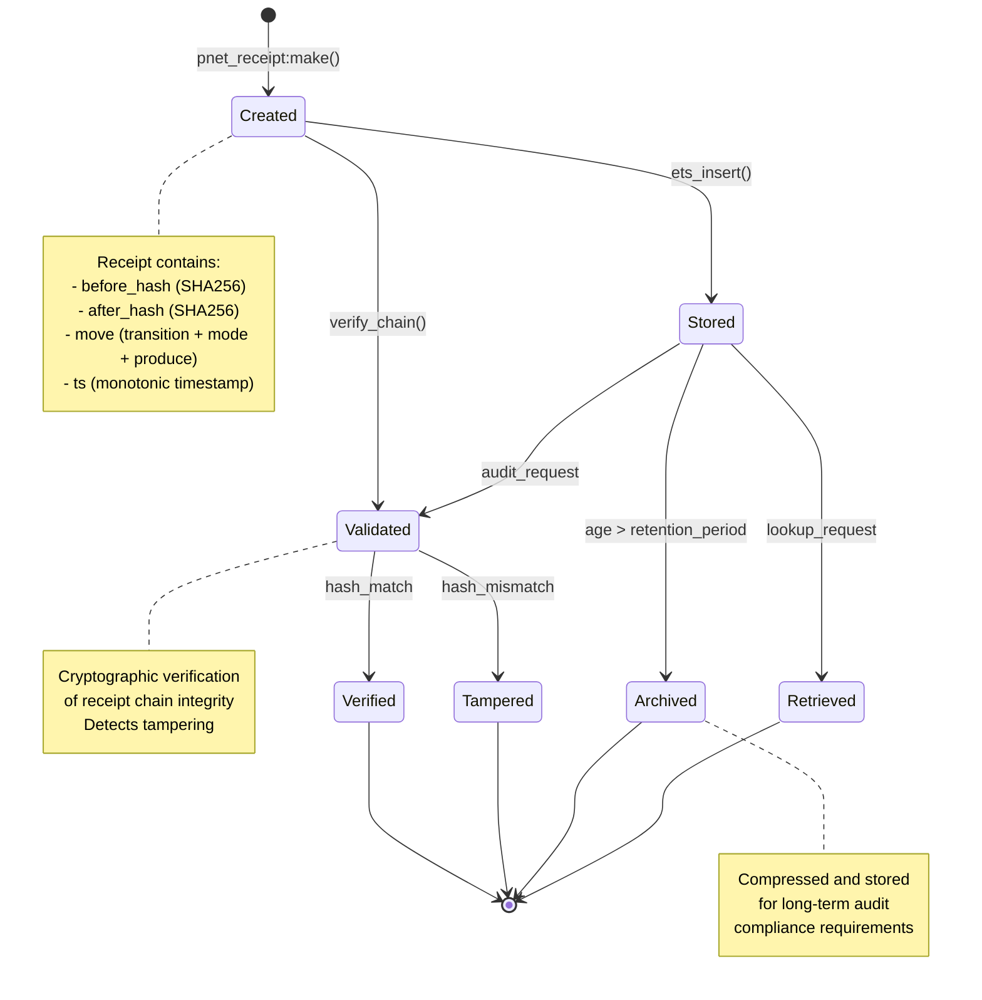

### Receipt Structure

```erlang
%% From pnet_receipt.erl
-type receipt() :: #{
    before_hash := binary(),    %% SHA256 of marking before
    after_hash  := binary(),    %% SHA256 of marking after
    move        := move(),      %% Transition fired
    ts          := integer()    %% Monotonic timestamp
}.

-type move() :: #{
    trsn    := atom(),                           %% Transition name
    mode    := pnet_types:mode() | cmode(),      %% Binding mode
    produce := pnet_types:produce_map()          %% Output tokens
}.
```

### Receipt Creation Flow

```erlang
%% Create receipt during transition firing
BeforeMarking = gen_yawl:get_marking(State),
%% ... execute transition ...
AfterMarking = gen_yawl:get_marking(State),

BeforeHash = crypto:hash(sha256, term_to_binary(BeforeMarking)),
AfterHash  = crypto:hash(sha256, term_to_binary(AfterMarking)),

Move = #{
    trsn    => TransitionName,
    mode    => Mode,
    produce => ProduceMap
},

Receipt = pnet_receipt:make(BeforeHash, AfterHash, Move),
```

### Receipt Chain Verification

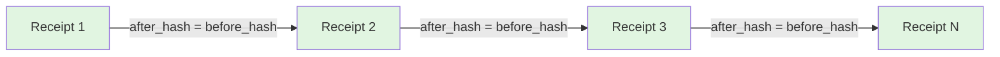

The chain is valid if each receipt's `after_hash` equals the next receipt's `before_hash`.

---

## 4. Exception Handling Lifecycle

Exception handling provides try-catch regions with automatic compensation on error.

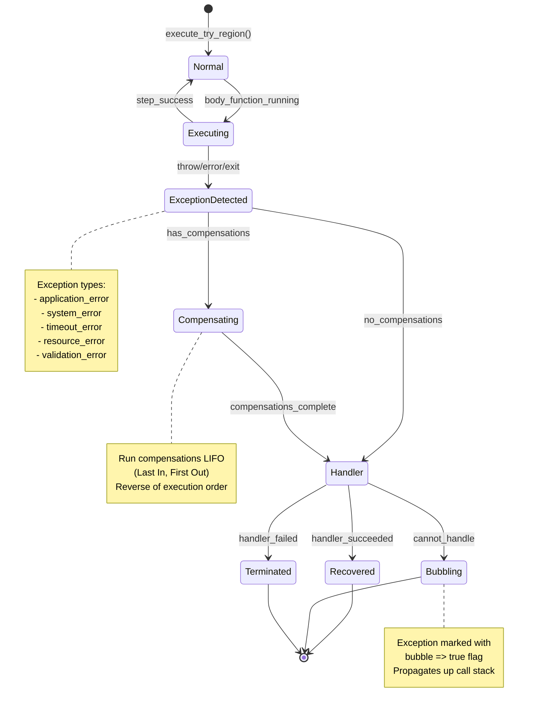

### Exception Types

```erlang
%% From wf_exception.erl
-type exception_type() ::
    application_error |  %% Business logic errors
    system_error      |  %% Technical failures (crash, OOM)
    timeout_error     |  %% Operation exceeded time limit
    resource_error    |  %% Resource unavailable or locked
    validation_error.   %% Input validation failure

-type exception() :: #{
    type     := exception_type(),
    reason   := atom() | binary(),
    data     := map(),
    source   := atom() | binary() | undefined,
    timestamp := integer()
}.
```

### Compensation Structure

```erlang
%% Compensation records undo actions
-type compensation() :: #{
    action   := atom() | function(),
    data     := map(),
    executed := boolean()
}.
```

### Try Region Execution

```erlang
%% From wf_try_region.erl
execute(TryFun, CatchFun, Engine, Compensations) ->
    try
        TryFun()
    catch
        Type:Reason:Stack ->
            Exc = wf_exception:new(Type, Reason, #{
                stack => Stack,
                compensations_count => length(Compensations)
            }),
            %% Run compensations LIFO
            run_compensations(Engine, Exc, lists:reverse(Compensations)),
            %% Call handler
            CatchFun(Exc)
    end.
```

### Exception Bubbling

```erlang
%% Mark exception for propagation
Exc1 = wf_exception:new(application_error, payment_failed, #{}),
Exc2 = wf_exception:bubble(Exc1),  %% Sets bubble => true

%% Check before handling
case wf_exception:is_bubbleable(Exc) of
    true  -> propagate_to_parent(Exc);
    false -> handle_locally(Exc)
end
```

---

## 5. Swarm Coordination Lifecycle

Swarm coordination manages distributed agent execution, task dispatch, and result aggregation.

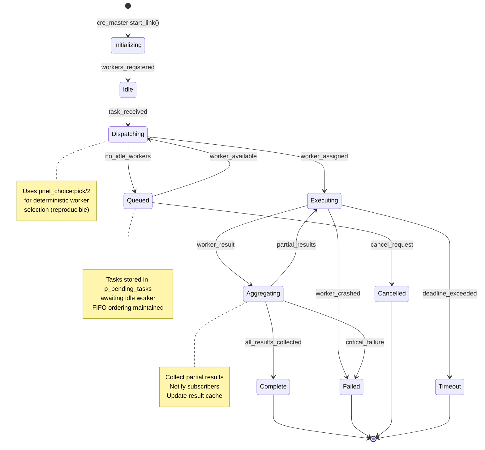

### Swarm Coordination States

| State | Description | Data Structure |
|-------|-------------|----------------|
| `Initializing` | Master process starting, ETS tables created | `#cre_state{}` |
| `Idle` | Workers available, no active tasks | `worker_marking` with idle workers |
| `Dispatching` | Matching pending tasks to idle workers | `attempt_progress/1` |
| `Queued` | Tasks waiting in pending place | `p_pending_tasks` place |
| `Executing` | Workers actively processing | `p_busy_workers` place |
| `Aggregating` | Collecting results from workers | `busy_map` + `subscr_map` |
| `Complete` | All tasks finished successfully | `cache` updated |
| `Failed` | Worker crashed or task failed | Error logged |
| `Cancelled` | Workflow cancelled | Clean-up performed |
| `Timeout` | Task exceeded deadline | Timeout handler invoked |

### Worker Selection Algorithm

```erlang
%% From cre_master.erl
attempt_progress(CreState) ->
    #cre_state{
        worker_marking = Marking,
        queue = Queue
    } = CreState,

    case Queue of
        [] -> CreState;  %% No pending tasks
        [A | Queue1] ->
            {ok, IdleWorkers} = pnet_marking:get(Marking, p_idle_workers),
            case IdleWorkers of
                [] -> CreState;  %% No workers available
                [_ | _] ->
                    %% Deterministic worker selection
                    {Pid, RngState1} = pnet_choice:pick(IdleWorkers, RngState),
                    %% Marking transition
                    {ok, M1} = pnet_marking:take(Marking, #{p_idle_workers => [Pid]}),
                    M2 = pnet_marking:add(M1, #{p_busy_workers => [Pid]}),
                    %% Dispatch
                    cre_worker:worker_request(Pid, A)
            end
    end.
```

### Result Aggregation

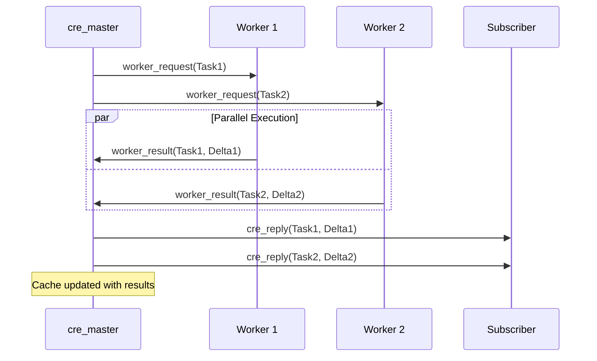

---

## 6. Human Task Lifecycle

Human tasks represent work items requiring human interaction, approval, or decision.

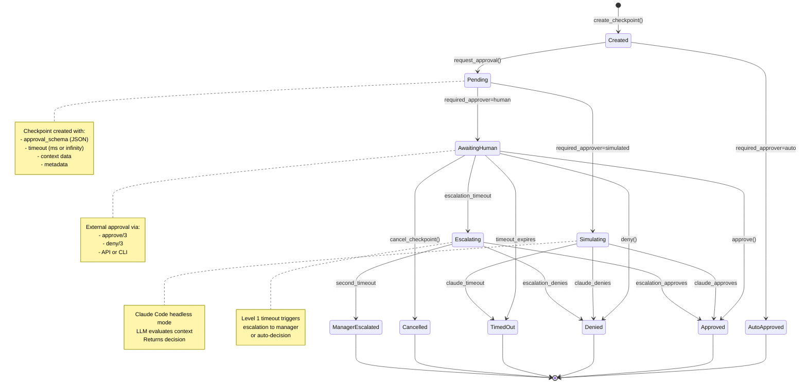

### Human Task States

| State | Status | Description |
|-------|--------|-------------|
| `Created` | checkpoint_created | Checkpoint initialized, not yet requested |
| `Pending` | pending | Approval requested, awaiting decision |
| `AwaitingHuman` | pending | Waiting for external human approval |
| `Simulating` | pending | LLM evaluating approval decision |
| `Approved` | approved | Decision granted |
| `Denied` | denied | Decision rejected |
| `TimedOut` | timeout | No decision within timeout period |
| `Cancelled` | cancelled | Cancelled before decision |
| `AutoApproved` | approved | Auto-approved based on rules |
| `Escalating` | pending | Escalation due to timeout |
| `ManagerEscalated` | timeout/decision | Second-level escalation complete |

### Approval Decision Record

```erlang
%% From cre_yawl.hrl
-record(approval_decision, {
    checkpoint_id  :: binary(),
    approved       :: boolean(),
    decision_maker :: pid() | atom() | binary(),  %% Who decided
    reason         :: binary(),                    %% Justification
    metadata       :: map(),                       %% Additional data
    decided_at     :: integer()                    %% Timestamp
}).
```

### Approval Flow with Receipt

```erlang
%% From yawl_approval.erl
do_approve(CheckpointId, Approver, Reason, State) ->
    %% Create decision record
    Decision = #approval_decision{
        checkpoint_id => CheckpointId,
        approved => true,
        decision_maker => Approver,
        reason => to_binary(Reason),
        decided_at => erlang:system_time(millisecond)
    },

    %% Create done task token
    _DoneToken = wf_task:done(CheckpointId, Decision, 'p_approval_complete'),

    %% Create audit receipt
    BeforeHash = crypto:hash(sha256, term_to_binary({checkpoint, Checkpoint})),
    AfterHash = crypto:hash(sha256, term_to_binary({decision, Decision})),
    Move = #{
        trsn => approve,
        mode => #{checkpoint => CheckpointId, approver => Approver},
        produce => #{'p_approval_complete' => [{task, CheckpointId, done, Decision}]}
    },
    Receipt = pnet_receipt:make(BeforeHash, AfterHash, Move),

    %% Store for audit
    ets:insert(yawl_approval_receipts, {{receipt, CheckpointId}, Receipt}),

    %% Notify waiters
    notify_waiters(CheckpointId, Decision, State#state.waiters).
```

---

## 7. Resource Allocation Lifecycle

Resource allocation manages participant assignment to tasks with role-based distribution.

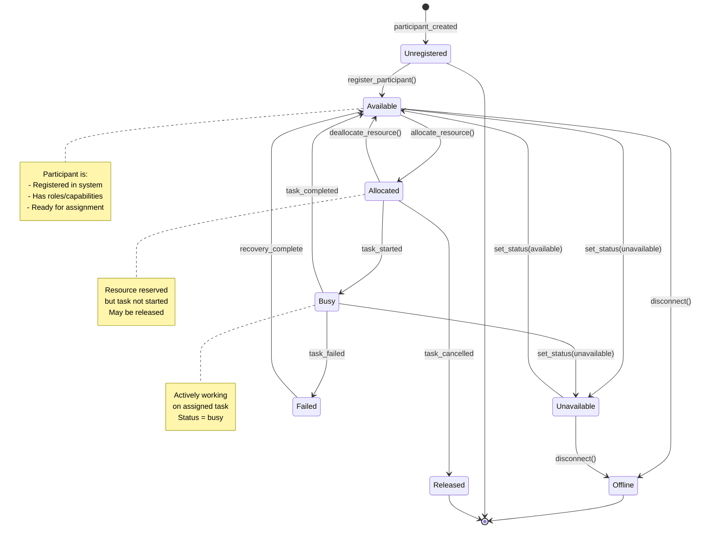

### Participant States

| State | Status | Description |
|-------|--------|-------------|
| `Unregistered` | N/A | Not in participant registry |
| `Available` | available | Free for task assignment |
| `Allocated` | reserved | Reserved for task, not yet started |
| `Busy` | busy | Actively working on task |
| `Unavailable` | unavailable | Temporarily unavailable |
| `Offline` | offline | Not connected to system |
| `Failed` | error | Task execution failed |
| `Released` | N/A | Allocation cancelled |

### Participant Record

```erlang
%% From yawl_resourcing.erl
-record(participant, {
    id           :: binary(),
    name         :: binary(),
    roles        :: [binary()],
    capabilities :: [binary()],
    is_user      :: boolean(),
    resource_type :: human | machine | non_human | system,
    status       :: available | busy | unavailable | offline,
    metadata     :: map()
}).
```

### Resource Allocation Flow

```erlang
%% Find available participants by role
find_available_participants(Participants, RoleList) ->
    lists:filter(
        fun(#participant{status = available, roles = Roles}) ->
            case RoleList of
                [] -> true;
                _ -> lists:any(fun(Role) -> lists:member(Role, Roles) end, RoleList)
            end;
           (_) -> false
        end,
        maps:values(Participants)
    ).

%% Allocate to task
allocate_resource(TaskId, RoleList, Strategy) ->
    AvailableParticipants = find_available_participants(Participants, RoleList),
    case AvailableParticipants of
        [] -> {error, no_resources_available};
        [Participant | _] ->
            AllocationId = generate_id(<<"allocation">>),
            Allocation = #resource_allocation{
                allocation_id => AllocationId,
                task_id => TaskId,
                participant_id => Participant#participant.id,
                allocated_at => erlang:timestamp(),
                status => active
            },
            {ok, AllocationId}
    end.
```

---

## 8. Cancellation Token Lifecycle

Cancellation tokens support cooperative cancellation throughout workflow execution.

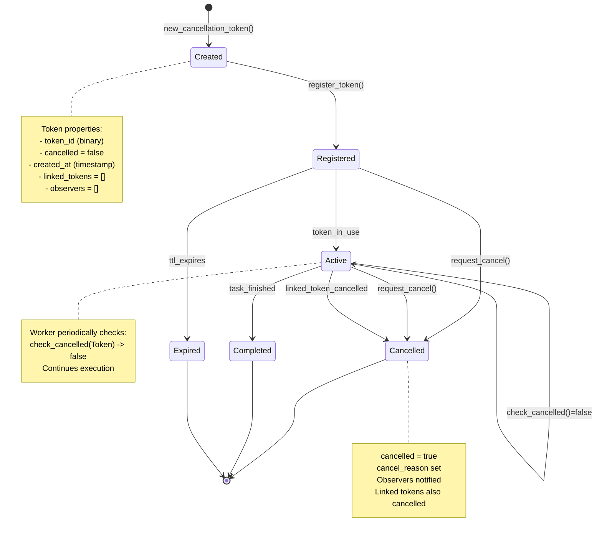

### Cancellation Token Structure

```erlang
%% From yawl_timeout.erl
-record(cancellation_token, {
    token_id        :: binary(),
    cancelled       :: boolean(),
    cancel_reason   :: term() | undefined,
    linked_tokens   :: [binary()],
    observers       :: [pid()],
    created_at      :: integer()
}).
```

### Cancellation Propagation

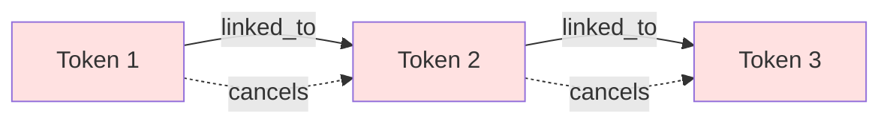

When a token is cancelled, all linked tokens are also cancelled recursively:

```erlang
%% Cancellation propagates through links
handle_call({request_cancel, TokenId, Reason}, _From, State) ->
    case maps:get(TokenId, State#timeout_state.cancellation_tokens, undefined) of
        #cancellation_token{linked_tokens = Linked} = Token ->
            UpdatedToken = Token#cancellation_token{
                cancelled = true,
                cancel_reason = Reason
            },
            %% Cancel linked tokens
            lists:foreach(fun(LinkedId) ->
                request_cancel(LinkedId, {linked, TokenId, Reason})
            end, Linked),
            %% Notify observers
            notify_observers(Token#cancellation_token.observers,
                           {cancelled, TokenId, Reason}),
            {reply, ok, State};
        undefined ->
            {reply, {error, not_found}, State}
    end.
```

### Cancellation Check Pattern

```erlang
%% Worker processes periodically check
do_work(CancelToken, WorkFn) ->
    case yawl_timeout:check_cancelled(CancelToken) of
        false ->
            %% Continue work
            WorkFn(),
            do_work(CancelToken, WorkFn);
        true ->
            %% Exit gracefully
            {error, cancelled}
    end.

%% Or use throw_if_cancelled for immediate exit
step(CancelToken) ->
    ok = yawl_timeout:throw_if_cancelled(CancelToken),
    %% Continue with step logic
    ...
```

---

## State Transition Summary Tables

### Common Events

| Event | Source | Triggers |
|-------|--------|----------|
| `load_yaml_spec()` | External | File system load |
| `yawl_compile:from_yaml()` | Compilation | YAML to module |
| `fire(transition)` | gen_yawl | Token enables transition |
| `worker_result()` | cre_worker | Task completion |
| `request_cancel()` | External | Cancellation request |
| `timeout` | wf_timerq/yawl_timeout | Deadline exceeded |
| `approve()` | External | Human approval |
| `deny()` | External | Human rejection |

### Error Recovery Patterns

| Error Type | Recovery Strategy | Result State |
|------------|------------------|--------------|
| `worker_down` | Re-queue task | Queued |
| `validation_error` | Handler decision | Recovered / Failed |
| `timeout_error` | Compensation | Compensating |
| `resource_error` | Retry with backoff | Retrying |
| `application_error` | Bubble or handle | Bubbling / Recovered |

---

## Related Modules

| Module | Purpose | Key State Machines |
|--------|---------|-------------------|
| `gen_yawl` | Workflow runtime | Workflow Lifecycle |
| `cre_master` | Worker pool management | Swarm Coordination |
| `wf_task` | Token constructors | Task Token Lifecycle |
| `pnet_receipt` | Audit receipts | Receipt Chain Lifecycle |
| `wf_exception` | Exception handling | Exception Handling Lifecycle |
| `wf_try_region` | Try-catch regions | Exception Handling Lifecycle |
| `yawl_approval` | Human approval | Human Task Lifecycle |
| `yawl_resourcing` | Resource allocation | Resource Allocation Lifecycle |
| `yawl_timeout` | Timeouts and cancellation | Cancellation Token Lifecycle |

---

## References

- [YAWL Specification](https://www.yawlfoundation.org/)
- [Petri Net Basics](https://en.wikipedia.org/wiki/Petri_net)
- [CRE Architecture](./architecture.md)
- [gen_pnet Documentation](./gen_pnet.md)
- [Workflow Patterns](./workflow_patterns.md)
