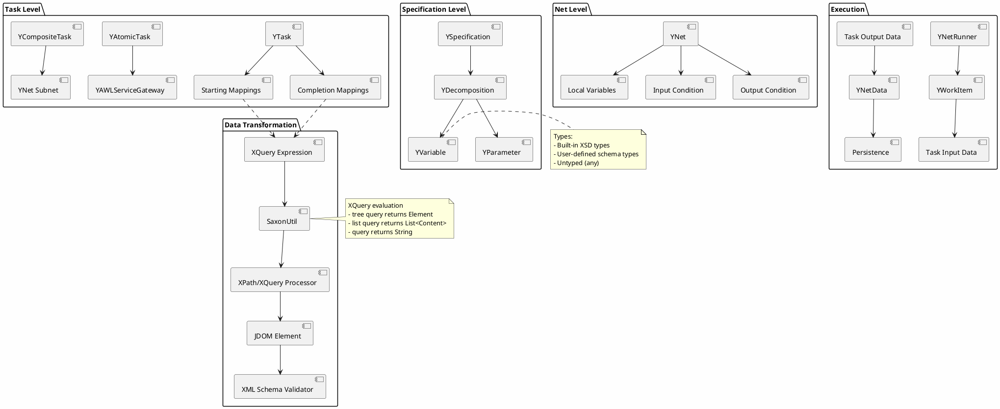
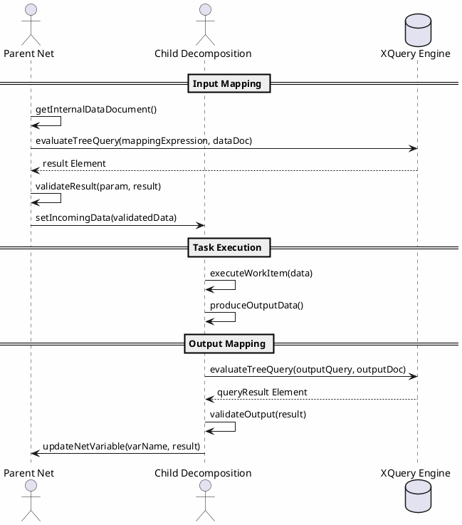
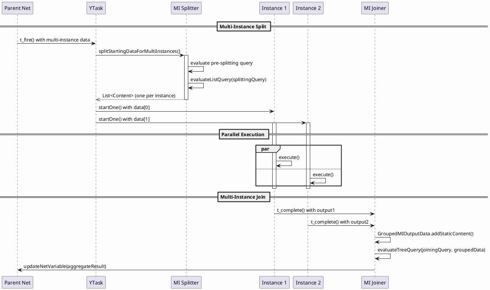
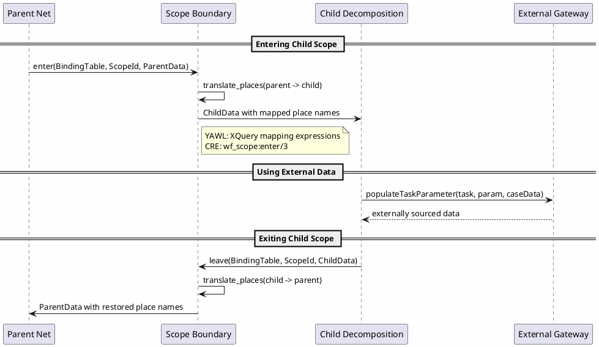

# YAWL Data Flow Implementation Analysis

## Overview

This document analyzes the YAWL (Yet Another Workflow Language) Java implementation's data flow architecture, comparing it with CRE's token-based approach. YAWL uses an XML-centric data model with XQuery for data transformation, while CRE uses Erlang tokens with pattern matching.

## Table of Contents

1. [Variable Scoping Rules](#variable-scoping-rules)
2. [Data Mapping (Input/Output)](#data-mapping-inputoutput)
3. [XQuery Integration](#xquery-integration)
4. [Comparison with CRE Token-Based Data Flow](#comparison-with-cre-token-based-data-flow)
5. [Data Flow Diagrams](#data-flow-diagrams)

---

## Variable Scoping Rules

### YAWL Scoping Hierarchy

YAWL implements a three-level scoping model:

```
Specification (Root)
    |
    +-- Net (Decomposition)
        |
        +-- Local Variables
        +-- Input Parameters
        +-- Output Parameters
```

### Key Classes

**YVariable** (`/Users/sac/cre/vendors/yawl/src/org/yawlfoundation/yawl/elements/data/YVariable.java`)
- Base class for all data containers
- Properties:
  - `_name`: Variable identifier
  - `_dataTypeName`: XML Schema type reference
  - `_initialValue`: Starting value
  - `_defaultValue`: Fallback value
  - `_namespaceURI`: Type namespace
  - `_isUntyped`: Flag for untyped variables
  - `_isEmptyTyped`: Flag for empty complex types
  - `_ordering`: Sequence position

**YParameter** (`/Users/sac/cre/vendors/yawl/src/org/yawlfoundation/yawl/elements/data/YParameter.java`)
- Extends YVariable for decomposition parameters
- Three types defined:
  ```java
  public static final int _INPUT_PARAM_TYPE = 0;
  public static final int _OUTPUT_PARAM_TYPE = 1;
  public static final int _ENABLEMENT_PARAM_TYPE = 2;
  ```
- Special property: `_cutsThroughDecompositionStateSpace`
  - When true on output parameters, bypasses decomposition state
  - Used for control-flow-only data

**YDecomposition** (`/Users/sac/cre/vendors/yawl/src/org/yawlfoundation/yawl/elements/YDecomposition.java`)
- Container for parameters and variables
- Maintains separate maps:
  ```java
  private Map<String, YParameter> _inputParameters;
  private Map<String, YParameter> _outputParameters;
  private Map<String, YParameter> _enablementParameters;
  ```
- Stores runtime data in `_data` (Document)
- Output filtering via `getOutputData()`:
  ```java
  public Document getOutputData() {
      // Returns only output parameters, ordered
      // Excludes internal variables and input-only parameters
  }
  ```

**YNet** (`/Users/sac/cre/vendors/yawl/src/org/yawlfoundation/yawl/elements/YNet.java`)
- Extends YDecomposition for nets
- Adds `_localVariables` map
- Variables initialized via `initialise()`:
  ```java
  public void initialise(YPersistenceManager pmgr) {
      for (YVariable variable : _localVariables.values()) {
          if (variable.getInitialValue() != null) {
              addData(pmgr, new XNode(varElementName,
                      variable.getInitialValue()).toElement());
          }
      }
  }
  ```

### Scoping Rules Summary

| Scope | Accessible From | Lifetime |
|-------|----------------|----------|
| Net Local Variables | Parent tasks only, via XQuery mapping | Entire net lifetime |
| Input Parameters | Decomposition internal use | From task start until decomposition completes |
| Output Parameters | Parent net (via mapping expressions) | Generated on decomposition completion |
| Enablement Parameters | Legacy (deprecated in 2.0) | Task enablement phase |

---

## Data Mapping (Input/Output)

### Mapping Storage in YTask

YAWL stores mapping expressions in maps within `YTask`:

```java
// Key: Parameter name, Value: XQuery expression
private final Map<String, String> _dataMappingsForTaskStarting;

// Key: XQuery expression, Value: Net variable name
private final Map<String, String> _dataMappingsForTaskCompletion;

// Deprecated since 2.0
private final Map<String, String> _dataMappingsForTaskEnablement;
```

### Input Mapping Flow

```
Parent Net Data
      |
      v
[getStartingDataSnapshot()] (YTask.java:1073)
      |
      +-- For each input parameter:
      |
      +-- Get mapping expression: _dataMappingsForTaskStarting.get(paramName)
      |
      +-- Evaluate XQuery against parent data: performDataExtraction()
      |
      +-- Validate result against parameter type
      |
      v
Child Decomposition Input Data
```

Key methods:
- `getStartingDataSnapshot()` (YTask:1073): Builds input data for child instance
- `performDataExtraction()` (YTask:1133): Evaluates XQuery and validates
- `prepareDataForInstanceStarting()` (YTask:1062): Entry point for data preparation

### Output Mapping Flow

```
Decomposition Output Data
      |
      v
[t_complete()] (YTask.java:509)
      |
      +-- For each completion mapping:
      |
      +-- Get expression: _dataMappingsForTaskCompletion.keySet()
      |
      +-- Evaluate against output data: evaluateTreeQuery()
      |
      +-- Get target net variable: _dataMappingsForTaskCompletion.get(query)
      |
      +-- Store in _localVariableNameToReplaceableOutputData
      |
      v
[t_exit()] (YTask.java:743)
      |
      +-- performDataAssignmentsAccordingToOutputExpressions()
      |
      +-- Update parent net variables
      |
      v
Parent Net Updated
```

Key methods:
- `t_complete()` (YTask:509): Receives output data, applies mappings
- `performDataAssignmentsAccordingToOutputExpressions()` (YTask:793): Updates parent
- `validateOutputs()` (YTask:652): Schema validation

### External Data Gateway

YAWL supports external data sources via `ExternalDataGateway`:

```java
// Check for external mapping expression
if (ExternalDataGatewayFactory.isExternalDataMappingExpression(expression)) {
    result = performExternalDataExtraction(expression, parameter);
}
```

Interface methods:
- `populateTaskParameter()`: Fetch data when task starts
- `updateFromTaskCompletion()`: Write data when task completes
- `populateCaseData()`: Initialize case variables
- `updateFromCaseData()`: Persist case output

---

## XQuery Integration

### SaxonUtil Wrapper

**SaxonUtil** (`/Users/sac/cre/vendors/yawl/src/org/yawlfoundation/yawl/util/SaxonUtil.java`)

YAWL wraps Saxon's XQuery processor:

```java
private static final Processor _processor = new Processor(false);
private static final XQueryCompiler _compiler = _processor.newXQueryCompiler();
private static final DOMOutputter _domOutputter = new DOMOutputter();
```

### Evaluation Methods

| Method | Purpose | Returns |
|--------|---------|---------|
| `evaluateQuery()` | Execute XQuery against document | String (XML) |
| `evaluateTreeQuery()` | Execute XQuery, parse to element | Element |
| `evaluateListQuery()` | Execute XQuery, return list | List<Content> |
| `compileXQuery()` | Pre-compile for reuse | XQueryExecutable |

### XQuery Usage in YTask

**Flow Predicates:**
```java
private boolean evaluateSplitQuery(String query, YIdentifier tokenToSend) {
    String xquery = "boolean(" + query + ")";
    String result = SaxonUtil.evaluateQuery(xquery,
                                            _net.getInternalDataDocument());
    return result.equalsIgnoreCase("true");
}
```

**Data Extraction:**
```java
protected Element performDataExtraction(String expression, YParameter inputParam) {
    Element result = evaluateTreeQuery(expression,
                                        _net.getInternalDataDocument());
    performSchemaValidationOverExtractionResult(expression, inputParam, result);
    return result;
}
```

**Multi-Instance Splitting:**
```java
private List<Content> splitStartingDataForMultiInstances() {
    String queryString = getPreSplittingMIQuery();
    Element dataToSplit = evaluateTreeQuery(queryString,
                                            _net.getInternalDataDocument());
    return evaluateListQuery(_multiInstAttr.getMISplittingQuery(),
                            dataToSplit);
}
```

### XQueryEvaluator Codelet

**XQueryEvaluator** (`/Users/sac/cre/vendors/yawl/src/org/yawlfoundation/yawl/resourcing/codelets/XQueryEvaluator.java`)

Special codelet for dynamic XQuery execution:
```java
public Element execute(Element inData, List<YParameter> inParams,
                       List<YParameter> outParams) {
    this.setInputs(inData, inParams, outParams);

    Document dataDoc = new Document(inData.clone());
    String query = (String) getParameterValue("query");
    String output = evaluateQuery(query, dataDoc);

    setParameterValue("result", output);
    return getOutputData();
}
```

### XQuery Expression Examples

```xquery
<!-- Simple value extraction -->
/data/orderId

<!-- Conditional extraction -->
if (/data/status = 'approved') then /data/approvalDate else xs:date('1900-01-01')

<!-- Multi-instance split -->
/data/items/item

<!-- Aggregation for MI join -->
<results>{
  for $item in /data/items/item
  return <item>{$item/*}</item>
}</results>
```

---

## Comparison with CRE Token-Based Data Flow

### Architecture Comparison

| Aspect | YAWL (Java) | CRE (Erlang) |
|--------|-------------|--------------|
| **Data Model** | XML Document | Erlang Terms (any) |
| **Data Storage** | JDOM Document in memory | Marking: `#{place => [tokens]}` |
| **Query Language** | XQuery 3.1 (Saxon) | Pattern matching, comprehension |
| **Type System** | XML Schema (XSD) | Dialyzer (success typing) |
| **Validation** | Schema validation at boundaries | Type checking + guards |
| **Transform** | XQuery expressions | Erlang functions |
| **Scope** | Hierarchical (Net -> Task -> Param) | Hierarchical (Net -> Place -> Token) |

### YAWL Data Flow

```
┌─────────────────────────────────────────────────────────────────┐
│ YAWL Data Flow                                                  │
├─────────────────────────────────────────────────────────────────┤
│                                                                 │
│  Parent Net                                                     │
│  ┌─────────────────────────────────────────────────────────┐   │
│  │ <data>                                                 │   │
│  │   <orderId>123</orderId>                              │   │
│  │   <items><item>...</item></items>                     │   │
│  │ </data>                                                │   │
│  └─────────────────────────────────────────────────────────┘   │
│           XQuery: "/data/orderId"                               │
│           v                                                      │
│  Child Decomposition                                           │
│  ┌─────────────────────────────────────────────────────────┐   │
│  │ <decompData>                                           │   │
│  │   <orderId>123</orderId>                              │   │
│  │ </decompData>                                          │   │
│  └─────────────────────────────────────────────────────────┘   │
│           v                                                      │
│  Task Execution                                                │
│           v                                                      │
│  Output Mapping: concat(/data/result, /decompData/output)       │
│           v                                                      │
│  Parent Net Updated                                            │
│                                                                 │
└─────────────────────────────────────────────────────────────────┘
```

### CRE Data Flow

```
┌─────────────────────────────────────────────────────────────────┐
│ CRE Token-Based Data Flow                                       │
├─────────────────────────────────────────────────────────────────┤
│                                                                 │
│  Parent Net (Marking)                                           │
│  ┌─────────────────────────────────────────────────────────┐   │
│  │ #{order_id => [123], items => [[...]]}                  │   │
│  └─────────────────────────────────────────────────────────┘   │
│           Scope Translation: wf_scope:enter/3                    │
│           v                                                      │
│  Child Subnet                                                  │
│  ┌─────────────────────────────────────────────────────────┐   │
│  │ #{order_in => [123], items_in => [[...]]}               │   │
│  └─────────────────────────────────────────────────────────┘   │
│           v                                                      │
│  Transition Fire (Token consumption/production)                 │
│           v                                                      │
│  Scope Translation: wf_scope:leave/3                            │
│           v                                                      │
│  Parent Net Updated                                            │
│  ┌─────────────────────────────────────────────────────────┐   │
│  │ #{order_id => [123], result => [...]}                    │   │
│  └─────────────────────────────────────────────────────────┘   │
│                                                                 │
└─────────────────────────────────────────────────────────────────┘
```

### Key Implementation Files

**YAWL:**
- `/Users/sac/cre/vendors/yawl/src/org/yawlfoundation/yawl/elements/data/YVariable.java`
- `/Users/sac/cre/vendors/yawl/src/org/yawlfoundation/yawl/elements/data/YParameter.java`
- `/Users/sac/cre/vendors/yawl/src/org/yawlfoundation/yawl/elements/YDecomposition.java`
- `/Users/sac/cre/vendors/yawl/src/org/yawlfoundation/yawl/elements/YTask.java`
- `/Users/sac/cre/vendors/yawl/src/org/yawlfoundation/yawl/elements/YNet.java`
- `/Users/sac/cre/vendors/yawl/src/org/yawlfoundation/yawl/util/SaxonUtil.java`

**CRE:**
- `/Users/sac/cre/src/wf/wf_scope.erl` - Scope boundary mapping
- `/Users/sac/cre/src/wf/wf_yaml_spec.erl` - YAML specification parsing
- `/Users/sac/cre/src/wf/wf_yawl_executor.erl` - Workflow execution
- `/Users/sac/cre/src/core/gen_yawl.erl` - 3-tuple fire/3 support
- `/Users/sac/cre/src/core/gen_pnet.erl` - Petri net runtime

### Data Transformation Comparison

**YAWL (XQuery):**
```xquery
<!-- Complex transformation -->
<OrderConfirmation>
{
  for $order in /data/order
  return
    <OrderId>{$order/id}</OrderId>,
    <Total>{sum($order/items/item/price)}</Total>,
    <Items>{count($order/items/item)}</Items>
}
</OrderConfirmation>
```

**CRE (Erlang):**
```erlang
%% Complex transformation via pattern matching
transform_order(#{order := #{id := Id, items := Items}}) ->
    Total = lists:foldl(
        fun(#{price := P}, Acc) -> Acc + P end,
        0, Items),
    #{
        order_id => Id,
        total => Total,
        item_count => length(Items)
    }.
```

### Data Validation Comparison

**YAWL (XML Schema):**
```java
// YTask.java:1200
protected void performSchemaValidationOverExtractionResult(
        String expression, YParameter param, Element result)
        throws YDataStateException {
    Element tempRoot = new Element(_decompositionPrototype.getID());
    tempRoot.addContent(result.clone());
    _net.getSpecification().getDataValidator().validate(param, tempRoot, getID());
}
```

**CRE (Type Guards + Dialyzer):**
```erlang
%% Type specification
-spec transform(order_data()) -> confirmation_data().

%% Runtime guard
transform(Data) when is_map(Data), map_size(Data) > 0 ->
    maps:fold(fun transform_item/3, #{}, Data).

%% Dialyzer checks at compile time
```

---

## Data Flow Diagrams

### Complete YAWL Data Lifecycle



### Task Data Mapping Flow



### Multi-Instance Data Flow



### Scope Boundary Crossing



---

## Summary

### YAWL Data Flow Characteristics

1. **XML-Centric**: All data is XML documents, manipulated via JDOM
2. **XQuery-Driven**: Transformations use XQuery 3.1 via Saxon
3. **Schema-Validated**: XML Schema validation at decomposition boundaries
4. **Hierarchical Scoping**: Net -> Decomposition -> Parameter/Variable
5. **Expression-Based Mapping**: XQuery expressions in specification define data flow

### CRE Data Flow Characteristics

1. **Term-Based**: Native Erlang terms in token payloads
2. **Pattern-Driven**: Erlang pattern matching for transformation
3. **Statically-Typed**: Dialyzer success typing + guards
4. **Hierarchical Scoping**: Net -> Place -> Token (with scope translation)
5. **Function-Based Mapping**: Erlang functions for data manipulation

### Key Differences

| Aspect | YAWL | CRE |
|--------|------|-----|
| Data Format | XML (JDOM) | Erlang Terms |
| Query Language | XQuery | Pattern Matching |
| Validation | XML Schema | Dialyzer + Guards |
| Transformation | Declarative (XQuery) | Functional (Erlang) |
| Performance | Higher overhead (XML) | Lower overhead (native) |
| Expressiveness | High (XQuery 3.1) | High (Erlang) |
| Tooling | Mature (XML tools) | Custom (Erlang/OTP) |

---

## References

1. YAWL Source: `/Users/sac/cre/vendors/yawl/src/org/yawlfoundation/yawl/`
2. CRE Source: `/Users/sac/cre/src/`
3. Saxon Documentation: https://www.saxonica.com/
4. XQuery 3.1 Specification: https://www.w3.org/TR/xquery-31/
