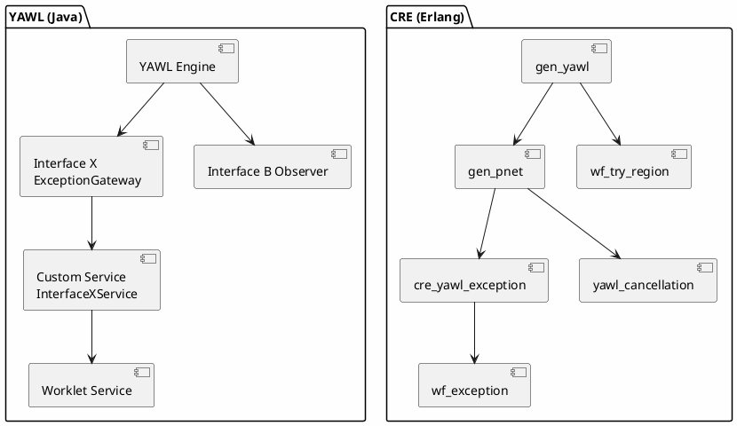

# YAWL Exception Handling Analysis

This document analyzes the YAWL (Yet Another Workflow Language) Java exception handling patterns and compares them with the CRE (Common Runtime Environment) implementation.

## Table of Contents

1. [YAWL Exception Handling Overview](#yawl-exception-handling-overview)
2. [Remove Set Mechanism for Cancellation](#remove-set-mechanism-for-cancellation)
3. [Interface X: Exception Gateway](#interface-x-exception-gateway)
4. [Exception Propagation](#exception-propagation)
5. [Comparison with CRE Exception Handling](#comparison-with-cre-exception-handling)
6. [Exception Flow Diagrams](#exception-flow-diagrams)

---

## YAWL Exception Handling Overview

YAWL provides comprehensive exception handling through a multi-layered architecture:

### Core Exception Handling Components

1. **Interface X (Exception Handling Interface)**: The primary gateway for exception notifications
2. **Cancellation Sets**: Deactivation of workflow elements upon task completion
3. **Worklet/Exlet Framework**: Dynamic exception handling and compensation
4. **Interface B Observer Gateway**: Event notifications for work items
5. **Interface E**: Administrative control including case cancellation

### Exception Types in YAWL

- **WorkItem Cancellation**: When a work item is cancelled during execution
- **Case Cancellation**: When an entire workflow instance is cancelled
- **Resource Unavailable Exception**: When required resources are not available
- **Process Exceptions**: Custom exceptions defined during workflow execution

---

## Remove Set Mechanism for Cancellation

### YAWL Cancellation Sets

In YAWL, a **Cancellation Set** allows you to nominate any number of tasks, conditions, and/or flow relations to be deactivated upon completion of a specified task.

#### Visual Indicators

- **Grey Fill**: The task that "owns" the cancellation set currently on view
- **Red Border**: Items belonging to the cancellation set
- **Red Dot (top-right corner)**: Task indicator showing a cancellation set is defined

#### Creating a Cancellation Set

1. Select the task to create the Cancellation Set for
2. Choose **View Cancellation Set** from the Elements menu or click the toolbar button
3. Select tasks, conditions, or flows to add to the Cancellation Set
4. Click **Add to Cancellation Set** button

#### Example: Purchase Book Workflow

```
       [Get Book Details]
              |
           AND-split
              |
      +-------+-------+
      |       |       |
[Order Amazon] [Order Booktopia] [Order Bookfinder]
      |       |       |
      +-------+-------+
              |
           XOR-join
              |
           [Pay]
```

When any one "Order" task completes, the other two are cancelled via their cancellation sets.

#### Cancellation Set Rules

1. Only one cancellation set may be viewed at any one time
2. All flows leading to/from explicit conditions are NOT valid cancellation set members
3. Input and Output conditions cannot be in cancellation sets
4. Flow relations between tasks contain implicit conditions and CAN be cancelled

#### API Methods

```java
// Cancel a work item
void cancelWorkItem(String workItemID, String sessionHandle) throws IOException

// Cancel a case
void cancelCase(String caseID, String sessionHandle) throws IOException

// Handle cancelled work item event
void handleCancelledWorkItemEvent(WorkItemRecord workItemRecord)

// Handle cancelled case event
void handleCancelledCaseEvent(String caseID)
```

### Cancellation Set Editor Classes

- **CancellationSet**: Represents the cancellation set model
- **CancellationSetModel**: Manages additions and removals of elements
- **NetMarqueeHandler**: Handles mouse interactions for cancellation set creation

---

## Interface X: Exception Gateway

### Overview

**Interface X** is YAWL's exception handling interface through which milestone notifications are passed during process execution where process exceptions may have occurred or may be tested for.

### Key Characteristics

- **Generic Application**: Not limited to exception handling; can be used for any milestone-based notifications
- **Event-Driven**: Uses listener pattern for event notifications
- **Bi-directional**: Supports both engine-to-service and service-to-engine communications

### Interface X Package Structure

```
org.yawlfoundation.yawl.engine.interfce.interfaceX
```

#### Core Components

| Component | Description |
|-----------|-------------|
| **ExceptionGateway** | Java interface defining event notifications from engine to custom service |
| **InterfaceXService** | Java interface defining methods that must be implemented by custom service |
| **InterfaceXEngineSideClient** | Implements ExceptionGateway; sends notifications to services |
| **InterfaceXServiceSideServer** | Servlet receiving POST messages from engine |
| **InterfaceXServiceSideClient** | Methods called from custom service to engine |

### Event Notifications via ExceptionGateway

```java
public interface ExceptionGateway {
    // Milestone event notifications
    void handleCaseLaunchEvent(String caseID);
    void handleCaseCompletionEvent(String caseID);
    void handleCancellationEvent(String caseID);
    void handleWorkItemCancellationEvent(WorkItemRecord wir);

    // Exception handling
    void handleResourceUnavailableException(WorkItemRecord wir);
}
```

### Implementing Interface X

#### Step 1: Implement the Interface

```java
public class MyService implements InterfaceXService {
    @Override
    public void handleCaseLaunchEvent(String caseID) {
        // Handle case launch
    }

    @Override
    public void handleCancellationEvent(String caseID) {
        // Handle cancellation
    }

    // Implement other required methods...
}
```

#### Step 2: Add to web.xml

```xml
<servlet>
    <servlet-name>InterfaceXServlet</servlet-name>
    <servlet-class>org.yawlfoundation.yawl.engine.interfce.interfaceX.InterfaceXServiceSideServer</servlet-class>
</servlet>

<servlet-mapping>
    <servlet-name>InterfaceXServlet</servlet-name>
    <url-pattern>/ix</url-pattern>
</servlet-mapping>
```

#### Step 3: Register Listener (Dynamic)

```java
InterfaceXEngineSideClient client = new InterfaceXEngineSideClient(engineURI);
client.addInterfaceXListener("http://localhost:8080/myService/ix");
```

#### Step 4: Configure in Engine (Static)

Add to engine's web.xml:

```xml
<context-param>
    <param-name>InterfaceXListener</param-name>
    <param-value>http://localhost:8080/myService/ix</param-value>
</context-param>
```

### Interface X API Methods

```java
// Add listener dynamically
String addInterfaceXListener(String listenerURI) throws IOException

// Remove listener
String removeInterfaceXListener() throws IOException

// Update work item data
void updateWorkItemData(WorkItemRecord wir, Element data, String sessionHandle) throws IOException

// Cancel work item
void cancelWorkItem(String workItemID, String sessionHandle) throws IOException
```

---

## Exception Propagation

### YAWL Exception Flow

```
[Exception Occurs]
        |
        v
[Engine Detection]
        |
        +--> [Interface X Notification]
        |         |
        |         v
        |    [Custom Service Exception Handlers]
        |         |
        |         v
        |    [Compensation Actions]
        |
        +--> [Cancellation Set Processing]
        |         |
        |         v
        |    [Work Item Cancellation]
        |
        +--> [Interface B Notification]
                  |
                  v
             [handleCancelledWorkItemEvent]
                  |
                  v
             [Service Cleanup]
```

### WorkItem Cancellation

A work item can be cancelled when:

1. It is a member of another task's cancellation set
2. It is a member of a deferred choice construct
3. An administrator cancels the case
4. An exception handling routine triggers cancellation

### Exception Propagation Steps

1. **Exception Detection**: Engine detects exception condition
2. **Event Notification**: Engine fires appropriate event via Interface X
3. **Handler Registration**: Custom services registered as Interface X listeners receive notification
4. **Handler Execution**: Service implements handler logic (e.g., compensation, retry, abort)
5. **Cleanup**: Resources released, work queues updated

### Cancellation Event Handling

```java
@Override
public void handleCancelledWorkItemEvent(WorkItemRecord workItemRecord) {
    // Example implementation
    String workItemID = workItemRecord.getID();
    String caseID = workItemRecord.getCaseID();

    // 1. Remove from work queues
    removeFromWorkQueue(workItemID);

    // 2. Clean up internal caches
    cleanupCache(caseID);

    // 3. Cancel any child cases
    cancelChildCases(workItemID);

    // 4. Log cancellation
    logCancellation(workItemRecord);
}
```

---

## Comparison with CRE Exception Handling

### Architecture Comparison

| Aspect | YAWL (Java) | CRE (Erlang) |
|--------|-------------|--------------|
| **Primary Mechanism** | Interface X (Java Interface) | gen_pnet behavior (Petri Net) |
| **Exception Types** | 5 core types | 10 exception types |
| **Communication** | HTTP POST / Servlet | Message passing (Erlang) |
| **State Management** | YNetRunner objects | Petri Net markings |
| **Cancellation** | Cancellation Sets | yawl_cancellation module |
| **Compensation** | Worklet/Exlet framework | wf_exception + wf_try_region |

### Exception Type Comparison

| YAWL Exception Types | CRE Exception Types |
|---------------------|---------------------|
| WorkItem Cancellation | business_exception |
| Case Cancellation | system_exception |
| Resource Unavailable | timeout_exception |
| Process Exceptions | resource_exception |
| - | data_exception |
| - | communication_exception |
| - | validation_exception |
| - | security_exception |
| - | workflow_exception |
| - | compensation_exception |

### Cancellation Mechanism Comparison

#### YAWL Cancellation Sets

```java
// YAWL: Visual editor-based cancellation set definition
CancellationSet set = new CancellationSet(task);
set.add(otherTask1);
set.add(otherTask2);
set.add(flowRelation);
```

#### CRE Cancellation Regions

```erlang
% CRE: Token-based cancellation via yawl_cancellation module
% Cancel token format: {cancel, [Place]}
CancelledPlaces = yawl_cancellation:find_cancelled_places(Marking, Regions),
UpdatedMarking = yawl_cancellation:process_cancellation(Marking, Regions).

% Region definition
Region = yawl_cancellation:define_region(
    carrier_timeout,
    [pending_appointment, awaiting_confirmation]
)
```

### Exception Handling Flow Comparison

#### YAWL Flow

```
Exception -> ExceptionGateway -> InterfaceXService -> Custom Handler
```

#### CRE Flow

```
Exception -> gen_pnet place -> transition fire -> handler execute -> compensation
```

### Interface X vs CRE Exception Module

| Feature | Interface X (YAWL) | cre_yawl_exception (CRE) |
|---------|-------------------|--------------------------|
| Registration | HTTP URI registration | gen_server registration |
| Notification | POST messages | Erlang messages |
| Handlers | Interface implementation | Handler records with predicates |
| Circuit Breaker | Not built-in | Built-in support |
| Retry Policy | Manual | Built-in (exponential, fibonacci, etc.) |
| Compensation | Worklet framework | Compensation stack (LIFO) |

### CRE Exception Records

```erlang
-record(yawl_exception, {
    id              :: exception_id(),
    type            :: exception_type(),
    severity        :: exception_severity(),
    message         :: binary(),
    context         :: map(),
    timestamp       :: integer(),
    stacktrace      :: list(),
    workflow_id     :: undefined | binary(),
    activity_id     :: undefined | binary(),
    compensation_attempts = 0,
    retry_attempts = 0,
    handled_by      :: undefined | handler_id(),
    resolved = false
}).
```

### CRE Compensation Record

```erlang
-record(compensator, {
    activity_id            :: binary(),
    compensation_handler   :: function(),
    compensation_strategy  :: immediate | deferred | chained | parallel,
    state                  :: pending | executing | completed | failed | cancelled,
    result                 :: undefined | {ok, term()} | {error, term()},
    created_at             :: integer(),
    started_at             :: undefined | integer(),
    completed_at           :: undefined | integer(),
    execution_time         :: undefined | integer(),
    retry_policy           :: undefined | retry_policy(),
    dependencies           :: [binary()],
    metadata               :: map()
}).
```

---

## Exception Flow Diagrams

### YAWL Exception Handling Flow

```plantuml
@startuml YAWL Exception Flow
skinparam backgroundColor #FEFEFE

start

:Exception Occurs in Workflow;

if "Exception Type?" then
    [WorkItem Exception]
else
    [Case Exception]
endif

:Engine Detects Exception;

partition "Interface X Notification" {
    :ExceptionGateway fires event;
    :InterfaceXEngineSideClient sends POST;
    note right
      HTTP POST to listener URI
      /service/ix
    end note
}

partition "Custom Service Handler" {
    :InterfaceXServiceSideServer receives;
    :handleCancelledWorkItemEvent or
     handleCancelledCaseEvent;
    :Service executes handler logic;
}

if "Needs Compensation?" then
    [Yes]
    :Execute Compensation Actions;
    :Clean up resources;
    :Remove from queues;
else
    [No]
    :Simple cleanup;
endif

:Engine updates workflow state;

stop

@enduml
```

### Cancellation Set Processing Flow

```plantuml
@startuml YAWL Cancellation Set Flow
skinparam backgroundColor #FEFEFE

start

:Task Completes;

if "Has Cancellation Set?" then
    [No]
    :Normal completion;
    stop
else
    [Yes]
    note right
      Cancellation Set contains:
      - Other tasks
      - Conditions
      - Flow relations
    end note
endif

:Get Cancellation Set elements;

repeat
    :Deactivate element;
    if "Element is WorkItem?" then
        [Yes]
        :Cancel work item;
        :Send Interface B notification;
        :Service handles handleCancelledWorkItemEvent;
    else if "Element is Task?" then
        [Yes]
        :Stop task execution;
        :Cancel child work items;
    else if "Element is Flow?" then
        [Yes]
        :Remove implicit condition tokens;
    endif
    endif
    endif
repeat while (More elements?) is (Yes)
-> No;

:Update workflow marking;

stop

@enduml
```

### CRE Exception Handling Flow

```plantuml
@startuml CRE Exception Flow
skinparam backgroundColor #FEFEFE

start

:Exception Raised in gen_yawl;

:Create #yawl_exception record;

partition "Petri Net Exception Handling" {
    :Token placed in 'ExceptionRaised' place;
    :Transition 'handle_exception' fires;
    note right
      WHP-01: Error Handler Pattern
    end note
}

:Find handler for exception type;

if "Handler found?" then
    [Yes]
    :Check circuit breaker state;
    if "Circuit open?" then
        [Yes]
        :Return {circuit_open, Reason};
        :Move token to 'CircuitBreaker' place;
        stop
    else
        [No]
        :Execute handler function;
    endif
else
    [No]
    :Move token to 'Failed' place;
    stop
endif

if "Handler success?" then
    [Yes]
    :Move token to 'Resolved' place;
    :Update metrics;
    stop
else
    [No]
    :Check retry policy;
    if "Should retry?" then
        [Yes]
        :Calculate backoff delay;
        :Move token to 'Retry' place;
        :Schedule retry;
    else
        [No]
        :Move token to 'Failed' place;
        :Trigger compensation if needed;
    endif
endif

stop

@enduml
```

### CRE Compensation Flow

```plantuml
@startuml CRE Compensation Flow
skinparam backgroundColor #FEFEFE

start

:Exception requires compensation;

partition "WHP-03: Compensation Pattern" {
    :Get compensation stack;
    note right
      LIFO order (most recent first)
    end note
}

repeat
    :Pop compensator from stack;
    :Check dependencies completed?;

    if "All dependencies complete?" then
        [Yes]
        :Execute compensation handler;
        note right
          Strategy: immediate | deferred
          | chained | parallel
        end note

        if "Compensation success?" then
            [Yes]
                :Update state to 'completed';
                :Record execution time;
            else
                [No]
                :Check retry policy;
                if "Retry available?" then
                    [Yes]
                    :Calculate backoff;
                    :Re-execute after delay;
                else
                    [No]
                    :Update state to 'failed';
                endif
            endif
        else
            [No]
            :Wait for dependencies;
        endif
    endif

repeat while (Compensators remain?) is (Yes)
-> No;

:Update exception state;

if "All compensations successful?" then
    [Yes]
    :Mark exception as resolved;
else
    [No]
    :Mark exception as failed;
    :Log audit event;
endif

stop

@enduml
```

### YAWL vs CRE Architecture Comparison



---

## Key Takeaways

### YAWL Strengths

1. **Visual Editor Support**: Cancellation sets can be created and managed visually
2. **Generic Interface X**: Not limited to exceptions; supports any milestone notification
3. **HTTP-based Communication**: Language-agnostic integration
4. **Worklet Framework**: Sophisticated dynamic exception handling

### CRE Strengths

1. **Petri Net Foundation**: Natural support for concurrency and distribution
2. **Built-in Retry Policies**: Exponential, Fibonacci, adaptive backoff
3. **Circuit Breaker Pattern**: Automatic failure threshold handling
4. **Erlang/OTP**: Fault-tolerant by design
5. **Comprehensive Exception Types**: 10 distinct exception categories
6. **Token-based Cancellation**: Lightweight and declarative

### Migration Considerations

When implementing YAWL-style exception handling in CRE:

1. **Cancellation Sets** map to **Cancellation Regions** with token removal
2. **Interface X events** map to **gen_pnet place/transition** tokens
3. **Custom Service handlers** map to **error_handler records**
4. **Worklet compensation** maps to **compensator records with strategies**

---

## Sources

- [YAWL User Manual 4.3](https://yawlfoundation.github.io/assets/files/YAWLUserManual4.3.pdf)
- [YAWL Technical Manual 4.3](https://yawlfoundation.github.io/assets/files/YAWLTechnicalManual4.pdf)
- [Worklet Thesis - Michael James Adams](https://eprints.qut.edu.au/16600/1/Michael_James_Adams_Thesis.pdf)
- [YAWL: An open source Business Process Management System](https://www.sciencedirect.com/science/article/pii/S2352711020302892)
- CRE source code: `/Users/sac/cre/src/`
