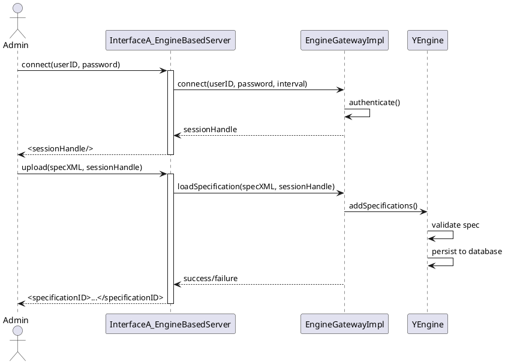
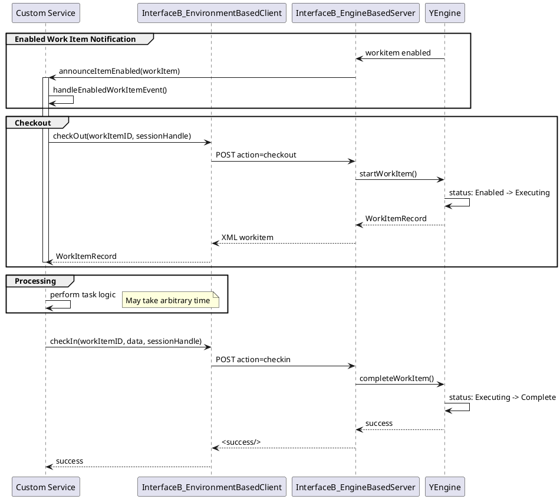
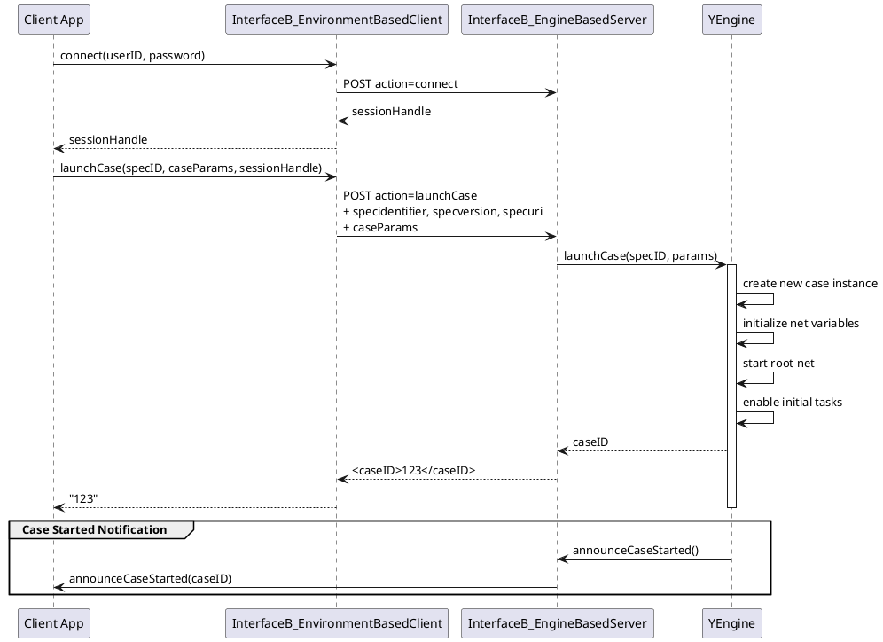
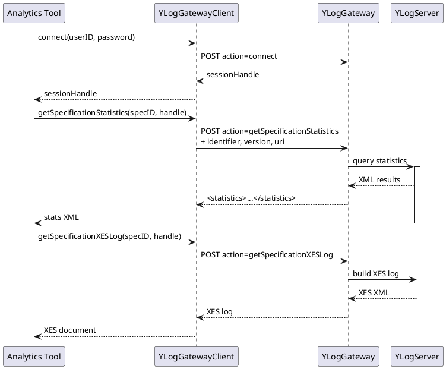
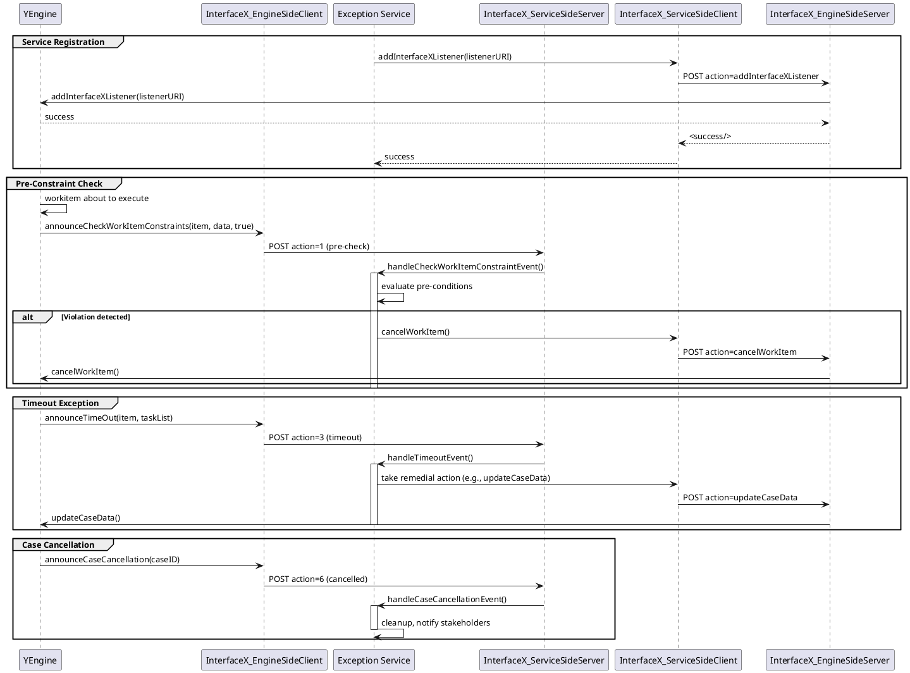

# YAWL Java Interface Architecture Analysis

This document provides a comprehensive analysis of the YAWL (Yet Another Workflow Language) Java interface architecture, covering the four main interfaces defined in the YAWL engine at `/vendors/yawl/src/org/yawlfoundation/yawl/engine/interfce/`.

## Table of Contents

1. [Interface A - Design/Management](#interface-a---designmanagement)
2. [Interface B - Worklist Gateway](#interface-b---worklist-gateway)
3. [Interface E - Event Logging](#interface-e---event-logging)
4. [Interface X - Exception Handling](#interface-x---exception-handling)
5. [Common Data Structures](#common-data-structures)
6. [Sequence Diagrams](#sequence-diagrams)

---

## Interface A - Design/Management

### Overview

**Interface A** corresponds to WfMC (Workflow Management Coalition) Interface 1 - Process Definition Tools and Interface 5 - Administration & Monitoring. It provides functionality for:

- Specification management (upload, unload, query)
- User and service account management
- System monitoring and control
- Work item reannouncement

**Location**: `interfaceA/`

**WfMC Correspondence**: Interface 1 (Process Definition) + Interface 5 (Administration & Monitoring)

### Core Components

#### InterfaceA_EngineBasedServer

Servlet-based server implementation that handles HTTP POST/GET requests from external clients.

**Default Endpoint**: `/yawl/ia`

**Supported Actions**:

| Action | Description | Parameters |
|--------|-------------|------------|
| `connect` | Create user session | `userID`, `password` |
| `checkConnection` | Validate session handle | `sessionHandle` |
| `disconnect` | Terminate session | `sessionHandle` |
| `upload` | Upload YAWL specification | `specXML` |
| `getList` | Get loaded specifications | `sessionHandle` |
| `unload` | Unload specification | `specidentifier`, `specversion`, `specuri` |
| `createAccount` | Create user account | `userID`, `password`, `doco` |
| `updateAccount` | Update user account | `userID`, `password`, `doco` |
| `deleteAccount` | Delete user account | `userID` |
| `newYAWLService` | Register YAWL service | `service` (XML) |
| `removeYAWLService` | Unregister YAWL service | `serviceURI` |
| `reannounceEnabledWorkItems` | Reannounce enabled work items | (none) |
| `reannounceExecutingWorkItems` | Reannounce executing work items | (none) |
| `reannounceFiredWorkItems` | Reannounce fired work items | (none) |
| `reannounceWorkItem` | Reannounce specific work item | `id` |
| `setHibernateStatisticsEnabled` | Enable Hibernate stats | `enabled` |
| `getHibernateStatistics` | Get Hibernate statistics | (none) |
| `promote` | Promote engine state | (none) |
| `demote` | Demote engine state | (none) |

#### InterfaceA_EnvironmentBasedClient

Client-side API for external applications to interact with the YAWL engine.

**Key Methods**:

```java
// Connection Management
String connect(String userID, String password) throws IOException
String checkConnection(String sessionHandle) throws IOException
String disconnect(String handle) throws IOException

// Specification Management
String uploadSpecification(String specification, String sessionHandle) throws IOException
String unloadSpecification(YSpecificationID specID, String sessionHandle) throws IOException
List<SpecificationData> getSpecificationList(String sessionHandle) throws IOException

// Service Management
String addYAWLService(YAWLServiceReference service, String sessionHandle) throws IOException
String removeYAWLService(String serviceURI, String sessionHandle) throws IOException
Set<YAWLServiceReference> getRegisteredYAWLServices(String sessionHandle)

// Account Management
String addClientAccount(String name, String password, String documentation, String sessionHandle) throws IOException
String updateClientAccount(String name, String password, String documentation, String sessionHandle) throws IOException
String removeClientAccount(String name, String sessionHandle) throws IOException
Set<YExternalClient> getClientAccounts(String sessionHandle) throws IOException
String changePassword(String password, String sessionHandle) throws IOException

// Work Item Reannouncement
String reannounceEnabledWorkItems(String sessionHandle) throws IOException
String reannounceExecutingWorkItems(String sessionHandle) throws IOException
String reannounceFiredWorkItems(String sessionHandle) throws IOException
String reannounceWorkItem(String itemID, String sessionHandle) throws IOException

// Administrative
String getBuildProperties(String sessionHandle) throws IOException
String getExternalDBGateways(String sessionHandle) throws IOException
```

#### InterfaceAManagement

Internal interface defining the management contract between the engine and external clients.

**Core Methods**:

```java
// Registration
void registerInterfaceAClient(InterfaceAManagementObserver observer)

// Specification Management
List<YSpecificationID> addSpecifications(String specificationStr, boolean ignoreErrors,
                                         YVerificationHandler errorMessages)
boolean loadSpecification(YSpecification spec)
Set<YSpecificationID> getLoadedSpecificationIDs()
YSpecification getLatestSpecification(String id)
YSpecification getSpecification(YSpecificationID specID)
void unloadSpecification(YSpecificationID specID)

// Case Management
Set<YIdentifier> getCasesForSpecification(YSpecificationID specID)
YIdentifier getCaseID(String caseIDStr)
String getStateTextForCase(YIdentifier caseID)
String getStateForCase(YIdentifier caseID)
void cancelCase(YIdentifier id)
void suspendCase(YIdentifier id)
void resumeCase(YIdentifier id)

// User & Service Management
Set getUsers()
YExternalClient getExternalClient(String name)
boolean addExternalClient(YExternalClient client)
YAWLServiceReference getRegisteredYawlService(String yawlServiceID)
void addYawlService(YAWLServiceReference yawlService)
YAWLServiceReference removeYawlService(String serviceURI)

// Work Item Reannouncement
int reannounceEnabledWorkItems()
int reannounceExecutingWorkItems()
int reannounceFiredWorkItems()
void reannounceWorkItem(YWorkItem workItem)

// Diagnostics
void dump()
YEngine.Status getEngineStatus()
void setEngineStatus(YEngine.Status engineStatus)
```

---

## Interface B - Worklist Gateway

### Overview

**Interface B** corresponds to WfMC Interfaces 2+3 - Workflow Client Applications and Invoked Applications. It is the primary interface for:

- Work item lifecycle management (checkout, check-in, suspend, etc.)
- Case instance management (launch, cancel, suspend, resume)
- Event notifications to external services
- Work list querying

**Location**: `interfaceB/`

**WfMC Correspondence**: Interface 2 (Client Applications) + Interface 3 (Invoked Applications)

### Core Components

#### InterfaceB_EngineBasedServer

Servlet that handles work item and case management requests.

**Default Endpoint**: `/yawl/ib`

**Supported Actions**:

| Action | Description | Parameters |
|--------|-------------|------------|
| `connect` | Authenticate user | `userid`, `password` |
| `checkConnection` | Validate session | `sessionHandle` |
| `disconnect` | Close session | `sessionHandle` |
| `checkout` | Start/check out work item | `workItemID`, `logPredicate` |
| `checkin` | Complete work item | `workItemID`, `data`, `logPredicate` |
| `launchCase` | Start new case instance | `specidentifier`, `specversion`, `specuri`, `caseParams`, `caseid`, etc. |
| `cancelCase` | Cancel running case | `caseID` |
| `getWorkItem` | Get work item details | `workItemID` |
| `getLiveItems` | Get all active work items | (none) |
| `getAllRunningCases` | Get all running cases | (none) |
| `getWorkItemsWithIdentifier` | Get work items by ID | `idType`, `id` |
| `getWorkItemsForService` | Get work items for service | `serviceuri` |
| `taskInformation` | Get task metadata | `specidentifier`, `specversion`, `specuri`, `taskID` |
| `getMITaskAttributes` | Get MI task attributes | `specidentifier`, `specversion`, `specuri`, `taskID` |
| `getResourcingSpecs` | Get resourcing specs | `specidentifier`, `specversion`, `specuri`, `taskID` |
| `getSpecificationPrototypesList` | List specifications | (none) |
| `getSpecification` | Get specification XML | `specidentifier`, `specversion`, `specuri` |
| `getSpecificationData` | Get specification data | `specidentifier`, `specversion`, `specuri` |
| `getSpecificationDataSchema` | Get data schema | `specidentifier`, `specversion`, `specuri` |
| `getCasesForSpecification` | Get cases for spec | `specidentifier`, `specversion`, `specuri` |
| `getCaseState` | Get case state | `caseID` |
| `exportCaseState` | Export case state | `caseID` |
| `exportAllCaseStates` | Export all case states | (none) |
| `importCases` | Import case states | `xml` |
| `getCaseData` | Get case data | `caseID` |
| `getChildren` | Get child work items | `workItemID` |
| `getWorkItemExpiryTime` | Get timer expiry | `workItemID` |
| `getCaseInstanceSummary` | Get case summary | (none) |
| `getWorkItemInstanceSummary` | Get work item summary | `caseID` |
| `getParameterInstanceSummary` | Get parameter summary | `caseID`, `workItemID` |
| `createInstance` | Create MI instance | `workItemID`, `paramValueForMICreation` |
| `suspend` | Suspend work item | `workItemID` |
| `unsuspend` | Unsuspend work item | `workItemID` |
| `rollback` | Rollback work item | `workItemID` |
| `skip` | Skip work item | `workItemID` |
| `getStartingDataSnapshot` | Get starting data | `workItemID` |
| `checkIsAdmin` | Check admin status | (none) |
| `checkAddInstanceEligible` | Check MI eligibility | `workItemID` |
| `rejectAnnouncedEnabledTask` | Reject announced task | `workItemID` |

#### InterfaceB_EnvironmentBasedClient

Client API for work item and case operations.

**Key Methods**:

```java
// Connection
String connect(String userID, String password) throws IOException
String disconnect(String handle) throws IOException
String checkConnection(String sessionHandle) throws IOException

// Work Item Query
List<WorkItemRecord> getCompleteListOfLiveWorkItems(String sessionHandle) throws IOException
String getCompleteListOfLiveWorkItemsAsXML(String sessionHandle) throws IOException
String getWorkItem(String itemID, String sessionHandle) throws IOException
List<WorkItemRecord> getWorkItemsForCase(String caseID, String sessionHandle) throws IOException
List<WorkItemRecord> getWorkItemsForSpecification(String specName, String sessionHandle) throws IOException
List<WorkItemRecord> getWorkItemsForTask(String taskID, String sessionHandle) throws IOException
List<WorkItemRecord> getWorkItemsForService(String serviceURI, String sessionHandle) throws IOException

// Work Item Lifecycle
String checkOutWorkItem(String workItemID, String logPredicate, String sessionHandle) throws IOException
String checkInWorkItem(String workItemID, String data, String logPredicate, String sessionHandle) throws IOException
String suspendWorkItem(String workItemID, String sessionHandle) throws IOException
String unsuspendWorkItem(String workItemID, String sessionHandle) throws IOException
String rollbackWorkItem(String workItemID, String sessionHandle) throws IOException
String skipWorkItem(String workItemID, String sessionHandle) throws IOException
String rejectAnnouncedEnabledTask(String workItemID, String sessionHandle) throws IOException

// Case Management
String launchCase(YSpecificationID specID, String caseParams, String sessionHandle) throws IOException
String launchCase(YSpecificationID specID, String caseParams, String sessionHandle, String caseID, YLogDataItemList logData, String completionObserverURI) throws IOException
String cancelCase(String caseID, String sessionHandle) throws IOException
String getAllRunningCases(String sessionHandle) throws IOException
String getCaseState(String caseID, String sessionHandle) throws IOException
String getCaseData(String caseID, String sessionHandle) throws IOException

// Multi-Instance Tasks
String checkPermissionToAddInstances(String workItemID, String sessionHandle) throws IOException
String createNewInstance(String workItemID, String paramValueForMICreation, String sessionHandle) throws IOException

// Specification Query
List<SpecificationData> getSpecificationList(String sessionHandle) throws IOException
String getSpecification(YSpecificationID specID, String sessionHandle) throws IOException
String getSpecificationData(YSpecificationID specID, String sessionHandle) throws IOException
String getSpecificationDataSchema(YSpecificationID specID, String sessionHandle) throws IOException

// Task Information
String getTaskInformationStr(YSpecificationID specID, String taskID, String sessionHandle) throws IOException
String getMITaskAttributes(YSpecificationID specID, String taskID, String sessionHandle) throws IOException
String getResourcingSpecs(YSpecificationID specID, String taskID, String sessionHandle) throws IOException

// Data Retrieval
String getStartingDataSnapshot(String workItemID, String sessionHandle) throws IOException
List<WorkItemRecord> getChildrenOfWorkItem(String workItemID, String sessionHandle) throws IOException
```

#### InterfaceBWebsideController

Abstract base class for custom YAWL services implementing Interface B.

**Event Handler Methods** (to be overridden by custom services):

```java
// Required - must implement
public abstract void handleEnabledWorkItemEvent(WorkItemRecord enabledWorkItem);
public abstract void handleCancelledWorkItemEvent(WorkItemRecord workItemRecord);

// Optional - override as needed
public void handleCancelledCaseEvent(String caseID)
public void handleDeadlockedCaseEvent(String caseID, String tasks)
public void handleStartCaseEvent(YSpecificationID specID, String caseID, String launchingService, boolean delayed)
public void handleCompleteCaseEvent(String caseID, String casedata)
public void handleTimerExpiryEvent(WorkItemRecord expiredWorkItem)
public void handleEngineInitialisationCompletedEvent()
public void handleWorkItemStatusChangeEvent(WorkItemRecord workItem, String oldStatus, String newStatus)
public void handleCaseSuspendingEvent(String caseID)
public void handleCaseSuspendedEvent(String caseID)
public void handleCaseResumedEvent(String caseID)
public void destroy()
```

**Utility Methods**:

```java
// Connection
public boolean checkConnection(String sessionHandle) throws IOException
public String connect(String userID, String password) throws IOException

// Work Item Operations
public WorkItemRecord checkOut(String workItemID, String logPredicate, String sessionHandle) throws IOException, YAWLException
public String checkInWorkItem(String workItemID, Element inputData, Element outputData, String logPredicate, String sessionHandle) throws IOException, JDOMException
public WorkItemRecord getCachedWorkItem(String workItemID)
public WorkItemRecord getEngineStoredWorkItem(String workItemID, String sessionHandle) throws IOException

// Task Information
public TaskInformation getTaskInformation(YSpecificationID specID, String taskID, String sessionHandle) throws IOException

// Specification Data
public List<SpecificationData> getSpecificationPrototypesList(String sessionHandle) throws IOException
public SpecificationData getSpecificationData(YSpecificationID specID, String sessionHandle) throws IOException
```

#### InterfaceB_EngineBasedClient

Engine-side client that broadcasts event notifications to registered services.

**Event Broadcasting**:

```java
public void announceFiredWorkItem(YAnnouncement announcement)
public void announceCancelledWorkItem(YAnnouncement announcement)
public void announceTimerExpiry(YAnnouncement announcement)
public void announceCaseSuspended(Set<YAWLServiceReference> services, YIdentifier caseID)
public void announceCaseSuspending(Set<YAWLServiceReference> services, YIdentifier caseID)
public void announceCaseResumption(Set<YAWLServiceReference> services, YIdentifier caseID)
public void announceWorkItemStatusChange(Set<YAWLServiceReference> services, YWorkItem workItem, YWorkItemStatus oldStatus, YWorkItemStatus newStatus)
public void announceCaseStarted(Set<YAWLServiceReference> services, YSpecificationID specID, YIdentifier caseID, String launchingService, boolean delayed)
public void announceCaseCompletion(Set<YAWLServiceReference> services, YIdentifier caseID, Document caseData)
public void announceEngineInitialised(Set<YAWLServiceReference> services, int maxWaitSeconds)
public void announceCaseCancellation(Set<YAWLServiceReference> services, YIdentifier id)
public void announceDeadlock(Set<YAWLServiceReference> services, YIdentifier id, Set<YTask> tasks)
```

#### InterfaceBClient

Internal interface defining the worklist gateway contract.

```java
void registerInterfaceBObserver(InterfaceBClientObserver observer)
void registerInterfaceBObserverGateway(ObserverGateway gateway)

Set<YWorkItem> getAvailableWorkItems()
Set<YWorkItem> getAllWorkItems()

YWorkItem startWorkItem(YWorkItem workItem, YClient client)
void completeWorkItem(YWorkItem workItem, String data, String logPredicate, WorkItemCompletion flag)
void rollbackWorkItem(String workItemID)
YWorkItem suspendWorkItem(String workItemID)

YWorkItem getWorkItem(String workItemID)
String getCaseData(String caseID)

String launchCase(YSpecificationID specID, String caseParams, URI completionObserver, YLogDataItemList logData)
String launchCase(YSpecificationID specID, String caseParams, URI completionObserver, String caseID, YLogDataItemList logData, String serviceHandle, boolean delayed)

String allocateCaseID()
void checkElegibilityToAddInstances(String workItemID)
YWorkItem createNewInstance(YWorkItem workItem, String paramValueForMICreation)
Set getChildrenOfWorkItem(YWorkItem workItem)
YTask getTaskDefinition(YSpecificationID specificationID, String taskID)
```

#### InterfaceB_EnvironmentBasedServer

Servlet that receives event announcements from the engine and delegates to custom service controllers.

**Event Handlers**:

```java
protected void handleEnabledWorkItemEvent(WorkItemRecord workItem)
protected void handleCancelledWorkItemEvent(WorkItemRecord workItemRecord)
protected void handleWorkItemStatusChangeEvent(WorkItemRecord workItem, String oldStatus, String newStatus)
protected void handleStartCaseEvent(YSpecificationID specID, String caseID, String launchingService, boolean delayed)
protected void handleCompleteCaseEvent(String caseID, String casedata)
protected void handleCancelledCaseEvent(String caseID)
protected void handleDeadlockedCaseEvent(String caseID, String tasks)
protected void handleTimerExpiryEvent(WorkItemRecord expiredWorkItem)
protected void handleEngineInitialisationCompletedEvent()
protected void handleCaseSuspendingEvent(String caseID)
protected void handleCaseSuspendedEvent(String caseID)
protected void handleCaseResumedEvent(String caseID)
```

---

## Interface E - Event Logging

### Overview

**Interface E** provides access to the YAWL process logs for analytics, monitoring, and audit purposes. It supports:

- Querying specification statistics
- Retrieving case event histories
- Exporting logs in XML and XES formats
- Service-level event tracking

**Location**: `interfaceE/`

**WfMC Correspondence**: Related to Interface 4 (History & Monitoring)

### Core Components

#### YLogGateway

Servlet that handles log data queries.

**Default Endpoint**: `/yawl/logGateway`

**Supported Actions**:

| Action | Description | Parameters |
|--------|-------------|------------|
| `connect` | Authenticate | `userid`, `password` |
| `checkConnection` | Validate session | `sessionHandle` |
| `getAllSpecifications` | List all specs | (none) |
| `getNetInstancesOfSpecification` | Get case instances | `identifier`, `version`, `uri` OR `key` |
| `getCompleteCaseLogsForSpecification` | Get full logs | `identifier`, `version`, `uri` OR `key` |
| `getSpecificationStatistics` | Get spec stats | `identifier`, `version`, `uri`, `from`, `to` |
| `getSpecificationCaseIDs` | Get case IDs | `identifier`, `version`, `uri` OR `key` |
| `getCaseEvents` | Get case events | `caseid` OR `key` |
| `getDataForEvent` | Get event data | `key` |
| `getDataTypeForDataItem` | Get data type | `key` |
| `getTaskInstancesForCase` | Get task instances | `caseid` |
| `getTaskInstancesForTask` | Get task instances | `key` |
| `getCaseEvent` | Get specific event | `caseid`, `event` |
| `getAllCasesStartedByService` | Get started cases | `name` |
| `getAllCasesCancelledByService` | Get cancelled cases | `name` |
| `getInstanceEvents` | Get instance events | `key` |
| `getServiceName` | Get service name | `key` |
| `getCompleteCaseLog` | Get full case log | `caseid` |
| `getEventsForTaskInstance` | Get task events | `itemid` |
| `getTaskInstancesForCaseTask` | Get task instances for case | `caseid`, `taskname` |
| `getSpecificationXESLog` | Export as XES | `identifier`, `version`, `uri`, `withdata`, `ignoreUnknowns` |

#### YLogGatewayClient

Client API for querying process logs.

**Key Methods**:

```java
// Connection
String connect(String userID, String password) throws IOException
String checkConnection(String handle) throws IOException

// Specification Queries
String getAllSpecifications(String handle) throws IOException
String getNetInstancesOfSpecification(String identifier, String version, String uri, String handle) throws IOException
String getNetInstancesOfSpecification(long specKey, String handle) throws IOException
String getCompleteCaseLogsForSpecification(String identifier, String version, String uri, String handle) throws IOException
String getCompleteCaseLogsForSpecification(long specKey, String handle) throws IOException

// Statistics
String getSpecificationStatistics(String identifier, String version, String uri, String handle) throws IOException
String getSpecificationStatistics(String identifier, String version, String uri, long from, long to, String handle) throws IOException
String getSpecificationStatistics(YSpecificationID specID, String handle) throws IOException
String getSpecificationStatistics(YSpecificationID specID, long from, long to, String handle) throws IOException
String getSpecificationStatistics(long specKey, String handle) throws IOException

// Case Queries
String getSpecificationCaseIDs(YSpecificationID specID, String handle) throws IOException
String getSpecificationCaseIDs(long specKey, String handle) throws IOException
String getCaseEvents(long rootNetInstanceKey, String handle) throws IOException
String getCaseEvents(String caseID, String handle) throws IOException
String getCompleteCaseLog(String caseID, String handle) throws IOException
String getCaseEvent(String caseID, String eventType, String handle) throws IOException

// Event Data
String getDataForEvent(long eventKey, String handle) throws IOException
String getDataTypeForDataItem(long dataTypeKey, String handle) throws IOException
String getInstanceEvents(long instanceKey, String handle) throws IOException

// Task Instance Queries
String getTaskInstancesForCase(String caseID, String handle) throws IOException
String getTaskInstancesForTask(long taskKey, String handle) throws IOException
String getTaskInstancesForTask(String rootCaseID, String taskName, String handle) throws IOException
String getEventsForTaskInstance(String itemID, String handle) throws IOException

// Service Queries
String getAllCasesStartedByService(String serviceName, String handle) throws IOException
String getAllCasesCancelledByService(String serviceName, String handle) throws IOException
String getServiceName(long serviceKey, String handle) throws IOException

// XES Export
String getSpecificationXESLog(String identifier, String version, String uri, String handle) throws IOException
String getSpecificationXESLog(String identifier, String version, String uri, boolean withData, String handle) throws IOException
String getSpecificationXESLog(String identifier, String version, String uri, boolean withData, boolean ignoreUnknownEventLabels, String handle) throws IOException
String getSpecificationXESLog(YSpecificationID specID, String handle) throws IOException
String getSpecificationXESLog(YSpecificationID specID, boolean withData, String handle) throws IOException
String getSpecificationXESLog(YSpecificationID specID, boolean withData, boolean ignoreUnknown, String handle) throws IOException
```

---

## Interface X - Exception Handling

### Overview

**Interface X** provides process-level exception handling capabilities including:

- Constraint checking (pre/post conditions)
- Timeout exception handling
- Work item abort handling
- Case cancellation handling
- Resource unavailability handling

**Location**: `interfaceX/`

### Architecture Diagram

```
                                EXCEPTION      |                              INTERFACE X
                                 GATEWAY       |                                SERVICE
                       (implements) |          |                       (implements) |
                                    |          |                                    |
   +==========+   ----->   ENGINE-SIDE  ---|-->   SERVICE-SIDE  ----->   +=============+
   || YAWL   ||              CLIENT        |        SERVER               || EXCEPTION ||
   || ENGINE ||                            |                             ||  SERVICE  ||
   +==========+   <-----   ENGINE-SIDE  <--|---   SERVICE-SIDE  <-----   +=============+
                         SERVER        |         CLIENT
                                       |
```

### Core Components

#### ExceptionGateway

Interface to be implemented by exception handlers that register with the engine.

```java
String getScheme()

void announceCheckWorkItemConstraints(YWorkItem item, Document data, boolean preCheck)
void announceCheckCaseConstraints(YSpecificationID specID, String caseID, String data, boolean preCheck)
void announceTimeOut(YWorkItem item, List taskList)
void announceCaseCancellation(String caseID)
void shutdown()
void announceWorkitemAbort(YWorkItem item)

// Future
void announceConstraintViolation(YWorkItem item)
```

#### InterfaceX_EngineSideClient

Engine-side client that sends exception events to registered exception handlers.

**Event Types**:

```java
protected static final int NOTIFY_CHECK_CASE_CONSTRAINTS = 0
protected static final int NOTIFY_CHECK_ITEM_CONSTRAINTS = 1
protected static final int NOTIFY_WORKITEM_ABORT = 2
protected static final int NOTIFY_TIMEOUT = 3
protected static final int NOTIFY_RESOURCE_UNAVAILABLE = 4
protected static final int NOTIFY_CONSTRAINT_VIOLATION = 5
protected static final int NOTIFY_CANCELLED_CASE = 6
```

**Methods**:

```java
void announceCheckWorkItemConstraints(YWorkItem item, Document data, boolean preCheck)
void announceCheckCaseConstraints(YSpecificationID specID, String caseID, String data, boolean preCheck)
void announceWorkitemAbort(YWorkItem item)
void announceTimeOut(YWorkLitem item, List taskList)
void announceConstraintViolation(YWorkItem item)
void announceCaseCancellation(String caseID)
void shutdown()
```

#### InterfaceX_Service

Interface for exception services to implement.

```java
void handleCheckCaseConstraintEvent(YSpecificationID specID, String caseID, String data, boolean precheck)
void handleCheckWorkItemConstraintEvent(WorkItemRecord wir, String data, boolean precheck)
String handleWorkItemAbortException(WorkItemRecord wir, String caseData)
void handleTimeoutEvent(WorkItemRecord wir, String taskList)
void handleResourceUnavailableException(String resourceID, WorkItemRecord wir, String caseData, boolean primary)
String handleConstraintViolationException(WorkItemRecord wir, String caseData)
void handleCaseCancellationEvent(String caseID)
void doGet(HttpServletRequest request, HttpServletResponse response) throws IOException, ServletException
```

#### InterfaceX_ServiceSideServer

Servlet that receives exception events from the engine.

**Process Flow**:

1. Unpack request parameters
2. Convert action string to event type
3. Call appropriate controller method
4. Return success/failure response

#### InterfaceX_EngineSideServer

Servlet that receives command requests from exception services and passes them to the engine.

**Default Endpoint**: `/yawl/ix`

**Supported Actions**:

| Action | Description | Parameters |
|--------|-------------|------------|
| `addInterfaceXListener` | Register exception listener | `listenerURI` |
| `removeInterfaceXListener` | Unregister exception listener | `listenerURI` |
| `updateWorkItemData` | Modify work item data | `workitemID`, `data`, `sessionHandle` |
| `updateCaseData` | Modify case data | `caseID`, `data`, `sessionHandle` |
| `completeWorkItem` | Force complete work item | `workitemID`, `data`, `logPredicate`, `sessionHandle` |
| `continueWorkItem` | Continue suspended work item | `workitemID`, `sessionHandle` |
| `unsuspendWorkItem` | Unsuspend work item | `workitemID`, `sessionHandle` |
| `restartWorkItem` | Restart work item | `workitemID`, `sessionHandle` |
| `startWorkItem` | Start work item | `workitemID`, `sessionHandle` |
| `cancelWorkItem` | Cancel work item | `workitemID`, `data`, `fail`, `sessionHandle` |

**Initialization**:

- Loads engine reference from servlet context
- Optionally enables persistence via `EnablePersistence` init parameter
- Registers initial Interface X listeners via `InterfaceXListener` init parameter (semicolon-separated URIs)

#### InterfaceX_ServiceSideClient

Client API for exception services to send commands back to the engine.

```java
// Listener Management
String addInterfaceXListener(String listenerURI) throws IOException
String removeInterfaceXListener(String listenerURI) throws IOException

// Data Modification
String updateWorkItemData(WorkItemRecord wir, Element data, String sessionHandle) throws IOException
String updateCaseData(String caseID, Element data, String sessionHandle) throws IOException

// Work Item Control
String forceCompleteWorkItem(WorkItemRecord wir, Element data, String sessionHandle) throws IOException
WorkItemRecord continueWorkItem(String workItemID, String sessionHandle) throws IOException
WorkItemRecord unsuspendWorkItem(String workItemID, String sessionHandle) throws IOException
String restartWorkItem(String workItemID, String sessionHandle) throws IOException
String startWorkItem(String workItemID, String sessionHandle) throws IOException
String cancelWorkItem(String workItemID, String data, boolean fail, String sessionHandle) throws IOException
```

---

## Common Data Structures

### WorkItemRecord

Represents a work item passed between engine and services.

**Status Constants**:

```java
// Execution Status
public static final String statusEnabled = "Enabled"
public static final String statusFired = "Fired"
public static final String statusExecuting = "Executing"
public static final String statusComplete = "Complete"
public static final String statusIsParent = "Is parent"
public static final String statusDeadlocked = "Deadlocked"
public static final String statusForcedComplete = "ForcedComplete"
public static final String statusFailed = "Failed"
public static final String statusSuspended = "Suspended"
public static final String statusDiscarded = "Discarded"

// Resource Status
public static final String statusResourceOffered = "Offered"
public static final String statusResourceAllocated = "Allocated"
public static final String statusResourceStarted = "Started"
public static final String statusResourceSuspended = "Suspended"
public static final String statusResourceUnoffered = "Unoffered"
public static final String statusResourceUnresourced = "Unresourced"
```

**Key Properties**:

```java
// Identifiers
private String _specIdentifier
private String _specVersion
private String _specURI
private String _caseID
private String _taskID
private String _uniqueID
private String _taskName

// Status
private String _status
private String _resourceStatus

// Timestamps (milliseconds)
private String _enablementTimeMs
private String _firingTimeMs
private String _startTimeMs
private String _completionTimeMs

// Timer (if enabled)
private String _timerTrigger
private String _timerExpiry

// Data
private Element _dataList           // initial data
private Element _dataListUpdated   // modified data

// Resources
private String _startedBy
private String _completedBy
```

**XML Format**:

```xml
<workItemRecord>
    <id>caseID:taskID</id>
    <specversion>0.1</specversion>
    <specuri>uri</specuri>
    <caseid>123</caseid>
    <taskid>task_name</taskid>
    <uniqueid>unique</uniqueid>
    <taskname>Task Name</taskname>
    <status>Enabled</status>
    <enablementTimeMs>1234567890</enablementTimeMs>
    <data><!-- XML data --></data>
    <updateddata><!-- updated data --></updateddata>
</workItemRecord>
```

### YSpecificationID

Identifies a YAWL specification with three components:

```java
private String _identifier   // spec name
private String _version      // version string
private String _uri          // optional URI
```

---

## Sequence Diagrams

### Interface A: Upload and Launch Specification



### Interface B: Work Item Checkout and Check-in



### Interface B: Case Launch



### Interface E: Log Query



### Interface X: Exception Handling Flow



---

## WfMC Interface Mapping

| YAWL Interface | WfMC Interface | Purpose |
|----------------|----------------|---------|
| Interface A | Interface 1 + 5 | Process Definition + Administration |
| Interface B | Interface 2 + 3 | Client Applications + Invoked Applications |
| Interface E | Interface 4 | History & Monitoring |
| Interface X | Extension | Exception Handling |

---

## References

- Source Location: `/Users/sac/cre/vendors/yawl/src/org/yawlfoundation/yawl/engine/interfce/`
- YAWL Documentation: https://www.yawlfoundation.org/
- WfMC Standards: https://www.omg.org/spec/BPMN/
