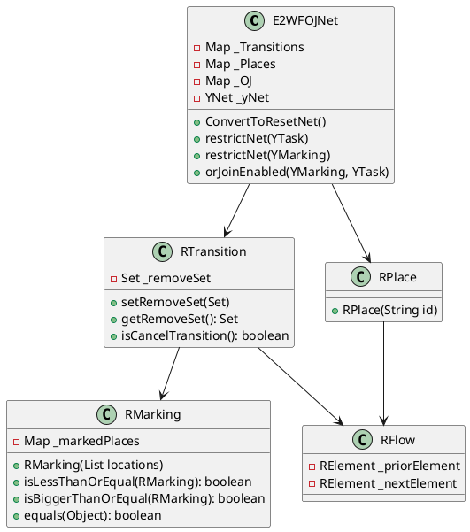
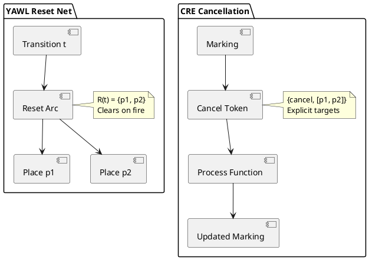

# YAWL Reset Net Implementation Analysis

## Executive Summary

This document analyzes the YAWL Java Reset Net implementation (E2WFOJ - Extended 2-Week Formalism for OR-Join), located at `/vendors/yawl/src/org/yawlfoundation/yawl/elements/e2wfoj/`. The analysis covers the reset net formalism, its differences from standard Petri nets, implementation strategy, and comparison with CRE's cancellation approach.

---

## 1. Reset Net Formalism

### 1.1 Definition

A **Reset Net** is an extension of Petri nets that introduces **reset arcs** (also called inhibitor arcs with reset capability). The formal definition is:

```
RN = (P, T, F, R, M0)
```

Where:
- **P**: Finite set of places
- **T**: Finite set of transitions
- **F**: Flow relation (standard arcs) F subseteq (P x T) union (T x P)
- **R**: Reset relation R subseteq (T x P) - the key extension
- **M0**: Initial marking

### 1.2 Reset Arc Semantics

A reset arc `(t, p) in R` from transition `t` to place `p` has the following semantics:

**When transition t fires:**
1. All tokens are **removed** from place `p` (regardless of token count)
2. This happens **independently** of whether `p` is in the preset of `t`
3. The reset occurs **before** the standard Petri net firing rules apply

Formally:
```
M' = (M - post(t)) + pre(t)
For all p in R(t): M'(p) = 0
```

Where `R(t)` denotes the **reset set** of transition `t`.

### 1.3 Key Difference from Inhibitor Arcs

| Property | Inhibitor Arc | Reset Arc |
|----------|---------------|-----------|
| Notation | `(p, t)` with circle at `p` end | `(t, p)` with special edge |
| Semantics | Enables `t` if `M(p) = 0` | Clears `p` when `t` fires |
| Effect | Does NOT modify marking | DOES modify marking |
| Use case | Testing zero condition | Cancelling active regions |

---

## 2. YAWL Reset Net Implementation (E2WFOJ)

### 2.1 Package Structure

```
org.yawlfoundation.yawl.elements.e2wfoj/
├── E2WFOJNet.java          # Core Reset Net implementation
├── RPlace.java             # Reset Place (extends RElement)
├── RTransition.java        # Reset Transition with removeSet
├── RMarking.java           # Multiset marking algebra
├── RFlow.java              # Flow relation (arcs)
├── RElement.java           # Base class for net elements
├── RSetOfMarkings.java     # Set of markings storage
├── CombinationGenerator.java # nCr combinations for OR-join
└── package-info.java       # Documentation
```

### 2.2 Core Data Structures

#### RTransition - The Reset Mechanism

```java
public class RTransition extends RElement {
    private Set _removeSet = new HashSet();  // The reset set R(t)

    public void setRemoveSet(Set removeSet) {
        _removeSet.addAll(removeSet);
    }

    public boolean isCancelTransition() {
        return _removeSet.size() > 0;
    }
}
```

**Key insight**: The `_removeSet` directly implements the reset relation `R`.

#### RMarking - Token Multiset Algebra

```java
public class RMarking {
    private Map _markedPlaces = new HashMap();  // place -> tokenCount

    // Coverability: M' <= M
    public boolean isLessThanOrEqual(RMarking marking)

    // Reachability comparison
    public boolean isBiggerThanOrEqual(RMarking marking)

    // Structural equality
    public boolean equals(Object omarking)
}
```

### 2.3 YAWL to Reset Net Conversion

The `E2WFOJNet.ConvertToResetNet()` method transforms YAWL nets:

```java
private void ConvertToResetNet() {
    // 1. Create places for conditions
    // YCondition -> RPlace with same ID
    RPlace p = new RPlace(nextElement.getID());

    // 2. Create places for tasks (internal)
    // YTask -> RPlace with ID "p_" + taskID
    RPlace p = new RPlace("p_"+nextElement.getID());

    // 3. Create start transitions based on join type
    // AND-join: Single start transition
    // XOR-join: Multiple start transitions (one per input)
    // OR-join: Special handling (see OJRemove)

    // 4. Create end transitions with cancel sets
    Set removeSet = nextElement.getRemoveSet();
    if (!removeSet.isEmpty()) {
        addCancelSet(t, removeSet);  // Implements R(t)
    }
}
```

### 2.4 Cancel Set Association

```java
private void addCancelSet(RTransition rt, Set removeSet) {
    Set removeSetR = new HashSet();

    // For YAWL conditions -> direct RPlace mapping
    removeSet.retainAll(_Conditions);
    for (Iterator i = removeSet.iterator(); i.hasNext();) {
        YExternalNetElement c = (YExternalNetElement) i.next();
        RPlace p = (RPlace) _Places.get(c.getID());
        removeSetR.add(p);
    }

    // For YAWL tasks -> internal place p_task
    removeSetT.removeAll(_Conditions);
    for (Iterator i = removeSetT.iterator(); i.hasNext();) {
        YExternalNetElement t = (YExternalNetElement) i.next();
        RPlace p = (RPlace) _Places.get("p_"+t.getID());
        removeSetR.add(p);
    }

    rt.setRemoveSet(removeSetR);  // Establish R(t)
}
```

---

## 3. Reset Arcs vs Standard Petri Nets

### 3.1 Standard Petri Net Firing

```
t is enabled at M iff: forall p in pre(t): M(p) >= 1
When t fires: M' = M - pre(t) + post(t)
```

### 3.2 Reset Net Firing

```
t is enabled at M iff: forall p in pre(t): M(p) >= 1
When t fires:
  1. M'(p) = 0 for all p in R(t)  [Reset step]
  2. M' = M - pre(t) + post(t)    [Standard step]
```

### 3.3 Visual Representation

```
Standard Petri Net:         Reset Net:

  p1 --[F]--> t --[F]--> p2     p1 --[F]--> t --[F]--> p2
                                    |
                                   [R]  (reset arc)
                                    |
                                    v
                                   p3
```

When `t` fires:
- **Standard**: Tokens move from p1 to p2
- **Reset**: Tokens move from p1 to p2, AND p3 is cleared

---

## 4. OR-Join Enabling Analysis

The primary purpose of Reset Nets in YAWL is determining when an OR-join should enable.

### 4.1 The OR-Join Problem

An OR-join should enable when:
- **At least one** input place has a token
- **No other input place can receive a token** in the future

This requires analyzing **future behavior** - non-trivial in Petri nets.

### 4.2 Coverability-Based Solution

```java
public boolean orJoinEnabled(YMarking M, YTask orJoin) {
    // Convert YAWL marking to Reset Net marking
    RMarking RM = convertToRMarking(M);

    // Generate "bigger enabling markings"
    // One per empty input place
    for each empty input place q {
        M_w = add token to q
        if Coverable(RM, M_w) {
            return false;  // q could receive token, wait
        }
    }
    return true;  // No future tokens possible
}
```

### 4.3 Backward Reachability Analysis

```java
private boolean Coverable(RMarking s, RMarking t) {
    // Compute predecessors until fixed point
    RSetOfMarkings K = FiniteBasisPred({t});

    // Check if any predecessor x satisfies x <= s
    for (RMarking x : K) {
        if (x.isLessThanOrEqual(s)) {
            return true;
        }
    }
    return false;
}
```

### 4.4 Reset Semantics in Backward Analysis

```java
private boolean isBackwardsEnabled(RMarking currentM, RTransition t) {
    Set removeSet = t.getRemoveSet();

    // Key constraint: M[R(t)] <= t*[R(t)]
    // If a reset place is marked, we must verify:
    // 1. It's also in the postset (will receive token)
    // 2. It has exactly 1 token (the one being added)
    if (removeSet.size() > 0) {
        for (RPlace place : removeSet) {
            if (currentM.isMarked(place)) {
                if (!postSet.contains(place)) {
                    return false;  // Cannot reverse reset
                }
                if (currentM.getTokenCount(place) > 1) {
                    return false;  // Ambiguous previous state
                }
            }
        }
    }
    return true;
}
```

---

## 5. Structural Restriction

The implementation supports two types of net restriction:

### 5.1 Structural Restriction (Presets)

```java
public void restrictNet(YTask j) {
    // Collect all places that can reach j
    Set restrictedPlaces = closure(preset(j));

    // Remove irrelevant transitions and places
    performRestriction(restrictedTrans, restrictedPlaces);
}
```

### 5.2 Active Projection (Marking-Based)

```java
public void restrictNet(YMarking M) {
    // Forward reachability from marked places
    Set restrictedPlaces = closure(postset(MarkedPlaces));

    // Filter transitions with incomplete presets
    for (RTransition t : allTransitions) {
        if (!restrictedPlaces.containsAll(preset(t))) {
            restrictedTrans.remove(t);
        }
    }

    performRestriction(restrictedTrans, restrictedPlaces);
}
```

---

## 6. CRE vs YAWL Cancellation Approach

### 6.1 YAWL Reset Net (E2WFOJ)

**Formal Foundation**: Reset nets with reset relation `R subseteq T x P`

**Key Mechanisms**:
1. **Reset Sets**: Each transition has an explicit set of places to clear
2. **Token-Level**: Operates on the marking directly
3. **Embedded in Transition**: Reset is part of firing semantics

```java
// YAWL style
RTransition t = new RTransition("cancel_order");
t.setRemoveSet([p_pending_items, p_inventory_reserved]);
```

### 6.2 CRE Cancellation (yawl_cancellation.erl)

**Formal Foundation**: Token-based cancellation regions

**Key Mechanisms**:
1. **Cancellation Tokens**: Special tokens `{cancel, [Place]}`
2. **Explicit Processing**: Separate cancellation pass over marking
3. **Declarative Regions**: Named regions with place lists

```erlang
% CRE style
% Cancellation token in marking
#{p1 => [{cancel, [p2, p3]}], p2 => [a], p3 => [b]}

% Process cancellation
yawl_cancellation:process_cancellation(Marking, Regions).
```

### 6.3 Comparison Table

| Aspect | YAWL Reset Net | CRE Cancellation |
|--------|----------------|------------------|
| **Formalism** | Reset Petri Nets | Token-based protocol |
| **Representation** | Transition property `R(t)` | Token value `{cancel, [...]}` |
| **Scope** | Per-transition reset sets | Named regions / explicit targets |
| **Activation** | Automatic on transition fire | Explicit processing step |
| **Composition** | Fixed at compile time | Dynamic via token values |
| **Analysis** | Supports coverability analysis | Runtime marking transformation |
| **Implementation** | Java class-based | Erlang functional + maps |

### 6.4 Visual Comparison

**YAWL Reset Net:**
```
        [cancel_order] (transition with removeSet)
              |
              +--->[R]---> p_pending_items (cleared on fire)
              |
              +--->[R]---> p_inventory_reserved (cleared on fire)
```

**CRE Cancellation:**
```
Marking: #{
    cancel_trigger => [{cancel, [p_pending_items, p_inventory_reserved]}],
    p_pending_items => [token1],
    p_inventory_reserved => [token2]
}

Result: #{
    cancel_trigger => [{cancel, [...]}],  % Preserved
    p_pending_items => [],                % Cleared
    p_inventory_reserved => []            % Cleared
}
```

### 6.5 CRE Exception Handling (cre_yawl_exception.erl)

CRE provides a **layered approach**:

1. **Cancellation Regions** (yawl_cancellation.erl):
   - Token-based marking manipulation
   - Region definitions
   - Nested region support

2. **Exception Patterns** (cre_yawl_exception.erl):
   - Exception type hierarchy
   - Compensation handlers
   - Retry policies
   - Circuit breakers

3. **Pattern Modules** (cancel_*.erl):
   - `cancel_activity` - P19 pattern
   - `cancel_case` - P20 pattern
   - `cancel_region` - P25 pattern
   - All use `gen_yawl` behavior

```erlang
% CRE pattern structure
-record(state, {
    region :: atom(),
    cancel_event :: atom(),
    cancelled = false :: boolean()
}).

fire(t_cancel_region, _Mode, UsrInfo) ->
    NewState = State#state{cancelled = true},
    {produce, #{p_region_cancelled => [cancelled]}, NewState};
```

---

## 7. Formal Notation Summary

### 7.1 Reset Net Definition

```
RN = (P, T, F, R, M0)

where:
  P - finite set of places
  T - finite set of transitions
  F ⊆ (P × T) ∪ (T × P) - flow relation
  R ⊆ (T × P) - reset relation
  M0: P → ℕ - initial marking
```

### 7.2 Firing Rule with Reset

```
t is enabled at M iff: ∀p ∈ •t: M(p) ≥ 1

When t fires at M:
  M'(p) = 0,                    ∀p ∈ R(t)
  M'(p) = M(p) - 1,             ∀p ∈ •t \ R(t)
  M'(p) = M(p) + 1,             ∀p ∈ t• \ (•t ∪ R(t))
  M'(p) = M(p),                 otherwise
```

### 7.3 Coverability for OR-Join

```
OJ enabled at M iff:
  (∃p ∈ •OJ: M(p) ≥ 1) ∧
  (∀q ∈ •OJ: M(q) = 0 ⇒
     ¬∃M' reachable from M: M'(q) ≥ 1)

Using reset nets:
  OJ enabled at M iff:
    ∀q ∈ •OJ with M(q) = 0:
      Coverable(M, M[q := 1]) = false
```

---

## 8. PlantUML Diagrams

### 8.1 Reset Net Structure



### 8.2 OR-Join Decision Flow

```plantuml
@startuml ORJoinDecision
start
:Receive OR-join enable query;

:Convert YAWL marking to Reset Net;

:Set X = empty input places of OR-join;

foreach (q in X)
  :Create M_w = add token to q;
  :Compute predecessors of M_w;
  :Check if any x <= current marking;
  if (coverable?) then (yes)
    :Return false (not enabled);
    stop
  else (no)
    :Continue to next q;
  endif
endforeach

:Return true (enabled);
stop
@enduml
```

### 8.3 Cancellation Comparison



---

## 9. Key Findings

### 9.1 Reset Net Advantages

1. **Formal Analysis**: Enables coverability-based OR-join analysis
2. **Declarative**: Reset relation is explicit in the net structure
3. **Composition**: Reset sets compose naturally with net operations
4. **Optimization**: Structural restriction reduces state space

### 9.2 CRE Cancellation Advantages

1. **Runtime Flexibility**: Cancellation targets determined at runtime
2. **Explicit Semantics**: Cancellation is a visible token processing step
3. **Region Nesting**: Natural support for hierarchical cancellation
4. **Integration**: Works with gen_yawl behavior pattern
5. **Functional Style**: Aligns with Erlang/OTP conventions

### 9.3 Implementation Differences

| Concern | YAWL | CRE |
|---------|------|-----|
| Type System | Java classes | Erlang records/maps |
| Concurrency | Thread-based | Process-based (OTP) |
| State Management | Object fields | Functional state passing |
| Extensibility | Inheritance | Composition + callbacks |

---

## 10. References

1. **YAWL Foundation**: "E2WFOJ: Extended 2-Week Formalism for OR-Join"
2. **Petri Nets with Reset Arcs**: Barkaoui, K., et al.
3. **OR-Join Semantics**: van der Aalst, W.M.P.
4. **CRE Architecture**: `/Users/sac/cre/src/` implementation

---

*Document generated: 2026-02-07*
*Analysis target: YAWL 2.0+ Reset Net implementation*
*Package: org.yawlfoundation.yawl.elements.e2wfoj*
