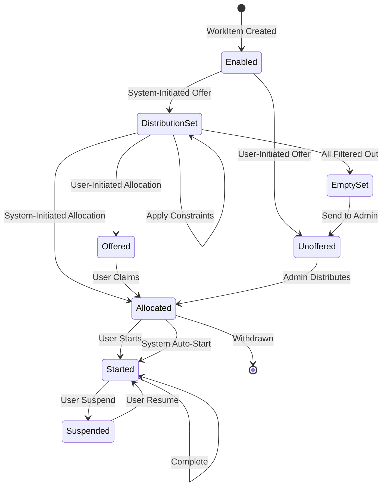
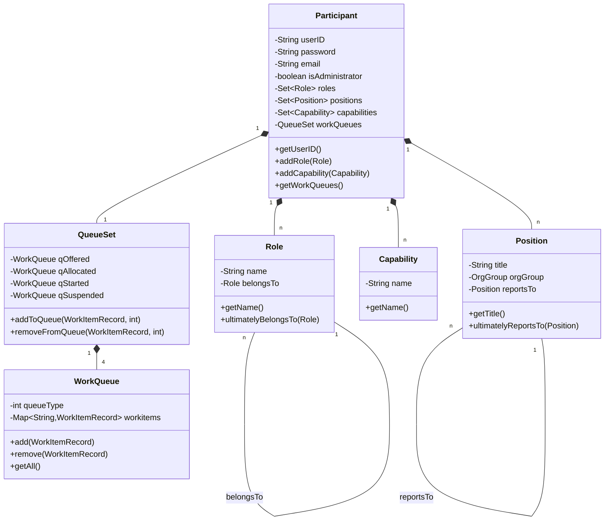
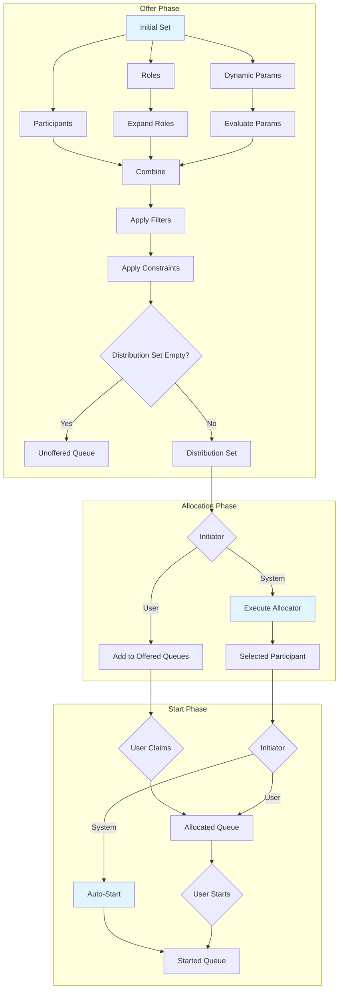
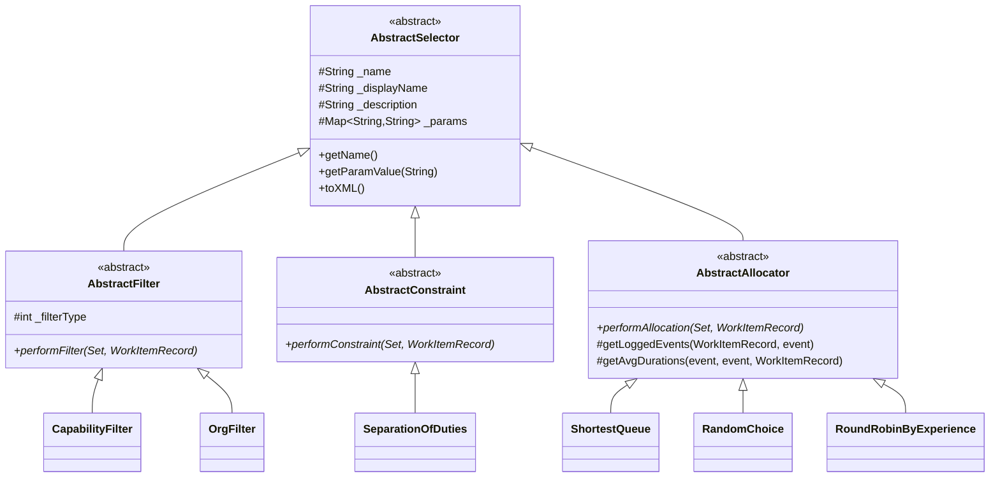
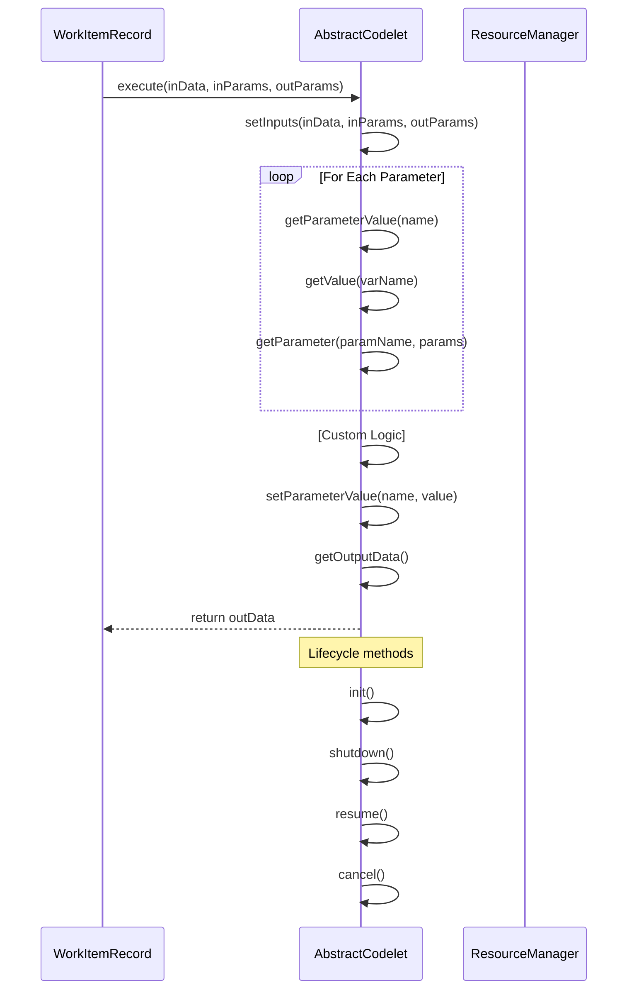

# YAWL Java Resourcing Implementation Analysis

This document analyzes the resource allocation patterns, participant management, constraint system, and codelet mechanism from the YAWL (Yet Another Workflow Language) Java implementation located at `/Users/sac/cre/vendors/yawl/src/org/yawlfoundation/yawl/resourcing/`.

---

## Table of Contents

1. [Architecture Overview](#architecture-overview)
2. [Resource Allocation Patterns](#resource-allocation-patterns)
3. [Participant Management](#participant-management)
4. [Constraint System](#constraint-system)
5. [Codelet Mechanism](#codelet-mechanism)
6. [Interaction Points](#interaction-points)
7. [Filter System](#filter-system)
8. [Work Queue Management](#work-queue-management)
9. [Resource Pattern Diagrams](#resource-pattern-diagrams)

---

## Architecture Overview

The YAWL resourcing subsystem is organized around the following key components:

```
org.yawlfoundation.yawl.resourcing/
├── ResourceManager.java       # Central singleton orchestrator
├── ResourceMap.java            # Task-level resourcing configuration
├── WorkQueue.java              # Work item queue container
├── QueueSet.java               # Collection of queues for a participant
├── allocators/                 # Resource allocation strategies
├── filters/                    # Distribution set filtering
├── constraints/                # Business rule constraints
├── codelets/                   # Custom execution logic
├── interactions/               # Offer/Allocate/Start interactions
├── resource/                   # Resource model classes
└── datastore/                  # Persistence and caching
```

### Key Classes

| Class | Responsibility |
|-------|---------------|
| `ResourceManager` | Singleton orchestrator for all resourcing operations |
| `ResourceMap` | Encapsulates resourcing requirements for a single task |
| `AbstractSelector` | Base class for filters, constraints, and allocators |
| `Participant` | Human resource with work queues |
| `WorkQueue` | Container for work items at specific lifecycle stages |

---

## Resource Allocation Patterns

### The Three-Phase Distribution Model

YAWL implements a sophisticated resource distribution pipeline with three distinct interaction points:

```
WorkItem Enabled
       |
       v
[1. OFFER PHASE] -> Distribution Set Construction
       |             - Initial set (participants, roles, params)
       |             - Role expansion
       |             - Filter application
       |             - Constraint application
       v
[2. ALLOCATION PHASE] -> Resource Selection
       |             - Allocator strategy execution
       |             - Single participant chosen
       v
[3. START PHASE] -> Task Initiation
       |             - Auto-start or user initiation
       |             - Queue placement
       v
WorkItem Started
```

### Distribution Set Construction (Offer Phase)

The `OfferInteraction` class constructs the distribution set through these steps:

1. **Initial Set Assembly**: Combine explicit participants, roles, and dynamic parameters
2. **Role Expansion**: Flatten role hierarchies to individual participants
3. **Filter Application**: Apply capability, organizational, and historical filters
4. **Constraint Application**: Enforce business rule constraints

```java
// From OfferInteraction.performOffer()
public Set<Participant> performOffer(WorkItemRecord wir) {
    _distributionSet = new HashSet<Participant>();

    // Special case: familiar participant
    if (_familiarParticipantTask != null) {
        Set<Participant> pSet = _rm.getWhoCompletedTask(_familiarParticipantTask, wir);
        if (pSet != null) _distributionSet.addAll(pSet);
    }
    else {
        // Add participants, expand roles, evaluate dynamic params
        // Then apply filters and constraints...
    }
    return _distributionSet;
}
```

### Allocator Strategies

The `AbstractAllocator` base class provides the foundation for 18 different allocation strategies:

| Allocator | Strategy |
|-----------|----------|
| `ShortestQueue` | Default: selects participant with fewest active items |
| `RandomChoice` | Randomly selects from distribution set |
| `RoundRobinByExperience` | Most experienced participant for this task |
| `RoundRobinByTime` | Longest time since last allocation |
| `RoundRobinByAllocationTime` | Longest time since allocated this task |
| `RoundRobinByLeastFrequency` | Least frequently allocated |
| `FastestResource` | Best historical completion time |
| `FastestToAllocate` | Fastest to accept allocation |
| `FastestToComplete` | Fastest to complete work items |
| `FastestToStart` | Fastest to start working |
| `CheapestResource` | Lowest cost per duration |
| `CheapestToAllocate` | Lowest allocation overhead |
| `CheapestCompleter` | Lowest total completion cost |
| `CheapestStarter` | Lowest startup cost |
| `RiskAssessment` | Complex multi-factor risk evaluation |
| `DearestResource` | Highest cost (anti-pattern) |

#### Example: ShortestQueue Allocator

```java
public Participant performAllocation(Set<Participant> resSet, WorkItemRecord wir) {
    if (resSet == null) return null;

    int shortest = Integer.MAX_VALUE;
    int qSize;
    Participant result = null;
    for (Participant p : resSet) {
        if (p.getWorkQueues() != null) {
            qSize = p.getWorkQueues().getQueueSize(WorkQueue.ALLOCATED) +
                    p.getWorkQueues().getQueueSize(WorkQueue.STARTED);
        }
        else qSize = 0;
        if (qSize < shortest) {
            shortest = qSize;
            result = p;
            if (qSize == 0) break;    // found empty queue
        }
    }
    return result;
}
```

---

## Participant Management

### Participant Class Structure

The `Participant` class represents human resources with the following attributes:

```java
public class Participant extends AbstractResource {
    // Identification
    private String _lastname;
    private String _firstname;
    private String _userID;
    private String _password;
    private String _email;

    // Authorization
    private boolean _isAdministrator;
    private UserPrivileges _privileges;

    // Organizational Relationships
    private Set<Position> _positions = new HashSet<Position>();
    private Set<Role> _roles = new HashSet<Role>();
    private Set<Capability> _capabilities = new HashSet<Capability>();

    // Notification Preferences
    private boolean _emailOnAllocation;
    private boolean _emailOnOffer;

    // Work Queues
    private QueueSet _qSet;
}
```

### Resource Attributes

#### Role
Represents a functional role with hierarchical support:

```java
public class Role extends AbstractResourceAttribute {
    private String _role;
    private Role _belongsTo;  // Parent role for hierarchies
}
```

Key methods:
- `ultimatelyBelongsTo(Role owner)`: Recursive hierarchy traversal
- Used for role expansion in distribution sets

#### Position
Represents an organizational position:

```java
public class Position extends AbstractResourceAttribute {
    private String _positionID;
    private String _title;
    private OrgGroup _orgGroup;  // Organizational unit
    private Position _reportsTo;  // Reporting line
}
```

#### Capability
Represents a skill or qualification:

```java
public class Capability extends AbstractResourceAttribute {
    private String _capability;
}
```

### Organizational Data Management

The `ResourceDataSet` manages all organizational entities:

```
ResourceDataSet
├── Participants (human resources)
├── Roles (functional hierarchies)
├── Positions (organizational structure)
├── Capabilities (skills/qualifications)
└── OrgGroups (organizational units)
```

---

## Constraint System

### Abstract Constraint

All constraints extend `AbstractConstraint`:

```java
public abstract class AbstractConstraint extends AbstractSelector {
    public abstract Set<Participant> performConstraint(
        Set<Participant> resources,
        WorkItemRecord wir
    );
}
```

### Built-in Constraints

| Constraint | Purpose |
|------------|---------|
| `SeparationOfDuties` | Excludes participants who completed familiar task |
| `PiledExecution` | Reserved for specific participant (piled allocation) |
| `GenericConstraint` | Base for custom constraints |

### Separation of Duties Example

```java
public class SeparationOfDuties extends AbstractConstraint {
    public Set<Participant> performConstraint(
            Set<Participant> resources, WorkItemRecord wir) {
        String famTaskID = getParamValue("familiarTask");
        if (famTaskID != null) {
            Set<Participant> pSet = ResourceManager.getInstance()
                .getWhoCompletedTask(famTaskID, wir);
            if (pSet != null)
                for (Participant p : pSet) resources.remove(p);
        }
        return resources;
    }
}
```

### Constraint Application Pipeline

```
Initial Distribution Set
       |
       v
Filter 1 Applied -> Reduced Set
       |
       v
Filter 2 Applied -> Reduced Set
       |
       v
...
       |
       v
Constraint 1 Applied -> Reduced Set
       |
       v
Constraint 2 Applied -> Final Distribution Set
```

---

## Codelet Mechanism

### Abstract Codelet

Codelets are custom execution blocks that can manipulate work item data:

```java
public abstract class AbstractCodelet {
    protected WorkItemRecord _wir;     // Calling work item
    private Element _inData;            // Input data
    private List<YParameter> _inParams; // Input parameters
    private List<YParameter> _outParams;// Output parameters
    private Element _outData;           // Result data

    public abstract Element execute(
        Element inData,
        List<YParameter> inParams,
        List<YParameter> outParams
    ) throws CodeletExecutionException;

    // Lifecycle hooks
    public void init() { }
    public void shutdown() { }
    public void resume() { }
    public void cancel() { }
}
```

### Built-in Codelets

| Codelet | Purpose |
|---------|---------|
| `ExampleCodelet` | Sample: adds two integers |
| `ParticipantInfo` | Get participant metadata |
| `SupervisorInfo` | Get supervisor information |
| `DirectReports` | Get direct reports |
| `UsersWithRole` | Find users by role |
| `UsersWithPosition` | Find users by position |
| `TaskCompleterInfo` | Get task completion info |
| `ItemMetaData` | Get work item metadata |
| `XQueryEvaluator` | Execute XQuery on data |
| `ShellExecution` | Execute shell commands |
| `RandomWait` | Introduce random delay |

### Example Codelet Implementation

```java
public class ExampleCodelet extends AbstractCodelet {
    public Element execute(Element inData, List<YParameter> inParams,
                          List<YParameter> outParams)
            throws CodeletExecutionException {

        setInputs(inData, inParams, outParams);

        long a = (Long) getParameterValue("a");
        long b = (Long) getParameterValue("b");
        long c = a + b;

        setParameterValue("c", String.valueOf(c));
        return getOutputData();
    }

    public List<YParameter> getRequiredParams() {
        // Define input/output parameters...
    }
}
```

### Codelet Data Flow

```
WorkItem Data
      |
      v
[Codelet Input]
      |
      v
[Parameter Extraction]
      |
      v
[Custom Logic]
      |
      v
[Output Construction]
      |
      v
Updated WorkItem Data
```

---

## Interaction Points

### Three Interaction Types

YAWL defines three key interaction points for resource distribution:

#### 1. OfferInteraction
- **Purpose**: Construct the candidate distribution set
- **Initiators**: `USER_INITIATED` (manual), `SYSTEM_INITIATED` (automatic)
- **Key Operations**:
  - Parse initial set (participants, roles, parameters)
  - Expand roles to participants
  - Apply filters
  - Apply constraints

#### 2. AllocateInteraction
- **Purpose**: Select a single participant from distribution set
- **Initiators**: `USER_INITIATED` (manual selection), `SYSTEM_INITIATED` (allocator)
- **Key Operations**:
  - Execute allocator strategy
  - Place item on participant's queue (if user-initiated)

#### 3. StartInteraction
- **Purpose**: Initiate task execution
- **Initiators**: `USER_INITIATED` (manual start), `SYSTEM_INITIATED` (auto-start)
- **Key Operations**:
  - Auto-start if system-initiated
  - Place in Allocated queue if user-initiated

### Interaction Coordination

The `ResourceMap.distribute()` method orchestrates all interactions:

```java
public WorkItemRecord distribute(WorkItemRecord wir) {
    boolean routed = false;

    // Check for piled execution
    if (_piledResource != null)
        routed = getRM().routePiledWorkItem(_piledResource, wir);

    if (! routed) {
        // OFFER phase
        Set<Participant> distributionSet = doOffer(wir);
        if (distributionSet != null) {
            // Check for chained execution
            routed = getRM().routeIfChained(wir, distributionSet);

            if (! routed) {
                // Remove ignored and unavailable participants
                removeIgnoredParticipants(wir, distributionSet);
                removeUnavailableParticipants(distributionSet);

                if (! distributionSet.isEmpty()) {
                    // ALLOCATION phase
                    Participant chosen = doAllocate(distributionSet, wir);
                    if (chosen != null)
                        // START phase
                        doStart(chosen, wir);
                }
            }
        }
    }
    return wir;
}
```

---

## Filter System

### Filter Types

Filters operate on the distribution set to refine candidate selection:

| Filter Type | Description |
|-------------|-------------|
| `ORGANISATIONAL_FILTER` | Filter by position, org group |
| `CAPABILITY_FILTER` | Filter by skill/capability |
| `HISTORICAL_FILTER` | Filter by past performance |

### Abstract Filter

```java
public abstract class AbstractFilter extends AbstractSelector {
    protected int _filterType;

    public abstract Set<Participant> performFilter(
        Set<Participant> resources,
        WorkItemRecord wir
    );

    // Expression parsing for & and | operators
    protected <T> Set<T> evaluate(List<Set<T>> setList, String expression);
}
```

### Built-in Filters

| Filter | Purpose |
|--------|---------|
| `CapabilityFilter` | Keep only participants with specified capability |
| `OrgFilter` | Filter by organizational attributes |
| `GenericFilter` | Base for custom filters |

### Expression Evaluation

Filters support set operations:

```java
// From AbstractSelector
protected <T> Set<T> evaluate(List<Set<T>> setList, String expression) {
    // expression format: "&" for intersection, "|" for union
    // Left-to-right evaluation
    for (char c : expression.toCharArray()) {
        if (c == '&') {
            setList.set(0, intersection(setList.get(0), setList.get(1)));
            setList.remove(1);
        } else if (c == '|') {
            setList.set(0, union(setList.get(0), setList.get(1)));
            setList.remove(1);
        }
    }
    return setList.get(0);
}
```

---

## Work Queue Management

### Queue Types

YAWL manages work items through multiple queue states:

```java
public final static int UNDEFINED = -1;
public final static int OFFERED = 0;      // Offered to participant(s)
public final static int ALLOCATED = 1;    // Allocated to participant
public final static int STARTED = 2;      // Participant has started
public final static int SUSPENDED = 3;    // Suspended by participant
public final static int UNOFFERED = 4;    # Administrator queue
public final static int WORKLISTED = 5;   # Union of all queues (admin)
```

### QueueSet

Each participant has a `QueueSet` containing:

```
QueueSet (Participant)
├── Offered Queue     # Items offered but not claimed
├── Allocated Queue   # Items allocated but not started
├── Started Queue     # Active work items
└── Suspended Queue   # Suspended work items

QueueSet (Administrator)
├── Unoffered Queue   # Items needing manual distribution
└── Worklisted Queue  # Union of all participant queues
```

### Queue Transitions

```
            [OFFERED]
               |
               v
         User Claims
               |
               v
          [ALLOCATED]
               |
               v
         User Starts
               |
               v
           [STARTED]
               |
        +------+------+
        |             |
     Suspend      Complete
        |             |
        v             v
   [SUSPENDED]   (Remove)
        |
        v
      Resume
        |
        v
     [STARTED]
```

---

## Resource Pattern Diagrams

### Resource Distribution State Machine



### Participant Resource Model



### Resource Allocation Pipeline



### Selector Hierarchy



### Codelet Execution Flow



---

## Key Design Patterns

### 1. Strategy Pattern
- **Used By**: Allocators, Filters, Constraints
- **Purpose**: Pluggable selection and filtering strategies

### 2. Chain of Responsibility
- **Used By**: Filter/Constraint pipeline
- **Purpose**: Sequential processing of distribution set

### 3. Template Method
- **Used By**: AbstractSelector
- **Purpose**: Common behavior for parameter handling, XML marshalling

### 4. Singleton
- **Used By**: ResourceManager
- **Purpose**: Single point of coordination for resourcing

### 5. Observer
- **Used By**: Queue notifications
- **Purpose**: Notify participants of queue changes

---

## Integration Points for CRE Implementation

When implementing resourcing in CRE (Erlang), consider these key patterns:

1. **Distribution Set Construction**: Start with participants/roles, expand hierarchies
2. **Filter Pipeline**: Apply filters sequentially, each reducing the set
3. **Allocator Strategy**: Select single participant from filtered set
4. **Queue Management**: Track work items through Offered -> Allocated -> Started states
5. **Codelet Execution**: Custom data manipulation at task boundaries

### Recommended Erlang Mapping

| YAWL Java | CRE Erlang |
|-----------|------------|
| `ResourceManager` | `yawlResourceManager` (gen_server) |
| `ResourceMap` | `yawlResourceMap` record |
| `Participant` | `yawlParticipant` record |
| `WorkQueue` | `yawlWorkQueue` record with ETS |
| `AbstractAllocator` | `yawlAllocator` behaviour |
| `AbstractFilter` | `yawlFilter` behaviour |
| `AbstractConstraint` | `yawlConstraint` behaviour |
| `AbstractCodelet` | `yawlCodelet` behaviour |

---

## File References

Key files analyzed:

- `/Users/sac/cre/vendors/yawl/src/org/yawlfoundation/yawl/resourcing/ResourceManager.java`
- `/Users/sac/cre/vendors/yawl/src/org/yawlfoundation/yawl/resourcing/ResourceMap.java`
- `/Users/sac/cre/vendors/yawl/src/org/yawlfoundation/yawl/resourcing/WorkQueue.java`
- `/Users/sac/cre/vendors/yawl/src/org/yawlfoundation/yawl/resourcing/QueueSet.java`
- `/Users/sac/cre/vendors/yawl/src/org/yawlfoundation/yawl/resourcing/AbstractSelector.java`
- `/Users/sac/cre/vendors/yawl/src/org/yawlfoundation/yawl/resourcing/allocators/`
- `/Users/sac/cre/vendors/yawl/src/org/yawlfoundation/yawl/resourcing/filters/`
- `/Users/sac/cre/vendors/yawl/src/org/yawlfoundation/yawl/resourcing/constraints/`
- `/Users/sac/cre/vendors/yawl/src/org/yawlfoundation/yawl/resourcing/codelets/`
- `/Users/sac/cre/vendors/yawl/src/org/yawlfoundation/yawl/resourcing/interactions/`
- `/Users/sac/cre/vendors/yawl/src/org/yawlfoundation/yawl/resourcing/resource/`
