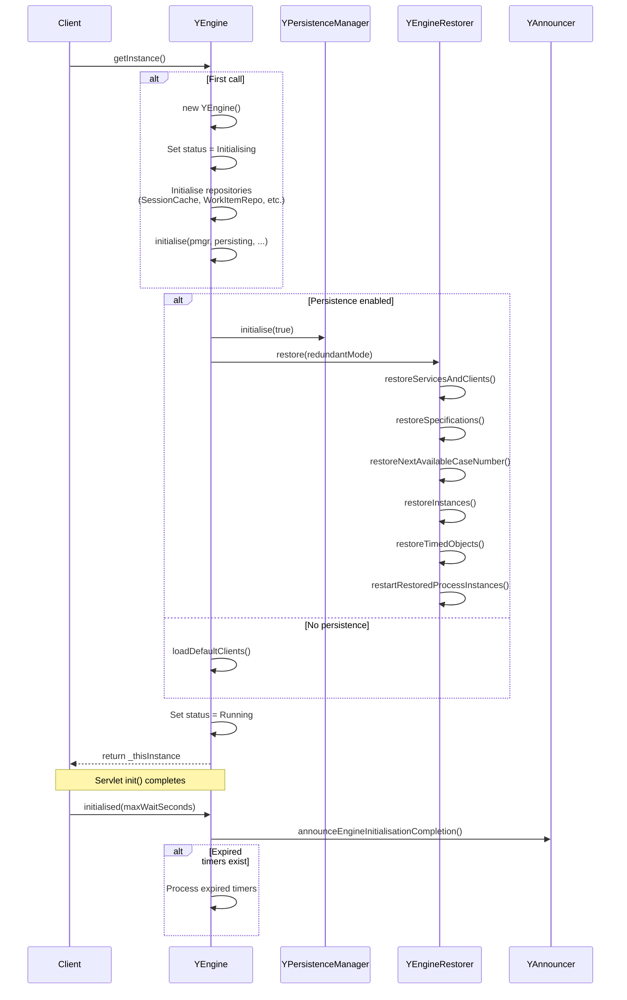
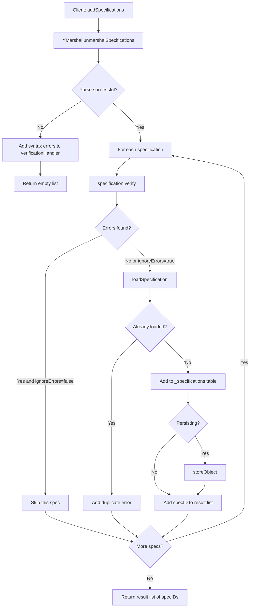
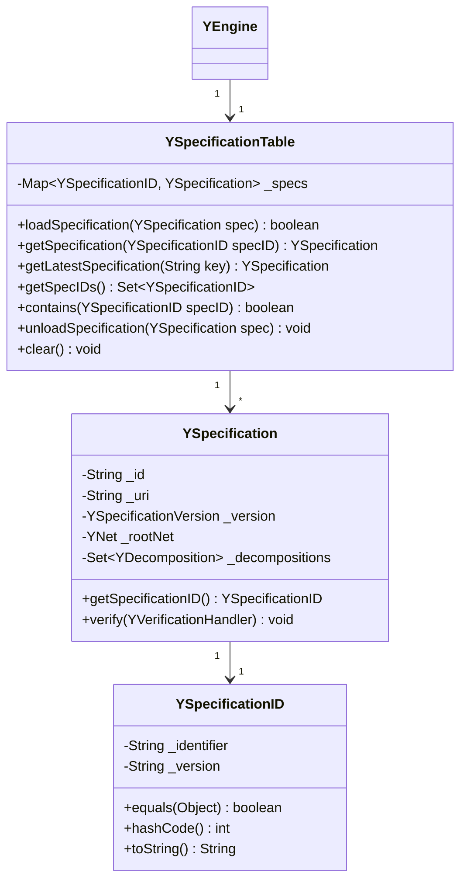
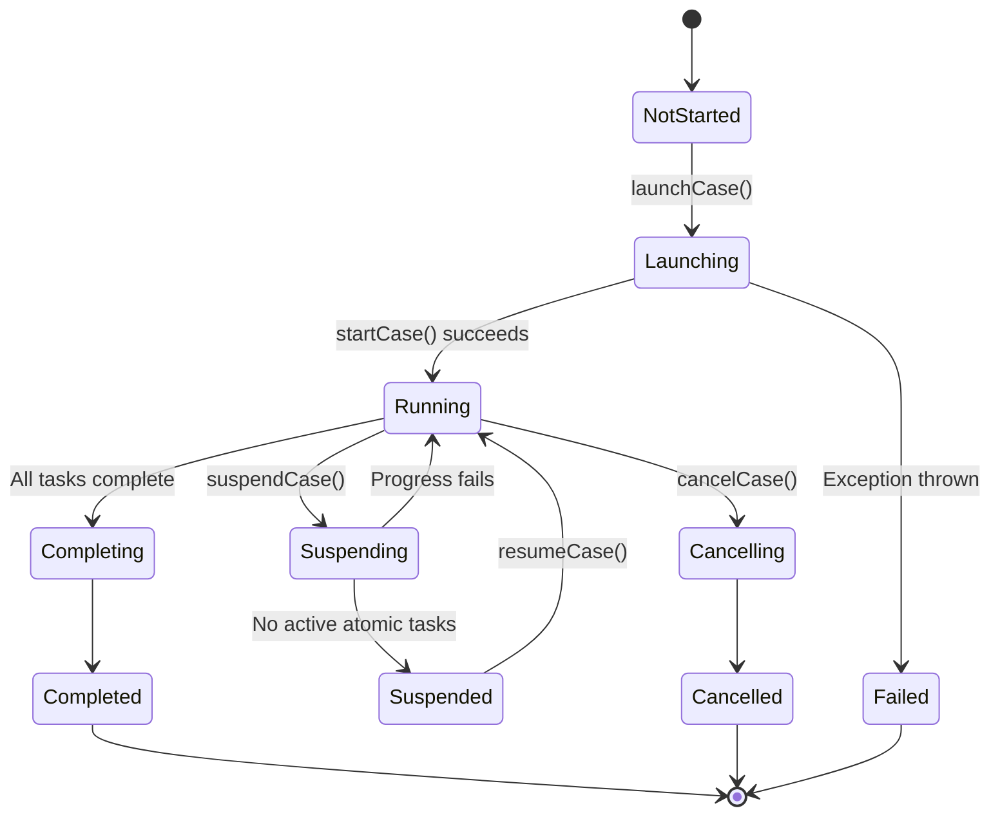
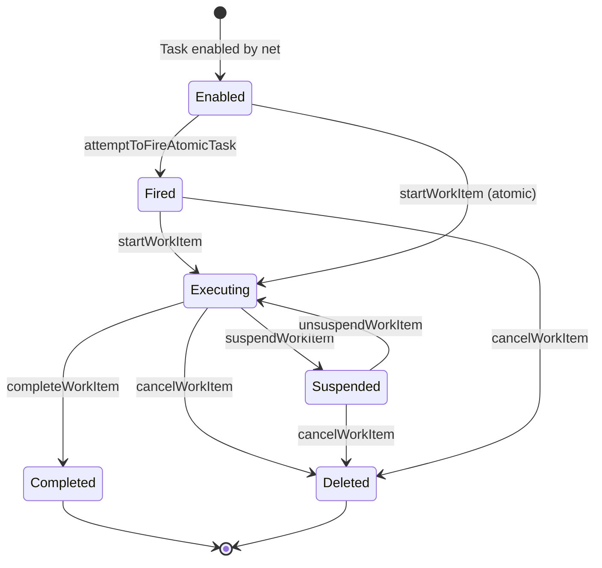
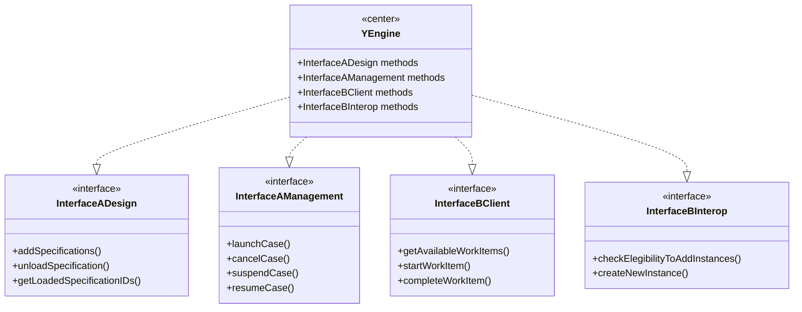
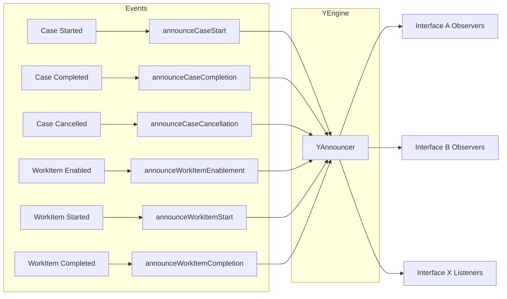
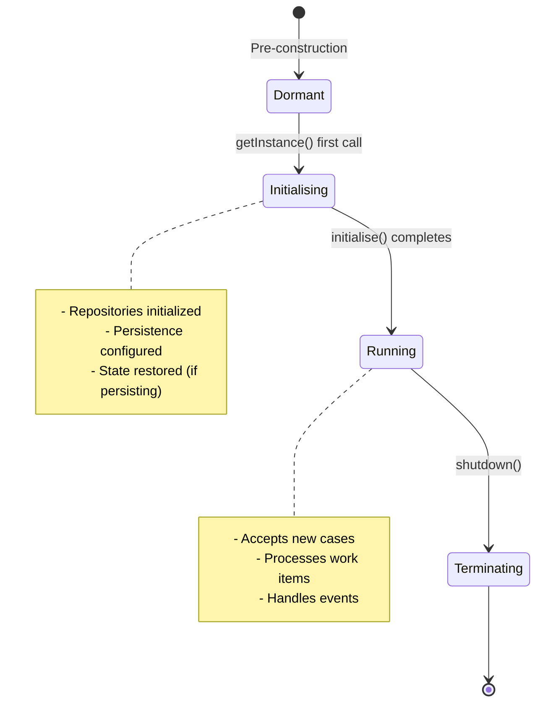

# YAWL YEngine Class Analysis

## Overview

The `YEngine` class is the core singleton workflow engine for the YAWL (Yet Another Workflow Language) system. It serves as the central orchestrator for workflow specification execution, case management, and work item lifecycle. This analysis documents the key architectural patterns, initialization sequences, and operational flows.

**File Location:** `/Users/sac/cre/vendors/yawl/src/org/yawlfoundation/yawl/engine/YEngine.java`

**Authorship:**
- Original: Lachlan Aldred (2004)
- Refactored for v2.0-2.1: Michael Adams

---

## 1. Singleton Pattern Implementation

### 1.1 Static Singleton Instance

```java
// Line 79
protected static YEngine _thisInstance;  // reference to self
```

### 1.2 Access Methods

The singleton is accessed through overloaded `getInstance()` methods with progressive parameter simplification:

```java
// Lines 137-172
public static YEngine getInstance(boolean persisting, boolean gatherHbnStats,
                                  boolean redundantMode)
        throws YPersistenceException {
    if (_thisInstance == null) {
        _thisInstance = new YEngine();
        initialise(null, persisting, gatherHbnStats, redundantMode);
    }
    return _thisInstance;
}

public static YEngine getInstance(boolean persisting) throws YPersistenceException {
    return getInstance(persisting, false);
}

public static YEngine getInstance(boolean persisting, boolean gatherHbnStats)
        throws YPersistenceException {
    return getInstance(persisting, gatherHbnStats, false);
}

public static YEngine getInstance() {
    try {
        return getInstance(ENGINE_PERSISTS_BY_DEFAULT);
    }
    catch (Exception e) {
        throw new RuntimeException("Failure to instantiate the engine.");
    }
}
```

### 1.3 Singleton Pattern Diagram

```mermaid
classDiagram
    class YEngine {
        -static YEngine _thisInstance
        -static boolean _persisting
        -static YEventLogger _yawllog
        -static YCaseNbrStore _caseNbrStore
        -static Logger _logger
        -static Set~YTimedObject~ _expiredTimers
        -static boolean _generateUIMetaData
        -static boolean _restoring
        -YWorkItemRepository _workItemRepository
        -YNetRunnerRepository _netRunnerRepository
        -Map~YIdentifier, YSpecification~ _runningCaseIDToSpecMap
        -Map~String, YAWLServiceReference~ _yawlServices
        -Map~String, YExternalClient~ _externalClients
        -YSpecificationTable _specifications
        -Status _engineStatus
        -YSessionCache _sessionCache
        -YAnnouncer _announcer
        -InstanceCache _instanceCache
        +getInstance() YEngine
        +getInstance(boolean persisting) YEngine
        +getInstance(boolean persisting, boolean gatherHbnStats) YEngine
        +getInstance(boolean persisting, boolean gatherHbnStats, boolean redundantMode) YEngine
        -protected YEngine()
        -protected static void initialise(...)
    }

    class YEngine$Status {
        <<enumeration>>
        Dormant
        Initialising
        Running
        Terminating
    }

    YEngine --> YEngine$Status : uses
```

### 1.4 Singleton Characteristics

| Characteristic | Implementation |
|----------------|----------------|
| **Instantiation** | Lazy initialization on first `getInstance()` call |
| **Access** | Static methods with progressive overloading |
| **Thread Safety** | Not explicitly synchronized (relies on servlet container) |
| **Lifecycle** | Per-JVM, survives until process termination |

---

## 2. Initialization Sequence

### 2.1 Constructor

```java
// Lines 113-128
protected YEngine() {
    _engineStatus = Status.Initialising;

    // initialise global objects
    _sessionCache = new YSessionCache();
    _workItemRepository = new YWorkItemRepository();
    _caseNbrStore = YCaseNbrStore.getInstance();
    _announcer = new YAnnouncer(this);         // the 'pusher' of interface events
    _specifications = new YSpecificationTable();
    _instanceCache = new InstanceCache();
    _logger = LogManager.getLogger(YEngine.class);
    _netRunnerRepository = new YNetRunnerRepository();
    _runningCaseIDToSpecMap = new ConcurrentHashMap<YIdentifier, YSpecification>();
    _yawlServices = new ConcurrentHashMap<String, YAWLServiceReference>();
    _externalClients = new ConcurrentHashMap<String, YExternalClient>();
}
```

### 2.2 Initialization Method

```java
// Lines 175-202
protected static void initialise(YPersistenceManager pmgr, boolean persisting,
                                 boolean gatherHbnStats, boolean redundantMode)
        throws YPersistenceException {
    _logger.debug("--> YEngine: Creating initial instance");
    _persisting = persisting;

    // init the process logger
    _yawllog = YEventLogger.getInstance(_thisInstance);

    // Initialise the persistence layer & restore state
    _pmgr = pmgr != null ? pmgr : new YPersistenceManager();
    if (_persisting) {
        _pmgr.initialise(true);
        _pmgr.setStatisticsEnabled(gatherHbnStats);
        _caseNbrStore.setPersisting(true);
        _thisInstance.restore(redundantMode);
    }
    else {
        _pmgr.setEnabled(false);
        // Default clients and services should always be available
        _thisInstance.loadDefaultClients();
    }

    // Init completed - set engine status to up and running
    _logger.info("Marking engine status = RUNNING");
    _thisInstance.setEngineStatus(Status.Running);
}
```

### 2.3 Initialization Sequence Diagram



### 2.4 Initialization Steps Summary

| Step | Component | Action |
|------|-----------|--------|
| 1 | Constructor | Set status to `Initialising` |
| 2 | Constructor | Initialize session cache, work item repository, announcer |
| 3 | Constructor | Initialize specifications table, instance cache |
| 4 | Constructor | Initialize concurrent maps for cases, services, clients |
| 5 | initialise() | Create event logger |
| 6 | initialise() | Create or use provided persistence manager |
| 7 | initialise() (persisting) | Restore persisted state via YEngineRestorer |
| 8 | initialise() (non-persisting) | Load default clients from properties |
| 9 | initialise() | Set status to `Running` |
| 10 | initialised() | Announce completion and process expired timers |

---

## 3. Specification Loading and Caching

### 3.1 Specification Storage

Specifications are stored in a `YSpecificationTable`:

```java
// Line 96
private YSpecificationTable _specifications;
```

### 3.2 Adding Specifications

```java
// Lines 532-585
public List<YSpecificationID> addSpecifications(String specStr,
                    boolean ignoreErrors, YVerificationHandler verificationHandler)
        throws YPersistenceException {

    _logger.debug("--> addSpecifications");

    List<YSpecificationID> result = new Vector<YSpecificationID>();
    List<YSpecification> newSpecifications;
    try {
        newSpecifications = YMarshal.unmarshalSpecifications(specStr);
    }
    catch (YSyntaxException e) {
        for (String msg : e.getMessage().split("\n")) {
            verificationHandler.error(null, msg);
        }
        _logger.debug("<-- addSpecifications: syntax exceptions found");
        return result;
    }

    if (newSpecifications != null) {
        for (YSpecification specification : newSpecifications) {
            specification.verify(verificationHandler);

            if (ignoreErrors || ! verificationHandler.hasErrors()) {
                if (loadSpecification(specification)) {
                    if (_persisting && ! _restoring) {
                        try {
                            storeObject(specification);
                        }
                        catch (YPersistenceException e) {
                            throw new YPersistenceException(
                                    "Failure whilst persisting new specification", e);
                        }
                    }
                    result.add(specification.getSpecificationID());
                }
                else {
                    String errDetail = specification.getSchemaVersion().isBetaVersion() ?
                        "URI: " + specification.getURI() : "UID: " + specification.getID();
                    errDetail += "- Version: " + specification.getSpecVersion();
                    verificationHandler.error(this,
                            "There is a specification with an identical id to ["
                             + errDetail + "] already loaded into the engine.");
                }
            }
        }
    }
    _logger.debug("<-- addSpecifications: {} IDs loaded", result.size());
    return result;
}
```

### 3.3 Loading Logic

```java
// Lines 593-595
public boolean loadSpecification(YSpecification spec) {
    return _specifications.loadSpecification(spec);
}
```

### 3.4 Retrieving Specifications

```java
// Lines 648-654
public YSpecification getLatestSpecification(String key) {
    return _specifications.getLatestSpecification(key);
}

public YSpecification getSpecification(YSpecificationID specID) {
    return _specifications.getSpecification(specID);
}
```

### 3.5 Specification Loading Flow



### 3.6 Specification Caching Architecture



---

## 4. Case Management

### 4.1 Case Storage Structure

Cases are tracked in a concurrent hash map:

```java
// Line 93
private Map<YIdentifier, YSpecification> _runningCaseIDToSpecMap;
```

### 4.2 Starting a Case

```java
// Lines 729-766
protected YIdentifier startCase(YSpecificationID specID, String caseParams,
                                URI completionObserver, String caseID,
                                YLogDataItemList logData, String serviceRef, boolean delayed)
        throws YStateException, YDataStateException, YQueryException, YPersistenceException {

    // check spec is loaded and is latest version (YStateException if not)
    YSpecification specification = _specifications.getSpecificationForCaseStart(specID);

    // check & format case data params (if any)
    Element data = formatCaseParams(caseParams, specification);

    YNetRunner runner = new YNetRunner(_pmgr, specification.getRootNet(), data, caseID);
    _netRunnerRepository.add(runner);
    logCaseStarted(specID, runner, completionObserver, caseParams, logData,
            serviceRef, delayed);

    // persist it
    if ((! _restoring) && (_pmgr != null)) {
        _pmgr.storeObject(runner);
    }

    runner.continueIfPossible(_pmgr);
    runner.start(_pmgr);
    YIdentifier runnerCaseID = runner.getCaseID();

    // special case: if spec contains exactly one task, and its empty,
    // the case (and runner) has already completed, so don't update map
    if (runner.hasActiveTasks()) {
        _runningCaseIDToSpecMap.put(runnerCaseID, specification);

        // announce the new case to the standalone gui (if any)
        if (_interfaceBClient != null) {
            _logger.debug("Asking client to add case {}", runnerCaseID.toString());
            _interfaceBClient.addCase(specID, runnerCaseID.toString());
        }
    }
    return runnerCaseID;
}
```

### 4.3 Launching a Case (Public API)

```java
// Lines 901-934
public String launchCase(YSpecificationID specID, String caseParams,
                         URI completionObserver, String caseID,
                         YLogDataItemList logData, String serviceHandle, boolean delayed)
        throws YStateException, YDataStateException, YEngineStateException,
        YQueryException, YPersistenceException {
    _logger.debug("--> launchCase");

    // ensure that the caseid passed (if any) is not already in use
    if ((caseID != null) && (getCaseID(caseID) != null)) {
        throw new YStateException("CaseID '" + caseID + "' is already active.");
    }
    checkEngineRunning();

    synchronized(_pmgr) {
        startTransaction();
        try {
            YIdentifier yCaseID = startCase(specID, caseParams, completionObserver,
                    caseID, logData, serviceHandle, delayed);
            if (yCaseID != null) {
                commitTransaction();
                announceEvents(yCaseID);
                return yCaseID.toString();
            }
            else throw new YStateException("Unable to start case.");
        }
        catch (YAWLException ye) {
            _logger.error("Failure returned from startCase - Rolling back Hibernate TXN", ye);
            rollbackTransaction();
            ye.rethrow();
        }
    }
    _logger.debug("<-- launchCase");
    return null;
}
```

### 4.4 Cancelling a Case

```java
// Lines 843-871
public void cancelCase(YIdentifier caseID, String serviceHandle)
        throws YPersistenceException, YEngineStateException {
    _logger.debug("--> cancelCase");
    checkEngineRunning();
    if (caseID == null) {
        throw new IllegalArgumentException(
                "Attempt to cancel a case using a null caseID");
    }

    _logger.info("Deleting persisted process instance: {}", caseID);

    Set<YWorkItem> removedItems = _workItemRepository.removeWorkItemsForCase(caseID);
    YNetRunner runner = _netRunnerRepository.get(caseID);
    synchronized(_pmgr) {
        startTransaction();
        if (_persisting) clearWorkItemsFromPersistence(removedItems);
        YTimer.getInstance().cancelTimersForCase(caseID.toString());
        removeCaseFromCaches(caseID);
        if (runner != null) runner.cancel(_pmgr);
        clearCaseFromPersistence(caseID);
        _yawllog.logCaseCancelled(caseID, null, serviceHandle);
        for (YWorkItem item : removedItems) {
            _yawllog.logWorkItemEvent(item,
                    YWorkItemStatus.statusCancelledByCase, null);
        }
        commitTransaction();
        _announcer.announceCaseCancellation(caseID, getYAWLServices());
    }
}
```

### 4.5 Case State Management

The engine supports case suspension and resumption:

```java
// Lines 1084-1136
public void suspendCase(YIdentifier caseID)
        throws YPersistenceException, YStateException {
    synchronized(_pmgr) {
        startTransaction();
        try {
            suspendCase(_pmgr, caseID);
            commitTransaction();
        }
        catch (Exception e) {
            _logger.error("Failure to suspend case " + caseID, e);
            rollbackTransaction();
            throw new YStateException("Could not suspend case (See log for details)");
        }
    }
}

// Lines 1145-1160
public void resumeCase(YIdentifier id) throws YPersistenceException, YStateException {
    synchronized(_pmgr) {
        startTransaction();
        try {
            resumeCase(_pmgr, id);
            commitTransaction();
            announceEvents(id);
           _announcer.announceCaseResumption(id, getYAWLServices());
        }
        catch (Exception e) {
            _logger.error("Failure to resume case " + id, e);
            rollbackTransaction();
            throw new YStateException("Could not resume case (See log for details)");
        }
    }
}
```

### 4.6 Case Lifecycle Diagram



### 4.7 Case Management Data Flow

```mermaid
flowchart LR
    subgraph CaseManagement
        A[launchCase] --> B[startCase]
        B --> C[Create YNetRunner]
        C --> D[Add to Repository]
        D --> E[Persist if enabled]
        E --> F[runner.start]
        F --> G{Has active tasks?}
        G -->|Yes| H[Add to _runningCaseIDToSpecMap]
        G -->|No| I[Immediate completion]
    end

    subgraph CaseExecution
        H --> J[Monitor work items]
        J --> K{User action}
        K -->|startWorkItem| L[Execute task]
        K -->|completeWorkItem| M[Finish task]
        K -->|suspendCase| N[Suspend execution]
        K -->|cancelCase| O[Cancel case]
    end

    subgraph CaseTermination
        L --> J
        M --> P{More tasks?}
        P -->|Yes| J
        P -->|No| Q[removeCaseFromCaches]
        N --> R[Suspended state]
        R --> S[resumeCase]
        S --> J
        O --> Q
        Q --> T[Clear persistence]
        T -->[*]
    end
```

---

## 5. Work Item Management

### 5.1 Work Item Repository

```java
// Line 91
private YWorkItemRepository _workItemRepository;
```

### 5.2 Starting a Work Item

```java
// Lines 1422-1479
public YWorkItem startWorkItem(YWorkItem workItem, YClient client)
        throws YStateException, YDataStateException, YQueryException,
        YPersistenceException, YEngineStateException {

    _logger.debug("--> startWorkItem");
    checkEngineRunning();
    YWorkItem startedItem = null;

    synchronized(_pmgr) {
        startTransaction();
        try {
            YNetRunner netRunner = null;
            if (workItem != null) {
                switch (workItem.getStatus()) {
                    case statusEnabled:
                        netRunner = getNetRunner(workItem.getCaseID());
                        startedItem = startEnabledWorkItem(netRunner, workItem, client);
                        break;

                    case statusFired:
                        netRunner = getNetRunner(workItem.getCaseID().getParent());
                        startedItem = startFiredWorkItem(netRunner, workItem, client);
                        break;

                    case statusDeadlocked:
                        startedItem = workItem;
                        break;

                    default:
                        rollbackTransaction();
                        throw new YStateException(String.format(
                                "Item [%s]: status [%s] does not permit starting.",
                                 workItem.getIDString(), workItem.getStatus()));
                }
            }
            else {
                rollbackTransaction();
                throw new YStateException("Cannot start null work item.");
            }

            commitTransaction();
            if (netRunner != null) announceEvents(netRunner.getCaseID());

            _logger.debug("<-- startWorkItem");
        }
        catch (YAWLException ye) {
            rollbackTransaction();
            ye.rethrow();
        }
        catch (Exception e) {
            rollbackTransaction();
            _logger.error("Failure starting workitem " + workItem.getIDString(), e);
            throw new YStateException(e.getMessage());
        }
    }
    return startedItem;
}
```

### 5.3 Completing a Work Item

```java
// Lines 1534-1581
public void completeWorkItem(YWorkItem workItem, String data, String logPredicate,
                             WorkItemCompletion completionType)
        throws YStateException, YDataStateException, YQueryException,
        YPersistenceException, YEngineStateException{
    if (_logger.isDebugEnabled()) {
        _logger.debug("--> completeWorkItem\nWorkItem = {}\nXML = {}",
                workItem != null ? workItem.get_thisID() : "null", data);
    }
    checkEngineRunning();

    synchronized(_pmgr) {
        startTransaction();
        try {
            if (workItem != null) {
                if (! workItem.getCaseID().hasParent()) {
                    throw new YStateException("WorkItem with ID [" + workItem.getIDString() +
                            "] is a 'parent' and so may not be completed.");
                }
                YNetRunner netRunner = getNetRunner(workItem.getCaseID().getParent());
                if (workItem.getStatus().equals(YWorkItemStatus.statusExecuting)) {
                    completeExecutingWorkitem(workItem, netRunner, data,
                            logPredicate, completionType);
                }
                else if (workItem.getStatus().equals(YWorkItemStatus.statusDeadlocked)) {
                    _workItemRepository.removeWorkItemFamily(workItem);
                }
                else {
                    throw new YStateException("WorkItem with ID [" + workItem.getIDString() +
                            "] not in executing state.");
                }

                commitTransaction();
                if (netRunner != null) announceEvents(netRunner.getCaseID());
            }
            else throw new YStateException("WorkItem argument is equal to null.");
        }
        catch (YAWLException ye) {
            rollbackTransaction();
            ye.rethrow();
        }
        catch (Exception e) {
            rollbackTransaction();
            _logger.error("Exception completing workitem", e);
        }
    }
    _logger.debug("<-- completeWorkItem");
}
```

### 5.4 Work Item Lifecycle



---

## 6. Interface Implementations

### 6.1 Implemented Interfaces

```java
// Lines 65-68
public class YEngine implements InterfaceADesign,
                            InterfaceAManagement,
                            InterfaceBClient,
                            InterfaceBInterop {
```

| Interface | Purpose |
|-----------|---------|
| `InterfaceADesign` | Specification design and management operations |
| `InterfaceAManagement` | Administrative operations |
| `InterfaceBClient` | Client operations for work items |
| `InterfaceBInterop` | Inter-service communication |

### 6.2 Interface Architecture



---

## 7. Persistence Management

### 7.1 Persistence Manager

```java
// Line 76
protected static YPersistenceManager _pmgr;
```

### 7.2 Transaction Management

```java
// Lines 2176-2188
private boolean startTransaction() throws YPersistenceException {
    return (_pmgr != null) && _pmgr.startTransaction();
}

private void commitTransaction() throws YPersistenceException {
    if (_pmgr != null) _pmgr.commit();
}

private void rollbackTransaction() throws YPersistenceException {
    if (_pmgr != null) _pmgr.rollbackTransaction();
}
```

### 7.3 Persistence Operations

```java
// Lines 2148-2173
public void storeObject(Object obj) throws YPersistenceException {
    doPersistAction(obj, YPersistenceManager.DB_INSERT);
}

public void updateObject(Object obj) throws YPersistenceException {
    doPersistAction(obj, YPersistenceManager.DB_UPDATE);
}

public void deleteObject(Object obj) throws YPersistenceException {
    doPersistAction(obj, YPersistenceManager.DB_DELETE);
}

private synchronized void doPersistAction(Object obj, int action) throws YPersistenceException {
    if (isPersisting() && _pmgr != null) {
        synchronized(_pmgr) {
            boolean isLocalTransaction = startTransaction();
            switch (action) {
                case YPersistenceManager.DB_UPDATE : _pmgr.updateObject(obj); break;
                case YPersistenceManager.DB_DELETE : _pmgr.deleteObject(obj); break;
                case YPersistenceManager.DB_INSERT : _pmgr.storeObject(obj); break;
            }
            if (isLocalTransaction) commitTransaction();
        }
    }
}
```

---

## 8. Announcements and Event Handling

### 8.1 YAnnouncer

```java
// Line 101
private YAnnouncer _announcer;  // handles all i'face notifys
```

### 8.2 Announcement Context



---

## 9. Key Design Patterns Summary

| Pattern | Implementation Location | Purpose |
|---------|------------------------|---------|
| **Singleton** | Static `_thisInstance` with `getInstance()` | Single engine instance per JVM |
| **Repository** | `YNetRunnerRepository`, `YWorkItemRepository` | Encapsulated data access |
| **Observer** | `YAnnouncer` with observer gateways | Event notification to interfaces |
| **Factory** | `YCaseNbrStore.getInstance()` | Centralized case ID generation |
| **Strategy** | Persistence enabled/disabled modes | Configurable persistence behavior |
| **State** | `Status` enum, `YWorkItemStatus` | Engine and work item state management |

---

## 10. Thread Safety Considerations

### 10.1 Concurrent Collections

```java
// Lines 125-127
_runningCaseIDToSpecMap = new ConcurrentHashMap<YIdentifier, YSpecification>();
_yawlServices = new ConcurrentHashMap<String, YAWLServiceReference>();
_externalClients = new ConcurrentHashMap<String, YExternalClient>();
```

### 10.2 Synchronization Patterns

```java
// Synchronized blocks around persistence manager
synchronized(_pmgr) {
    startTransaction();
    try {
        // ... operations
        commitTransaction();
    }
    catch (Exception e) {
        rollbackTransaction();
        throw ...;
    }
}
```

---

## 11. Engine Status States



---

## 12. Dependencies

| Component | Purpose |
|-----------|---------|
| `YMarshal` | XML marshalling/unmarshalling |
| `YEventLogger` | Process event logging |
| `YCaseNbrStore` | Case number generation |
| `YAnnouncer` | Event broadcasting |
| `YPersistenceManager` | Hibernate-based persistence |
| `YTimer` | Timeout management |
| `YSessionCache` | Session management |
| `InstanceCache` | Case instance caching |

---

## Conclusion

The `YEngine` class is a well-structured, enterprise-grade workflow engine implementing:

1. **Singleton pattern** for single-JVM deployment
2. **Lazy initialization** with configurable persistence
3. **Specification management** with verification and caching
4. **Case lifecycle management** (launch, suspend, resume, cancel)
5. **Work item orchestration** through state transitions
6. **Multi-interface support** for design, management, and client operations
7. **Transactional persistence** via Hibernate
8. **Event-driven architecture** with observer pattern

The code demonstrates mature enterprise Java patterns from the early 2000s, with careful attention to transaction management, state consistency, and extensibility.
