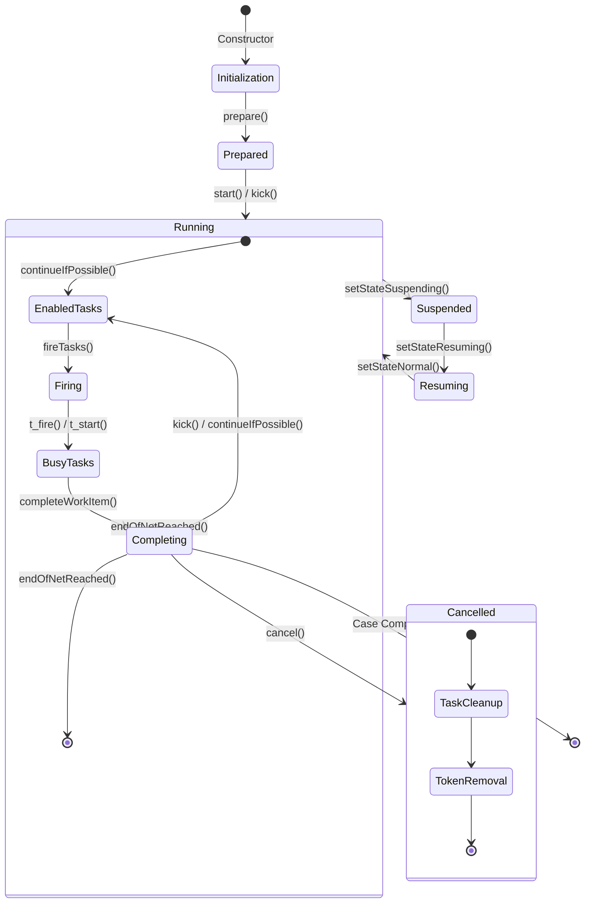
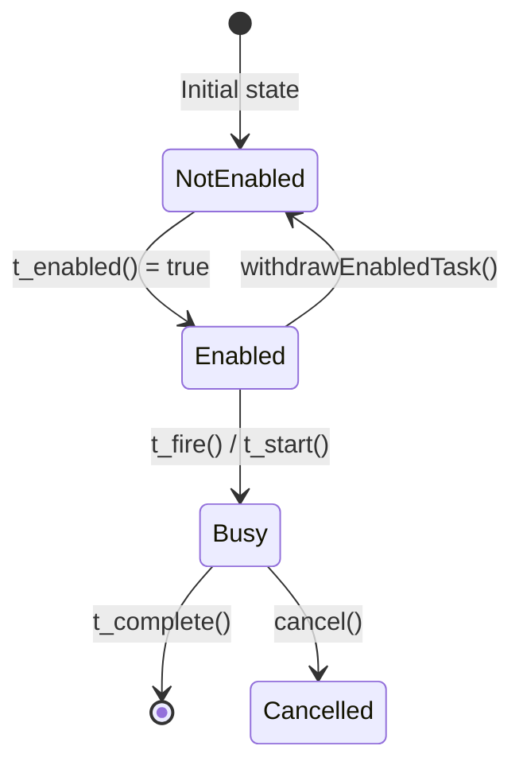
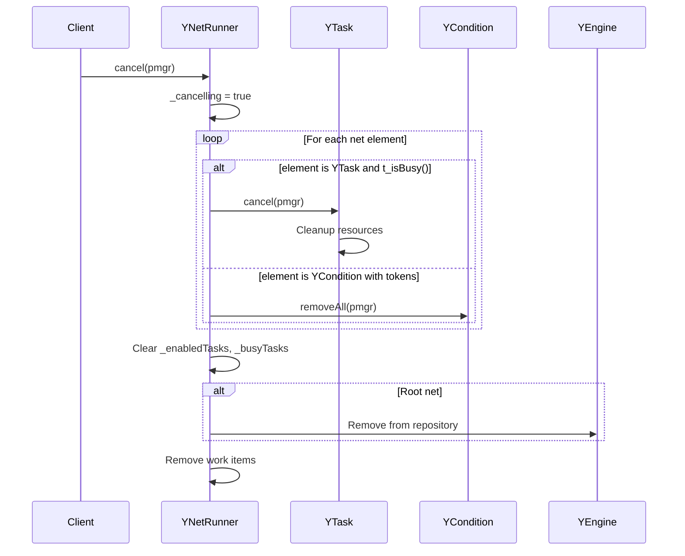
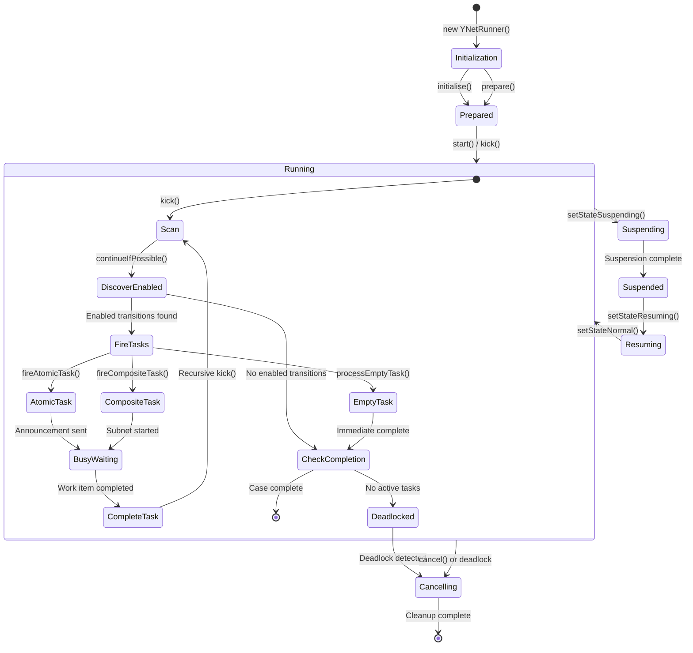
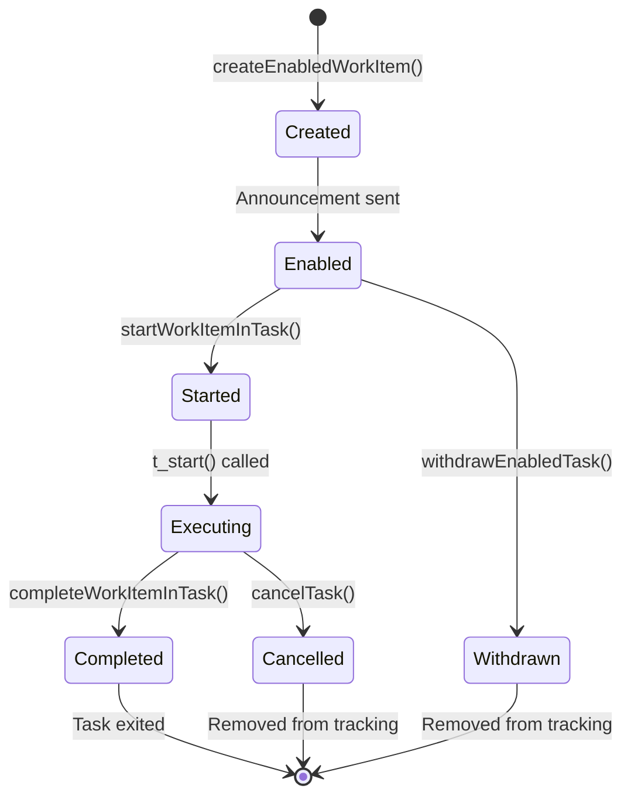

# YNetRunner Analysis - YAWL Java Engine

> Analysis of `/Users/sac/cre/vendors/yawl/src/org/yawlfoundation/yawl/engine/YNetRunner.java`
> Total Lines: 1,236

---

## Table of Contents

1. [Overview](#overview)
2. [Class Structure and Fields](#class-structure-and-fields)
3. [Net Execution Lifecycle](#net-execution-lifecycle)
4. [Transition Firing Mechanism (kick method)](#transition-firing-mechanism-kick-method)
5. [Enabled/Busy Task Tracking](#enabledbusy-task-tracking)
6. [Cancellation Handling](#cancellation-handling)
7. [State Diagrams](#state-diagrams)
8. [Key Design Patterns](#key-design-patterns)

---

## Overview

`YNetRunner` is the core runtime component of the YAWL (Yet Another Workflow Language) engine. It manages the execution of a single YAWL net (workflow instance), which is a Petri-net-based workflow model. Each running case (workflow instance) has exactly one `YNetRunner`.

### Primary Responsibilities

1. **Net Execution**: Orchestrates the firing of transitions (tasks) in a YAWL net
2. **Task Lifecycle Management**: Tracks enabled and busy tasks throughout execution
3. **Work Item Management**: Creates, enables, and completes work items for atomic tasks
4. **Subnet Coordination**: Manages nested workflow instances via composite tasks
5. **Case Completion**: Detects and announces case completion, handles cancellation
6. **Timer Management**: Supports deadline-based task execution
7. **Persistence**: Maintains execution state across restarts

### Execution Status States

```java
public enum ExecutionStatus {
    Normal,      // Normal execution
    Suspending,  // Transitioning to suspended
    Suspended,   // Execution paused
    Resuming     // Transitioning back to normal
}
```

---

## Class Structure and Fields

### Core Fields

```java
// Net and Case Identification
protected YNet _net;                      // The YAWL net being executed
private YIdentifier _caseIDForNet;        // Unique case identifier
private YSpecificationID _specID;         // Specification ID
private String _caseID;                   // String form of case ID

// Task Tracking Sets
private Set<YTask> _netTasks;             // All tasks in the net
private Set<YTask> _enabledTasks;         // Tasks enabled but not started
private Set<YTask> _busyTasks;            // Tasks currently executing
private final Set<YTask> _deadlockedTasks;// Tasks detected in deadlock
private Set<String> _enabledTaskNames;    // String IDs of enabled tasks
private Set<String> _busyTaskNames;       // String IDs of busy tasks

// Hierarchical Context
private YCompositeTask _containingCompositeTask; // Parent composite task (if subnet)
private String _containingTaskID;         // ID of containing task

// Engine Integration
private YEngine _engine;                  // Reference to YAWL engine
private YWorkItemRepository _workItemRepository; // Work item storage
private YAnnouncer _announcer;            // Event announcement broadcaster

// Execution Control
private boolean _cancelling;              // Cancellation flag
private ExecutionStatus _executionStatus; // Current execution status
private Set<YAnnouncement> _announcements;// Pending announcements

// Timing
private long _startTime;                  // Net start timestamp
private Map<String, String> _timerStates; // Task timer states

// Observers
private YAWLServiceReference _caseObserver; // Case observer service
private String _caseObserverStr;          // Persisted observer URI

// Data
private YNetData _netdata;                // Net-level data storage
```

---

## Net Execution Lifecycle

### Lifecycle Diagram



### Initialization Phase

```java
// Constructor for root net (top-level workflow)
public YNetRunner(YPersistenceManager pmgr, YNet netPrototype,
                  Element paramsData, String caseID) {
    // 1. Create or use provided case identifier
    _caseIDForNet = new YIdentifier(caseID);

    // 2. Get external data if available
    Element externalData = netPrototype.getCaseDataFromExternal(_caseIDForNet.toString());

    // 3. Initialize the net
    initialise(pmgr, netPrototype, _caseIDForNet, paramsData);
}

private void initialise(YPersistenceManager pmgr, YNet netPrototype,
                       YIdentifier caseIDForNet, Element incomingData) {
    // Clone the net prototype (each case gets its own net instance)
    _net = (YNet) netPrototype.clone();

    // Initialize data store for this case
    _net.initializeDataStore(pmgr, _netdata);

    // Collect all tasks in the net
    _netTasks = new HashSet<YTask>(_net.getNetTasks());

    // Prepare the net (add case ID to input condition)
    prepare(pmgr);

    // Set incoming data if provided
    if (incomingData != null) _net.setIncomingData(pmgr, incomingData);

    // Initialize timers
    initTimerStates();

    // Set initial execution status
    _executionStatus = ExecutionStatus.Normal;
}

private void prepare(YPersistenceManager pmgr) {
    // Add case identifier to input condition (initial marking)
    YInputCondition inputCondition = _net.getInputCondition();
    inputCondition.add(pmgr, _caseIDForNet);

    // Initialize net internal state
    _net.initialise(pmgr);
}
```

### Execution Phase

The net execution is driven by the `kick()` method, which is called:
1. When the net starts (`start()` calls `kick()`)
2. After a work item is completed
3. After a subnet completes
4. After an atomic task fires

```java
public void start(YPersistenceManager pmgr) {
    kick(pmgr);
}
```

---

## Transition Firing Mechanism (kick method)

### The kick() Method

The `kick()` method is the primary execution driver. It attempts to continue execution by firing enabled transitions.

```java
public synchronized void kick(YPersistenceManager pmgr) {
    _logger.debug("--> YNetRunner.kick");

    // STEP 1: Try to continue execution
    if (! continueIfPossible(pmgr)) {
        // STEP 2: If cannot continue, net may be complete

        // Check if root net (top-level workflow)
        if ((_engine != null) && isRootNet()) {
            // Announce case completion
            announceCaseCompletion();

            // Check for unsound nets (tokens left in non-output places)
            if (endOfNetReached() && warnIfNetNotEmpty()) {
                _cancelling = true;  // Flag as not a deadlock
            }

            // Post case data to external gateway
            _net.postCaseDataToExternal(getCaseID().toString());

            // Clean up engine caches
            _engine.removeCaseFromCaches(_caseIDForNet);

            // Log completion
            YEventLogger.getInstance().logNetCompleted(_caseIDForNet, logData);
        }

        // STEP 3: Handle deadlock (if any)
        if (! _cancelling && deadLocked()) {
            notifyDeadLock(pmgr);
        }

        // STEP 4: Cancel and clean up
        cancel(pmgr);

        // STEP 5: Clear persistence (root only)
        if ((_engine != null) && isRootNet()) {
            _engine.clearCaseFromPersistence(_caseIDForNet);
        }
    }

    _logger.debug("<-- YNetRunner.kick");
}
```

### continueIfPossible() - Task Discovery

This method discovers and fires all enabled transitions.

```java
public synchronized boolean continueIfPossible(YPersistenceManager pmgr) {
    _logger.debug("--> continueIfPossible");

    // Check if suspended - don't post new work items
    if (isInSuspense()) {
        _logger.debug("Aborting runner continuation as case is currently suspending/suspended");
        return true;
    }

    // Don't continue if already completed
    if (isCompleted()) return false;

    // Storage for enabled transitions
    YEnabledTransitionSet enabledTransitions = new YEnabledTransitionSet();

    // Iterate through all tasks in the net
    for (YTask task : _netTasks) {

        // Check if task is enabled (Petri net firing rule)
        if (task.t_enabled(_caseIDForNet)) {
            // Add if not already tracked as enabled or busy
            if (! (_enabledTasks.contains(task) || _busyTasks.contains(task))) {
                enabledTransitions.add(task);
            }
        }
        else {
            // Task was enabled but is no longer - withdraw it
            if (_enabledTasks.contains(task)) {
                withdrawEnabledTask(task, pmgr);
            }
        }

        // Consistency check
        if (task.t_isBusy() && !_busyTasks.contains(task)) {
            throw new RuntimeException("Busy task list out of synch");
        }
    }

    // Fire all enabled transitions
    if (! enabledTransitions.isEmpty()) {
        fireTasks(enabledTransitions, pmgr);
    }

    // Sync busy tasks from net
    _busyTasks = _net.getBusyTasks();

    // Return whether there are active tasks
    return hasActiveTasks();
}
```

### fireTasks() - Task Firing Strategy

This method implements the deferred choice pattern for YAWL. Tasks are grouped by their enabling condition.

```java
private void fireTasks(YEnabledTransitionSet enabledSet, YPersistenceManager pmgr) {
    Set<YTask> enabledTasks = new HashSet<YTask>();

    // Process each TaskGroup (tasks enabled by same condition)
    for (YEnabledTransitionSet.TaskGroup group : enabledSet.getAllTaskGroups()) {

        // STRATEGY 1: Deferred Choice with Composite Tasks
        // If group has composite tasks, fire only one (random)
        if (group.hasCompositeTasks()) {
            YCompositeTask composite = group.getRandomCompositeTaskFromGroup();
            if (! (enabledTasks.contains(composite) || endOfNetReached())) {
                fireCompositeTask(composite, pmgr);
                enabledTasks.add(composite);
            }
        }

        // STRATEGY 2: Deferred Choice with Empty Tasks
        // Empty tasks (no decomposition) are fired immediately
        else if (group.hasEmptyTasks()) {
            YAtomicTask atomic = group.getRandomEmptyTaskFromGroup();
            if (! (enabledTasks.contains(atomic) || endOfNetReached())) {
                processEmptyTask(atomic, pmgr);
            }
        }

        // STRATEGY 3: Atomic Tasks (announce all for external execution)
        else {
            String groupID = group.getDeferredChoiceID(); // null if < 2 tasks
            for (YAtomicTask atomic : group.getAtomicTasks()) {
                if (! (enabledTasks.contains(atomic) || endOfNetReached())) {
                    YAnnouncement announcement = fireAtomicTask(atomic, groupID, pmgr);
                    if (announcement != null) {
                        _announcements.add(announcement);
                    }
                    enabledTasks.add(atomic);
                }
            }
        }
    }
}
```

### Firing Atomic Tasks

```java
private YAnnouncement fireAtomicTask(YAtomicTask task, String groupID,
                                     YPersistenceManager pmgr) {
    // Add to enabled set
    _enabledTasks.add(task);
    _enabledTaskNames.add(task.getID());

    // Create work item
    YWorkItem item = createEnabledWorkItem(pmgr, _caseIDForNet, task);

    // Set deferred choice group ID if applicable
    if (groupID != null) item.setDeferredChoiceGroupID(groupID);

    // Persist
    if (pmgr != null) pmgr.updateObject(this);

    // Create announcement for external services
    YAWLServiceGateway wsgw = (YAWLServiceGateway) task.getDecompositionPrototype();
    YAnnouncement announcement = _announcer.createAnnouncement(
        wsgw.getYawlService(),
        item,
        YEngineEvent.ITEM_ADD
    );

    // Check work item constraints with Interface X
    if (_announcer.hasInterfaceXListeners()) {
        _announcer.announceCheckWorkItemConstraints(
            item,
            _net.getInternalDataDocument(),
            true
        );
    }

    return announcement;
}
```

### Firing Composite Tasks

```java
private void fireCompositeTask(YCompositeTask task, YPersistenceManager pmgr) {
    // Check not already firing
    if (! _busyTasks.contains(task)) {
        _busyTasks.add(task);
        _busyTaskNames.add(task.getID());
        if (pmgr != null) pmgr.updateObject(this);

        // Fire creates child case identifiers
        List<YIdentifier> caseIDs = task.t_fire(pmgr);

        // Start each child instance
        for (YIdentifier id : caseIDs) {
            try {
                task.t_start(pmgr, id);
            }
            catch (YDataStateException ydse) {
                // Rollback on failure
                task.rollbackFired(id, pmgr);
                ydse.rethrow();
            }
        }
    }
}
```

### Processing Empty Tasks

Empty tasks have no decomposition and complete immediately.

```java
protected void processEmptyTask(YAtomicTask task, YPersistenceManager pmgr) {
    try {
        if (task.t_enabled(_caseIDForNet)) {
            // Fire, start, and complete in one atomic operation
            YIdentifier id = task.t_fire(pmgr).get(0);
            task.t_start(pmgr, id);
            _busyTasks.add(task);  // Pre-req for completeTask
            completeTask(pmgr, null, task, id, null);
        }
    }
    catch (YStateException yse) {
        // Ignore - task already removed due to alternate path
    }
}
```

---

## Enabled/Busy Task Tracking

### Task State Diagram



### Tracking Sets

The `YNetRunner` maintains three sets for tracking task state:

| Set | Purpose | When Added | When Removed |
|-----|---------|------------|--------------|
| `_enabledTasks` | Tasks enabled but not yet started | `fireAtomicTask()` | `withdrawEnabledTask()`, `attemptToFireAtomicTask()` |
| `_busyTasks` | Tasks currently executing | `fireCompositeTask()`, `processEmptyTask()`, `attemptToFireAtomicTask()` | `completeTask()`, `processCompletedSubnet()`, `cancelTask()` |
| `_deadlockedTasks` | Tasks detected in deadlock | `createDeadlockItem()` | Never (accumulated for reporting) |

### Task State Queries

```java
// Check if net has active work
public boolean hasActiveTasks() {
    return _enabledTasks.size() > 0 || _busyTasks.size() > 0;
}

// Get all active tasks (enabled + busy)
protected Set<YTask> getActiveTasks() {
    Set<YTask> activeTasks = new HashSet<YTask>();
    activeTasks.addAll(_busyTasks);
    activeTasks.addAll(_enabledTasks);
    return activeTasks;
}

// Check completion status
public boolean isCompleted() {
    return endOfNetReached() || isEmpty();
}

// Check if output condition has token
public boolean endOfNetReached() {
    return _net.getOutputCondition().containsIdentifier();
}

// Check if net is empty (no tokens anywhere)
public boolean isEmpty() {
    for (YExternalNetElement element : _net.getNetElements().values()) {
        if (element instanceof YCondition) {
            if (((YCondition) element).containsIdentifier()) return false;
        }
        else {
            if (((YTask) element).t_isBusy()) return false;
        }
    }
    return true;
}
```

### Withdrawing Enabled Tasks

When a task is no longer enabled (its precondition no longer holds):

```java
private void withdrawEnabledTask(YTask task, YPersistenceManager pmgr) {
    // Remove from tracking
    _enabledTasks.remove(task);
    _enabledTaskNames.remove(task.getID());

    // Get the work item
    YWorkItem wItem = _workItemRepository.get(_caseID, task.getID());
    if (wItem != null) {
        // Announce cancellation
        YAnnouncement announcement = _announcer.createAnnouncement(
            wItem,
            YEngineEvent.ITEM_CANCEL
        );
        if (announcement != null) _announcements.add(announcement);

        // Log withdrawal
        YEventLogger.getInstance().logWorkItemEvent(
            wItem,
            YWorkItemStatus.statusWithdrawn,
            null
        );

        // Cancel any active timer
        if (wItem.hasTimerStarted()) {
            YTimer.getInstance().cancelTimerTask(wItem.getIDString());
        }

        // Remove from persistence
        if (pmgr != null) {
            pmgr.deleteObject(wItem);
            pmgr.updateObject(this);
        }
    }
}
```

---

## Cancellation Handling

### Cancellation Flow



### Cancel Method

```java
public synchronized void cancel(YPersistenceManager pmgr) {
    _logger.debug("--> NetRunner cancel {}", getCaseID().get_idString());

    // Flag cancellation
    _cancelling = true;

    // Cancel all busy tasks
    for (YExternalNetElement netElement : _net.getNetElements().values()) {
        if (netElement instanceof YTask) {
            YTask task = ((YTask) netElement);
            if (task.t_isBusy()) {
                task.cancel(pmgr);
            }
        }
        // Remove all tokens from conditions
        else if (((YCondition) netElement).containsIdentifier()) {
            ((YCondition) netElement).removeAll(pmgr);
        }
    }

    // Clear tracking sets
    _enabledTasks = new HashSet<>();
    _busyTasks = new HashSet<>();

    // Handle root vs subnet cancellation
    if (_containingCompositeTask == null) {
        // Root net - remove from repository
        _engine.getNetRunnerRepository().remove(_caseIDForNet);
    }
    else {
        // Subnet - log cancellation
        YEventLogger.getInstance().logNetCancelled(
            getSpecificationID(),
            this,
            _containingCompositeTask.getID(),
            null
        );
    }

    // Remove all work items for root net
    if (isRootNet()) {
        _workItemRepository.removeWorkItemsForCase(_caseIDForNet);
    }
}
```

### Task-Specific Cancellation

```java
public synchronized void cancelTask(YPersistenceManager pmgr, String taskID) {
    YAtomicTask task = (YAtomicTask) getNetElement(taskID);

    try {
        task.cancel(pmgr, this.getCaseID());
        _busyTasks.remove(task);
        _busyTaskNames.remove(task.getID());
    }
    catch (YPersistenceException ype) {
        _logger.fatal("Failure whilst cancelling task: " + taskID, ype);
    }
}
```

### isAlive() Check

```java
public boolean isAlive() {
    return ! _cancelling;
}
```

This check is used before performing operations on a net runner.

---

## State Diagrams

### Complete Net Runner State Machine



### Work Item Lifecycle



---

## Key Design Patterns

### 1. Hierarchical Net Execution

YAWL supports composite tasks that contain entire subnets. The `YNetRunner` handles this recursively:

```java
// Processing a completed subnet
private synchronized void processCompletedSubnet(YPersistenceManager pmgr,
                                                 YIdentifier caseIDForSubnet,
                                                 YCompositeTask busyCompositeTask,
                                                 Document rawSubnetData) {
    // Complete the composite task in this net
    if (busyCompositeTask.t_complete(pmgr, caseIDForSubnet, rawSubnetData)) {
        _busyTasks.remove(busyCompositeTask);

        // Check if this completes the containing net
        if (endOfNetReached()) {
            if (_containingCompositeTask != null) {
                // Get parent runner and notify it
                YNetRunner parentRunner = _engine.getNetRunner(_caseIDForNet.getParent());
                if ((parentRunner != null) && _containingCompositeTask.t_isBusy()) {
                    Document dataDoc = _net.usesSimpleRootData() ?
                        _net.getInternalDataDocument() :
                        _net.getOutputData();

                    // Recursively notify parent
                    parentRunner.processCompletedSubnet(pmgr,
                        _caseIDForNet,
                        _containingCompositeTask,
                        dataDoc);
                }
            }
        }

        // Continue execution
        kick(pmgr);
    }
}
```

### 2. Deferred Choice Pattern

When multiple tasks are enabled by the same condition (OR-join), only one can execute. The implementation groups tasks by their enabling condition:

```java
// TaskGroup represents tasks enabled by a single condition
for (YEnabledTransitionSet.TaskGroup group : enabledSet.getAllTaskGroups()) {
    if (group.hasCompositeTasks()) {
        // Choose one composite task randomly
        YCompositeTask composite = group.getRandomCompositeTaskFromGroup();
        fireCompositeTask(composite, pmgr);
    }
    // ... similar for empty and atomic tasks
}
```

### 3. Persistence Integration

All state changes are persisted through `YPersistenceManager`:

```java
if (pmgr != null) {
    pmgr.updateObject(this);        // Update runner state
    pmgr.storeObject(workItem);     // Store new work item
    pmgr.deleteObject(wItem);       // Delete removed work item
}
```

### 4. Event Announcement

The runner uses an announcer pattern to notify external services:

```java
// Announce case completion
_announcer.announceCaseCompletion(_caseObserver, _caseIDForNet, _net.getOutputData());

// Announce work item events
_announcer.createAnnouncement(wsgw.getYawlService(), item, YEngineEvent.ITEM_ADD);

// Announce cancellation
_announcer.announceCancelledWorkItem(removed);

// Announce deadlock
_announcer.announceDeadlock(_caseIDForNet, _deadlockedTasks);
```

### 5. Synchronization

Critical methods are `synchronized` to ensure thread safety:

- `kick()` - Main execution driver
- `continueIfPossible()` - Task discovery
- `cancel()` - Cancellation handler
- `completeTask()` - Task completion
- `startWorkItemInTask()` - Work item start
- `completeWorkItemInTask()` - Work item completion
- `processCompletedSubnet()` - Subnet completion
- `cancelTask()` - Task cancellation

---

## Summary

The `YNetRunner` class implements the core execution semantics of YAWL workflows:

1. **Petri Net Foundation**: Uses marking-based execution (tokens in conditions)
2. **Two-Phase Execution**: Discover enabled tasks, then fire them
3. **Hierarchical Composition**: Supports nested workflows via composite tasks
4. **Deferred Choice**: Handles OR-joins by randomly selecting from multiple enabled tasks
5. **Persistence**: Maintains full execution state for recovery
6. **Event-Driven**: Announces all significant events to external observers

The class follows the YAWL reference implementation semantics and serves as the blueprint for implementing YAWL in other languages (such as the Erlang implementation in this project).
