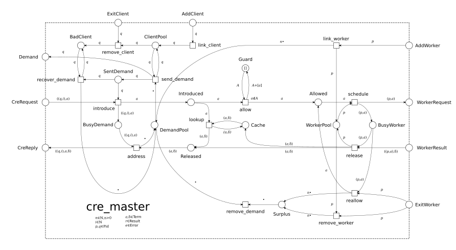

# CRE Architecture

## Overview

CRE (Common Runtime Environment) is built on Erlang/OTP using the **Joe Armstrong design philosophy**: **one real OTP runner, everything else pure helpers/utilities**.

The system uses **Petri nets** as its formal foundation, with `gen_pnet` as the sole OTP behavior maintaining state. All other modules are pure functional utilities that transform data without side effects.



*Figure: CRE system architecture showing component layers and data flow*

## Design Philosophy

### Joe Armstrong Principle

> "One real OTP runner (gen_pnet), everything else pure helpers/utilities"

**Key implications:**
- Only `gen_pnet` (and its wrapper `gen_yawl`) are OTP processes maintaining state
- All workflow logic lives in pure functional modules
- Message contracts define communication patterns
- State changes flow through token production/consumption
- Deterministic execution through pure functions

This design ensures:
- **Predictability** - Pure functions produce consistent outputs
- **Testability** - Easy to unit test individual components
- **Fault Tolerance** - State is isolated and recoverable
- **Scalability** - Stateless workers can be scaled horizontally

## System Architecture

### Component Layers

```
┌─────────────────────────────────────────────────────────────────┐
│                        Application Layer                         │
│  ┌─────────────┐  ┌─────────────┐  ┌─────────────┐               │
│  │ cre_app     │  │ cre_sup     │  │ cre_master  │               │
│  │ (app)       │  │ (sup)       │  │ (gen_server)│               │
│  └─────────────┘  └─────────────┘  └─────────────┘               │
└─────────────────────────────────────────────────────────────────┘
                              │
┌─────────────────────────────────────────────────────────────────┐
│                         OTP Runner Layer                        │
│  ┌──────────────────────────────────────────────────────────┐  │
│  │  gen_yawl (wrapper) ───────► gen_pnet (state machine)   │  │
│  │  - 3-tuple fire/3 support   - Token management          │  │
│  │  - usr_info updates         - Transition firing         │  │
│  │  - Timeout handling          - Progress loop            │  │
│  └──────────────────────────────────────────────────────────┘  │
└─────────────────────────────────────────────────────────────────┘
                              │
┌─────────────────────────────────────────────────────────────────┐
│                       Pure Helper Modules                       │
│  ┌──────────────┐  ┌──────────────┐  ┌──────────────┐           │
│  │ pnet_*       │  │ wf_*         │  │ yawl_*       │           │
│  │ (pure)       │  │ (pure)       │  │ (utilities)  │           │
│  └──────────────┘  └──────────────┘  └──────────────┘           │
│  ┌──────────────────────────────────────────────────────┐      │
│  │ src/patterns/*.erl (gen_yawl behaviors)              │      │
│  │ - Each pattern is a gen_pnet behavior                │      │
│  │ - Pure functional helper logic                         │      │
│  └──────────────────────────────────────────────────────┘      │
└─────────────────────────────────────────────────────────────────┘
```

### Layer Descriptions

#### Application Layer
- **cre_app** - Application module defining CRE's OTP application structure
- **cre_sup** - Top-level supervisor managing all CRE processes
- **cre_master** - Master process managing workflow execution and worker pools

#### OTP Runner Layer
- **gen_yawl** - Wrapper around gen_pnet providing YAWL-specific functionality
- **gen_pnet** - Core Petri net behavior maintaining workflow state

#### Pure Helper Modules
- **pnet_*** - Petri net utilities (place marking, transition validation)
- **wf_*** - Workflow utilities (task execution, data flow)
- **yawl_*** - YAWL-specific utilities (pattern implementations)
- **patterns/*.erl** - YAWL pattern implementations as gen_yawl behaviors

## Core Components

### gen_pnet - The Single OTP Runner

**File**: `src/core/gen_pnet.erl`

The only OTP behavior that maintains Petri net state. All workflow nets implement this behavior.

**Structure Callbacks (define the net):**
- `place_lst/0` - Returns list of place atoms
- `trsn_lst/0` - Returns list of transition atoms
- `init_marking/2` - Initial token distribution
- `preset/1` - Input places for each transition
- `is_enabled/3` - Check if transition can fire
- `fire/3` - Produce tokens when transition fires

**State Management:**
- Token distribution across places
- Transition firing logic
- Progress loop for automatic execution
- Timeout handling

### gen_yawl - YAWL Workflow Wrapper

**File**: `src/core/gen_yawl.erl`

Wrapper around gen_pnet providing YAWL-specific functionality:
- 3-tuple `fire/3` callback (return type, updated marking, user info)
- User info updates during workflow execution
- Task result handling
- Timeout management

### Workflow Patterns

**Directory**: `src/patterns/*.erl`

Each YAWL pattern is implemented as a gen_yawl behavior:

| Pattern | Module | Description |
|---------|--------|-------------|
| Parallel Split | `parallel_split.erl` | Execute tasks concurrently |
| Synchronization | `or_join.erl` | Wait for all parallel tasks |
| Exclusive Choice | `exclusive_choice.erl` | Branch based on conditions |
| Multi-Choice | `multiple_choice.erl` | Multiple conditional branches |
| Structured Loop | `structured_loop.erl` | Repeat tasks with conditions |
| Milestone | `milestone.erl` | Enable tasks based on state |

Each pattern:
1. Implements gen_yawl behavior
2. Defines Petri net structure (places, transitions)
3. Implements pure helper functions for logic
4. Maintains no state outside gen_pnet

## Data Flow

### Workflow Execution Flow

```
Client Request
      │
      ▼
┌─────────────┐
│ cre_api     │  REST API handler receives workflow submission
│ (gen_server)│
└─────┬───────┘
      │
      ▼
┌─────────────┐
│ cre_master  │  Master process assigns workflow to executor
│ (gen_server)│
└─────┬───────┘
      │
      ▼
┌─────────────┐
│ gen_yawl    │  Workflow executor (gen_pnet behavior)
│ (gen_pnet)  │  - Maintains token distribution
└─────┬───────┘  - Fires transitions
      │          - Progresses workflow
      ▼
┌─────────────┐
│ Task Modules│  Pure functional task execution
│ (stateless) │  - No side effects
└─────────────┘  - Return results only
      │
      ▼
Result Notification
```

### State Management

CRE uses **Petri net tokens** to represent workflow state:

- **Places** - Hold tokens representing workflow state (e.g., "task pending", "task complete")
- **Transitions** - Fire when input places have tokens, produce output tokens
- **Token Flow** - Token movement represents workflow progress

**Example**: Sequence pattern

```
Place: start       Place: task1_ready   Place: task1_done   Place: end
  (token)    ─────►    (token)      ─────►    (token)    ─────►  (token)
                │                      │
                ▼                      ▼
           Transition:           Transition:
           execute_task1         execute_task2
```

## Kubernetes Deployment Architecture

### GKE Deployment Model

```
┌─────────────────────────────────────────────────────────────┐
│                      GKE Cluster                            │
│  ┌──────────────────────────────────────────────────────┐  │
│  │             CRE Deployment (StatefulSet)             │  │
│  │                                                       │  │
│  │   ┌─────────┐    ┌─────────┐    ┌─────────┐         │  │
│  │   │ Pod: 0  │    │ Pod: 1  │    │ Pod: 2  │    ...  │  │
│  │   │ (cre)   │    │ (cre)   │    │ (cre)   │         │  │
│  │   │         │    │         │    │         │         │  │
│  │   │ CRE VM  │    │ CRE VM  │    │ CRE VM  │         │  │
│  │   │ Mnesia  │    │ Mnesia  │    │ Mnesia  │         │  │
│  │   └────┬────┘    └────┬────┘    └────┬────┘         │  │
│  │        │              │              │               │  │
│  │        └──────────────┴──────────────┘               │  │
│  │                    │                                 │  │
│  │              Mnesia Cluster                           │  │
│  │              (Distributed DB)                         │  │
│  └──────────────────────────────────────────────────────┘  │
│                           │                                 │
│                           ▼                                 │
│  ┌──────────────────────────────────────────────────────┐  │
│  │               Kubernetes Services                     │  │
│  │  ┌──────────────┐  ┌──────────────┐                  │  │
│  │  │ cre-service  │  │ cre-api-svc  │                  │  │
│  │  │ (ClusterIP)  │  │ (LoadBalancer)│                  │  │
│  │  └──────────────┘  └──────────────┘                  │  │
│  └──────────────────────────────────────────────────────┘  │
│                           │                                 │
│                           ▼                                 │
│  ┌──────────────────────────────────────────────────────┐  │
│  │              External Access                         │  │
│  │         Ingress / Load Balancer                      │  │
│  └──────────────────────────────────────────────────────┘  │
└─────────────────────────────────────────────────────────────┘
```

### Pod Architecture

Each CRE pod contains:

```
┌─────────────────────────────────────────────┐
│            CRE Pod                          │
│  ┌───────────────────────────────────────┐  │
│  │         CRE Application               │  │
│  │  - cre_app (OTP application)         │  │
│  │  - cre_sup (supervisor tree)         │  │
│  │  - cre_master (workflow orchestrator)│  │
│  │  - gen_yawl instances (workflows)    │  │
│  │  - API handlers (Cowboy HTTP)        │  │
│  └───────────────────────────────────────┘  │
│                                             │
│  ┌───────────────────────────────────────┐  │
│  │         Mnesia Database               │  │
│  │  - Distributed across CRE pods        │  │
│  │  - Stores workflow state              │  │
│  │  - Automatic replication             │  │
│  └───────────────────────────────────────┘  │
│                                             │
│  ┌───────────────────────────────────────┐  │
│  │      Persistent Volume                │  │
│  │  - Mnesia data directory              │  │
│  │  - Backup files                       │  │
│  │  - Configuration                      │  │
│  └───────────────────────────────────────┘  │
└─────────────────────────────────────────────┘
         │                │
         ▼                ▼
   Health Checks    OpenTelemetry
   (/health, /ready) (Metrics, Traces)
```

## Integration Points

### Google Cloud Services

CRE integrates with Google Cloud services:

| Service | Integration | Purpose |
|---------|-------------|---------|
| **Cloud Logging** | `cloud_logging_backend.erl` | Export structured logs |
| **Cloud Monitoring** | `autoscaling_metrics.erl` | HPA custom metrics |
| **Cloud Trace** | `cloud_trace_exporter.erl` | Distributed tracing |
| **Cloud Spanner** | `spanner_adapter.erl` | Distributed database |
| **Cloud Storage** | Backup scripts | Backup/restore storage |
| **Workload Identity** | Kubernetes service account | Secure IAM integration |

### API Endpoints

CRE exposes HTTP endpoints via Cowboy:

| Endpoint | Method | Purpose |
|----------|--------|---------|
| `/health` | GET | Kubernetes liveness probe |
| `/ready` | GET | Kubernetes readiness probe |
| `/api/workflows` | POST | Submit workflow |
| `/api/workflows/:id` | GET | Get workflow status |
| `/api/workflows/:id` | DELETE | Cancel workflow |
| `/dashboard` | GET | Web dashboard |

## Scalability Model

### Horizontal Scaling

- **Pod Scaling**: Add CRE pods to increase workflow throughput
- **Cluster Scaling**: Add GKE nodes to handle more pods
- **Erlang Distribution**: Mnesia automatically replicates across nodes

### Vertical Scaling

- **CPU**: Increase CPU allocation for faster task execution
- **Memory**: Increase memory for larger workflow state
- **Storage**: Increase persistent volume for more Mnesia data

### Autoscaling

CRE supports Kubernetes HPA (Horizontal Pod Autoscaler):

- **Metric**: Custom metric from `autoscaling_metrics.erl`
- **Target**: Workflow queue length or execution time
- **Scaling**: Add pods when queue exceeds threshold

## Fault Tolerance

### Failure Detection

- **Supervisor Tree**: OTP supervisors detect process crashes
- **Health Checks**: Kubernetes probes detect pod failures
- **Mnesia Monitoring**: Detect partitioned network or node failures

### Recovery Mechanisms

- **Automatic Restart**: Supervisors restart crashed processes
- **Task Rescheduling**: Failed tasks are automatically retried
- **State Recovery**: Mnesia replicates state across pods
- **Pod Rescheduling**: Kubernetes reschedules failed pods

### Data Durability

- **Mnesia Replication**: State replicated across 3+ pods
- **Persistent Volumes**: Data survives pod restarts
- **Automated Backups**: Daily backups to Cloud Storage
- **Point-in-Time Recovery**: Restore from backup snapshots

## Security Architecture

### Authentication and Authorization

- **Workload Identity**: GKE pod identity for GCP service access
- **IAM Roles**: Least-privilege IAM roles for GCP services
- **Network Policies**: Kubernetes NetworkPolicy for pod-to-pod communication
- **Service Accounts**: Dedicated service account per CRE deployment

### Data Protection

- **Encryption at Rest**: Persistent volumes encrypted with Google-managed keys
- **Encryption in Transit**: TLS for external API access
- **Secrets Management**: Kubernetes Secrets for sensitive configuration
- **Audit Logging**: Cloud Audit Logs for API access

See [Security Model](security-model.md) for complete security architecture.

## Monitoring and Observability

### Metrics

CRE exports metrics to Cloud Monitoring:

- **Workflow Metrics**: Queue length, execution time, throughput, error rate
- **System Metrics**: CPU, memory, disk, network
- **Erlang VM Metrics**: Process count, memory usage, garbage collection

### Logging

CRE exports structured JSON logs to Cloud Logging:

- **Application Logs**: Workflow events, errors, warnings
- **Access Logs**: HTTP API access
- **Audit Logs**: Administrative actions
- **XES Logs**: Process mining events

### Tracing

CRE integrates with Cloud Trace via OpenTelemetry:

- **Distributed Traces**: End-to-end workflow execution traces
- **Span Attributes**: Workflow ID, task ID, pattern type
- **Performance Analysis**: Identify bottlenecks and slow tasks

See [Operations Guide](operations-guide.md) for monitoring procedures.

## Performance Characteristics

### Throughput

- **Single Pod**: ~100 workflows/second (simple patterns)
- **3-Pod Cluster**: ~300 workflows/second (with Mnesia replication)
- **Scaling**: Linear throughput increase with pod count

### Latency

- **Task Execution**: < 100ms (in-memory tasks)
- **Workflow Submission**: < 50ms
- **Health Check**: < 10ms
- **API Response**: < 100ms (95th percentile)

### Resource Utilization

- **CPU**: 1-2 cores per pod (typical load)
- **Memory**: 2-4 GiB per pod (typical load)
- **Storage**: 10 GiB per pod (Mnesia data + backups)

## Next Steps

- **[Deployment Guide](deployment-guide.md)** - Deploy CRE on GKE
- **[Operations Guide](operations-guide.md)** - Run CRE in production
- **[Security Model](security-model.md)** - Security and compliance

## References

- **[Complete Architecture Documentation](../../docs/ARCHITECTURE.md)** - Detailed technical architecture
- **[System Design Diagrams](../../docs/diagrams/)** - C4 model and flowcharts
- **[API Reference](../../docs/API_REFERENCE.md)** - Complete API documentation

---

**Version**: 0.3.0
**Last Updated**: 2025-01-10
