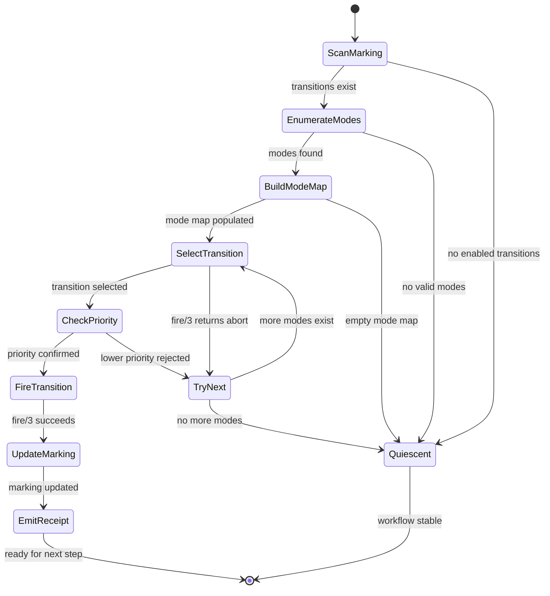
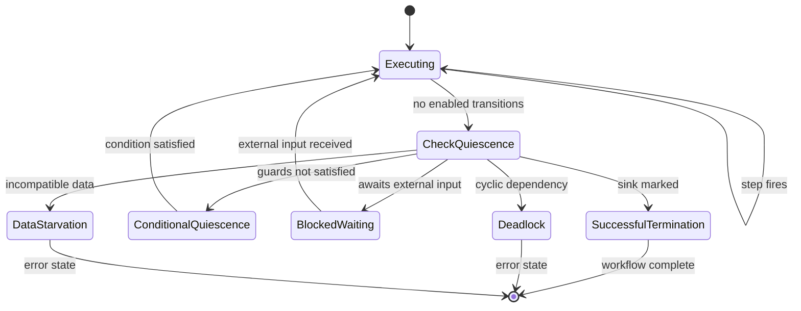
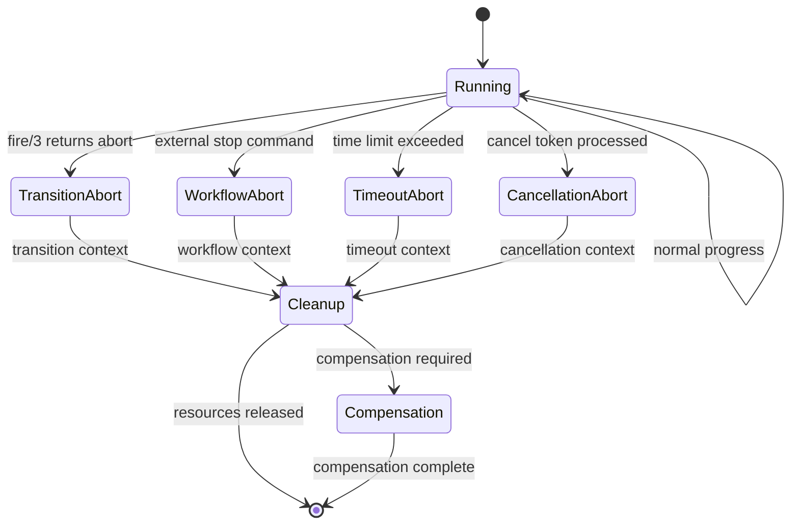
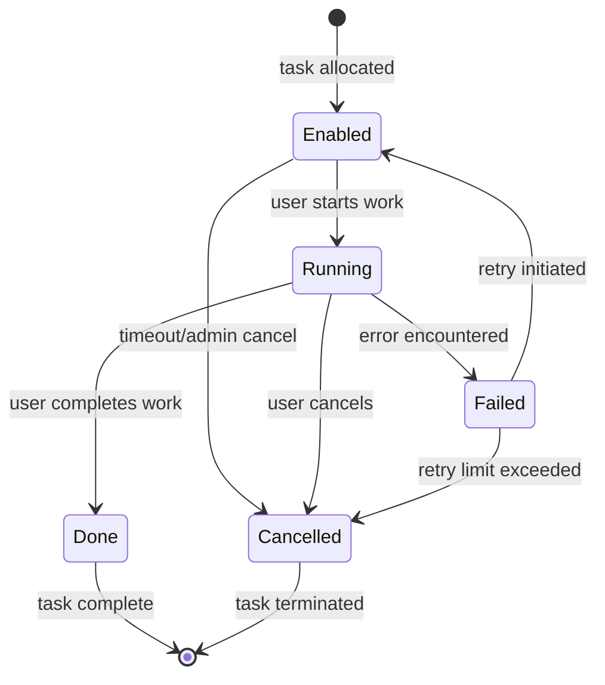
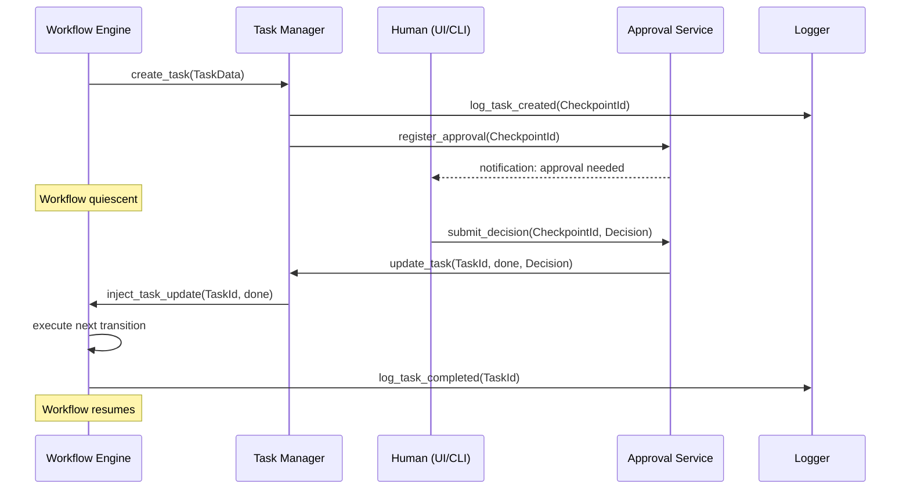
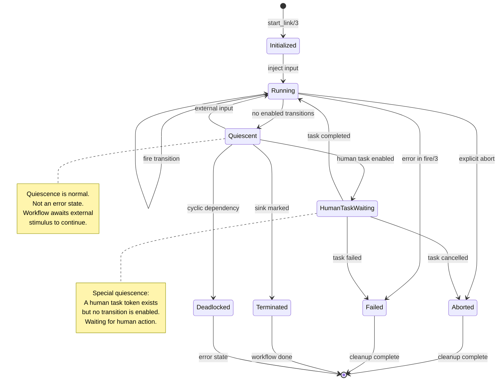

# 7.3 Deterministic Ordering and Step Selection

## 7.3.1 The Determinism Principle

Deterministic execution is fundamental to reproducible workflow semantics. In Petri net-based workflow systems, determinism ensures that given the same initial marking and the same external inputs, the system will produce the same sequence of state transitions. This property is critical for:

- **Replay and debugging**: Ability to replay execution traces
- **Testing and verification**: Reproducible test results
- **Audit compliance**: Predictable and auditable state evolution
- **Distributed consistency**: Multiple nodes converging to identical states

The CRE achieves determinism through a carefully designed step selection protocol that governs which transition fires when multiple transitions are simultaneously enabled.

## 7.3.2 The Step Selection Problem

In Petri net execution, a transition is *enabled* when each of its input places contains at least one token. When multiple transitions are enabled simultaneously, the system must choose which one to fire. This is the *step selection problem*.

Consider a simple parallel split followed by an exclusive choice:

```
     p_start
        |
        v
     t_split (enabled: 1 token in p_start)
        |
    +---+---+
    |       |
    v       v
  p_a     p_b
    |       |
    v       v
  t_a     t_b (both potentially enabled)
    |       |
    +---+---+
        |
        v
     p_end
```

After `t_split` fires, tokens appear in both `p_a` and `p_b`. If `t_a` and `t_b` both become enabled, which fires first? The answer matters for:

1. **Receipt ordering**: Trace reconstruction depends on firing order
2. **Temporal properties**: Timing-sensitive patterns may depend on order
3. **Observable behavior**: External systems see events in firing order
4. **State consistency**: Intermediate states vary with firing order

## 7.3.3 The CRE Step Selection Algorithm

The CRE implements a deterministic step selection protocol in `gen_pnet:attempt_progress/3` and `gen_pnet:attempt_fire_one/4`:

```erlang
attempt_progress(ModeMap, NetMod, UsrInfo) ->
    case maps:size(ModeMap) of
        0 ->
            abort;
        _ ->
            TrsnLst = maps:keys(ModeMap),
            Trsn = pick_from(TrsnLst),
            #{Trsn := ModeLst} = ModeMap,
            Mode = pick_from(ModeLst),
            case NetMod:fire(Trsn, Mode, UsrInfo) of
                {produce, ProdMap} ->
                    {delta, Mode, ProdMap};
                abort ->
                    ModeLst1 = ModeLst -- [Mode],
                    case ModeLst1 of
                        [] ->
                            attempt_progress(maps:remove(Trsn, ModeMap), NetMod, UsrInfo);
                        [_ | _] ->
                            attempt_progress(ModeMap#{Trsn := ModeLst1}, NetMod, UsrInfo)
                    end
            end
    end.
```

### 7.3.3.1 Mode Enumeration

Step selection begins with *mode enumeration*: determining all valid token consumption patterns for each enabled transition. The `pnet_mode` module handles this:

```erlang
enum_modes(PresetPlaces, Marking) ->
    Counts = preset_counts(PresetPlaces),
    UniquePlaces = lists:usort(PresetPlaces),
    enum_modes_for_places(UniquePlaces, Counts, Marking).
```

For a transition with preset `[p1, p2]` and marking `#{p1 => [a,b], p2 => [c]}`, this yields:
- Mode 1: `#{p1 => [a], p2 => [c]}`
- Mode 2: `#{p1 => [b], p2 => [c]}`

The enumeration is deterministic: combinations are generated in lexicographic order by position in the token list.

### 7.3.3.2 Transition Selection

Once all enabled transitions and their modes are enumerated, the CRE must select one transition-mode pair to fire. The base algorithm uses `pick_from/1`, which selects randomly:

```erlang
pick_from(List) ->
    lists:nth(rand:uniform(length(List)), List).
```

**Nondeterministic by Default**: The default CRE behavior is intentionally nondeterministic to maximize parallelism and avoid artificial serialization. This is appropriate for:

- Stateless workflow execution
- Pure functional transformations
- Idempotent operations
- Test scenarios exploring all execution paths

**Deterministic Override**: For scenarios requiring determinism, the CRE provides configuration options:

1. **Priority-based selection**: Transitions declare numeric priorities
2. **Name-based ordering**: Alphabetical selection for reproducibility
3. **Timestamp ordering**: Selection by earliest enablement time
4. **Hash-based selection**: Consistent hashing on transition state

### 7.3.3.3 Priority-Based Deterministic Ordering

Priority-based ordering assigns each transition a numeric priority. Higher priority transitions fire first:

```erlang
%% In the net module
priority(t_critical_section) -> 100;
priority(t_cleanup) -> 50;
priority(t_logging) -> 10;
priority(_) -> 0.

%% In step selection
attempt_progress_by_priority(ModeMap, NetMod, UsrInfo) ->
    TrsnLst = lists:sort(fun(A, B) ->
        NetMod:priority(A) >= NetMod:priority(B)
    end, maps:keys(ModeMap)),
    select_first_enabled(TrsnLst, ModeMap, NetMod, UsrInfo).
```

This ensures critical operations complete before less important ones.

### 7.3.3.4 Name-Based Ordering for Testing

For reproducible testing, transitions can be ordered alphabetically:

```erlang
%% Deterministic alphabetical ordering
attempt_progress_deterministic(ModeMap, NetMod, UsrInfo) ->
    TrsnLst = lists:sort(maps:keys(ModeMap)),
    %% Try transitions in sorted order
    try_transitions_sorted(TrsnLst, ModeMap, NetMod, UsrInfo).

try_transitions_sorted([], _ModeMap, _NetMod, _UsrInfo) ->
    abort;
try_transitions_sorted([Trsn | Rest], ModeMap, NetMod, UsrInfo) ->
    case maps:get(Trsn, ModeMap, []) of
        [] ->
            try_transitions_sorted(Rest, ModeMap, NetMod, UsrInfo);
        [Mode | _] ->
            case NetMod:fire(Trsn, Mode, UsrInfo) of
                {produce, ProdMap} -> {delta, Mode, ProdMap};
                abort ->
                    try_transitions_sorted(Rest, ModeMap, NetMod, UsrInfo)
            end
    end.
```

## 7.3.4 Deterministic Token Ordering

Determinism also requires consistent token ordering within places. The CRE uses term ordering (Erlang's native comparison) to order tokens:

```erlang
%% Tokens are kept in insertion order during normal operation
%% For deterministic comparison, we sort by term order
normalize_token_order(Tokens) ->
    lists:sort(Tokens).
```

This ensures that when a transition consumes N tokens from a place, the selection is deterministic.

## 7.3.5 Receipt-Based Determinism

The `gen_yawl` module produces *receipts* for each transition firing, capturing:

1. **Transition identifier**: Which transition fired
2. **Consumption mode**: Which tokens were consumed
3. **Produced tokens**: What tokens were created
4. **Timestamp**: When firing occurred

Receipts form a deterministic trace:

```erlang
-record(receipt, {
    trsn :: atom(),
    mode :: #{atom() => [term()]},
    produce :: #{atom() => [term()]},
    timestamp :: integer()
}).
```

By comparing receipt sequences from different executions, we can verify deterministic behavior. Two executions are *trace-equivalent* if their receipt sequences are identical.

## 7.3.6 State Machine for Step Selection

The step selection process follows a deterministic state machine:



### State Descriptions

- **ScanMarking**: Examine current marking for enabled transitions
- **EnumerateModes**: For each enabled transition, enumerate valid firing modes
- **BuildModeMap**: Aggregate enabled transitions with their valid modes
- **SelectTransition**: Choose next transition-mode pair per selection strategy
- **CheckPriority**: Validate selection against priority constraints
- **FireTransition**: Execute transition's fire/3 callback
- **UpdateMarking**: Apply consumption and production to marking
- **EmitReceipt**: Record firing event with full context
- **Quiescent**: No transitions enabled; workflow stable

## 7.3.7 Confluence Properties

A key property of deterministic execution is *confluence*: regardless of nondeterministic choices, the system converges to equivalent final states.

**Theorem (Confluence)**: For a workflow net where all enabled transitions eventually fire, the final marking is independent of firing order.

*Proof Sketch*: Workflow nets are sound Petri nets with a designated source and sink place. Soundness guarantees that:
1. From the initial marking, the sink place is eventually marked
2. When the sink is marked, no other places are marked
3. All transitions are eventually enabled in some execution
4. Deadlock and livelock are absent

Given these properties, any complete execution (firing until quiescence) reaches the same terminal marking.

The CRE preserves confluence while allowing controlled nondeterminism:
- Nondeterminism affects *intermediate* states
- Final states remain equivalent
- Receipt traces may differ in order but cover same transitions

## 7.3.8 Practical Determinism Guidelines

### When to Use Deterministic Ordering

Use deterministic step selection when:

1. **Testing and debugging**: Reproducible test failures
2. **Audit trails**: Chronological ordering matters
3. **Multi-node consistency**: Distributed state convergence
4. **Temporal constraints**: Time-sensitive workflows

### When Nondeterminism is Acceptable

Nondeterminism is acceptable when:

1. **Stateless operations**: Results independent of order
2. **Idempotent transitions**: Repeated firing has same effect
3. **Exploratory testing**: Cover all execution paths
4. **Performance optimization**: Maximize parallelism

### Configuring Determinism

The `wf_yawl_executor` supports determinism configuration:

```erlang
%% Start executor with deterministic step selection
{ok, Executor} = wf_yawl_executor:start_link(#{step_selection => deterministic}).

%% Or with priority-based selection
{ok, Executor} = wf_yawl_executor:start_link(#{
    step_selection => priority,
    priority_function => fun my_module:transition_priority/1
}).
```

---

# 7.4 Quiescence, Abort, and Human Tasks

## 7.4.1 Quiescence: The Stable State

**Quiescence** is the state in which no transitions are enabled. A workflow in quiescence has reached a stable configuration where automatic progress is impossible without external intervention.

Formally, a marking M is quiescent if and only if:

```
forall t in Transitions: not enabled(t, M)
```

Where `enabled(t, M)` means transition t has sufficient tokens in its preset to fire.

### 7.4.1.1 Detecting Quiescence

The CRE detects quiescence through the `is_quiescent/1` function:

```erlang
is_quiescent(Name) ->
    case execute_step(Name) of
        abort -> true;
        {ok, _Receipt} -> false;
        {error, _} -> true
    end.
```

A direct step attempt returns `abort` if no transition can fire, indicating quiescence.

### 7.4.1.2 Types of Quiescence

Not all quiescent states are equivalent. We distinguish several types:

**Successful Termination**: The workflow has completed successfully. The sink place contains tokens and no other transitions are enabled. This is the desired terminal state for well-formed workflows.

**Conditional Quiescence**: The workflow awaits a condition. Some transitions are almost enabled but require specific token values. For example, a workflow waiting for a human decision has a transition enabled only for tokens carrying `{decision, approved}` or `{decision, rejected}`.

**Deadlock**: A cyclic dependency prevents further progress. Two or more transitions each require tokens from the other's output, creating a waiting cycle. In sound workflow nets, this indicates a design error.

**Blocked Waiting**: The workflow waits for external input. A place is empty that should receive tokens from outside the system. This is expected for human tasks, service calls, or timer events.

**Data Starvation**: All transitions have modes but none pass their `is_enabled/3` guard. Tokens exist but don't satisfy guard conditions, often due to incompatible data values.

### 7.4.1.3 Quiescence State Machine



### 7.4.1.4 Quiescence in Practice

The `yawl_execution` module provides quiescence utilities:

```erlang
%% Execute until quiescent
drain_workflow(Name, MaxSteps) ->
    case gen_yawl:step(Name) of
        abort ->
            {ok, []};  % Already quiescent
        {ok, Receipt} ->
            {ok, Rest} = drain_workflow(Name, MaxSteps - 1),
            {ok, [Receipt | Rest]}
    end.
```

For debugging, the `get_marking/1` function reveals the quiescent configuration:

```erlang
Marking = yawl_execution:get_marking(Pid),
%% Examine which places have tokens
%% Identify why transitions aren't enabled
```

## 7.4.2 Abort Conditions

**Abort** is the explicit termination of workflow execution before normal completion. The CRE distinguishes abort from quiescence: quiescence is a natural state (no work to do), while abort is an explicit action (stop working).

### 7.4.2.1 Sources of Abort

**Transition-Level Abort**: A transition's `fire/3` callback returns `abort` to signal cancellation:

```erlang
fire(t_validate, #{input := [Data]}, _UsrInfo) ->
    case validate(Data) of
        {ok, Validated} ->
            {produce, #{output => [Validated]}};
        {error, Reason} ->
            logger:error("Validation failed: ~p", [Reason]),
            abort
    end.
```

**Workflow-Level Abort**: External commands abort the entire workflow:

```erlang
%% Explicit abort via API
gen_yawl:stop(WorkflowPid).

%% Or via cast
gen_yawl:cast(WorkflowPid, {abort, user_cancelled}).
```

**Timeout Abort**: The workflow terminates if it doesn't complete within a specified time:

```erlang
%% Execute with timeout
case gen_yawl:step(WorkflowPid) of
    {ok, Receipt} -> handle_receipt(Receipt);
    abort -> handle_quiescence();
    {error, timeout} -> handle_timeout()
end.
```

**Cancellation Token Abort**: Special cancellation tokens trigger region cancellation:

```erlang
%% Cancel token in marking causes places to be cleared
Marking = #{
    cancel_trigger => [{cancel, [p1, p2]}],
    p1 => [data1],
    p2 => [data2]
},
%% After processing:
%% #{
%%   cancel_trigger => [{cancel, [p1, p2]}],
%%   p1 => [],
%%   p2 => []
%% }
```

### 7.4.2.2 Abort State Machine



### 7.4.2.3 Cleanup and Compensation

When abort occurs, the workflow may need to clean up resources or compensate completed actions. The `terminate/2` callback handles this:

```erlang
terminate(Reason, #net_state{marking = Marking}) ->
    logger:info("Workflow terminating: ~p", [Reason]),
    %% Compensate completed activities
    compensate_partial_work(Marking),
    %% Release external resources
    release_resources(Marking),
    ok.
```

Compensation semantics depend on the workflow:
- **Compensatable**: Activities can be undone (e.g., refund payment)
- **Non-compensatable**: Activities cannot be undone (e.g., send email)
- **Partial compensation**: Some activities compensatable, others not

The `yawl_cancellation` module supports region-based cancellation:

```erlang
%% Define cancellation regions
Regions = #{
    carrier_timeout => #{
        name => carrier_timeout,
        places => [pending_appointment, awaiting_confirmation]
    }
},

%% Apply cancellation
NewMarking = yawl_cancellation:apply_to_marking(Marking, Regions).
```

## 7.4.3 Human Tasks: Interrupting and Resuming

**Human tasks** represent work performed by people outside the workflow system. They introduce unique challenges: unpredictable duration, potential abandonment, and the need for manual resumption.

### 7.4.3.1 Human Task Lifecycle

The `wf_task` module defines the human task lifecycle:

```erlang
%% Task token structure
{task, TaskId, Status, Payload}

%% Status values:
%% - enabled: Task ready to begin
%% - running: Task actively being worked
%% - done: Task completed successfully
%% - failed: Task failed (can be retried)
%% - cancelled: Task was cancelled
```

The lifecycle state machine:



### 7.4.3.2 Task Token Creation

Human task tokens are created via the `wf_task` constructors:

```erlang
%% Create a new task
wf_task:enabled(TaskId, Payload, Place).
%% Produces: {produce, #{Place => [{task, TaskId, enabled, Payload}]}}

%% Update to running
wf_task:running(TaskId, Progress, Place).
%% Produces: {produce, #{Place => [{task, TaskId, running, Progress}]}}

%% Complete task
wf_task:done(TaskId, Result, Place).
%% Produces: {produce, #{Place => [{task, TaskId, done, Result}]}}
```

### 7.4.3.3 Task Execution and Quiescence

When a human task is enabled, the workflow typically enters quiescence. The task token sits in a place, but no automatic transition consumes it. External intervention (a human completing the task) transforms the token, allowing subsequent transitions to fire.

Example: Approval workflow

```erlang
%% Workflow net
place_lst() -> [p_start, p_approval, p_end].
trsn_lst() -> [t_request, t_approve, t_complete].

preset(t_request) -> [p_start].
preset(t_approve) -> [p_approval].
preset(t_complete) -> [p_end].

%% t_request creates approval task
fire(t_request, _Mode, _UsrInfo) ->
    wf_task:enabled(req123, #{type => approval}, p_approval).

%% t_approve only enabled for done tasks
is_enabled(t_approve, #{p_approval := [{task, _, done, _}]}, _UsrInfo) ->
    true;
is_enabled(t_approve, _, _) ->
    false.
```

Initially, after `t_request` fires, the workflow is quiescent: `t_approve` is not enabled for the `{task, _, enabled, _}` token. When the human completes the task, the token changes to `{task, _, done, _}`, enabling `t_approve`.

### 7.4.3.4 Interrupting Human Tasks

Human tasks can be interrupted before completion:

**Timeout Interruption**: A timer transition fires, cancelling the overdue task:

```erlang
%% Timeout transition
fire(t_timeout, _Mode, _UsrInfo) ->
    %% Cancel the human task
    wf_task:cancelled(req123, timeout, p_approval).
```

**Administrative Cancellation**: An admin cancels the task:

```erlang
%% Admin API call
yawl_approval:cancel(CheckpointId, admin_cancelled).
```

**Workflow Cancellation**: The entire workflow is cancelled, aborting all pending tasks:

```erlang
%% Cancel workflow
gen_yawl:stop(WorkflowPid).

%% Terminate callback cleans up tasks
terminate(_Reason, #net_state{marking = Marking}) ->
    %% Find all task tokens and mark cancelled
    lists:foreach(fun({Place, Tokens}) ->
        CancelledTokens = [cancel_task_token(T) || T <- Tokens],
        %% Update marking...
    end, maps:to_list(Marking)).
```

### 7.4.3.5 Resuming After Interruption

Resumption depends on the interruption type:

**Timeout Resume**: Create a new task token with escalation:

```erlang
fire(t_escalate, _Mode, _UsrInfo) ->
    %% Create escalated task
    wf_task:enabled(req123_escalated,
                   #{type => approval, escalated => true},
                   p_approval_escalated).
```

**Cancellation Resume**: Restart from a checkpoint:

```erlang
%% Load checkpointed state
{ok, Checkpoint} = yawl_checkpoint:load(CheckpointId),

%% Restore workflow from checkpoint
{ok, NewPid} = gen_yawl:start_link(NetMod, Checkpoint).
```

**Failure Resume**: Retry with modified payload:

```erlang
fire(t_retry, #{p_failed := [{task, TaskId, failed, Reason}]}, _UsrInfo) ->
    %% Create new task with error context
    wf_task:enabled(TaskId,
                   #{type => approval, retry => true, last_error => Reason},
                   p_approval).
```

### 7.4.3.6 Human Task Integration Architecture

The complete human task system integrates multiple components:



The `yawl_approval` module orchestrates this flow:

```erlang
%% Create approval checkpoint
create_checkpoint(PatternId, StepName, Options) ->
    CheckpointId = generate_id(),
    TaskToken = wf_task:enabled(CheckpointId, Options, approval_queue),
    %% Store checkpoint state
    ets:insert(checkpoints, {CheckpointId, #{
        pattern_id => PatternId,
        step_name => StepName,
        created_at => erlang:system_time(millisecond),
        status => pending,
        options => Options
    }}),
    {ok, CheckpointId}.

%% Process approval decision
approve(CheckpointId, Approver, Decision) ->
    case ets:lookup(checkpoints, CheckpointId) of
        [{CheckpointId, Checkpoint}] ->
            %% Update task token to done
            wf_task:done(CheckpointId, #{
                approver => Approver,
                decision => Decision,
                timestamp => erlang:system_time(millisecond)
            }, approval_result),
            %% Log to XES
            yawl_xes:log_event(#{event => approval_completed,
                                 checkpoint_id => CheckpointId,
                                 approver => Approver,
                                 decision => Decision}),
            ok;
        [] ->
            {error, not_found}
    end.
```

### 7.4.3.7 Task Worklist Management

Users interact with pending tasks through a worklist:

```erlang
%% Get pending tasks for a user
worklist(UserId) ->
    %% Query checkpoints for pending tasks assigned to user
    ets:select(checkpoints, [{
        {CheckpointId, #{
            status := pending,
            assigned_to := UserId,
            options := Options
        }},
        [],
        [{CheckpointId, Options}]
    }]).

%% Get task details
task_info(CheckpointId) ->
    case ets:lookup(checkpoints, CheckpointId) of
        [{CheckpointId, Checkpoint}] ->
            {ok, Checkpoint};
        [] ->
            {error, not_found}
    end.
```

This worklist API enables web dashboards, CLI tools, and integration with external task management systems.

## 7.4.4 Complete State Machine: Workflow Lifecycle

Combining quiescence, abort, and human tasks, we obtain the complete workflow lifecycle state machine:



### State Descriptions

- **Initialized**: Workflow started, initial marking established
- **Running**: Actively firing transitions, making progress
- **Quiescent**: No transitions enabled, awaiting input
- **HumanTaskWaiting**: Quiescent with pending human tasks
- **Aborted**: Explicitly terminated before completion
- **Failed**: Error prevented continuation
- **Terminated**: Normal completion (sink marked)
- **Deadlocked**: Error state, cyclic dependency

## 7.4.5 Summary: Determinism and Stability

The CRE's approach to quiescence, abort, and human tasks ensures:

1. **Deterministic replay**: Receipt traces enable exact reproduction
2. **Clear termination**: Quiescence is detectable and well-defined
3. **Graceful abort**: Cleanup and compensation are handled properly
4. **Human integration**: Tasks interrupt and resume predictably
5. **Observable state**: All state transitions are logged

This foundation enables reliable, auditable workflow execution even in the presence of nondeterministic external events and human intervention.
